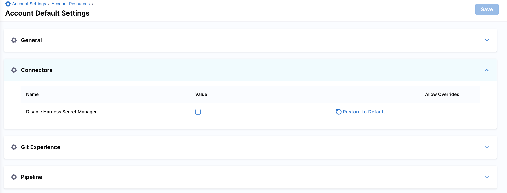

Harness includes a built-in Secret Management feature that enables you to store encrypted secrets, such as access keys, and use them in your Harness Accounts, Organizations, or Projects.

You can choose to disable the Harness built-in Secret Manager at any point and use any other [Secret Manager](./5-add-secrets-manager.md) to store secrets.

This topic explains how to disable the built-in Harness Secret Manager.

### Before you begin

* [Harness Secret Management Overview](./1-harness-secret-manager-overview.md)
* [Add a Secret Manager](./5-add-secrets-manager.md)
* Make sure you have Account Admin permissions to disable the built-in Secret Manager.  
For more information, go to [Permissions Reference](/docs/platform/role-based-access-control/permissions-reference).

### Important notes

* When you disable the built-in Secret Manager, Harness does not move your existing secrets to another secret manager.
* Before you disable Harness built-in secret manager, you must have at least one Secret Manager in the Account scope.

### Harness Built-in Secret Manager

Harness always stores secrets in encrypted form and decrypts them when they are needed. Harness never makes secrets accessible publicly.

By default, Harness provides a built-in Secret Manager that you can use to store your secrets or you can create your own Secret Manager and use that instead. Every new organization or project that you create comes with a built-in Secret Manager by default. The default Secret Manager in Harness is Google Cloud Key Management Service, which is called Harness Built-in Secret Manager.

The Key Management Service only stores the key. Harness uses [envelope encryption](https://cloud.google.com/kms/docs/envelope-encryption) to encrypt and decrypt secrets. The encrypted secret and the encrypted Data Encryption Key (used for envelope encryption) are stored in the Harness database. 

### Disable Harness Built-in Secret Manager

1. In your Harness Account, go to **Account Settings**.
2. Select **Account Resources** and then select **Default Settings**.

   

3. Select **Connectors**.

4. Select **Disable default Harness Secret Manager** and then select **Save.**

   The built-in Secret Manager is no longer available in any of the following:

   * List of Connectors inside Account/Org/Project Resources.
   * List of Secret Managers populated while creating new secrets.
   * Any new Organization or Project that you create.

   You can, however, continue to access the secrets created using this Secret Manager before it was disabled.

If you create a new Organization or Project after disabling Harness Built-In Secret Manager, you'll need to either create a new Secret Manager or refer to the Secrets generated in the Account before disabling built-in Secret Manager. This also means that if you try to set up a new Secret Manager in any scope, the credentials for it must already be stored in the Account scope as secrets.

You must have another Secret Manager created at the Account scope with its credentials saved as a secret in the built-in Secret Manager to disable the Harness Secret Manager.You can re-enable the built-in Secret Manager at any time. The built-in Secret Manager will be available in the Organizations and Projects created before it was disabled when you re-enable it. Any Organization or Project you add after you disable the built-in Secret Manager will not have this when you re-enable it.

### See also

* [Add Google KMS as a Harness Secret Manager](./10-add-google-kms-secrets-manager.md)
* [Add an AWS KMS Secret Manager](./7-add-an-aws-kms-secrets-manager.md)
* [Add an AWS Secret Manager](./6-add-an-aws-secret-manager.md)
* [Add an Azure Key Vault Secret Manager](../../Secrets/Secrets-Management/8-azure-key-vault.md)
* [Add a HashiCorp Vault Secret Manager](./12-add-hashicorp-vault.md)

