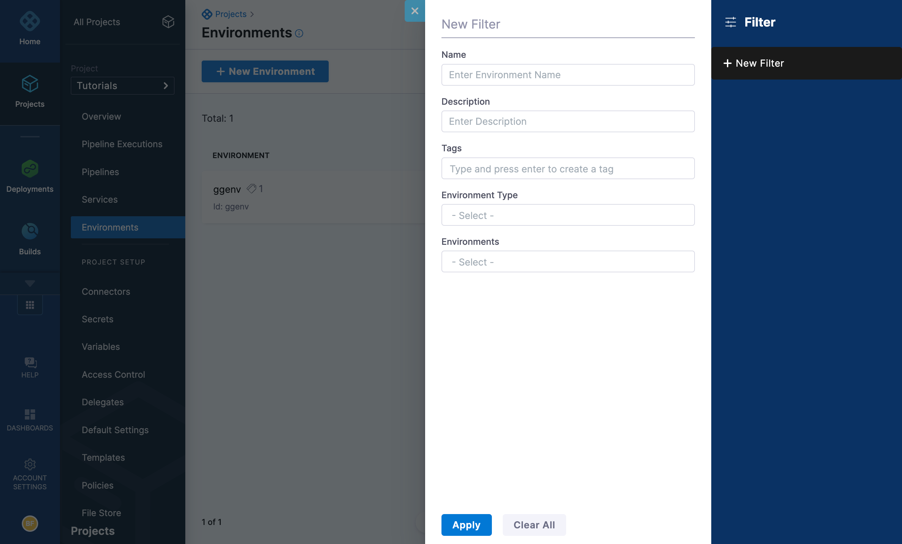

Once you’ve applied tags to your Harness applications and components, you can use these tags to filter what components you see. This topic describes how to use tags to create different views of your applications and components. 

## Before you begin

* Go to [Platform overview](/docs/platform/Get-started/platform-concepts/platform-overview.md).
* Go to [Assign metadata using tags](tags.md).
* Go to [Tags reference](/docs/platform/references/tags-reference/).

## Filter applications or components by tags

In Harness, select your application or component. Look for a filter button at the upper right.

To filter applications or their components by tags:

1. In Harness, go the application or component.

2. Click the filter button.  
  
   This opens the **Filter** dialog, initially empty:

    

3. The **Name** field enables free-text filtering of the currently displayed Harness entity (applications or an application component). This option displays entities whose *names* (or their substrings) match the text that you enter. 

   :::info note 
   Harness applies AND searches logic between the **Name** and **Tags** fields. So any **Name** string that you enter will further restrict the results of your **Tags** selection, and vice versa.
   :::

4. Use the Search box to locate desired tags, or tag values, by free-text search. Or, manually scroll the list of tags and values.

6. To retrieve Harness entities that match a given tag with any value, select the **Any Value** check box to the Tag's right. To match only one or more specific values, select the check boxes to their left.

   :::info note 
   Within a given tag, inclusive OR search logic is *always* applied among the *values* you select. (Remember that each tag can take only one value on a given application or component—so a restrictive AND search for two or more values would always return zero results.) The search logic among your selected *Tags* is either OR or AND—depending on your **Match** [setting](#tags_search_logic). 
   :::

   The **Tags** field updates to display a running summary of your selections.

4. When you are ready to display the results of your selected filter conditions, select **Apply**. To discard all selections and keep the dialog open to make new selections, select **Clear All**.
