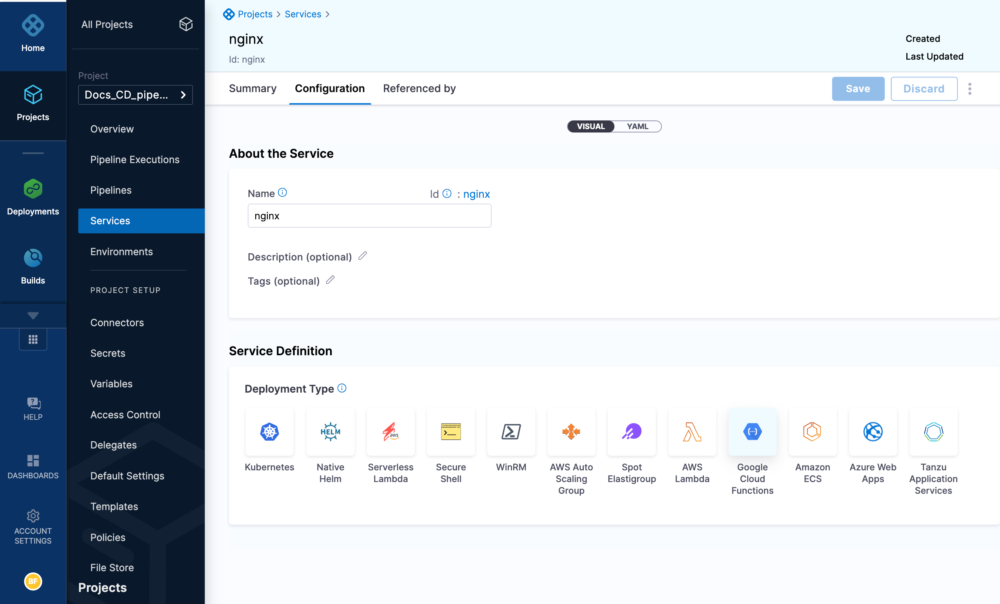

Workflow and pipeline tags support Harness variable expressions.

Using expressions in tags lets you create dynamic metadata for your deployments. This can be very helpful when filtering workflows and pipelines in the Harness **Deployments** page.

## Before you begin

* Go to [Using tags](/docs/platform/Tags/tags.md)
* Go to [Tags reference](/docs/platform/references/tags-reference/).

## Review: Tag restrictions

There are many restrictions for using variable expressions in tags. Review the following restrictions.

### Expressions in workflow and pipelines tags only

You can only use variable expressions in the tags created/modified in workflows and pipelines.

If a tag uses a variable expression in its name, you must delete the tag in a workflow or pipeline and add it again.

### Workflow variables, application and account defaults only

For workflows, you can add variables expressions to tags for the following:

* Workflow variables: For example, `${workflow.variables.wfvar}`.
* Application defaults: For example, `${app.defaults.RUNTIME_PATH}`.
* Account defaults: For example, `${account.defaults.example}`.

For more information, go to [Fixed values, runtime inputs, and expressions](/docs/platform/references/runtime-inputs/).

Harness built-in variables expressions cannot be used in tags at deployment runtime.

Application defaults support some Harness built-in expressions, such as the names and descriptions of application components.

### Standard format restrictions do not apply

Normally, tag names must meet specific format restrictions: `^[/A-Za-z0-9 _-]+`. No dots are supported.

When using expressions in tags, you do not need to follow these restrictions. When a variable expression is evaluated by Harness, its result does not have to meet the standard tag format restrictions. It has no restrictions.

### Tag naming restrictions for deployment tags

When a workflow/pipeline using tags is deployed, we say the tags have been promoted to deployment tags. But there are restrictions on which tags may be promoted:

* If the workflow/pipeline tag name or evaluated name contains a dot character, `${`, or any unresolved Harness variables, Harness does not promote it as a deployment tag.

## Step 1: Expressions in workflow tags

1. In a Harness workflow, select the **Tags** pencil icon.

   

2. In the field, type a tag name, and then press enter.

   

3. Enter a string or variable expression that references a workflow variable, application default, or account default.

### Evaluated expressions in deployments

When you deploy the workflow, the expressions are evaluated after every stage by Harness and their values are displayed in the **Deployments** view.

## Step 2: Expressions in pipeline tags

1. In a Harness pipeline, select the **Tags** pencil icon next to the pipeline name.

2. Enter a string or variable expression that references one of the following:

   * Workflow variables: For example `${workflow.variables.wfvar}`.  
If you want to use workflow variables in a pipeline tag, you must create a pipeline variable that represents the workflow variable value.
   * Application Defaults: For example `${app.defaults.RUNTIME_PATH}`.
   * Account Defaults: For example `${account.defaults.example}`.
   * Pipeline Name: Use `${pipeline.name}`.
   * Pipeline Description: Use `${pipeline.description}`.

### Workflow variables in pipeline tags

If you want to use workflow variables in a pipeline tag, you must create a pipeline variable that represents the workflow variable value.

When we add the workflow as a stage in a pipeline, we use an expression as its value.

This expression is now a pipeline variable that evaluates to the workflow variable value at runtime.

And now we add the pipeline variable to the pipeline tag.

### Evaluated expressions in deployments

When you deploy the pipeline, the expressions are evaluated after every stage by Harness and their values are displayed in the **Deployments** view.

The expressions in all tags on the workflows deployed by the pipeline are also evaluated and displayed.

Here is an example where the pipeline has tags using expressions for the application default and a workflow variable. In addition, a workflow in the pipeline also uses an account default expressions in a tag **Name**.

As a result, the pipeline deployment displays the evaluated expressions for tags from the pipeline and its workflow.

## Step 3: Filtering by tag expressions in deployments

In **Deployments**, you can filter by tag **Name**.

:::info note
The **Display matching workflow executions as separate cards in the result** filter option allows you to see each workflow deployment as separate.
:::

The filter results in all deployments for workflows and pipelines that use the tag.

Each deployment is listed separately. If the tag is used in a single workflow/pipeline, but that workflow/pipeline has been deployed multiple times, then each deployment is listed separately.

You can also filter by name using the evaluated expression. So, if the tag on the workflow is `WorkflowVar: ${workflow.variables.wfvar}`, then you can filter by `WorkflowVar:wf-var-value`.

## Step 4: Filtering and grouping by tag expressions in custom dashboards

You can create a [Custom dashboard](/docs/platform/dashboards/dashboards-overview/) that filters or groups using tags that use expressions.

You can use a tag whose name uses an expression, but you can only filter or group by tag *name*.

You cannot use the expression itself to filter or group. You must use the evaluated expression displayed in Harness **Deployments**.

You can use expression Tags in the following widgets:

* Deployments
* Lead Time to Production
* Mean Time to Restore

You simply use the **Tag (Deployments)** option in the **Data Filter** or **Group By** settings of the widget.

This can be a very powerful method for creating custom dashboards.

For example, let's say you had a workflow or pipeline tag named **commitID**. The value for it is passed in as an expression, such as `${workflow.variables.commitID}`. You could provide the value for the variable using a Trigger that passes in a Git commit ID.

When you deploy, the expression is evaluated and the commit ID is displayed in **Deployments** like **commitID:521747298a3790fde1710f3aa2d03b55020575aa**.

Now, you can create a custom dashboard for the name **commitID** that filters or groups deployments by each commit ID.

## Notes

* When you use workflow variables for tags, a value must be provided for the workflow variable at the time of deployment. The value must be added whether the workflow is deployed alone, as part of a pipeline, or as part of a trigger.
