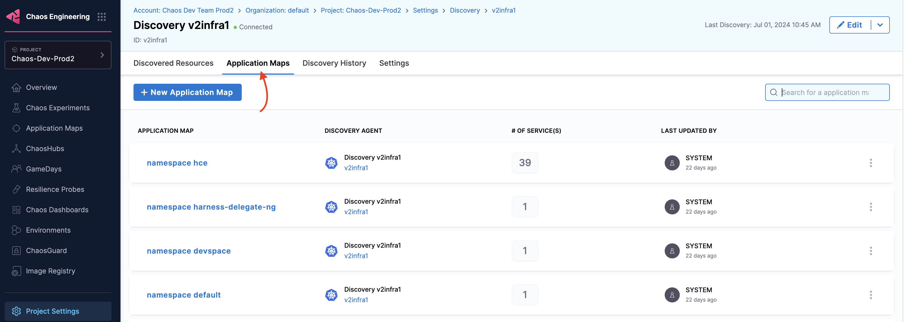
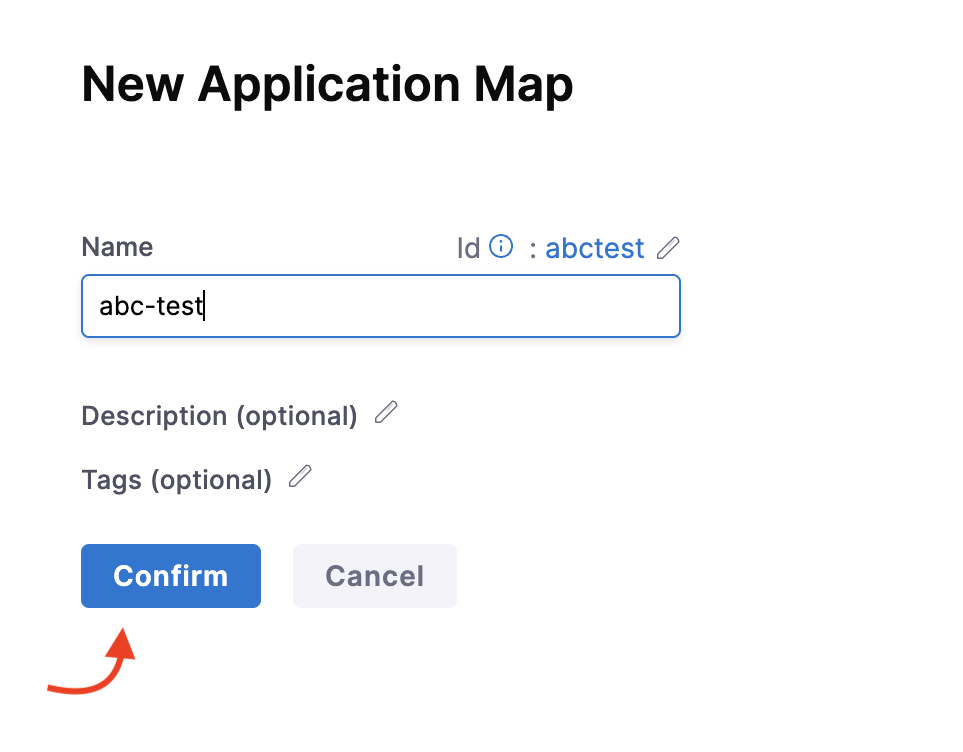
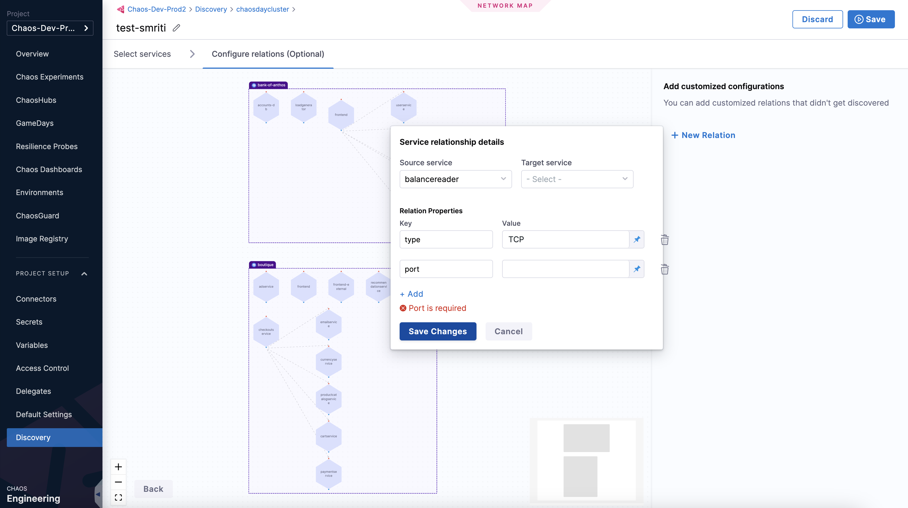
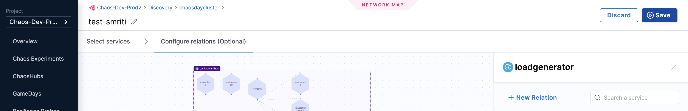
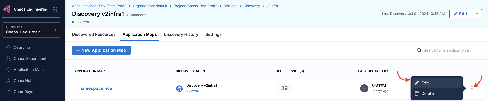

This topic describes application maps, their significance, and how to create, edit, and delete them.

### Before you begin

- [Service discovery](/docs/platform/service-discovery/)
- [How Harness CE leverages Service Discovery?](/docs/chaos-engineering/use-harness-ce/service-discovery#how-does-harness-ce-leverage-discovered-services)
- [Create Discovery Agent](/docs/platform/service-discovery/customize-agent#create-discovery-agent)

### What is an Application Map?

An application map is a resource on the Harness Platform (also known as the control plane) used to bind multiple interacting [discovered services](/docs/chaos-engineering/use-harness-ce/service-discovery) into a single object, thereby allowing the users to act (test, monitor, and so on) on a group of services.

### Why is an Application Map Required?

Application maps help:

- Test and monitor a group of services.
- Determine the resilience coverage and resilience score for the overall application map and its constituent services.
- Manage experiments associated with them.
- Perform trend analysis.

### How to Use an Application Map?

Once you have a list of discovered services, Harness CE creates an application map (using [auto-suggestion or manual service selection](/docs/chaos-engineering/getting-started/onboarding/guided-onboarding#create-application-maps)) based on your requirements. You can refer to the real-time topology view to get the connectivity representation.

You can [create](#create-application-map), [edit](#edit-application-map), and [delete](#delete-application-map) application maps.

### Create Application Map

1. To create an application map, select **Project Settings**, and then select **Discovery**.

    

2. Select one of the discovery agents or [create a new discovery agent](/docs/platform/service-discovery/customize-agent#create-discovery-agent). In this example, select a discovery agent that you created earlier.

    

3. Once you select a discovery agent, navigate to the **Application Maps** tab and select **New Application Map**.

    

4. Specify a name, description (optional), and tags (optional). Select **Continue**.

    

5. Select one or more discovered services that you wish to use and select **Next**.

    

6. Optionally, add service relationship details and select **Save Changes**.

    

7. Select **Save**.

    

### Edit Application Map

1. To edit an application map, select **More Options** (&vellip;), then select **Edit**. Make the necessary changes and select **Save**.

    

### Delete Application Map

1. To delete an application map, select **More Options** (&vellip;), then select **Delete**.

    

2. To confirm the deletion, select **Delete**.

    

