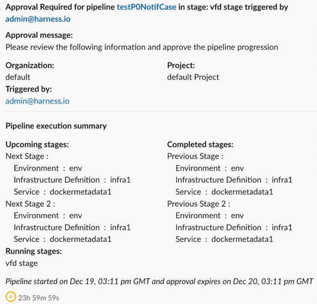

You can specify Harness User Group(s) to approve or reject a Pipeline at any point in its execution. During deployment, the User Group members use the Harness Manager to approve or reject the Pipeline deployment manually.

Approvals are added in between Stages to prevent the Pipeline execution from proceeding without an approval.

For example, in a [CI pipeline](../../continuous-integration/get-started/overview.md), you might want to add an approval stage between a Build stage and an Integration Test stage.

Other approval methods are:

- [Manual Harness Approval Steps in CD Stages](/docs/continuous-delivery/x-platform-cd-features/cd-steps/approvals/using-harness-approval-steps-in-cd-stages/): add Approval steps to a stage for manual intervention.
- [Adding Jira Approval Stages and Steps](adding-jira-approval-stages.md): add Jira Approval stages and steps.

### Before you begin

- [Add a Stage](../pipelines/add-a-stage.md)

### Important notes

Approval steps should not be added to run in parallel with other steps, including other Approval steps. The Harness Pipeline Studio will not allow you to add Approval steps in parallel with other steps, but the pipeline YAML editor does not prevent this setup. During execution, a successful parallel Approval step will not fail the deployment, but it is not a valid configuration because Approvals are checks on the release process and should always be used between steps.

### Visual summary

Here's a Manual Approval Stage step during the execution of a pipeline:


An approver can approve/reject the stage, stopping the pipeline. The approver can also add comments and define variables for use by subsequent approvers and steps.

Here's a quick video that walks you through setting up and running the step:

<!-- Video:
https://www.youtube.com/watch?v=V-d6kaMBf-w-->
<DocVideo src="https://www.youtube.com/watch?v=V-d6kaMBf-w" />

Here's what a Manual Approval Stage and step looks like in YAML:

#### YAML Example

```yaml
- stage:
    name: Manual Stage
    identifier: Manual_Stage
    description: ""
    type: Approval
    spec:
      execution:
        steps:
          - step:
              name: Approval
              identifier: approval
              type: HarnessApproval
              timeout: 1d
              spec:
                approvalMessage: |-
                  Please review the following information  
                  and approve the pipeline progression
                includePipelineExecutionHistory: true
                approvers:
                  minimumCount: 1
                  disallowPipelineExecutor: false
                  userGroups:
                    - docs
                approverInputs:
                  - name: myvar
                    defaultValue: myvalue
                isAutoRejectEnabled: false
    failureStrategies: []
```

### Add the Approval stage

In a CD Pipeline, click **Add Stage**.

Click **Approval**.

Enter a name and then click **Harness Approval**. The **Harness Approval** stage appears, containing a new **Approval** step.

Click the **Approval** step.

### Set timeout

Set a default for the step timeout. Leave enough time for the Users in **Approvers** to see and respond to the waiting step.

The default timeout for an Approval step is **1d** (24 hours).

You can use:

- `w`  for week
- `d`  for day
- `h`  for hour
- `m`  for minutes
- `s`  for seconds
- `ms` for milliseconds

For example, 1d for one day.

The maximum timeout duration is 53 weeks. The timeout countdown appears when the step in executed.


### Add message

In **Approval Message**, add the message for the Users in **Approvers**.

### Include stage execution details in approval

Enable this option to provide approvers with the execution history for this Pipeline. This can help approvers make their decision.

### Auto-reject previous deployments in approval

Enable this option to reject old executions waiting for approval when a latest step is approved.

:::info

- If you have two approval steps in a step group of a stage with the same step identifier, Harness won't be able to differentiate between the approval steps, and rejects previous deployments with the same identifier.

- If you change the services in a CD stage, Harness won't reject the previous pipeline waiting for approval because you added/updated the service in the pipeline.

:::

### Select approvers

1. In **User Groups**, select the Harness user groups that will approve the step. For more information, go to [Manage user groups](/docs/platform/role-based-access-control/add-user-groups).
2. In **Number of approvers that are required at this step**, enter how many of the users in the user groups must approve the step.


### Automatic Approvals

You can set the Approval step to automatically approve at a specific date and time.

1. In **Schedule Auto Approval**, select **Auto Approve**.
2. In **Timezone**, select the timezone to use for the schedule.
3. In **Time**, select the date and time when the automatic approval should occur.
4. In **Message**, enter the message that the users in the **User Groups** setting will see when the automatic approval occurs.

:::note

- The Auto approve schedule should be greater than 15 minutes past the current time.
- In addition to automatic approvals, you can also set a step-level failure strategy of **Mark as Success**. If the step exceeds its **Timeout** setting or fails for a different reason, **Mark as Success** will automatically approve the step. This is not a replacement for the **Auto Approve** option.

:::

#### Auto approval using expressions

The **Time** setting supports Harness expressions. You can use an expression to set a flexible data and time for when the automatic approval should occur.

For example, let's say you wanted to automatically approve exactly one week from when the pipeline runs.

You could precede the Approval step with a Shell Script step. In the Shell Scrip step, you can add a script that calculates what the time will be exactly one week from now, at the current hour and minute, in a specific time zone, and display it in a human-readable format.

Here's an example script:

```
# Define the desired time zone (e.g., "America/New_York")
desired_timezone="Asia/Calcutta"
current_time=$(date "+%H:%M")  # Get the current time
formatted_time=$(TZ=$desired_timezone date --date="next week $current_time" "+%Y-%m-%d %I:%M %p")

echo "Formatted time in $desired_timezone: $formatted_time"
```

Next, you can output that from the Shell Script step as an Output Variable. Lastly, you can reference that Output Variable in the Approval **Time** setting using a Harness expression.

In **Time**, you select **Expression**, and then use the Harness expression that references the Output Variable. For example:

```
<+pipeline.stages.AutoApproval.spec.execution.steps.ShellScript_1.output.outputVariables.time>
```

Now, the Approval step will automatically approve exactly one week from the current time of pipeline execution.

Here's a sample pipeline that demonstrates how to use expressions for both the **Timezone** and **Time** settings.

<details>
<summary>Pipeline demonstrating time expression</summary>

```yaml
pipeline:
  name: HarnessAutoApprovalRuntime
  identifier: HarnessAutoApprovalRuntime
  projectIdentifier: ServiceV2_Ramya
  orgIdentifier: Ng_Pipelines_K8s_Organisations
  tags: {}
  stages:
    - stage:
        name: AutoApproval
        identifier: AutoApproval
        description: ""
        type: Approval
        spec:
          execution:
            steps:
              - step:
                  type: ShellScript
                  name: ShellScript_1
                  identifier: ShellScript_1
                  spec:
                    shell: Bash
                    onDelegate: true
                    source:
                      type: Inline
                      spec:
                        script: |-

                          # Define the desired time zone (e.g., "America/New_York")
                          desired_timezone="Asia/Calcutta"
                          current_time=$(date "+%H:%M")  # Get the current time 
                          formatted_time=$(TZ=$desired_timezone date --date="next week $current_time" "+%Y-%m-%d %I:%M %p")

                          echo "Formatted time in $desired_timezone: $formatted_time"
                    environmentVariables: []
                    outputVariables:
                      - name: time
                        type: String
                        value: formatted_time
                      - name: timeZone
                        type: String
                        value: desired_timezone
                  timeout: 10m
              - step:
                  name: autoapproval
                  identifier: autoapproval
                  type: HarnessApproval
                  timeout: 1d
                  spec:
                    approvalMessage: |-
                      Please review the following information
                      and approve the pipeline progression
                    includePipelineExecutionHistory: true
                    approvers:
                      minimumCount: 1
                      disallowPipelineExecutor: false
                      userGroups:
                        - account._account_all_users
                    isAutoRejectEnabled: false
                    approverInputs: []
                    autoApproval:
                      action: APPROVE
                      scheduledDeadline:
                        timeZone: <+pipeline.stages.AutoApproval.spec.execution.steps.ShellScript_1.output.outputVariables.timeZone>
                        time: <+pipeline.stages.AutoApproval.spec.execution.steps.ShellScript_1.output.outputVariables.time>
                      comments: Auto approved by Harness via Harness Approval step
        tags: {}
        variables:
          - name: zone
            type: String
            description: ""
            required: false
            value: Asia/Kolkata
          - name: time
            type: String
            description: ""
            required: false
            value: 2023-12-20 09:24 AM
```

</details>

### Prevent approval by pipeline executor

If you don't want the User that initiated the Pipeline execution to approve this step, select the **Disallow the executor from approving the pipeline** option. Even if the User is in the selected in User Group, they won't be able to approve this step.

### Approver inputs

In **Approver Inputs**, you can enter variables and when the approver views the step they can provide new values for the variables.

If there are multiple approvers, the first approver sees the variables as you entered them in the step. If the first approver enters new values, the next approver sees the values the first approver entered.

A third approver will see all the variables the first and second approver provided.

The variable values entered by the final approver populate the expressions created from the inputs.

For example, if there were three approvers, and you added a Shell Script step that referenced the input variables with an expression, the expression would render the variable values entered by the final, third approver.

You can reference input variables using the `approverInputs` expression:

`<+pipeline.stages.[stage_name].spec.execution.steps.[step_name].output.approverInputs.[variable_name]>`

These variables can serve as inputs to later stages of the same Pipeline, where they support conditional execution or user overrides.

For example, in a subsequent step's **Conditional Execution** settings, you could use an expression that only runs the step if the expression evaluates to 1.

`<+pipeline.stages.Shell_Script.spec.execution.steps.Harness_Approval_Step.output.approverInputs.foo> == 1`

### Support for allowed values for custom approval inputs

You can now provide allowed values for manual approval step.

Here's an example YAML file showcasing various configurations you can use for allowed values.

#### YAML Example

```yaml
- step:
                  type: HarnessApproval
                  name: HarnessApproval_1
                  identifier: HarnessApproval_1
                  spec:
                    approvalMessage: Please review the following information and approve the pipeline progression
                    includePipelineExecutionHistory: true
                    isAutoRejectEnabled: false
                    approvers:
                      userGroups:
                        - _project_all_users
                      minimumCount: 1
                      disallowPipelineExecutor: false
                    approverInputs:
                      - name: variable_1
                        defaultValue: ""
                        allowedValues: 1,2,3
                      - name: variable_2
                        defaultValue: ""
                        required: true
                      - name: variable_3
                        defaultValue: ""
                        regex: .*abc
                      - name: variable_4
                        defaultValue: ""
                        selectOneFrom: 1,2,3
                  timeout: 3m
```            

In this example, for variable_1, initially set to an empty string and can take the allowed values: 1, 2, or 3.

For variable_2, initially set to an empty string and is required, meaning a value must be provided.

For variable_3, initially set to an empty string and must match the regex pattern .*abc, meaning it should contain the substring "abc" anywhere in its value.

For variable_4, initially set to an empty string and allows selection from the options 1, 2, or 3.

The validation of approval inputs only occurs during manual approvals; there is no validation for rejections or auto approvals.

### User groups as expressions

In **User Groups**, select **Expression** as the type of value.


You can select one of the following types of expression for user groups:

- **Individual**: Specify individual expressions for each user group that needs to be configured as an approver. Select **Add** to add more user groups.

  

- **Combined**: Specify a combined expression for all user groups that need to be configured as Approvers. This expression must resolve to a list of strings.

  Following example shows a combined expression:

  `<+ <+pipeline.variables.grouplist1> + "," + <+pipeline.variables.grouplist2> >.split(",")`

  The expression `<+pipeline.variables.grouplist1>` resolves to `_project_all_users,testUserGroup`
  and the expression `<+pipeline.variables.grouplist2>` resolves to `org._organization_all_users,account._account_all_users`.
  The above two expressions resolve to a string of comma-separated user groups. The combined expression resolves to a list of the following user groups:

  - \_project_all_users
  - testUserGroup
  - org.\_organization_all_users
  - account.\_account_all_users

  :::important
  Make sure no spaces are present in the expression values. In the above example, the format must be `_project_all_users,testUserGroup` to match the split criteria `,` .

  Make sure to use user group identifiers and not names in these expressions.

  You must prefix scope indicators for account and organization user groups, for example:

  - `account` for account level user group. For example: `account._account_all_users`
  - `org` for organization level user group. For example: `org._organization_all_users`
    :::

  

### Approval notifications to approvers

:::note

Currently, details of service, environment and infrastructure definition for CD stages in approval notifications is behind the feature flag `CDS_APPROVAL_AND_STAGE_NOTIFICATIONS_WITH_CD_METADATA`. Contact [Harness Support](mailto:support@harness.io) to enable the feature.

:::

Approval notifications are sent to each of the configured **User Groups** in the **Approvers** section. User group's notification settings are used while sending notifications. For more information, go to [Edit notification preferences](/docs/platform/role-based-access-control/add-user-groups#edit-notification-preferences).

:::important
The PagerDuty notification channel is not currently supported for approval notifications. This means that even if the PagerDuty notification channel is configured in a user group notification setting, approval notifications will not be sent to that channel.

:::

These notifications help approvers to make their decision. There are two kinds of approval notifications:

1. `Approval Required`: A notification is sent when the approval step starts containing the pipeline name, execution URL, user who triggered the pipeline, stage name, approval message, organization and project details, pipeline start time, and the time left in approval expiry.



2. `Approved or Rejected`: A notification is sent when the approval step is approved or rejected. The notification contains the pipeline name, execution URL, step status, stage name, the user who triggered the pipeline, organization, and project details, pipeline start time, approval activity details containing approver name, action, and the time of the approval or rejection.  


Use the **Include stage execution details in approval** option to include stage execution details in approval notifications. A summary of completed, running, and upcoming stages is shown. 

#### CD execution metadata feature in notifications

- Execution metadata like service, environment, and infrastructure identifiers are present for CD stages in approval notifications.
- For upcoming CD stages with multiple services and(or) multiple environments, approval notifications support services, environments, infrastructures and environment groups' identifiers.


#### Limitations of CD execution metadata feature in notifications

- In certain situations, values for certain fields might not be resolved for future stages. In such cases, the notification will contain unresolved expressions for those fields. For instance, if a service is configured as an expression in a CD stage that comes after the current stage, then the notification will have an unresolved expression for that service.

  For such cases, wherein an approval step is meant for approval of a future CD stage, and the CD stage configuration contains expressions, then we recommend having appropriate expressions as a part of **Approval Message** field. Approval notification will include the approval message with expressions resolved till the approval step.

  Go to this [knowledge base article](/kb/continuous-delivery/articles/harness-approval-notifications) for approval messages best practices.

- Artifact details are not supported currently.
- Environment and infrastructure filters' details are not supported currently.
- GitOps CD stage metadata is not supported.
- Custom stage metadata is not supported.

### Advanced settings

Go to:
- [Step Skip Condition Settings](/docs/platform/pipelines/step-skip-condition-settings)
- [Step Failure Strategy Settings](/docs/platform/pipelines/failure-handling/define-a-failure-strategy-on-stages-and-steps)
- [Use delegate selectors](/docs/platform/delegates/manage-delegates/select-delegates-with-selectors)
- [Looping Strategy](/docs/platform/pipelines/looping-strategies/looping-strategies-matrix-repeat-and-parallelism)
- [Policy Enforcement](/docs/platform/governance/policy-as-code/harness-governance-overview)

### Approval variables

After an approval is granted, [\<+approval>](/docs/platform/variables-and-expressions/harness-variables#approval) variables store the approver name and email as well as any approval comments. These variables are useful if you want the pipeline to generate notifications about the approval.

### Notes

- For more information about approval log limitations, go to [Deployment logs and limitations](/docs/continuous-delivery/manage-deployments/deployment-logs-and-limitations). 

### See also

- [Using Manual Harness Approval Steps in CD Stages](/docs/continuous-delivery/x-platform-cd-features/cd-steps/approvals/using-harness-approval-steps-in-cd-stages/)
- [Update Jira Issues in CD Stages](/docs/continuous-delivery/x-platform-cd-features/cd-steps/ticketing-systems/update-jira-issues-in-cd-stages)
- [Using Harness Approval APIs](/kb/continuous-delivery/articles/harness-approval-api)
- [Add ServiceNow Approval steps and stages](/docs/platform/approvals/service-now-approvals)
