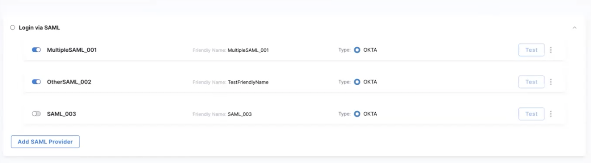
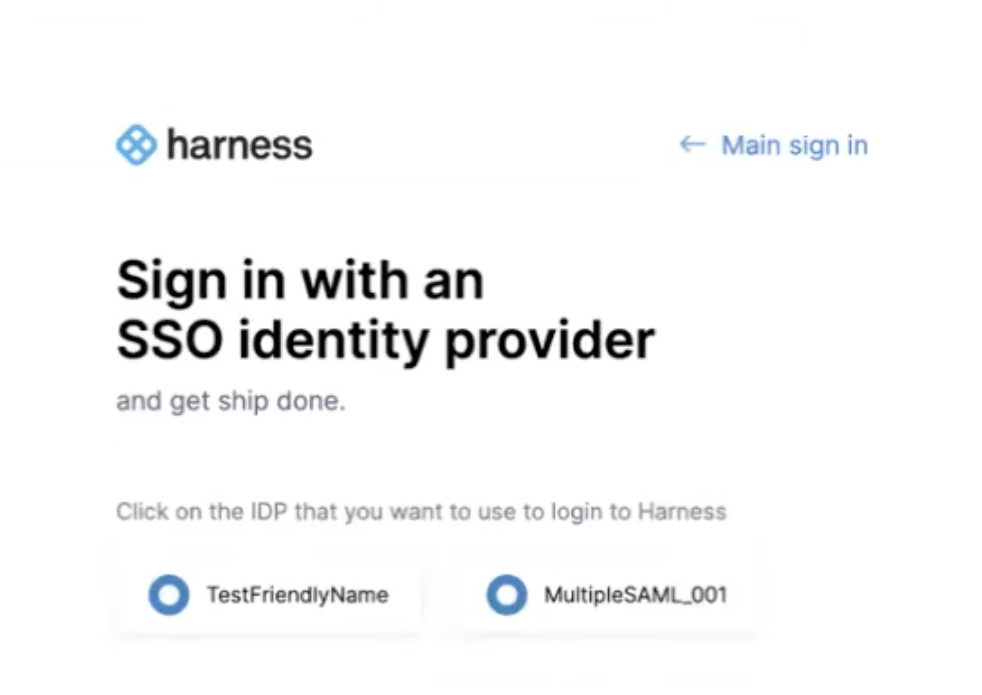

```mdx-code-block
import Tabs from '@theme/Tabs';
import TabItem from '@theme/TabItem';
```

:::important
Currently, this feature is behind the feature flag `PL_ENABLE_MULTIPLE_IDP_SUPPORT`. Contact [Harness Support](mailto:support@harness.io) to enable the feature.
:::

Harness supports multiple identity providers (IdPs) for user authentication using SAML.
You can configure a mix of various SAML providers and enable or disable them for user authentication.

This topic explains how to set up multiple SAML providers in Harness.

## Configure multiple SAML providers

To configure multiple SAML providers in Harness, do the following:

1. Select **ACCOUNT SETTINGS**, and then select **Authentication**.
2. Add the SAML providers you need.

    a. If no SAML providers are configured for the account, select **SAML Provider**. 
    
    b. If one or more SAML providers are configured, select **Add SAML Provider**.
   The SAML Provider settings appear.
3. In **Name**, enter a name for the SAML provider.
4. If you want a friendly name to be displayed on the login screen, enter the name in **Friendly Name**.
5. Select **Continue**.

## Select a SAML provider

To select a SAML provider, do the following:

1. Select a SAML provider.
   
   ```mdx-code-block
   <Tabs>
      <TabItem value="Azure">
   ```

   For steps to configure, go to [SAML SSO with Azure](/docs/platform/Authentication/single-sign-on-saml#saml-sso-with-azure).

   ```mdx-code-block
      </TabItem>
      <TabItem value="Okta">
   ```   

   For steps to configure, go to [SAML SSO with Okta](/docs/platform/Authentication/single-sign-on-saml#saml-sso-with-okta).

   ```mdx-code-block
      </TabItem>
      <TabItem value="OneLogin">
   ```

   For steps to configure, go to [SAML SSO with OneLogin](/docs/platform/Authentication/single-sign-on-saml#saml-sso-with-onelogin).

   ```mdx-code-block
      </TabItem>
      <TabItem value="Others">
   ``` 

   For steps to configure, go to [SAML SSO with Keycloak](/docs/platform/Authentication/single-sign-on-saml#saml-sso-with-keycloak).

   ```mdx-code-block
      </TabItem>
   </Tabs>
   ```

2. Select **Continue**.
3. Select **Submit**.

   The SAML provider is now listed in **Login via SAML**.

   

   Configure more SAML providers by repeating the steps.

## Enable login via SAML

   Select **Login via SAML** and then select **Continue**.
   To log in to Harness, a user of this account must select the SAML provider and then log in.

   

