Harness supports Single Sign-On (SSO) with SAML, integrating with your SAML SSO provider to enable you to log your users into Harness as part of your SSO infrastructure. This document explains how to set up SAML authentication.

:::info note
If the [Harness Self-Managed Enterprise Edition](/docs/self-managed-enterprise-edition/get-started/onboarding-guide) version is not accessed using the HTTPS load balancer, SAML authentication will fail. Make sure you access the Harness Self-Managed Enterprise Edition version using an HTTPS load balancer, and not an HTTP load balancer.
:::

## Supported formats

The XML SAML file used with Harness must use UTF-8.

UTF-8 BOM is not supported. Some text editors like Notepad++ save in UTF-8 BOM by default.

:::info note
When integrating users through any SAML provider, it is important to note that users added to an external SAML provider are not automatically synchronized with Harness user groups. Synchronization occurs upon the first login by the user belonging to a specific provider's user group into Harness. Only at this point will the newly added user, having logged in through SAML, inherit all permissions and access rights associated with the Harness group linked to the Okta user group.

:::

:::tip
    The **Users** column in the Harness UI is based on the `displayname` in the assertion. If you see an email address in the **Users** column, update the `displayname` with the user's first and last name.
:::

## Use System for Cross-domain Identity Management (SCIM) protocol

To ensure continuous and real-time synchronization of user group bindings and access controls, Harness recommends that you utilize the System for Cross-domain Identity Management (SCIM) protocol. SCIM enables real-time syncing of user additions with Harness user groups, ensuring that user permissions and access rights are consistently applied and maintained.

For implementation details and further guidance on provisioning users with SCIM, go to [Okta SCIM](/docs/platform/role-based-access-control/provision-users-with-okta-scim), [Microsoft Entra SCIM](/docs/platform/role-based-access-control/provision-users-and-groups-using-azure-ad-scim), and [OneLogin SCIM](/docs/platform/role-based-access-control/provision-users-and-groups-with-one-login-scim).

### SCIM API integration settings

If you provision users and groups via SCIM API, use the following settings for your SAML integration.

- **SCIM connector base URL:** `https://app.harness.io/gateway/ng/api/scim/account/<YOUR_ACCOUNT_ID`
   - Replace `YOUR_ACCOUNT_ID` with your Harness account ID.
   The URL depends on the Harness production cluster you use: Prod1: `https://app.harness.io`, Prod2: `https://app.harness.io/gratis`, or Prod3: `https://app3.harness.io`.
- **Unique identifier:** `userName`
- **Authentication Mode:** HTTP Header
- **Authorization:** `<YOUR_SERVICE_ACCOUNT_TOKEN>`

You must also do the following:

- Enable provisioning to Harness.
- Assign your user groups.
- Push your groups to Harness.

## SAML SSO with Harness

To set up SAML SSO with Harness, you add a SAML SSO provider to your Harness account and enable it as the default authentication method.

Harness SAML SSO involves the following:

* **Harness User email addresses:** Users are invited to Harness using their email addresses. Once they log into Harness, their email addresses are registered with Harness as Harness Users. To use SAML SSO, Harness Users must use the same email addresses to register in Harness and the SAML provider.

:::info note
Ensure that you have at least two corresponding user accounts when setting up and testing SAML SSO in Harness. This allows you to set up the account with a Harness Administrator account and test it with a Harness user account.
:::

* **SAML provider user email addresses:** To use the SAML provider to verify Harness Users, the email addresses used in the SAML provider must match the email addresses for the registered Harness Users you want to verify.
* **Harness SAML Endpoint URL:** This URL is where the SAML provider will post the SAML authentication response to your Harness account. This URL is provided by Harness in the **Single Sign-On (SSO) Provider** dialog. You enter this URL in your SAML SSO provider app to integrate it with Harness.
* **SAML metadata file:** This file is provided by your SAML provider app. You upload this file into the Harness **Single Sign-On (SSO) Provider** dialog to integrate the app with Harness.

## SAML SSO with Okta

To set up Harness with Okta as a SAML SSO provider, you exchange the necessary information between your Okta app and Harness.

:::info note
Users are not created as part of the SAML SSO integration. Okta user accounts must exist prior to exchanging information between your Okta account and Harness. Users are invited to Harness using their email addresses. Once they log into Harness, their email addresses are registered as Harness Users. For more information, go to [SAML SSO with Harness Overview](#saml-sso-with-harness-overview).
:::

This section describes the steps you must perform to use an Okta app for Harness SAML SSO.

:::tip

Use two browser windows or tabs for this process. Open Okta in one tab and open Harness in the other.

In your Harness tab, navigate to the **Add SAML Provider** page:

1. Select **Account Settings**, and then select **Authentication**.
2. Select **SAML Provider** to add a SAML configuration.
3. Enter a **Name** for the SAML configuration, and select **Okta**.

:::

### Okta user accounts

To set up a SAML support in your Okta Harness app, ensure that the app has corresponding Users in Harness:

1. In Harness, add the users you want to set up for SAML SSO by inviting them to Harness using the same email addresses that they use in your SAML provider.
2. In Okta, assign them to your SAML provider app.

:::tip
The only user property that must match between a Harness User and its corresponding SAML provider user account is its **email address**. 
Sometimes users might have mixed case email addresses in Okta. In these situations, Harness converts the email address to lowercase when adding them to Harness.
:::

### Create app integration in Okta

1. Sign in to your Okta administrator account, and select **Applications**.
2. Select **Create App Integration**.

   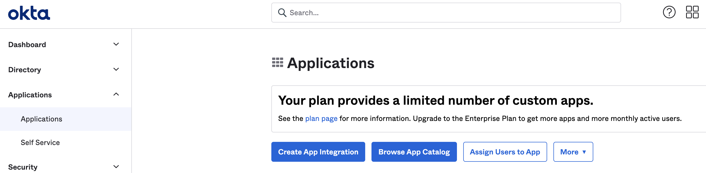

   The **Create a new app integration** dialogue opens.

3. Select **SAML 2.0**, then select **Next**.

   

3. In **General Settings**, enter a name in the **Application label** field, and then select **Next**.

   

4. On the **Configure SAML** tab, enter the Harness SAML endpoint URL in the **Single sing on URL** field. To get the SAML endpoint URL from Harness:
	1. If you aren't already on the **Add SAML Provider** page in Harness, open a new browser tab and navigate there. Sign in to Harness, go to **Account Settings**, select **Authentication**, select **SAML Provider**, enter a **Name** for the SAML configuration, and then select **Okta**.

	   

	2. Copy the endpoint URL from **Enter this SAML Endpoint URL as your Harness application's ACS URL**. This is the URL you need to paste in the **Single sign on URL** field in Okta.

	   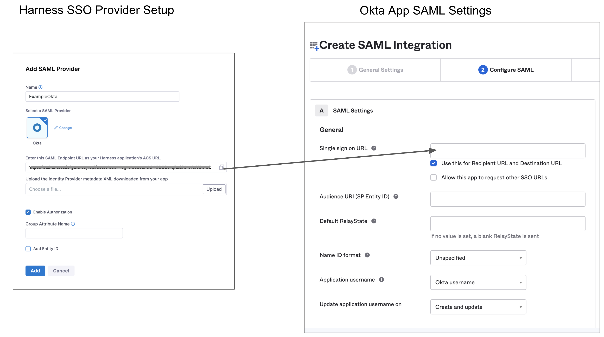

	3. Keep this page open. You will come back to it later in this process.

5. In **Audience URI (SP Entity ID)**, enter `app.harness.io`. The SAML application identifier is always `app.harness.io`.
6. In **Default RelayState**, leave **blank**.  Harness uses this to exchange addtiional info between IdP SAML provider (OKTA) and Service Provider (Harness), by sending Custom RelayState information.
7. In **Name ID format**, enter the username format you are sending in the SAML Response. The default format is **Unspecified**.
8. In **Application username**, enter the default username.
9.  In **Attribute Statements (optional)**, enter name in the **Name** field, select **Name Format** as **Basic**, and select the **Value** as **user.email**.

    When you create a new SAML integration or modify an existing one, you can define custom attribute statements. These statements are inserted into the SAML assertions shared with your app. For more information, go to the Okta documentation on [Defining Attribute Statements](https://help.okta.com/oie/en-us/Content/Topics/Apps/Apps_App_Integration_Wizard_SAML.htm#).

10. In **Group Attribute Statements (optional)**, enter a name in the **Name** field, select **Name format (optional)** as **Basic**, select an appropriate **Filter** and enter its value.

    If your Okta org uses groups to categorize users, you can add group attribute statements to the SAML assertion shared with your app. For more information, go to the Okta documentation on [Defining Group Attribute Statements](https://help.okta.com/oie/en-us/Content/Topics/Apps/Apps_App_Integration_Wizard_SAML.htm#).

    

11. Select **Next**, and then select **Finish**.

### Okta SAML metadata file

Download the **Identity Provider metadata** XML from your Okta app and upload it into Harness.

1. In your Harness Okta app, go to the **Sign On** tab, and then select **Edit**.
2. Select **Actions** to download the SAML metadata file.

   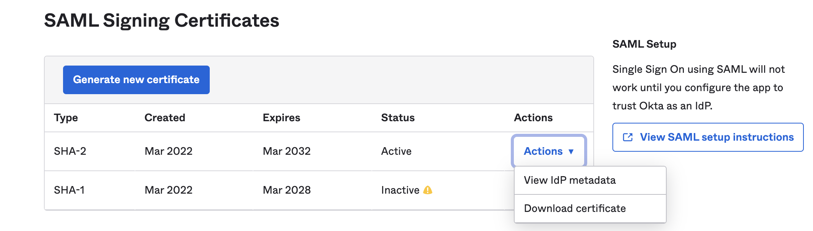

3. In Harness, on the **Add SAML Provider** page, in **Upload the Identity Provider metadata XML downloaded from your Okta app**, select **Choose a file** or **Upload**, and select the SAML metadata file you downloaded from your Okta app.
4. Deselect **Enable Authorization**.
5. The default Entity ID is `app.harness.io`. To override the default entity ID, select **Add Entity ID** and enter your custom entity ID.
6. Select **Add**. Your Okta configuration appears under **Login via SAML**.

   

### Enable and test SSO with Okta

Now that Okta is set up in Harness as a SAML SSO provider, you can enable and test it.

1. In Harness, go to **Account Settings**, and then select **Authentication**.
2. Select **Login via SAML**.
3. On the **Enable SAML Provider** confirmation window, select **Test** to verify the connection. A new browser tab opens where you need to log in to **Okta**.

   

   If the connection test succeeds, Harness displays a **SAML test successful** banner.

   

4. Select **Confirm** to enable Okta SAML SSO in Harness.
5. As an additional test of the SSO configuration, log into Harness through a different user account. Do this in a separate private browsing (Incognito) window so you can disable SSO in your Harness Administrator account if there are any errors.

   1. In a private browsing window, navigate to Harness.
   2. Log in using a Harness [user account](../role-based-access-control/add-users.md) that has a corresponding email address registered in Okta. If successful, you're redirected to the Okta log in page.
   3. On the Okta log in page, enter the email address associated with the Harness user account. The Harness account and Okta account can have different passwords. If successful, you'll be returned to Harness.

   :::info

   If you get locked out of Harness due to an SSO issue, you can log into Harness through [local login](#harness-local-login).

   :::

import Llnote from '/docs/platform/shared/local-login-note.md'

<Llnote />

### SAML authorization with Okta

Once you have enabled Harness SSO with your Okta app, you can set up and enable Okta SAML authorization in Harness.

To set up SAML authorization in Harness, link a [Harness user group](../role-based-access-control/add-user-groups.md) to an Okta user group. When an Okta user in that Okta user group logs in to Harness, they are automatically added to the associated Harness user group, and the user inherits all permissions and access assigned to that group. For more information, go to [RBAC in Harness](../role-based-access-control/rbac-in-harness.md).

1. Set up SAML SSO in Harness as described in [SAML SSO with Okta](#saml-sso-with-okta).

   Enabling SAML authorization will authorize the same Harness users that are authenticated using your SAML provider.

   :::info note

   Harness uses email addresses to match Harness user accounts with Okta user accounts. Make sure the email addresses of your registered Harness users match the Okta users you want to authenticate and authorize.

   :::

2. In Okta, create a user group and add users to the group, if you don't already have such a group.

	1. Sign in to Okta using Admin Account.
	2. Under **Directory**, select **Groups**, then select **Add Group**. The **Add Group** dialog opens.

	   

	3. Enter a **Name** and **Group Description** for your group. Select **Add Group**.
	4. You are redirected to the **Groups** page. Search for the group you created, and then select it.
	5. Select **Manage People**. Find and add members to your group.

	   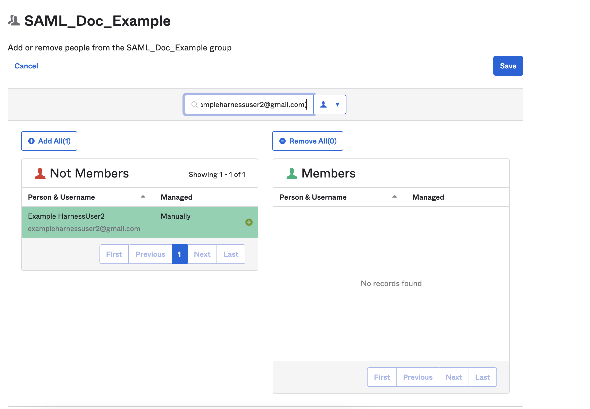

	   After adding the members to the group you created, the screen would looks like this:

	   

	   Both members are already registered in Harness using the same email addresses in both Harness and the SAML provider.

3. Make note of the Okta Group Name. You'll need it later to link the Okta group to a Harness user group.
4. Make sure the Okta user group is assigned to the same Okta SAML provider app you use for Harness SAML SSO.

	1. In Okta, under **Directory**, select **Groups**.
	2. Find and select your Okta user group.
	3. Select **Manage Apps**.

	   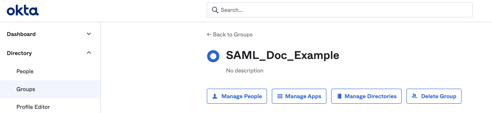

	4. Find your Harness Okta app and select **Assign**.
	5. Select **Done**.
	6. Under **Applications**, select **Applications**.
	7. Find and select your Harness Okta app.
	8. Under **Assignments**, select **Groups**, and make sure your Okta user group is listed there.

	   

5. Configure the **Group Attribute Name** in your Okta app. Later, you'll use the Group Attribute Name to enable SAML authorization in Harness.

	1. In **Okta**, select **Applications**, and then select your Harness Okta SAML SSO app.
	2. Switch to the **General** tab.
	3. Under **SAML Settings**, select **Edit**.

	   

	4. Under **General Settings**, select **Next**.

	   

	5. Under **Group Attribute Statements (Optional)**, in the **Name** field, enter the Group Attribute Name you want to use, such as `dept`.

       The *Group Attribute Name* is different from an *Okta Group Name*. Your company might have many groups set up in Okta, and the Group Attribute Name is used to filter the groups that you want to authenticate to Harness.

	6. In **Filter**, select **Matches regex**, and enter `.*` as the value.

	   

	7. Select **Next**, and then select **Finish**.

6. Make sure you have the following information from Okta:

   * **Group Name:** This is the name of the Okta user group containing the users you want to authorize in Harness. The email addresses registered in this group must be the same as the email addresses these users have registered in Harness.
   * **Group Attribute Name:** This is the Group Attribute Name associated with the Okta app you use for authentication.

   The *Group Attribute Name* is different from an *Okta Group Name*. Your company might have many groups set up in Okta, and the Group Attribute Name is used to filter groups.

   In Harness, you enter the Group Attribute Name in the SAML SSO provider settings, and then you link the Okta Group Name to the Harness user group.

   If you're configuring multiple groups, you need all the Group Names. You can only have one Group Attribute Name.

7. In Harness, go to **Account Settings**, and select **Authentication**.
8. Select the arrow to expand the **Login via SAML** section.

   

9. Select **More options** (&vellip;) next to your Okta provider configuration, and then select **Edit**.

   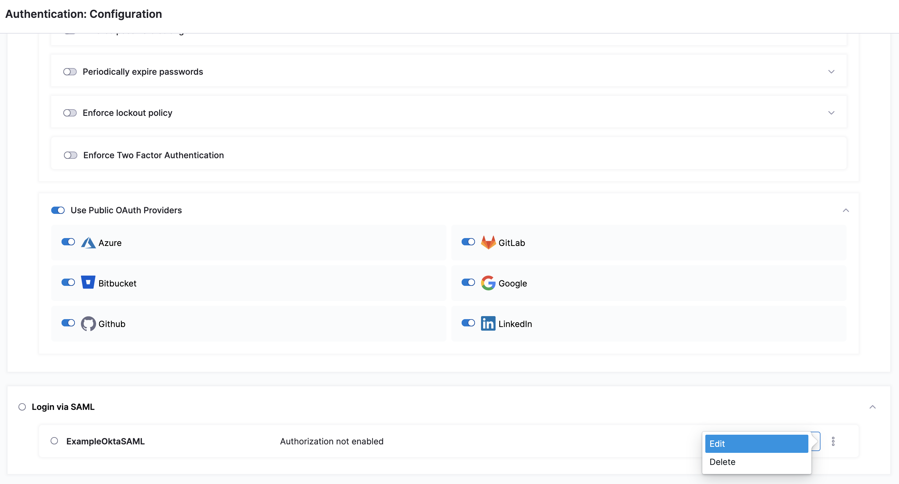

10. On the **Edit SAML Provider** page, select **Enable Authorization**.
11. Enter the **Group Attribute Name**.

     <!-- -->

12. Select **Add**. Your Okta configuration now uses the Group Attribute Name for authorization.
13. Link your Okta user group to a corresponding [Harness user group](../role-based-access-control/add-user-groups.md). You can create a user group or use an existing group if your Harness user account is a member and your user account is registered under the same email address as in Okta.

	1. In Harness, go to **Account Settings**, and select **Access Control**.
	2. Select **User Groups** in the header, and locate the user group that you want to connect to your Okta user group.
	3. Select **Link to SSO Provider Group**.

	    

	4. In **Search SSO Settings**, select your Okta SAML SSO configuration.
	5. Enter the Okta **Group Name**, and select **Save**.

		

	6. Repeat these steps if you need to connect more user groups.

14. To test the SAML authorization configuration, log into Harness through a different user account. Do this in a separate private browsing (Incognito) window so you can disable SSO in your Harness Administrator account if there are any errors.

    1. In a private browsing window, navigate to Harness.
    2. Log in using a Harness [user account](../role-based-access-control/add-users.md) that has a corresponding email address registered in Okta. If successful, you're redirected to the Okta log in page.
    3. On the Okta log in page, enter the email address associated with the Harness user account. The Harness account and Okta account can have different passwords. If successful, you'll be returned to Harness.

    :::info note

    If you get locked out of Harness due to an SSO issue, you can log into Harness through [local login](#harness-local-login).

    :::

    4. In your other browser window (where you are logged in to your admin account), make sure the user appears in the Harness user group. Go to **Account Settings**, select **Access Control**, select **User Groups** in the header, select the user group you linked to Okta, and make sure the user you just logged in with is listed as a member.

    By being a member of this user group, the user receives the permissions and access granted to that group. For more information about this, go to [RBAC in Harness](../role-based-access-control/rbac-in-harness.md).

:::tip Delink groups

If you no longer want a Harness user group to be connected with an Okta user group, you can delink the groups without losing group members.

Delinking groups is required to remove a SAML SSO provider configuration from Harness. You can't delete the SAMl SSO provider from Harness until you have delinked all associated Harness user groups.

1. In Harness, go to **Account Settings**, and select **Access Control**.
2. Select **User Groups** in the header, and locate the user group that you want to delink.
3. Select **Delink Group**.

   

4. On the **Delink Group** window, you can select **Retain all members in the user group** to keep the users (as local Harness user accounts) in the Harness user group. If unselected, the groups are delinked and the group members who were authenticated through Okta are removed from the Harness user group.

   

5. Select **Save**.

:::

## SAML SSO with Microsoft Entra ID

The section describes the Microsoft Entra ID-specific steps you must perform to use an Microsoft Entra ID app for Harness SAML SSO:

:::info note
Make sure the email address used in Harness matches the email address in the Microsoft Entra ID app for every user.
:::

The following image shows the basic exchange of information between Harness and your Microsoft Entra ID app's Single sign-on settings:

### Users in over 150 groups

When a user has many group memberships, the number of groups listed in the token can grow the token size. Microsoft Entra ID limits the number of groups it will emit in a token to 150 for SAML assertions.

If a user is a member of a larger number of groups, the groups are omitted and a link to the Graph endpoint to obtain group information is included instead.

To invoke the API, Harness requires **Client ID** and **Client Secret** for your registered app.

To get this information, do the following:

1. In your Azure, go to **App registrations**.
2. Click on your app. Copy the Application (client) ID and paste it in **Client ID** in your Harness account.
3. In your  account, go to **App registrations**. Click **Certificates and Secrets**.
4. Select **New Client Secret**.
5. Add a description and click **Add**.
6. You must copy this secret and save it as an encrypted text secret. For detailed steps to create an encrypted text in Harness, go to [Use Encrypted text Secrets](../secrets/add-use-text-secrets).
7. Select the above secret reference in the **Client Secret** field in your Harness account.

When the user authenticating SAML is part of more than 150 groups in Microsoft Entra ID, you must set `User.Read.All` access for the application if you want to configure the optional **Client ID** and **Client Secret**. For more information on Azure application permissions, go to [Application permissions](https://learn.microsoft.com/en-us/graph/permissions-reference#application-permissions-93) in the Azure documentation.

To set `User.Read.All` access for the application, do the following:

1. In Azure, go to **Manage**, and then select **API Permissions**.
2. Select **Add a permission**.
3. Under **Microsoft APIs**, select Microsoft Graph, and then select **Application permissions**.
4. Add the `User.Read.All` permission.

The following App registration permissions are required to configure the optional `client-id` and `client-secret` for Harness SAML SSO with the Azure app:

- `Directory.ReadWrite.All`
- `Group.ReadWrite.All`
- `GroupMember.ReadWrite.All`
- `User.ReadWrite.All`

:::info note
You must set the above for both Delegated permissions and Application permissions.
:::

### Azure user accounts

The Harness User accounts and their corresponding Azure user accounts must have the same email addresses.

Ensure that you have at least two corresponding user accounts in both Harness and your Azure app when setting up and testing SAML SSO. This allows you to set up the account with a Harness Administrator account and test it with a Harness user account.

The following image shows a Harness User Group containing two users and their corresponding accounts in the Azure app that will be used for SAML SSO.

### Endpoint URL for Azure

You must enter the **Harness SAML Endpoint URL** from Harness in your Azure app **Reply URL**:

1. In your Azure app, click **Single sign-on**. The SSO settings for the Azure app are displayed.

   

2. In **Basic SAML Configuration**, click the edit icon (pencil).
3. Enter a unique identifier in the **Identifier (Entity ID)** field. When your tenant only has one SAML application, this can be `app.harness.io`. If there are several SAML applications in the same tenant, this should be a unique identifier. While setting up SAML in Harness, the same identifier should be configured in the **Entity ID** field.

   

Next, you will use the **SAML SSO Provider** settings in Harness to set up your Azure app **Single sign-on**.

:::info note
For [Harness Self-Managed Enterprise Edition](/docs/self-managed-enterprise-edition/get-started/onboarding-guide), replace **app.harness.io** with your custom URL.
If you use a custom Harness subdomain in any Harness version, like **example.harness.io**, use that URL.
:::

4. In **Home**, under **ACCOUNT SETUP**, select **Authentication**. **The Authentication: Configuration** page appears.
5. Select **SAML Provider**. The **Add SAML Provider** page opens.

   

6. In **Name**, enter a name for the SAML SSO Provider.
7. Under **Select a SAML Provider**, select **Azure**. The settings for Azure setup are displayed:

   

8. Copy the **Harness SAML Endpoint URL** from the **Add SAML Provider** dialog, and paste it in the **Reply URL** in your Azure app.

   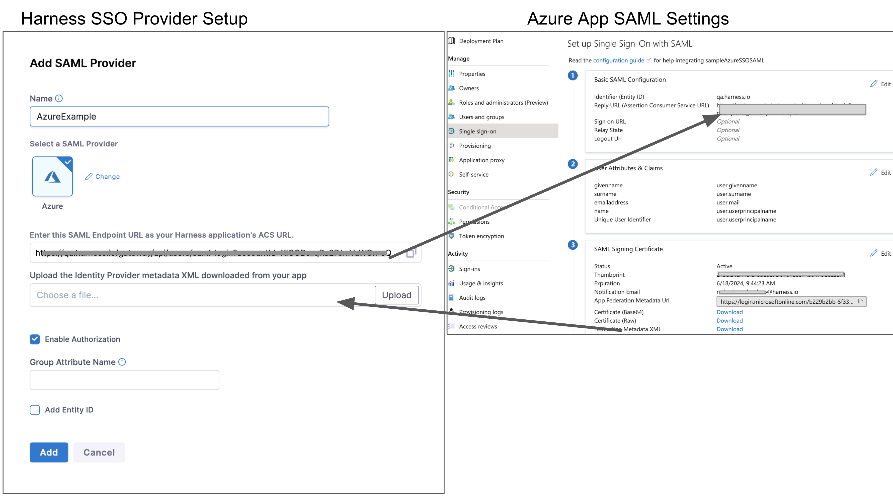

9. Click **Save** on the Azure App SAML Settings page.

### User attributes and claims

Next, you need to ensure that Harness Users' email addresses will identify them when they log in via Azure. To do this, you set up the **Single sign-on** section of your Azure app to use the **User name** email address as the method to identify users.

The Azure users that are added to your Azure app must have their email addresses listed as their **User name.**

To set this **User name** email address as the method for identifying users, in the Azure app **Single sign-on** section, the Azure app must use the **user.userprincipalname** as the **Unique User Identifier**, and **user.userprincipalname** must use **Email address** as the **name identifier format**.

:::info note
If **user.userprincipalname** can't use an email address as the **Name ID format**, then **user.email** should be used as the unique identifier in the **Identifier (Entity ID)** field.
:::

To set this up in your Azure app, do the following:

1. In your Azure app, in the **Single sign-on** blade, in **User Attributes & Claims**, click the edit icon (pencil). The **User Attributes & Claims** settings appear.

   

2. For **Unique User identifier value**, click the edit icon. The **Manage claims** settings appear.

   

3. Click **Choose name identifier format**, and select **Email address**.
4. In **Source attribute**, select **user.userprincipalname**.
5. Click **Save**, and then close **User Attributes & Claims**.

:::info note
If your Azure users are set up with their email addresses in some field other than **User name**, just ensure that the field is mapped to the **Unique User Identifier** in the Azure app and the **name identifier format** is **Email address**.
:::

### Azure SAML metadata file

You must download the **Federation Metadata XML** from your Azure app and upload the file into Harness.

1. Download the **Federation Metadata XML** from your Azure app and upload it using **Upload the identity Provider metadata xml downloaded from your Azure App** in the **Add SAML Provider** settings in Harness.

   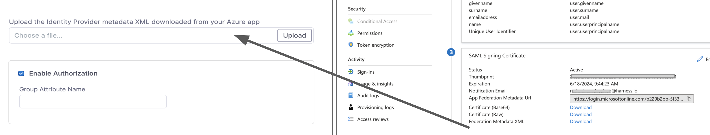

2. Select **Add Entity ID** and enter your custom Entity ID. The default Entity ID is **app.harness.io**. The value you enter here will override the default Entity ID.
3. Click **Add**. The new Azure SAML Provider is added.

   

### Enable and test SSO with Azure

Now that Azure is set up in Harness as a SAML SSO provider, you can enable and test it.

You can test the Azure app SSO from within Azure if you are logged into Azure using an Azure user account that has the following:

* A corresponding Harness User account with the same email address.
* The Azure user account is in the Azure app **Users and groups** settings.
* The Azure user account has the Global Administrator Directory role in Azure.

To test Azure SSO using Azure, do the following:

1. In the Azure app, click **Single sign-on**, and then at the bottom of the **Single sign-on** settings, click **Test**.

   

2. In the **Test** panel, click **Sign in as current user**. If the settings are correct, you are logged into Harness. If you cannot log into Harness, the **Test** panel will provide debugging information. For more information, go to [Debug SAML-based single sign-on to applications](https://docs.microsoft.com/en-us/azure/active-directory/develop/howto-v1-debug-saml-sso-issues?WT.mc_id=UI_AAD_Enterprise_Apps_Testing_Experience) from Microsoft Entra ID.

To test Azure SSO using Harness, do the following:

1. In **Harness**, in **ACCOUNT SETUP**->**Authentication**, select **Login via SAML**, to enable SAML SSO using the Azure provider.
2. Open a new Chrome Incognito window to test the SSO login using a Harness User account other than the one you are currently logged in with.
3. Sign into Harness using one of the user account email addresses shared by Harness and Azure. When you sign into Harness, you are prompted with the Microsoft Sign in dialog.
4. Enter the Azure user name for the user (most often, the email address), enter the Azure password, and click **Sign in**.

### SAML authorization with Azure

Once you have enabled Harness SSO with your Azure app, you can set up and enable SAML authorization in Harness using Azure.

To set up SAML authorization in Harness, you link a Harness User Group to a user group assigned to your Azure app. When a user from your Azure app logs into Harness, they are automatically added to the linked Harness User Group and inherit all the RBAC settings for that Harness User Group.

Below is the Harness SAML settings you need from Azure to set up SAML authorization in Harness:

* **Group Attribute Name** - In Azure, this value is obtained from the **Group Claims** in the Azure app **User Attributes & Claims** settings.

For Harness **Group Attribute Name**, here is the Harness **SAML Provider** setting on the left and their corresponding Azure **Group Claims** settings on the right:

To set up Azure Authorization in Harness, do the following:

1. In Azure, add the **Group Claim** (Name and Namespace) to the Azure app.
	1. In your Azure app, click **Single sign-on**, and then in **User Attributes & Claims**, click edit (pencil icon).

	   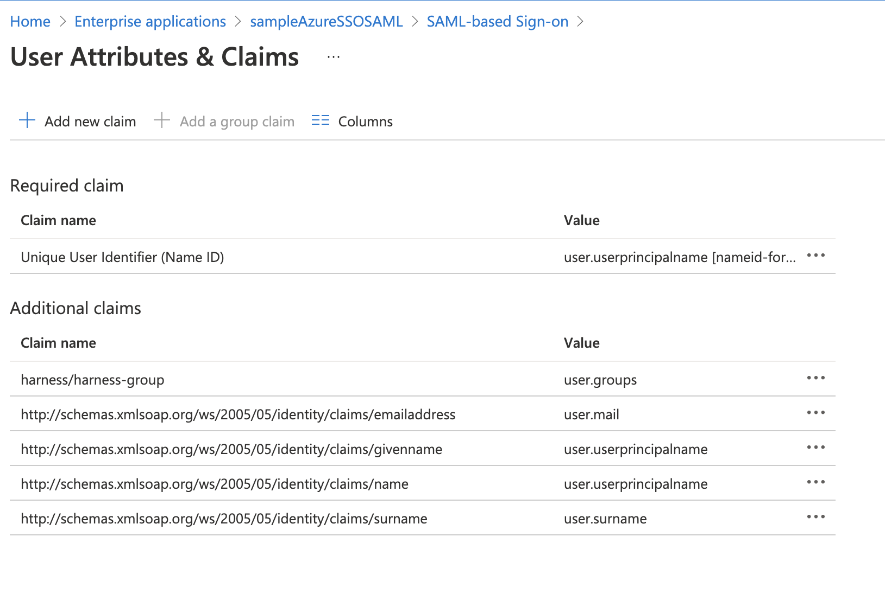

	2. In **User Attributes & Claims**, edit the groups claim. The **Group Claims** settings appear.

	   

	3. Click the **All groups** option and then enable **Customize the name of the group claim**.
	4. In **Name**, enter a name to use to identify the Harness Group Attribute Name.
	5. In **Namespace**, enter a namespace name.
	6. Click **Save**. **User Attributes & Groups** now display the group claim you created.
	7. Close **User Attributes & Groups**.
2. In Harness, enter the Group Claim name and namespace in the SAML SSO Provider **Group Attribute Name** field.
	1. Open the SAML SSO Provider dialog, and enable the **Enable Authorization** setting. You need to enable **Enable Authorization** in order to select this SSO Provider when you link a Harness User Group for authorization.
	2.  Enter the Group Claim name and namespace in the **Group Attribute Name** field in the same format as a Claim Name (`namespace/name`). The SAML SSO Provider dialog will look something like this:

		

	3. Click **Save**. Authorization and the Group Attribute Name are set up. Next, you need to set up your Azure and Harness groups.
3. In Azure, ensure the Azure users with corresponding Harness accounts belong to an Azure group. Here is an Azure group named **ExampleAzureGroup** with two members:

   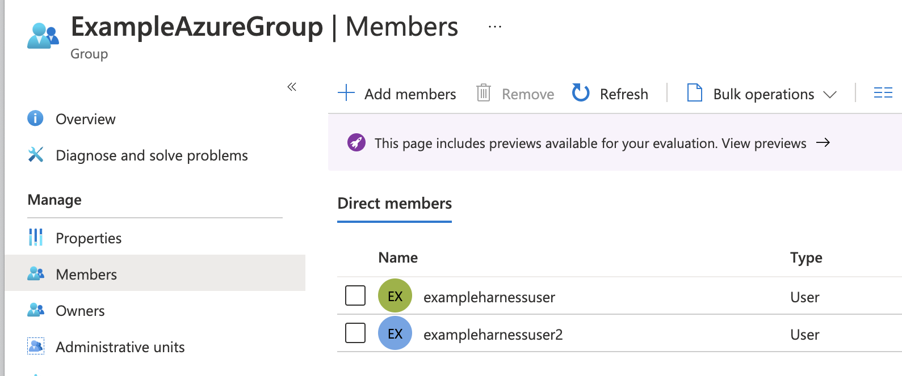

4. Ensure that the Azure group is assigned to the Azure app. Here you can see the **ExampleAzureGroup** group in the Azure app's **Users and groups**:

   

5. Link the Harness User Group to the Azure group using the Azure group Object ID.
	1. In Azure, copy the Azure group **Object ID**.

		

	2. In Harness, create a new User Group or open an existing User Group.
	3. In **Home**, click **Access Control** under **ACCOUNT SETUP**.
	4. Click **User Groups** and then click on the User Group you want to link the SAML SSO Provider to**.**
	5. Click **Link to SSO Provider Group**.

	    

	6. In the **Link to SSO Provider Group** dialog, in **SSO Provider**, select the Azure SSO Provider you set up, and in **Group Name**, paste the Object ID you copied from Azure. When you are done, the dialog will look something like this:

       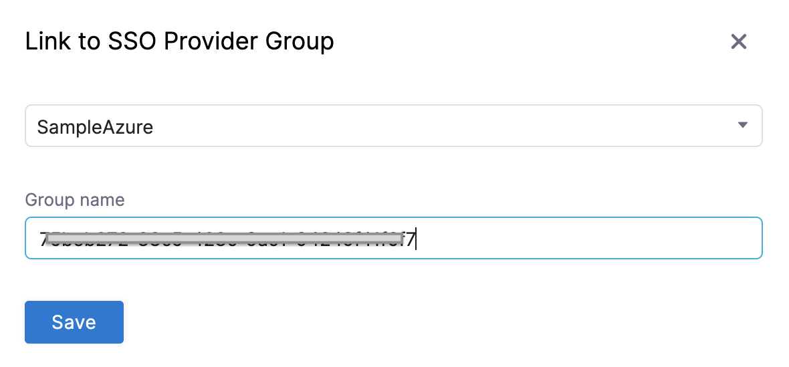

	7. Click **Save**. The User Group is now linked to the SAML SSO Provider and Azure group Object ID.
6. Test Authorization.
	1. Open a new Chrome Incognito window to test the authorization using a Harness User account other than the one you are currently logged in with.
	2. Log into Harness using the user email address, and sign in using the Azure username and password. If you are already logged into Azure in Chrome, you might be logged into Harness automatically.
	3. In the linked Harness User Group, ensure that the Harness User account you logged in with was added.

The Harness User is now added and the RBAC settings for the Harness User Group are applied to its account. For more information, go to [Manage User Groups](/docs/platform/role-based-access-control/add-user-groups).

## SAML SSO with Microsoft Entra ID

You can use Microsoft Entra ID for SAML SSO with Harness, enabling Microsoft Entra ID users to log into Harness using their Microsoft Entra ID credentials.

For detailed steps on adding SAML SSO with Microsoft Entra ID, follow the steps in the tutorial [Microsoft Entra single sign-on (SSO) integration with Harness](https://docs.microsoft.com/en-us/azure/active-directory/saas-apps/harness-tutorial) from Microsoft.

:::info note
Users are not created as part of the SAML SSO integration. Users are invited to Harness using their email addresses. Once they log into Harness, their email addresses are registered as Harness Users. For more information, go to [SAML SSO with Harness Overview](#saml-sso-with-harness-overview).
:::

### Users in over 150 groups

When users have large numbers of group memberships, the number of groups listed in the token can grow the token size. Microsoft Entra ID limits the number of groups it will emit in a token to 150 for SAML assertions.

If a user is a member of a larger number of groups, the groups are omitted and a link to the Graph endpoint to obtain group information is included instead.

To invoke the API, Harness will need **Client ID** and **Client Secret** for your registered app.

To get this information, do the following:

1. In your Microsoft Entra ID account, go to **App registrations**.
2. Click on your app. Copy the Application (client) ID and paste it in **Client ID** in your Harness account.
3. In your Microsoft Entra ID account, go to **App registrations**. Click **Certificates and Secrets**.
4. Click New Client Secret.
5. Add a description and click Add.
6. You must copy this secret and save it as an encrypted text secret. For detailed steps to create an encrypted text in Harness, go to [Use Encrypted text Secrets](/docs/platform/secrets/add-use-text-secrets).

7. Select the above secret reference in the Client Secret field in your Harness account.

   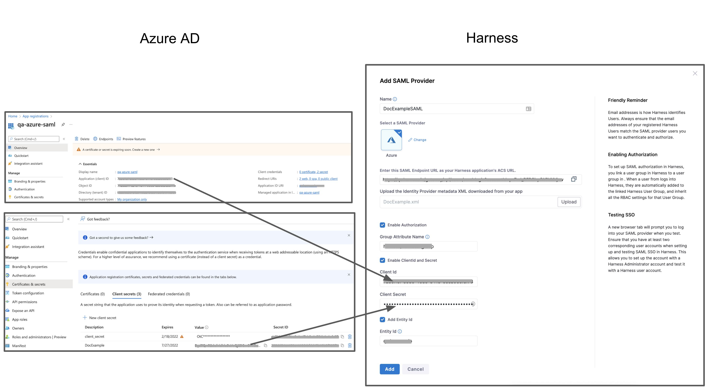

## SAML SSO with OneLogin

To set up OneLogin as a SAML SSO provider on Harness, you exchange the necessary information between the OneLogin Harness application and Harness. The following sections cover Authentication steps, followed by Authorization steps.

### OneLogin authentication on Harness

Enabling OneLogin authentication on Harness requires configuration on both platforms, as described in these sections:

#### Exchange Harness Consumer URL and OneLogin Metadata

1. In **Home**, click **Authentication** under **ACCOUNT SETUP**. **The Authentication: Configuration** page appears.
2. Click **SAML Provider**. The **Add SAML Provider** page appears.
3. In**Name**, enter a name for the SAML SSO Provider.
4. Select **OneLogin** under **Select a SAML Provider**. The settings for OneLogin setup are displayed.
5. Copy the provided URL under **Enter the SAML Endpoint URL, as your Harness OneLogin application's ACS URL**, to clipboard.
6. In OneLogin, add the **Harness** app (for SaaS setup) or **Harness (On Prem)** app for Harness Self-Managed Enterprise Edition setup. To do so, perform the following steps:
	1. Log in to OneLogin.
	2. Click **Administration**.
	3. Under the **Applications** tab, click **Applications**.
	4. Click **Add App**.
	5. Find **Harness** or **Harness (On Prem)** based on your setup, and then click the app.

	   

7. In **Configuration**, paste this URL into the **SCIM Base URL** field.

   

8. Skip all other **Application Details** fields, and click **Save**.
9. Navigate to OneLogin's **Applications** > **SSO** tab. At the upper right, select **More Actions** > **SAML Metadata**.

	

10. From the resulting dialog, download the .xml authentication file that you'll need to upload to Harness.

#### Assign users to roles

1. In OneLogin, select **Users** > **Users**.

:::tip
   If you prefer to assign *groups* to roles, instead start at **Users** > **Groups**, and modify the following instructions accordingly.
:::

2. Search for a user that you want to add to Harness.

   

3. Click to select the user.
4. The **Users** page appears. Click the **Applications** tab.
5. Click the **+** button at the upper right to assign an Application.
6. Select the Application, then click **Continue**.
7. Repeat this section for other users (or groups) that you want to add to Harness.

#### Enable OneLogin as a Harness SSO provider

1. In **Home**, click **Authentication** under **ACCOUNT SETUP**. **The Authentication: Configuration** page appears.
2. Click to expand the **Login via SAML** section.

   

3. You can see the SSO Provider you have setup listed in this section. Click the vertical ellipsis (**︙**) next to the SSO Provider you have set up for SSO authentication, and click **Edit**.
4. Use **Choose File** to upload the .xml file that you obtained from OneLogin.
5. Deselect **Enable Authorization**.
6. Select **Add Entity ID** and enter your custom Entity ID. The default Entity ID is **app.harness.io**. The value you enter here will override the default Entity ID.
7. Click **Add**.
8. Click **Login via SAML** toggle, to enable your new provider.
9.  In the resulting **Enable SAML Provider** dialog, click **TEST** to verify the SAML connection you've configured.

	

10. Once the test is successful, click **Confirm** to finish setting up OneLogin authentication.

### OneLogin authorization on Harness

Once you've enabled OneLogin authentication on Harness, refer to the below sections to enable authorization between the two platforms:

#### Assign roles to users

Harness' SAML authorization replicates OneLogin Roles as Harness User Groups. Here is how to begin mapping between these entities.

1. From OneLogin's, menu, select **Users** > **Users**.
2. Find and select a user, assigned to Harness, to assign appropriate OneLogin Roles.
3. Click the **Applications** tab.
4. Select the specific Roles you want to assign to this user.
5. Click **Save User** at the upper right.
6. Repeat this section for other users to whom you want to assign Roles.

#### Define parameters

1. Select **Applications** > **Parameters**, then select the `+` button to add a new Parameter.
2. In the resulting **New Field** dialog, assign a **Field name** (for example **Groups**).

   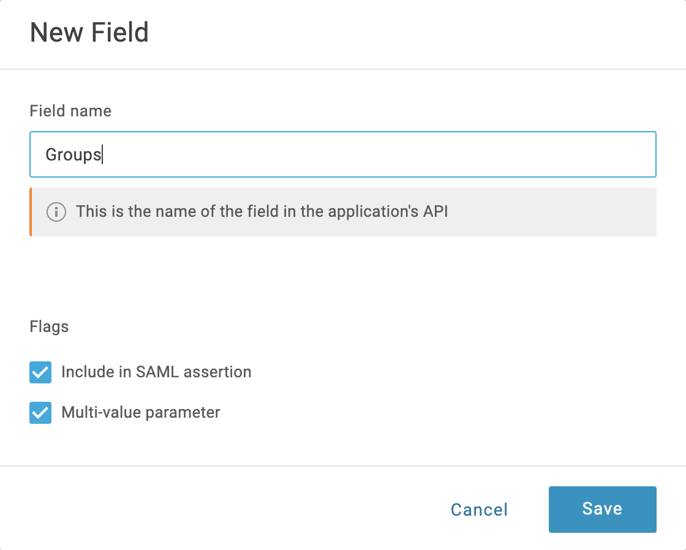

3. Select **Include in SAML assertion** and **Multi-value parameter**. Then click **Save**.
4. Back on the **Parameters** tab, select your new **Groups** field.
5. In the resulting **Edit Field Groups** dialog, set **Default if no value selected** to **User Roles**. Below that, select **Semicolon Delimited input (Multi-value output)**. Then select **Save**.

   

6. Select **Save** again at the **Parameters** page's upper right.

#### Sync users in Harness

1. In **Home**, click **Authentication** under **ACCOUNT SETUP**. **The Authentication: Configuration** page appears.
2. Click to expand the **Login via SAML** section.

   

3. You can see the SSO Provider you have set up listed in this section. Click the vertical ellipsis (**︙**) next to the SSO Provider you have set up for SSO authentication, and click **Edit**.

   

4. In the **Edit SAML Provider** dialog, click **Enable Authorization**.
5. In **Group Attribute Name**, enter the name of the **Field Group** you configured in OneLogin.
6. Click **Save**.
7. Under **ACCOUNT SETUP** click **User Groups**.
8. Click on the User Group you want to link the SAML SSO Provider to**.**
9. Click **Link to SSO Provider Group**.
10. In the **Link to SSO Provider Group** dialog, in **Search SSO Settings**, select the SAML SSO Provider you have set up.
11. In the **Group Name**, enter the name of the Field Group you configured in OneLogin.
12. Click **Save**.

#### Test the integration

After you've synced Users between OneLogin and Harness, users will be assigned to the designated Harness User Group upon your next login to Harness. To test whether OneLogin authentication and authorization on Harness are fully functional do the following:

1. In Chrome, open an Incognito window, and navigate to Harness.
2. Log into Harness using the email address of a Harness User that is also used in the SAML provider group linked to the Harness User Group.
When the user submits their email address in Harness Manager, the user is redirected to the SAML provider to log in.
3. Log into the SAML provider using the same email that the user is registered with, within Harness.
Once the user logs in, the user is redirected to Harness and logged into Harness using the SAML credentials.
4. In your Harness account in the other browser window, check the User Group you linked with your SAML provider. The user that logged in is now added to the User Group, receiving the authorization associated with that User Group.

:::info note
You cannot delete a SAML SSO Provider from Harness that is linked to a Harness Group. You must first remove the link to the SSO Provider from the Group.
:::

## SAML SSO with Keycloak

Harness supports configuration with or without [Just-In-Time (JIT) user provisioning](/docs/platform/role-based-access-control/provision-use-jit/). Without JIT, perform the following steps to add new users:

1. In Harness, add the users you want to set up for SAML SSO by inviting them to Harness using the same email addresses that they use in your SAML provider.
2. In Keycloak, add the users and make sure they are in scope for the client you create in the configuration steps below.

With JIT, you add users to Keycloak, and they will automatically be added to Harness upon first login.

### Set up a client in Keycloak

1. Log in to your Keycloak account.
2. Switch to your target Realm, then select **Clients**.
3. Select **Create Client**, then enter the following values.

	**General settings**

	| **Field**                      | **Description**                                                                                                                                 |
	| ------------------------------ | ----------------------------------------------------------------------------------------------------------------------------------------------- |
	| **Client Type**                | SAML                                                                                                                                            |
	| **Client ID**                  | app.harness.io                                                                                                                                  |
	| **Name**                       | _optional_                                                                                                                                      |
	| **Description**                | _optional_                                                                                                                                      |
	| **Always display in UI**       | Off                                                                                                                                             |

	**Login settings**

	| **Field**                      | **Description**                                                                                                                                 |
	| ------------------------------ | ----------------------------------------------------------------------------------------------------------------------------------------------- |
	| **Root URL**                   | `https://app.harness.io/`                                                                                                                       |
	| **Home URL**                   | `https://app.harness.io/ng/account/<YOUR ACCOUNT ID>/main-dashboard`                                                                            |
	| **Valid post logout redirect URIs** | `https://app.harness.io/ng/account/<YOUR ACCOUNT ID>/main-dashboard`                                                                       |
	| **Master SAML Processing URL** | `https://app.harness.io/gateway/api/users/saml-login?accountId=<YOUR ACCOUNT ID>`                                                               |

:::info note
If the account uses a vanity URL, then use the vanity URL in your SAML setup. For example, `https://<yourvanityurl>/gateway/api/users/saml-login?accountId=<YOUR ACCOUNT ID>`.
:::

4. Select **Save**.
5. In the newly-created client's configuration, enter the following values.

	**Settings -> SAML capabilities**

	| **Field**                      | **Description**                                                                                                                                 |
	| ------------------------------ | ----------------------------------------------------------------------------------------------------------------------------------------------- |
	| **Name ID format**             | email                                                                                                                                           |
	| **Force POST binding**         | On                                                                                                                                              |
	| **Include AuthnStatement**     | On                                                                                                                                              |
	| _All other options_            | Off                                                                                                                                             |

	**Settings -> Signature and Encryption**

	| **Field**                      | **Description**                                                                                                                                 |
	| ------------------------------ | ----------------------------------------------------------------------------------------------------------------------------------------------- |
	| **Sign documents**             | On                                                                                                                                              |
	| **Sign assertions**            | On                                                                                                                                              |
	| **Signature algorithm**        | RSA_SHA256                                                                                                                                      |
	| **SAML signature key name**    | NONE                                                                                                                                            |
	| **Canonicalization method**    | EXCLUSIVE                                                                                                                                       |

	**Keys**

	| **Field**                      | **Description**                                                                                                                                 |
	| ------------------------------ | ----------------------------------------------------------------------------------------------------------------------------------------------- |
	| **Client signature required**  | Off                                                                                                                                             |

	**Advanced**

	| **Field**                      | **Description**                                                                                                                                 |
	| ------------------------------ | ----------------------------------------------------------------------------------------------------------------------------------------------- |
	| **Assertion Consumer Service POST Binding URL**  | `https://app.harness.io/gateway/api/users/saml-login?accountId=<YOUR ACCOUNT ID>`                                             |

6. Select **Save**.
7. From the left-nav menu, go to **Realm Settings**, then select **SAML 2.0 Identity Provider Metadata**. A new tab opens with XML data.

8. Save the data to a file to use when configuring Harness.

9. (Optional) To automatically sync group memberships in Harness based on group memberships in Keycloak, perform the following steps.

   1. Go to your newly-created Client, then select the **Client Scopes** tab.

   2. In the first row, select the value in the **Assigned client scope** field.

   3. Select **Configure a new mapper**, then select **Group list**.
   4. Configure the following settings.

	| **Name**                       | **Description**                                                                                                                                 |
	| ------------------------------ | ----------------------------------------------------------------------------------------------------------------------------------------------- |
	| **Name**                       | grouplist                                                                                                                                       |
	| **Group attribute name**       | member                                                                                                                                          |
	| **SAML Attribute NameFormat**  | Basic                                                                                                                                           |
	| **Single Group Attribute**     | On                                                                                                                                              |
	| **Full group path**            | Off                                                                                                                                             |
   5. Select **Save**.

### Set up Keycloak SAML SSO in Harness

1. In your Harness account, go to **Account Settings**, and then select **Authentication**.
2. Select **+ SAML Provider**, then enter the following values.

	| **Field**                      | **Description**                                                                                                                                 |
	| ------------------------------ | ----------------------------------------------------------------------------------------------------------------------------------------------- |
	| **Name**            			 | Keycloak                                                                                                                                        |
	| **Select an SAML Provider**    | Other                                                                                                                                           |
	| **Enable Authorization**       | _Enable if you want to automatically sync group memberships in Harness based on group memberships in Keycloak_                                  |
	| **Group Attribute Name**       | member _(only available if Enable Authorization is selected)_                                                                                   |
	| **Add Entity Id**              | _Enabled_                                                                                                                                       |
	| **Entity Id**                  | app.harness.io                                                                                                                                  |
	| **Enable JIT Provisioning**    | _Enable if Just In Time user provisioning is desired_                                                                                           |

3. Select **Add**.
4. In **Upload the Identity Provider metadata XML downloaded from your app**, select **Upload**, then select the XML file you added when you set your Keycloak configuration steps.
5. Select **Add**. The new SSO provider is displayed under **Login via SAML**. You might need to expand this section using the arrow on the right-hand side of the screen.

### Enable and test SSO with Keycloak

Now that Keycloak is set up in Harness as a SAML SSO provider, you can enable and test it.

1. To enable the SSO provider, select **Login via SAML**.
2. In the resulting **Enable SAML Provider** dialog, click **TEST** to verify the SAML connection you've configured.
3. Upon a successful test, Harness will display the **SAML test successful** banner on top.
4. Click **CONFIRM** to enable SAML SSO in Harness.

## Harness Local Login

import Harnessll from '/docs/platform/shared/harness-local-login.md'

<Harnessll />

## Use encrypted SAML

To use encrypted SAML with Harness, you download the encryption certificate from the Harness UI and upload it to your identity provider (IdP) settings to support the encrypted SAML flow.

To download your encryption certificate and upload it to your IdP settings, do the following:

1. In your Harness account, go to **Account Settings**, and then select **Authentication**.
2. Under **Login via SAML**, select **More Options** (&vellip;), and then select **Edit**. The **Edit SAML Provider** options open.

   

3. Select the **Download** link to download the encryption certificate for SAML assertions.
4. Sign in to your IdP.
5. Edit your SAML integration.

   1. Enable assertion encryption.
   2. Select your encryption algorithm.
   3. Upload the encrypted certificate file you downloaded from the Harness UI in step 3 above.

When you sign in to Harness via SAML, the operation is completed using encrypted assertions.

## Set the default experience

Environment administrators can set the default Harness generation landing page, FirstGen or NextGen, for their users to ensure the correct Harness Experience is provided to each user. For more information, go to [Account details](/docs/platform/get-started/subscriptions-licenses/view-account-info-and-subscribe-to-alerts#account-details).
