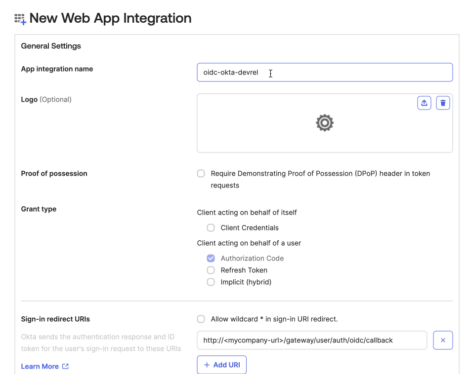
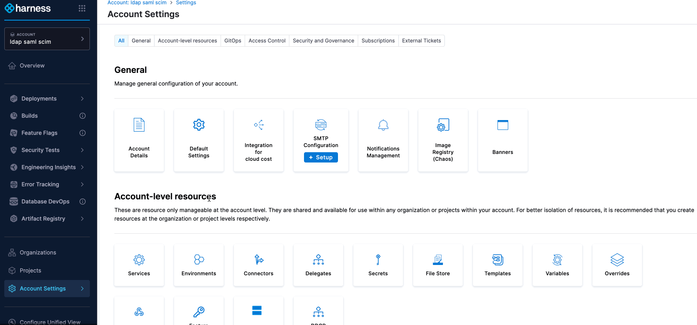
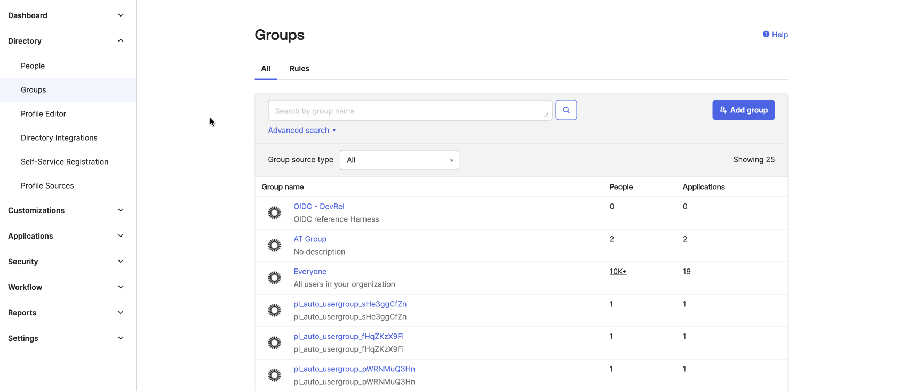
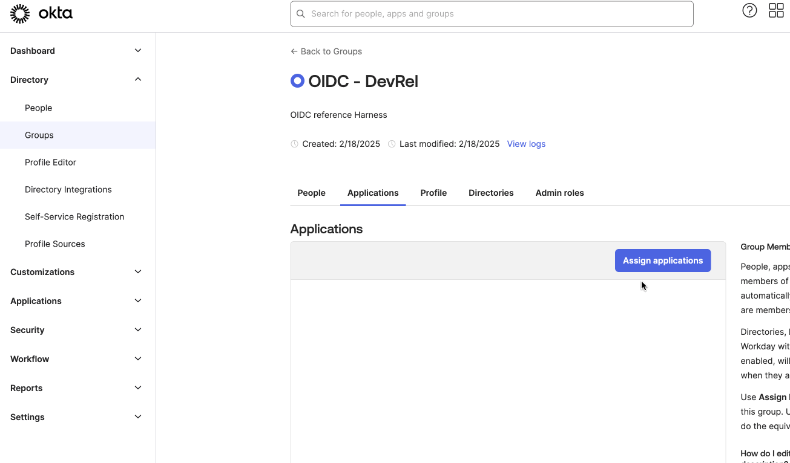
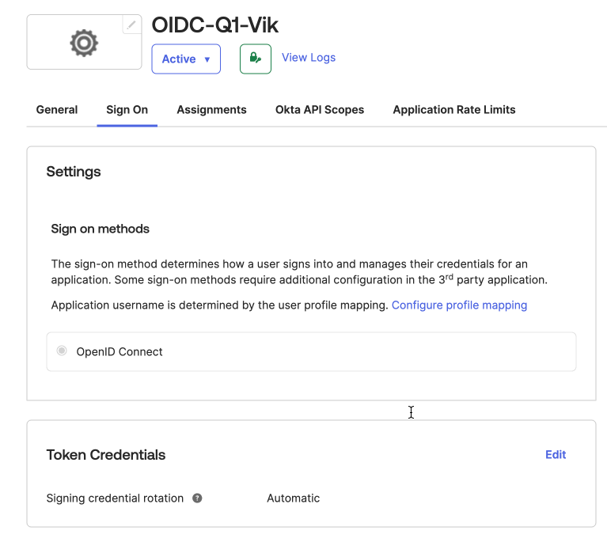
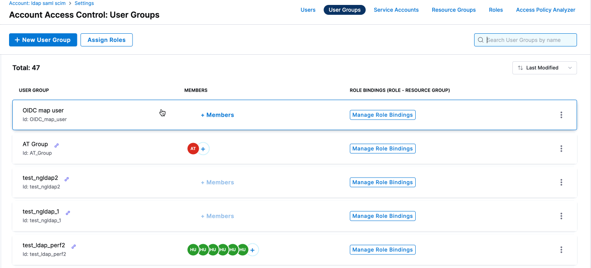
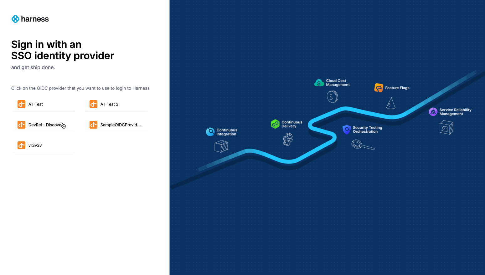

import Tabs from '@theme/Tabs';
import TabItem from '@theme/TabItem';
import DocImage from '@site/src/components/DocImage';

Harness supports single sign-on (SSO) with any custom OpenID Connect (OIDC) provider. You can authenticate users and provision user groups through OIDC integration. When you integrate your Harness account with an OIDC provider, your users can log into Harness using their existing identity provider credentials.

Harness OIDC implementation supports the **Authorization Code flow**, which is the most common and secure OAuth 2.0 flow. In this flow, users authenticate with the identity provider, receive a short-lived authorization code, and Harness exchanges that code for an access token to complete the login.

OIDC authentication is only supported for accounts with a configured <a href="/docs/platform/authentication/authentication-overview#set-up-vanity-url" target="_blank">Vanity URL</a>.

:::note Feature Availability
The feature flag `PL_ENABLE_OIDC_AUTHENTICATION` must be enabled. Contact <a href="mailto:support@harness.io">Harness Support</a> to enable this feature for your account.
:::

---

## What will you learn in this topic?

By the end of this topic, you will be able to:

- [Configure an OIDC provider in Harness for SSO authentication](#step-1-create-an-app-integration-in-okta).
- [Set up Okta as an OIDC provider with relevant client settings](#step-2-add-an-okta-oidc-provider-in-harness).
- [Enable Just-in-Time (JIT) user provisioning for automatic user creation](#step-4-configure-additional-settings-optional).
- [Link Harness user groups to OIDC provider groups for authorization](#step-6-assign-okta-user-group-to-oidc-app).
- [Test and verify OIDC SSO login](#step-10-test-and-verify-oidc-authorization).

---

## Before you begin

Before you integrate Harness with an OIDC provider, ensure you have the following:

- Familiarity with the <a href="/docs/platform/authentication/authentication-overview" target="_blank">authentication overview</a> to understand how SSO works in Harness.
- Understanding of <a href="https://openid.net/developers/how-connect-works/" target="_blank">OpenID Connect (OIDC)</a> protocol basics.
- A Harness account with a configured <a href="/docs/platform/authentication/authentication-overview#set-up-vanity-url" target="_blank">Vanity URL</a>. OIDC authentication is only supported for accounts with Vanity URLs.
- Account administrator permissions in Harness to configure SSO providers and manage authentication settings.
- Administrative access to your OIDC identity provider (such as Okta, Auth0, or Azure AD) to create application integrations.
- Ability to generate client ID and client secret from your OIDC provider.

---

## Set up OIDC SSO in Harness

Harness supports the following OIDC features:

- **User authentication** – Authenticate users through your OIDC identity provider.
- **Multiple OIDC providers** – Configure and manage multiple OIDC identity providers within a single Harness account.
- **Just-in-Time (JIT) user provisioning** – Automatically create user accounts in Harness when users log in for the first time through OIDC.
- **User group provisioning** – Automatically add users to Harness user groups based on their OIDC provider group membership.

This guide uses Okta as an example OIDC provider. The same principles apply to other OIDC providers such as Auth0, Azure AD, or any custom OIDC-compliant identity provider.

To configure Harness with Okta for OIDC SSO, exchange the required information between your Okta application and Harness. You will create an application integration in Okta, configure the OIDC provider in Harness with the client credentials from Okta, and optionally enable user group synchronization.

Use two browser windows or tabs for this process. Open Okta in one tab and Harness in the other. In your Harness tab, navigate to **Account Settings** -> **Authentication** -> **Login via OIDC** -> **Add OIDC Provider** to have the configuration page ready as you gather information from Okta.
 

### Step 1: Create an app integration in Okta

To create an app integration in Okta, do the following:

1. Log in to your Okta administrator account.
2. Navigate to **Applications** and select **Create App Integration**.     
     

<DocImage path={require('./static/single-sign-on-saml-53.png')} width="80%" height="40%" title="Click to view full size image" />

3. In the **Create a new app integration** dialog, select **OIDC - OpenID Connect** as the sign-in method and **Web Application** as the application type.
     
   <DocImage path={require('./static/sign-in-method-okta.png')} width="60%" height="60%" title="Click to view full size image" />

4. Click **Next**.
5. Enter a name for the app in **App Integration Name**.
6. Under **Sign-in redirect URIs**, enter your Harness URL followed by `/gateway/user/auth/oidc/callback`.
   
    **Example:** `https://something.harness.io/gateway/user/auth/oidc/callback`

7. Under **Assignments**, select the user groups that should have access to the application. Other details are optional. For more information on the optional fields, go to <a href="https://help.okta.com/en-us/content/topics/apps/apps_app_integration_wizard_oidc.htm" target="_blank">Okta OIDC app integration</a>.
8. Click **Save** to complete the app integration setup.
        

The following animation demonstrates creating an OIDC app integration in Okta with the required configuration settings.

   

### Step 2: Add an Okta OIDC provider in Harness

To add an Okta OIDC provider in Harness, do the following:

1. In your Harness account, go to **Account Settings** -> **Authentication**.
2. Select **Login via OIDC** and select **Add OIDC Provider**.
3. Enter a name for the OIDC configuration.
4. In **OIDC Scope**, the default required values (`openid`, `email`, and `profile`) are pre-selected. You may add additional scopes if needed.
5. Under **Issuer**, enter the Issuer URL from your authorization server (for example, `https://example-123.oktapreview.com`).
6. In the **UID Field**, enter the attribute that contains the user email address. Only email addresses are supported as the unique identifier.
7. Click **Continue**.
    
   <DocImage path={require('./static/oidc-page-1.png')} width="60%" height="60%" title="Click to view full size image" />

The following animation demonstrates adding an Okta OIDC provider in Harness with the required configuration details.

   

### Step 3: Configure client settings

Client settings include the credentials and endpoints needed for Harness to connect with the OIDC provider.

<Tabs>
  <TabItem value="DE" label="Discovery Enabled (Default)" default>
        If **Discovery is enabled** (default behavior), Harness automatically retrieves Identity Provider (IdP) details from the `/.well-known` endpoint (for example, `https://example-123.oktapreview.com/.well-known/openid-configuration`).
        
        Provide the following:
        
        - **Client Identifier** – The Client ID of the previously created Okta application. You can find this under **Client Credentials** in the **General** tab of the application details in Okta.
        - **Client Secret** – Store this secret in the <a href="/docs/platform/secrets/secrets-management/harness-secret-manager-overview" target="_blank">Built-In Harness Secrets Manager</a>. This is a required part of the configuration.
        - **Redirect URL** – Must match the Sign-in Redirect URI from the Okta app setup (for example, `https://something.harness.io/gateway/user/auth/oidc/callback`).

        <DocImage path={require('./static/oidc-with-discovery.png')} width="60%" height="60%" title="Click to view full size image" />
</TabItem>
<TabItem value="DD" label="Discovery Disabled">
        If **Discovery is disabled**, enter the following additional details in addition to **Client Identifier**, **Client Secret**, and **Redirect URL**:
        
        - **Authorization Endpoint** – URL for user authorization (for example, `https://example-123.oktapreview.com/oauth2/v1/authorize`).
        - **Token Endpoint** – URL for retrieving access tokens (for example, `https://example-123.oktapreview.com/oauth2/v1/token`).
        - **User Info Endpoint** – URL for obtaining user details (for example, `https://example-123.oktapreview.com/oauth2/v1/userinfo`).
        - **JWKS URI** – URL where the token signer publishes its keys (for example, `https://example-123.oktapreview.com/oauth2/v1/keys`).
            
                <DocImage path={require('./static/oidc-without-discovery.png')} width="60%" height="60%" title="Click to view full size image" />

</TabItem>
</Tabs>

Click **Continue**.

### Step 4: Configure additional settings (optional)

**Enable JIT provisioning**
        
By default, JIT provisioning is disabled. Without it, SSO login fails if the user does not already exist in Harness. When you enable JIT provisioning, Harness automatically creates users upon their first login, eliminating the need for manual account creation.

<DocImage path={require('./static/claim-key-value-jit.png')} width="60%" height="60%" title="Click to view full size image" />

The **Claim Key** and **Claim Value** fields help control automatic provisioning. If these values match specific attributes in the ID token received from the OIDC provider, Harness automatically creates the user in Harness.

Go to <a href="https://developer.okta.com/docs/guides/customize-tokens-returned-from-okta/main/" target="_blank">Okta documentation</a> for guidance on customizing Okta tokens with custom claims.

**Enable authorization**

You can enable Okta OIDC authorization in Harness by linking a <a href="/docs/platform/role-based-access-control/add-user-groups" target="_blank">Harness user group</a> to an Okta user group. When a user from the linked Okta group logs into Harness, Harness automatically adds them to the corresponding Harness user group. The user inherits the permissions and access assigned to that group.

Go to <a href="/docs/platform/role-based-access-control/rbac-in-harness" target="_blank">RBAC in Harness</a> for more details on role-based access control.

### Step 5: Set up authorization for OIDC provider

OIDC authorization allows users authenticated via your OIDC provider to be authorized in Harness.

**Create a user group in Okta**

If you have not already created a user group in Okta, do the following:

1. Log in to your Okta administrator account.
2. Go to **Directory** -> **Groups**, and select **Add group**.
3. In the **Add group** dialog, enter a name and description.
4. Click **Save**.

Make sure to note the Okta group name. You will need it later to link the Okta group to a Harness user group.

    <DocImage path={require('./static/okta-user-group.png')} width="60%" height="60%" title="Click to view full size image" />

**Add users to the group**

1. After creating the group, search for it in the **Groups** section.
2. Select the group and select **Assign people**.
3. Search for users and add them to the group.

After adding members, the group displays the list of users added.

The following animation demonstrates creating and configuring user groups in Okta for OIDC authorization.

    

### Step 6: Assign Okta user group to OIDC app

For users in the Okta group to authenticate through the OIDC app, you must assign the Okta user group to the same Okta OIDC provider app you created for Harness. Without this assignment, users in the group cannot access the application.

To assign the Okta user group, do the following:

1. In Okta, go to **Directory** -> **Groups** and select your Okta user group.
2. Go to the **Applications** tab and select **Assign applications**. Find the Okta application you created.
3. Select **Assign** and select **Done**.
4. Go to the **Applications** page and select the Okta app you created previously.
5. In the **Assignments** tab, verify that your Okta user group is listed.
    
    <DocImage path={require('./static/okta-app-assignments.png')} width="60%" height="60%" title="Click to view full size image" />

The following animation demonstrates assigning Okta user groups for OIDC authorization.

    

### Step 7: Create a groups claim

A groups claim includes the user group membership information in the ID token that Okta sends to Harness during authentication. Harness uses this information to automatically assign users to the correct Harness user groups. Without a groups claim, Harness cannot map Okta groups to Harness user groups for authorization.

Go to <a href="https://developer.okta.com/docs/guides/customize-tokens-groups-claim/main/#add-a-groups-claim-for-the-org-authorization-server" target="_blank">Okta documentation</a> for detailed steps on adding a groups claim.

To create a groups claim, do the following:

1. In Okta, go to **Applications** and select your Harness Okta OIDC SSO app.
2. Go to the **Sign On** tab and select **Edit** under the **OpenID Connect ID Token** section.
3. In the **Groups claim filter** section, ensure the name "groups" is present. If it is empty, add it.
4. Set the filter type to **Matches regex** and enter `.*` to return all user groups. The filter allows you to select which groups should be authenticated to Harness.
5. Click **Save** to complete the configuration.

The following animation demonstrates creating a groups claim in Okta to enable user group mapping in Harness.

    

### Step 8: Enable group claim authorization in Harness

To enable group claim authorization in Harness, do the following:

1. In your Harness account, go to **Account Settings** -> **Authentication**.
2. Expand the **Login via OIDC** section.
3. Select **More options***(⋮) next to your Okta provider configuration and select **Edit**.
    
    <DocImage path={require('./static/edit-for-okta-provider.png')} width="60%" height="60%" title="Click to view full size image" />

4. On the **OIDC Provider Overview** page, add **groups** as an additional **OIDC Scope** if using an Org authorization server in Issuer.
    
    <DocImage path={require('./static/oidc-groups-scope.png')} width="60%" height="60%" title="Click to view full size image" />

5. In **Additional Settings**, enable **Authorization**.
6. Set **Group Claim** as `groups`.
7. Select **Submit** to save changes.

Your Okta configuration now uses the group claim for authorization.

<DocImage path={require('./static/auth-enabled.png')} width="60%" height="60%" title="Click to view full size image" />

### Step 9: Link Okta user group to Harness user group

To link an Okta user group to a Harness user group, do the following:

1. In your Harness account, go to **Account Settings** -> **Access Control**.
2. Select **User Groups** and find the group you want to link with your Okta user group.
3. Select **Link to SSO Provider Group**.
4. In the **Search SSO Settings** window, select your Okta OIDC SSO configuration.
5. Enter the Okta group name and click **Save**.
6. Repeat these steps for any additional user groups you need to connect.

The following animation demonstrates linking an Okta user group to a Harness user group for SSO authorization.

    

### Step 10: Test and verify OIDC authorization

To test and verify OIDC authorization in Harness, do the following:

1. Open a private or incognito browsing window and go to Harness.
2. Log in using a Harness user account with an email registered in Okta.
3. If configured correctly, Harness redirects you to the Okta login page.
4. Enter your email address. Passwords for Harness and Okta can be different.
5. If authentication is successful, Okta redirects you back to Harness.
6. In another browser window where you are logged in as an administrator, go to **Account Settings** -> **Access Control**.
7. Select **User Groups** and open the group linked to Okta.
8. Verify that the logged-in user appears as a member of the group.

By being part of this user group, the user inherits all permissions and access assigned to it. Go to <a href="/docs/platform/role-based-access-control/rbac-in-harness" target="_blank">RBAC in Harness</a> for more details.

The following animation demonstrates testing OIDC authentication by logging in through Okta and verifying automatic user group assignment in Harness.

    

:::warning Prevent lockout
If the OIDC login test fails due to misconfiguration (such as incorrect client credentials, group claim settings, or user mapping issues), you may be unable to log in. To prevent lockout, keep your administrator session open in another browser window while testing. If you get locked out, you can use the <a href="/docs/platform/authentication/single-sign-on-saml/advanced-saml-configuration#harness-local-login" target="_blank">Harness local login</a> URL to log in with your Harness credentials and disable or fix the OIDC configuration.
:::

---

## Related articles

- <a href="/docs/platform/authentication/single-sign-on-sso-with-ldap" target="_blank">Single sign-on (SSO) with LDAP</a> - Configure LDAP-based SSO including Active Directory and OpenLDAP.
- <a href="/docs/platform/connectors/cloud-providers/ref-cloud-providers/aws-connector-settings-reference/#credentials" target="_blank"> AWS connector with OIDC</a> - Connect your AWS account to Harness using OIDC.
- <a href="/docs/platform/connectors/cloud-providers/ref-cloud-providers/gcs-connector-settings-reference#use-openid-connect-oidc" target="_blank"> GCP connector settings</a> - Understand how Harness Delegate communicates with GCP through OIDC.
