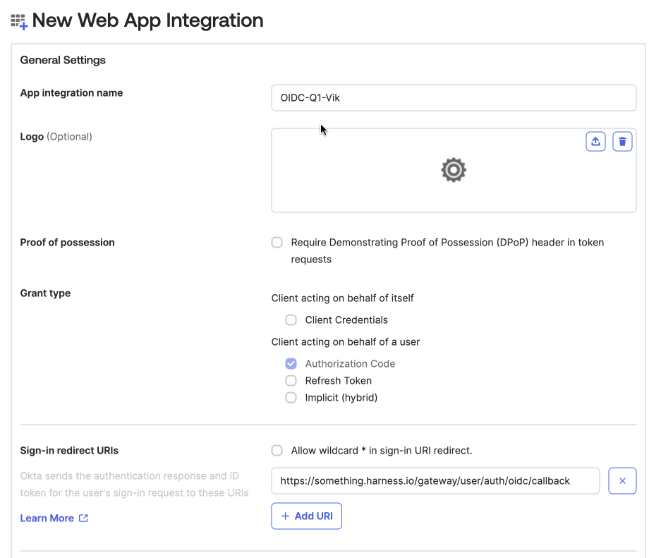
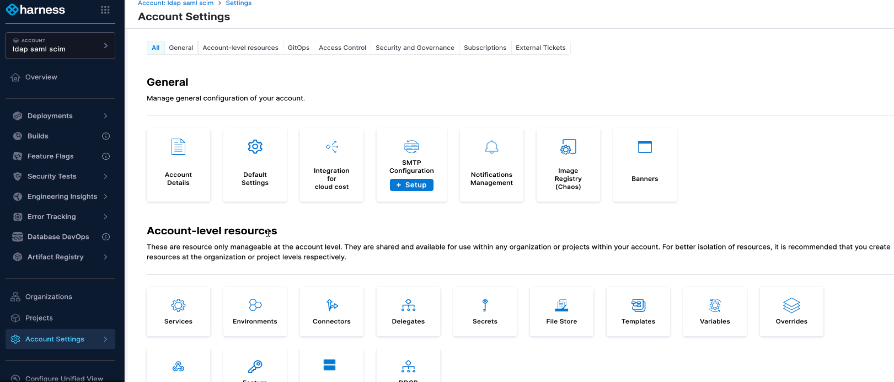
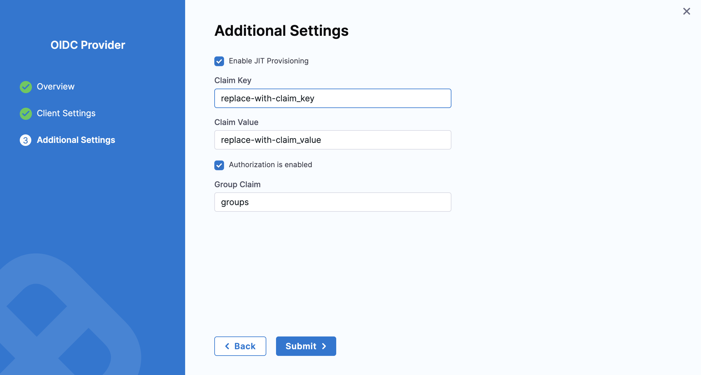

import Tabs from '@theme/Tabs';
import TabItem from '@theme/TabItem';

:::warning Important Note
    - The OIDC authentication feature is controlled by the feature flag `PL_ENABLE_OIDC_AUTHENTICATION`, which must be enabled to use this feature.
    - OIDC Authentication is only supported for accounts with **[Vanity URL](https://developer.harness.io/docs/platform/authentication/authentication-overview#set-up-vanity-url)**.
:::

Harness supports Single Sign-On (SSO) with any custom OIDC (OpenID Connect) provider, allowing authentication and provisioning user and user group. 

:::note Note
Currently, only the `Authorization Code flow` is supported, enabling applications to exchange an authorization code for a token.
:::

### Getting Started

Before you begin, It's helpful to check the following:

1. Review the **[Authentication Overview](https://developer.harness.io/docs/platform/authentication/authentication-overview)** in Harness.  
2. Check how **[Role-Based Access Control (RBAC)](https://developer.harness.io/docs/platform/role-based-access-control/rbac-in-harness)** works.  
3. Learn more about **[OpenID Connect (OIDC)](https://openid.net/developers/how-connect-works/)** by referring to the official documentation.

### Supported Features

- **OIDC-Based Authentication** – Authenticate users using the OIDC protocol.  
- **Multiple OIDC Providers** – Configure and manage multiple OIDC identity providers.  
- **Just-in-Time (JIT) User Provisioning** – Automatically create and update users upon login via OIDC.  
- **User Group Provisioning** – Assign users to groups based on their OIDC provider group membership.  

### OIDC SSO with Okta 

To configure Harness with Okta for OIDC SSO, you need to exchange required information between your **Okta application** and **Harness**.

:::tip
Use two browser windows or tabs for this process. Open Okta in one tab and open Harness in the other.
In your Harness tab, navigate to the Add OIDC Provider page:
    - Select Account Settings, and then select Authentication.
    - Select Login via OIDC and enable OIDC Provider as authentication mechanism.
    - Click on Add OIDC Provider to configure a new OIDC provider.
:::

This section outlines the steps to integrate Okta as an OIDC provider for seamless authentication in Harness. 

### Steps to Create an App Integration in Okta

1. **Sign in to Okta**  
   - Log in to your Okta **administrator account**.  
   - Navigate to **Applications** and click **Create App Integration**.     
     
     

2. **Select Sign-in Method and Application Type**  
   - In the **Create a new app integration** dialog, choose **OIDC - OpenID Connect** as the sign-in method.  
   - Select **Web Application** as application type.
     
       

3. **Configure General Settings**  
   - Enter a name for the app in **App Integration Name**.  
   - Under **Sign-in redirect URIs**, enter your **Harness URL** followed by `/gateway/user/auth/oidc/callback` 
   
    **Example:** `https://something.harness.io/gateway/user/auth/oidc/callback`

4. **Set User Access**  
   - Under **Assignments**, select the **user groups** that should have access to the application.  
   - Other details are optional.  

5. **Save and Proceed**  
   - Click **Save** to complete the app integration setup.
        
    

### Adding an Okta OIDC Provider in Harness

#### Step 1: Configure the OIDC Provider

1. Navigate to the **Account Settings ➝ Security and Governance ➝ Authentication** page in Harness.
    
    - Select Login via OIDC and click on Add OIDC Provider 

        

2. Configure OIDC 
    - Enter a **name** for the OIDC configuration.  
    - In **OIDC Scope**, the default required values (`openid`, `email`, `profile`) are pre-selected. You may add additional scopes if needed.  
    - Under **Issuer**, enter the Issuer URL from your authorization server (e.g., `https://example-123.oktapreview.com`).  
    - In the UID Field, enter the attribute that contains the user's email address. Only email addresses are supported as the unique identifier, and other attributes will not work.  
    - Click **Continue** to proceed. 
    
        

#### Step 2: Configure Client Settings

Client Settings include the credentials and endpoints needed for Harness to connect with the OIDC provider(Okta).

<Tabs>
  <TabItem value="DE" label="Discovery Enabled (Default)" default>
        If **Discovery is enabled** (default behavior), Harness automatically retrieves Identity Provider (IdP) details from the `/.well-known` endpoint. (i.e., `https://example-123.oktapreview.com/.well-known/openid-configuration` )  
        - Provide the following:  
            - **Client Identifier** – The **Client ID** of the previously created Okta application can be found under **"Client Credentials"** in the **General** tab of the application's details in Okta.  
            - **Client Secret** – Ensure that you store this secret in the **Built-In Harness Secrets Manager**, as it is a required part of the configuration. 
            - **Redirect URL** – Must match the Sign-in Redirect URI from the Okta app setup (e.g., `https://something.harness.io/gateway/user/auth/oidc/callback`). 

                 
    </TabItem>
   <TabItem value="DD" label="Discovery Disabled">
        If **Discovery is disabled**, enter the following additional details apart from **Client Identifier**, **Client Secret** and **Redirect URL**:  
        - **Authorization Endpoint** – URL for user authorization (e.g., `https://example-123.oktapreview.com/oauth2/v1/authorize`).  
        - **Token Endpoint** – URL for retrieving access tokens (e.g., `https://example-123.oktapreview.com/oauth2/v1/token`).  
        - **User Info Endpoint** – URL for obtaining user details (e.g., `https://example-123.oktapreview.com/oauth2/v1/userinfo`).  
        - **JWKS URI** – URL where the token signer publishes its keys (e.g., `https://example-123.oktapreview.com/oauth2/v1/keys`).
            
                          
    </TabItem>
</Tabs>

Click on **Continue** to proceed

#### Step 3: Additional Settings (Optional)

**1. Enable JIT Provisioning**
        
    By default, JIT provisioning is **disabled**. Without it, SSO login will fail if the user does not already exist in Harness. When enabled, users are automatically created upon their first login, eliminating the need for manual account creation.

          

    Additionally, **Claim Key** and **Claim Value** help control automatic provisioning. If these values match specific attributes in the **ID token** received from the OIDC provider, the user is automatically created in Harness.

    Refer to the **[Okta documentation](https://developer.okta.com/docs/guides/customize-tokens-returned-from-okta/main/)** for guidance on customizing Okta tokens with custom claims.

**2. Authorization is enabled**

    You can enable Okta OIDC authorization in Harness by linking a **[Harness user group](https://developer.harness.io/docs/platform/role-based-access-control/add-user-groups)** to an **Okta user group**. When a user from the linked Okta group logs into Harness, they are automatically added to the corresponding Harness user group and inherit its permissions and access.  

    For more details, refer to the **[RBAC section](https://developer.harness.io/docs/platform/role-based-access-control/rbac-in-harness)** in Harness documentation.

    1. Setting up Authorization for an OIDC provider in Harness

        Enabling OIDC authorization allows the same users authenticated via your OIDC provider to be authorized in Harness.  

        1. **Create a User Group in Okta** (if not already created):  
            - Log in to **Okta Admin Account**.  
            - Go to **Directory** > **Groups**, then click **Add group**.  
            - In the **Add group** dialog, enter a **Name** and **Description**, then click **Save**.

                

        2. **Add Users to the Group**:  
            - After creating the group, search for it in the **Groups** section.  
            - Select the group and click **Assign people**.  
            - Search for users and add them to the group.  

                

        3. **Verify Group Members**:  
            - After adding members, the group should display the list of users added.

:::tip
    Make sure to **note the Okta Group Name**, as you’ll need it later to link the Okta group to a Harness user group.
:::

    2. Ensure the **Okta user group** is assigned to the same Okta OIDC provider app you use for **Harness OIDC SSO**. Here’s how to do it:

        1. In Okta, go to **Directory** > **Groups** and select your Okta user group.
        2. Go to the **Applications** tab and click on **Assign applications**. Find the Okta application created by you.
        3. Select **Assign** and click **Done**.
            
            
        4. Go to the **Applications** page and select the Okta app you created previously.
        5. In the **Assignments** tab, check that your Okta user group is listed.
            
            

    3. Create a **Groups Claim** for your OpenID Connect client app by following the steps in the [official Okta documentation](https://developer.okta.com/docs/guides/customize-tokens-groups-claim/main/#add-a-groups-claim-for-the-org-authorization-server). This claim will later be used to enable **OIDC authorization** in Harness.

        1. In Okta, go to **Applications** and select your **Harness Okta OIDC SSO app**.
        2. Go to the **Sign On** tab and click **Edit** under the **OpenID Connect ID Token** section.
        3. Use the **Groups claim filter** or **Groups claim expression** that contains the list of user’s groups. The filter allows you to select which groups should be authenticated to Harness. In the **Groups claim filter** section, make sure the name "groups" is present (add if it is empty). Set the filter type to **Matches regex** and enter `.*` to return all user groups.
        4. Click **Save** to complete the configuration.

            

    4. Enable Group Claim Authorization in Harness

        1. In **Harness**, go to **Account Settings** > **Authentication**.  
        2. Expand the **Login via OIDC** section.  
        3. Click **More options (⋮)** next to your Okta provider configuration and select **Edit**.  
            
        4. On the **OIDC Provider Overview** page, add **groups** as the additional **OIDC Scope** if using an **Org authorization server** in Issuer.  
            
        5. In **Additional Settings**, enable **Authorization**.  
        6. Set **Group Claim** as `groups`.  
        7. Click **Submit** to save changes. Now, your **Okta configuration** uses the **Group Claim** for authorization.
            
    
    5. Link Okta User Group to a Harness User Group

        1. In **Harness**, go to **Account Settings** > **Access Control**.  
        2. Click on **User Groups** and find the group you want to link with your Okta user group.  
        3. Select **Link to SSO Provider Group**.  
        4. In the **Search SSO Settings** window, choose your **Okta OIDC SSO configuration**.  
        5. Enter the **Okta Group Name** and click **Save**.
            
        6. Repeat these steps for any additional user groups you need to connect.

    6. Test and Verify OIDC Authorization in Harness

        1. **Log in via OIDC:**  
            - Open a **private/incognito browsing window** and go to **Harness**.  
            - Log in using a **Harness user account** with an email registered in **Okta**.  
            - If configured correctly, you'll be redirected to the **Okta login page**. 

        2. **Authenticate with Okta:**  
            - Enter your **email address** (passwords for Harness and Okta can be different).  
            - If authentication is successful, you’ll be redirected back to **Harness**.
                
                  

        3. **Verify User Group Membership in Harness:**  
            - In another browser window, where you're logged in as an **admin**, go to **Account Settings** > **Access Control**.  
            - Select **User Groups** and open the group linked to **Okta**.  
            - Ensure that the logged-in user appears as a **member** of the group.  

    By being part of this **user group**, the user inherits all **permissions and access** assigned to it. For more details, refer to **[RBAC in Harness](https://developer.harness.io/docs/platform/role-based-access-control/rbac-in-harness)**.  

    :::warning Note
    If there are any errors, you can **disable SSO** using your **Harness Administrator account** in another session.
    :::

