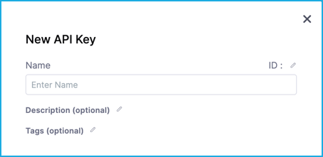
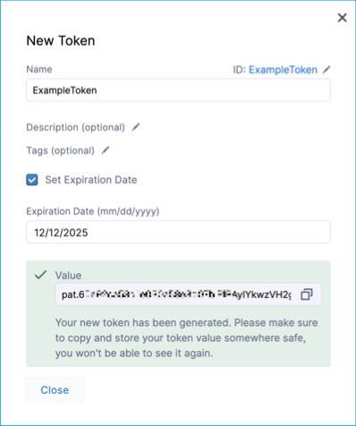

```mdx-code-block
import Tabs from '@theme/Tabs';
import TabItem from '@theme/TabItem';
```

Harness APIs use API keys to authenticate requests. You can create API keys for your personal account or for [service accounts](/docs/platform/role-based-access-control/add-and-manage-service-account). API keys can be created at any [scope](/docs/platform/role-based-access-control/rbac-in-harness#permissions-hierarchy-scopes).

After creating an API key, you must add tokens to the key, and then you use the tokens in your API requests or where ever else you need to supply an API key for authentication. Each API key can have multiple tokens.

Keys and tokens inherit the permissions of the account they are created under. If you create an API key under your personal account, then the key and tokens have the same permissions as your account. If you create an API key under a service account, then the key and tokens have the same permissions as the service account. You must be an Account Admin (or equivalent) to create service accounts and API keys for service accounts.

## Create personal API keys and tokens

Use these steps to create an API key and personal access token (PAT) for your personal Harness account.

1. Go to your user profile in Harness.
2. Under **My API Keys**, select **API Key**.
3. Enter a **Name** for the API key. **Description** and **Tags** are optional.

   

4. Select **Save** to create your API key.
5. Select **Token** under your new API key.
6. Enter a **Name** for the token. **Description** and **Tags** are optional.

   

7. If you want to set an expiration date for the token, select **Set Expiration Date** and enter an expiration date in `mm/dd/yyyy` format.
8. Select **Generate Token** and copy the token.

   :::caution

   The token is only displayed once. Store the token somewhere secure that you can access when you make API requests.

   Your API keys carry many privileges. Don't store them in publicly-accessible areas.

   After [rotating tokens](/docs/platform/automation/api/add-and-manage-api-keys#rotate-tokens) make sure you always use the new token.

   :::

   <!--  -->

   <docimage path={require('./static/api-quickstart-04.png')} />

## Create service account API keys and tokens

Use these steps to create an API key and service account token (SAT) for a service account. To do this, you must have the Account Admin role or another role that provides [permissions](./api-permissions-reference.md) to View, Create/Edit, Manage, and Delete service accounts.

1. If you haven't done so already, [create a Service Account](/docs/platform/role-based-access-control/add-and-manage-service-account). The API key and token inherit the permissions of the service account they are associated with; therefore, make sure the service account has the necessary permissions.
2. In Harness, select **Account Settings**, and then select **Access Control**.
3. Select **Service Accounts** in the header, and then select the service account for which you want to create an API key.
4. Under **API Keys**, select **API Key**.
5. Enter a **Name** for the API key. **Description** and **Tags** are optional.
6. Select **Save** to create the API key.
7. Select **Token** under the new API key.
8. Enter a **Name** for the token. **Description** and **Tags** are optional.
9. If you want to set an expiration date for the token, select **Set Expiration Date** and enter an expiration date in `mm/dd/yyyy` format.
10. Select **Generate Token** and copy the token.

   :::caution

   The token is only displayed once. Store the token somewhere secure that you can access when you make API requests.

   API keys carry many privileges. Don't store them in publicly-accessible areas.

   After [rotating tokens](/docs/platform/automation/api/add-and-manage-api-keys#rotate-tokens) make sure you always use the new token.

   :::

## Edit API keys

Use these steps to edit the name, description, or tags for an API key. To edit tokens under API keys, go to [edit tokens](#edit-tokens) and [rotate tokens](#rotate-tokens).

```mdx-code-block
<Tabs>
  <TabItem value="pat" label="Edit personal API keys" default>
```

1. Go to your user profile in Harness.
2. Under **My API Keys**, select **More Options** (&vellip;) next to the key you want to edit, and then select **Edit**.
3. You can edit the name, description, and tags. You can't edit the Id.
4. Select **Save**.

```mdx-code-block
  </TabItem>
  <TabItem value="sat" label="Edit service account API keys">
```

1. In Harness, select **Account Settings**, and then select **Access Control**.
2. Select **Service Accounts** in the header, and then select the service account for which you want to edit an API key.
3. Select **More Options** (&vellip;) next to the key you want to edit, and then select **Edit**.
4. You can edit the name, description, and tags. You can't edit the ID.
5. Select **Save**.

```mdx-code-block
  </TabItem>
</Tabs>
```

## Edit tokens

Use these steps to edit the name, description, tags, and expiration dates of tokens under API keys. You can also [rotate tokens](#rotate-tokens).

```mdx-code-block
<Tabs>
  <TabItem value="pat" label="Edit personal access tokens" default>
```

1. Go to your user profile in Harness.
2. Under **My API Keys**, expand the token that you want to edit, select **More Options** (&vellip;), and then select **Edit**.
3. You can edit the name, description, tags, and expiration date. You can't edit the Id or the token's value.
4. Select **Save**.

```mdx-code-block
  </TabItem>
  <TabItem value="sat" label="Edit service account tokens">
```

1. In Harness, select **Account Settings**, and then select **Access Control**.
2. Select **Service Accounts** in the header, and then select the service account for which you want to edit a token.
3. Select the API key that has the token you want to edit.
4. Select **More Options** (&vellip;) next to the token you want to edit, and then select **Edit**.
5. You can edit the name, description, tags, and expiration date. You can't edit the ID or the token's value.
6. Select **Save**.

```mdx-code-block
  </TabItem>
</Tabs>
```

## Rotate tokens

As a security best practice, rotate tokens periodically. You can rotate tokens in Harness for symmetric encryption.

```mdx-code-block
<Tabs>
  <TabItem value="pat" label="Rotate personal access tokens" default>
```

1. Go to your user profile in Harness.
2. Under **My API Keys**, expand the token that you want to rotate, select **More Options** (&vellip;), and then select **Rotate Token**.
3. If you want to set an expiration date for the token, select **Set Expiration Date** and enter an expiration date in `mm/dd/yyyy` format.
4. Select **Rotate Token** and copy the token.

```mdx-code-block
  </TabItem>
  <TabItem value="sat" label="Rotate service account tokens">
```

1. In Harness, select **Account Settings**, and then select **Access Control**.
2. Select **Service Accounts** in the header, and then select the service account for which you want to rotate a token.
3. Select the API key that has the token you want to rotate.
4. Select **More Options** (&vellip;) next to the token you want to rotate, and then select **Rotate Token**.
5. If you want to set an expiration date for the token, select **Set Expiration Date** and enter an expiration date in `mm/dd/yyyy` format.
6. Select **Rotate Token** and copy the token.

```mdx-code-block
  </TabItem>
</Tabs>
```

:::caution

The token is only displayed once. Store the token somewhere secure that you can access when you make API requests.

API keys carry many privileges. Don't store them in publicly-accessible areas.

After rotating tokens make sure you always use the new token.

:::

## Delete API keys

Use these steps to delete an API key and all of its tokens. To delete individual tokens under API keys, go to [delete tokens](#delete-tokens).

```mdx-code-block
<Tabs>
  <TabItem value="pat" label="Edit personal API keys" default>
```

1. Go to your user profile in Harness.
2. Under **My API Keys**, select **More Options** (&vellip;) next to the key you want to delete, and then select **Delete**.

```mdx-code-block
  </TabItem>
  <TabItem value="sat" label="Edit service account API keys">
```

1. In Harness, select **Account Settings**, and then select **Access Control**.
2. Select **Service Accounts** in the header, and then select the service account for which you want to delete an API key.
3. Select **More Options** (&vellip;) next to the key you want to delete, and then select **Delete**.

```mdx-code-block
  </TabItem>
</Tabs>
```

## Delete tokens

```mdx-code-block
<Tabs>
  <TabItem value="pat" label="Delete personal access tokens" default>
```

1. Go to your user profile in Harness.
2. Under **My API Keys**, expand the token that you want to delete, select **More Options** (&vellip;), and then select **Delete**.

```mdx-code-block
  </TabItem>
  <TabItem value="sat" label="Delete service account tokens">
```

1. In Harness, select **Account Settings**, and then select **Access Control**.
2. Select **Service Accounts** in the header, and then select the service account for which you want to delete a token.
3. Select the API key that has the token you want to delete.
4. Select **More Options** (&vellip;) next to the token you want to delete, and then select **Delete**.

```mdx-code-block
  </TabItem>
</Tabs>
```
