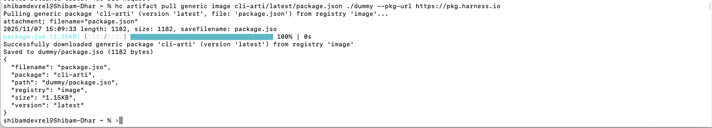

## Registry Management Examples

### List Registries

View all registries in your project:

```bash
hc registry list --org devrel --project sd1
```

You can also use the short alias:

```bash
hc reg list --org devrel --project sd1
```


This displays a table with your registries, including their identifiers, package types, and other details.

## Artifact Management Examples

### Pull Artifacts

Download artifacts from your registry to your local machine.

**General syntax:**

```bash
hc artifact pull <package_type> <registry_name> <package_path> <destination_path> [flags]
```

**Flag:**
- `--pkg-url`: Full URL to the artifact package (useful for direct access)

**Example with package URL:**

```bash
hc artifact pull generic image cli-arti/latest/package.json ./dummy --pkg-url https://pkg.harness.io 
```



This downloads the specified artifact to the destination path on your local machine.

---

:::tip Learn More
For comprehensive documentation on managing artifacts and registries with the Harness CLI, including additional commands, flags, and advanced usage examples, visit the [Artifact Registry CLI documentation](/docs/artifact-registry/artifact-registry-cli/manage-artifacts-registries).
:::
