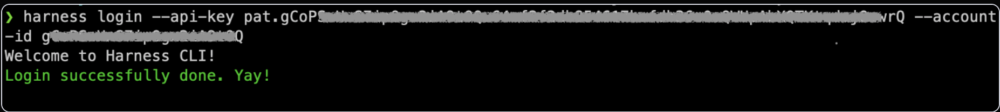

## Install Harness CLI

You can install `harness` CLI utility on Linux, MacOS, or Windows in order to interact with Harness Platform from a command-line interface.

import Tabs from '@theme/Tabs';
import TabItem from '@theme/TabItem';

<!---
Import statements for CLI downloads
<MacOSCLI />, <WindowsCLI />, <ARMCLI />, <AMDCLI />
-->
import MacOSCLI from '/docs/platform/shared/cli/mac.md';
import WindowsCLI from '/docs/platform/shared/cli/windows.md';
import ARMCLI from '/docs/platform/shared/cli/arm.md';
import AMDCLI from '/docs/platform/shared/cli/amd.md';

<Tabs>
<TabItem value="Linux">

### Install the CLI on Linux

1. Download and extract the Harness CLI binary.
 
 <Tabs>
 <TabItem value="ARM">
 
 <ARMCLI />

</TabItem>
 <TabItem value="AMD">
 
 <AMDCLI />

</TabItem>
 </Tabs>
 

2. Add the binary path to the system `$PATH` variable
 ```bash
 echo 'export PATH="$(pwd):$PATH"' >> ~/.bash_profile
 source ~/.bash_profile
 ```
3. After you install the CLI, it is available using the `harness` command. To verify run:
 ```bash
 harness --version
 ```

</TabItem>
<TabItem value="MacOS">

### Install the CLI on MacOS

1. Run commands below on terminal
<MacOSCLI />

 (If you are using different shell variation of terminal e.g. zsh, replace `~/.bash_profile` with your shell specific profile file path e.g. `~/.zshrc`)

</TabItem>
<TabItem value="Windows">

### Install the CLI on Windows
1. Run the commands below in Windows Powershell:
 <WindowsCLI />
2. Extract the downloaded zip file and change directory to extracted file location
3. Run following command in powershell to setup environment variables:
 ```
 $currentPath = Get-Location 
 [Environment]::SetEnvironmentVariable("PATH", "$env:PATH;$currentPath", [EnvironmentVariableTarget]::Machine)
 ```
4. Restart terminal

</TabItem>
</Tabs>

## Configure Harness CLI

1. Obtain **Harness API Token**. You can follow the steps outlined in the Harness documentation's guide on [how to create a personal API token](/docs/platform/automation/api/add-and-manage-api-keys).

2. Retrieve your `Account ID` by navigating within the `Harness UI` to `ACCOUNT SETTINGS` > `Overview` > `Account Id`.

3. Login to Harness from CLI.
    ```bash
    harness login --api-key HARNESS_API_TOKEN --account-id HARNESS_ACCOUNT_ID
    ```
    > Note: Replace `HARNESS_API_TOKEN` with the Harness API Token obtained in the previous step, and `HARNESS_ACCOUNT_ID` with your specific Account Id.

4. Upon successful login, you will be greeted with the confirmation message **Login successfully done. Yay!**

