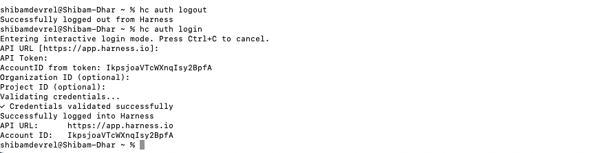

## Installation

Install the Harness CLI on Unix-based systems (macOS, Linux) using the following command:

```bash
curl https://raw.githubusercontent.com/harness/harness-cli/v2/install | sh
```

This script will download and install the latest version of the CLI to your system.

## Version Check

After installing the CLI, verify the installation by checking the version:

```bash
hc version
```

Example output:

```bash
hc version dev
Built with go1.24.9
```

## Upgrade to Latest Version

To ensure you have the latest features and bug fixes, upgrade the Harness CLI to the latest version:

```bash
hc upgrade
```


## Authentication Setup

To authenticate the CLI with your Harness account, use the login command:

```bash
hc auth login
```

<!-- <DocImage path={require('/cli/static/reg-list.png')} width="80%" title="Auth Login form" alt="Auth Login form" /> -->




You will be prompted to provide the following details:

- **URL**: Your Harness platform URL
- **API Token Key**: Your personal access token or API key ([learn how to create API keys](https://developer.harness.io/docs/platform/automation/api/add-and-manage-api-keys/))
- **Account ID**: Your Harness account identifier
- **Organization ID**: Your organization identifier (optional)
- **Project ID**: Your project identifier (optional)

Once authenticated, the CLI will store your credentials securely for subsequent commands.

:::tip Getting Help
Use `hc [command] --help` to get more information about any command. This will display available options, flags, and usage examples for the specified command.
:::

## Basic Verification

After authentication, verify your connection by performing a basic operation, for example, listing your registries:

```bash
<!-- List registries in the devrel org and sd1 project -->
hc registry list --org devrel --project sd1
```

This command should display your available registries, confirming a successful connection.


## Using the CLI Binary

If you've downloaded the CLI binary directly, you may need to run it using `./hc` from the directory where it's located:

```bash
./hc version
```

### Adding to PATH

To use `hc` from anywhere without the `./` prefix, add the CLI binary to your system PATH:

**macOS/Linux:**

1. Move the binary to a directory in your PATH (e.g., `/usr/local/bin`):
   ```bash
   sudo mv hc /usr/local/bin/
   ```

2. Make sure it's executable:
   ```bash
   sudo chmod +x /usr/local/bin/hc
   ```

3. Verify you can now use `hc` from anywhere:
   ```bash
   hc version
   ```

**Alternative: Add to PATH without moving**

If you prefer to keep the binary in its current location, add that directory to your PATH:

```bash
export PATH=$PATH:/path/to/directory/containing/hc
```

To make this permanent, add the above line to your shell configuration file (`~/.bashrc`, `~/.zshrc`, or `~/.bash_profile`).
