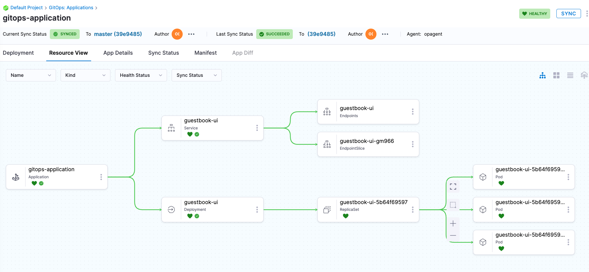

```mdx-code-block
import Tabs from '@theme/Tabs';
import TabItem from '@theme/TabItem';
```

In this segment, we'll guide you through a example demonstrating how to utilize the Harness CLI tool. You have the option to either establish a Harness GitOps workflow or configure a pipeline along with all necessary components to deploy a test guestbook application to your Kubernetes setup.

## Let's Begin

```mdx-code-block
<Tabs>
<TabItem value="GitOps Example">
```

1. Refer [Install and Configure Harness CLI](./install.md) doc to setup and configure Harness CLI.

2. Fork the [harnessed-example-apps](https://github.com/harness-community/harnesscd-example-apps/fork) repository through the GitHub web interface.

3. Clone the Forked **harnessed-example-apps** repo and change directory.
    ```bash
    git clone https://github.com/GITHUB_ACCOUNTNAME/harnesscd-example-apps.git
    cd harnesscd-example-apps 
    ```
    :::note
    
    Replace `GITHUB_ACCOUNTNAME` with your GitHub Account name.

    :::

4. Make sure you have a GitOps Agent configured and running smoothly. If not, you can also refer to the [Install Harness GitOps Agent](https://developer.harness.io/docs/continuous-delivery/gitops/use-gitops/install-a-harness-git-ops-agent/) for steps on creating a new Harness GitOps Agent or on utilizing existing ArgoCD Agent.

5. Before proceeding, store the Agent Identifier value as an environment variable for use in the subsequent commands:
    ```bash
    export AGENT_NAME=GITOPS_AGENT_IDENTIFIER
    ```
    > Note: Replace `GITOPS_AGENT_IDENTIFIER` with GitOps Agent Identifier.

6. Create a **GitOps Repository**.
    ```bash
    harness gitops-repository --file guestbook/harness-gitops/repository.yml apply --agent-identifier $AGENT_NAME
    ```

7. Create a **GitOps Cluster**.
    ```bash
    harness gitops-cluster --file guestbook/harness-gitops/cluster.yml apply --agent-identifier $AGENT_NAME
    ```

8. Create a **GitOps Application**.
    ```bash
    harness gitops-application --file guestbook/harness-gitops/application.yml apply --agent-identifier $AGENT_NAME
    ```

9. At last, it's time to synchronize the application with your Kubernetes setup.

  - Navigate to Harness UI > Default Project > GitOps > Applications, then click on gitops-application. Choose Sync, followed by Synchronize to kick off the application deployment.

    - Observe the Sync state as Harness synchronizes the workload under `Resource View` tab.
    

    - After a successful execution, you can check the deployment in your Kubernetes cluster using the following command:  

    ```bash
    kubectl get pods -n default
    ```
    - To access the Guestbook application deployed via the Harness pipeline, port forward the service and access it at [http://localhost:8080](http://localhost:8080):  

    ```bash
    kubectl port-forward svc/kustomize-guestbook-ui 8080:80
    ```

10. Congratulations! You successfully used `harness` CLI utility tool to create and execute a GitOps workflow.

```mdx-code-block
</TabItem>
<TabItem value="CD Pipeline Example">
```

1. Refer [Install and Configure Harness CLI](./install.md) doc to setup and configure Harness CLI.

2. Fork the [harnessed-example-apps](https://github.com/harness-community/harnesscd-example-apps/fork) repository through the GitHub web interface.

3. Clone the Forked **harnessed-example-apps** repo and change directory.
    ```bash
    git clone https://github.com/GITHUB_ACCOUNTNAME/harnesscd-example-apps.git
    cd harnesscd-example-apps 
    ```
    :::note
    
    Replace `GITHUB_ACCOUNTNAME` with your GitHub Account name.

    :::

4. Make sure you have a delegate configured and running smoothly. If not, you can also refer to the [Install Harness Delegate on Kubernetes or Docker](/tutorials/platform/install-delegate/) guide for steps on setting up the delegate using Helm, Terraform Helm Provider, or Kubernetes manifest.

5. Now, let's create all the resources that is required to execute a pipeline successfully. Let's start with creating a **Harness Secret** to store GitHub PAT.
    - Obtain GitHub personal access token with repo permissions. For steps, go to the GitHub documentation on [creating a personal access token](https://help.github.com/en/github/authenticating-to-github/creating-a-personal-access-token-for-the-command-line).
    - Create a Harness Secret to store GitHub PAT. This will be used in the next step to create GitHub connector.
        ```bash
        harness secret  --token GITHUB_PAT apply 
        ```
        > Note: Replace `GITHUB_PAT` with GitHub PAT that you obtained in the previous step.

6. Create a **GitHub connector**.
    ```bash
    harness connector --file guestbook/harnesscd-pipeline/github-connector.yml apply --git-user GITHUB_ACCOUNTNAME
    ```
    > Note: Replace `GITHUB_ACCOUNTNAME` with your GitHub Account Name.

7. Create a **Kubernetes connector**.
    ```bash
    harness connector --file guestbook/harnesscd-pipeline/kubernetes-connector.yml apply --delegate-name DELEGATE_NAME
    ```
    > Note: Replace `DELEGATE_NAME` with the Delegate name.

8. Create a **Environment**.
    ```bash
    harness environment --file guestbook/harnesscd-pipeline/environment.yml apply
    ```

9. Create a **Infrastructure Definition**.
    ```bash
    harness infrastructure  --file guestbook/harnesscd-pipeline/infrastructure-definition.yml apply
    ```

10. Create a **Service**.
    ```bash
    harness service --file guestbook/harnesscd-pipeline/service.yml apply 
    ```

11. Now, let's create a Pipeline of deployement type **Canary** with just a single command.
    ```bash
    harness pipeline --file  guestbook/harnesscd-pipeline/canary-pipeline.yml apply
    ```

12. Finally, it's time to execute the pipeline. Traverse through `Harness UI` > `Default Project` > `Pipelines` > Click `guestbook_canary_pipeline` > Select **Run**, and then select **Run Pipeline** to initiate the deployment.

    - Observe the execution logs as Harness deploys the workload and checks for steady state.
    - After a successful execution, you can check the deployment in your Kubernetes cluster using the following command:  

    ```bash
    kubectl get pods -n default
    ```
    - To access the Guestbook application deployed via the Harness pipeline, port forward the service and access it at [http://localhost:8080](http://localhost:8080):  

    ```bash
    kubectl port-forward svc/kustomize-guestbook-ui 8080:80
    ```

13. Congratulations! You successfully used `harness` CLI utility tool to create and execute a pipeline.

```mdx-code-block
</TabItem>
</Tabs>
```