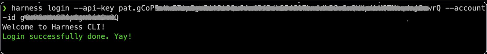

```mdx-code-block
import Tabs from '@theme/Tabs';
import TabItem from '@theme/TabItem';
```

Welcome to the **_Harness CLI_** Documentation!

**Harness CLI** serves as your gateway to frictionless interaction with the intelligent Harness Platform directly through the command-line interface, providing you with a powerful and efficient means to manage Harness and its diverse set of resources.

This documentation section will serve as your compass, guiding you through the installation, configuration, and upgrade of the Harness CLI utility.

## Installing Harness CLI

You can install `harness` CLI utility on Linux, MacOS, or Windows in order to interact with Harness Platform from a command-line interface.

```mdx-code-block
<Tabs>
<TabItem value="Linux">
```

### Installing the CLI on Linux

1. Download and extract the Harness CLI binary.

```mdx-code-block
<Tabs>
<TabItem value="ARM">
```

```bash
curl -LO https://github.com/harness/harness-cli/releases/download/v0.0.13-alpha/harness-v0.0.13-alpha-linux-arm64.tar.gz
tar -xvf harness-v0.0.13-alpha-darwin-amd64.tar.gz
```

```mdx-code-block
</TabItem>
<TabItem value="AMD">
```

```bash
curl -LO https://github.com/harness/harness-cli/releases/download/v0.0.13-alpha/harness-v0.0.13-alpha-linux-amd64.tar.gz
tar -xvf harness-v0.0.13-alpha-darwin-amd64.tar.gz
```

```mdx-code-block
</TabItem>
</Tabs>
```

2. Add the binary path to the system `$PATH` variable
```bash
echo 'export PATH="$(pwd):$PATH"' >> ~/.bash_profile
source ~/.bash_profile
```

3. After you install the CLI, it is available using the `harness` command. To verify run:
```bash
harness --version
```

```mdx-code-block
</TabItem>
<TabItem value="MacOS">
```

### Installing the CLI on MacOS
1. Run commands below on terminal
```curl -LO https://github.com/harness/harness-cli/releases/download/v0.0.13-alpha/harness-v0.0.13-alpha-darwin-amd64.tar.gz 
tar -xvf harness-v0.0.13-alpha-darwin-amd64.tar.gz 
export PATH="$(pwd):$PATH" 
echo 'export PATH="'$(pwd)':$PATH"' >> ~/.bash_profile   
```
(If you are using different variation of terminal , replace `~/.bash_profile` with your bash profile file path)

```mdx-code-block
</TabItem>
<TabItem value="Windows">
```

### Installing the CLI on Windows
1. Run the commands below in Windows Powershell:
```
Invoke-WebRequest -Uri https://github.com/harness/harness-cli/releases/download/v0.0.13-alpha/harness-v0.0.13-alpha-windows-amd64.zip -OutFile ./harness.zip
```
2. Extract the downloaded zip file and change directory to extracted file location
3. Run following command in powershell to setup environment variables:
```$currentPath = Get-Location 
[Environment]::SetEnvironmentVariable("PATH", "$env:PATH;$currentPath", [EnvironmentVariableTarget]::Machine)
```
 4. Restart terminal

```mdx-code-block
</TabItem>
</Tabs>
```

## Configuring Harness CLI

1. Obtain **Harness API Token**. You can follow the steps outlined in the Harness documentation's guide on [how to create a personal API token](https://developer.harness.io/docs/platform/resource-development/apis/add-and-manage-api-keys/).

2. Retrieve your `Account ID` by navigating within the `Harness UI` to `ACCOUNT SETTINGS` > `Overview` > `Account Id`.

3. Login to Harness from CLI.
    ```bash
    harness login --api-key HARNESS_API_TOKEN --account-id HARNESS_ACCOUNT_ID
    ```
    > Note: Replace `HARNESS_API_TOKEN` with the Harness API Token obtained in the previous step, and `HARNESS_ACCOUNT_ID` with your specific Account Id.


4. Upon successful login, you will be greeted with the confirmation message **Login successfully done. Yay!**.

