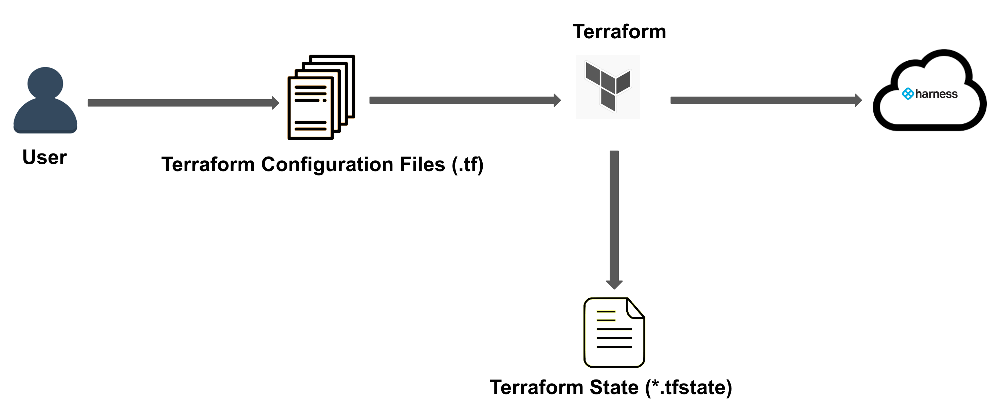

The Terraform tool enables the management and provisioning of infrastructure through code. Using Terraform, you can easily build, modify, and version low-level components like compute instances, storage, and networking, as well as high-level components like DNS entries and SaaS features.

Harness Terraform Provider is a library that you can use to create Harness Infrastructure. You can administer and use Harness functionality from within your Terraform setup using Harness Terraform Provider. It serves as an interface to the Harness API, enabling you to create and manage Harness infrastructure using Terraform commands.


To create and modify Harness resources using the Harness Terraform Provider, you will need to do the following:
- Install the Terraform CLI
- Configure your Harness credentials
- Install the Harness Provider
- Add your credentials to the appropriate Terraform config file.
- Build infrastructure
- Modify infrastructure
- Destroy infrastructure




Once the provider is set up, you can use it to provision your Harness resources.

## How does the Harness Terraform Provider work?

When you configure the Harness Terraform Provider, you will need to provide credentials that Terraform can use to authenticate with Harness, and trigger creation and management of resources within Harness as per the config file provided to Terraform. 
Once the provider is configured, Terraform can use it to execute commands on the Terraform-managed infrastructure and resources. 

This includes:
- Deploying new infrastructure: Use the provider to create new resources in Terraform.
- Updating existing infrastructure: Use the provider to update existing resources.
- Rolling back changes: Use the provider to roll back changes to the infrastructure, such as the deletion of a outdated pipeline or an unnecessary connector.
- Monitoring and observability: Use the provider to monitor the state of the infrastructure and resources, and to collect metrics and logs for observability purposes.

You can provision and manage the following resources using the Harness Provider: 
- Organizations
- Projects
- Delegates
- Connectors
- Secrets
- Variables
- Services
- Environments
- Infrastructure Definitions
- Pipelines
- Templates
- Permissions

For more information, see [Harness Provider](https://registry.terraform.io/providers/harness/harness/latest/docs)


## Benefits of Harness Terraform Provider

This section explains the benefits of using Harness Terraform Provider to provision your Harness resources.

### Common tool to provision infrastructure

The Harness Terraform Provider enables you to manage all of your Harness resources using the same declarative syntax and tooling. 

You can do the following:
- Provision core platform capabilities such as users, groups, and policies. 
- Provision projects, organizations, and pipelines to automate regular infrastructure and application deployments.
- Provision Harness resources such as secrets, connectors, templates, etc.

  
### Automate resource provisioning

Harness Terraform Provider automates the process of provisioning infrastructure, making it faster and more efficient than manual processes. This lowers the potential for human errors while deploying and managing infrastructure. The Terraform template-based configuration file syntax enables you to configure Harness resources in a repeatable and predictable manner.

Harness Terraform Provider makes it easy to scale infrastructure up and down as needed, improving the overall scalability of your infrastructure.

### Understand the infrastructure changes before being applied

Complex resource configurations can make it difficult to understand the meaning and impact of infrastructure changes. The Terraform CLI lets you validate and preview infrastructure changes before applying them. Previewing infrastructure changes safely has several benefits:
- Team members can collaborate more effectively by understanding proposed changes and their impact.
- Unintended changes can be caught early in the development process.
- 

## Contributing to the Harness Terraform Provider

Harness welcomes contributions to the Harness Terraform Provider. Go to the [Terraform Provider Repo](https://github.com/harness/terraform-provider-harness) to access the source code.

### Build and test locally

You can build the Harness Terraform Platform and test it locally.

To build and test locally, do the following:

1. Run the following to clone the repo to your local directory. 
   
   ```
   git clone https://github.com/harness/terraform-provider-harness.git
   ```

2. Run the following command.
   
   ```
   go mod tidy
   ```

3. Run the following to build Harness Terraform Provider.

   ```
   go build -o terraform-provider-harness`
   ```

4. Create a file called `local.sh` in the root directory of the repository, and copy the following script to the bash file.

   ```SH
   #!/bin/sh
    
   version=0.40.2 #specify in this format 
   source=registry.terraform.io/harness/harnessregistry.terraform.io/harness/harness
   platform=darwin_amd64
   
   mkdir -p ~/.terraform.d/plugins/$source/$version/$platform/
   
   cp terraform-provider-harness ~/.terraform.d/plugins/$source/$version/$platform/terraform-provider-harness
   ```

5. Run the Bash script `./local.sh`.

:::info note
Make sure the Terraform provider version matches the version in the script.
:::

## Next step
- [Harness Provider](https://registry.terraform.io/providers/harness/harness/latest/docs)
