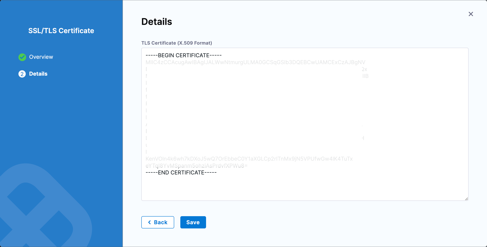
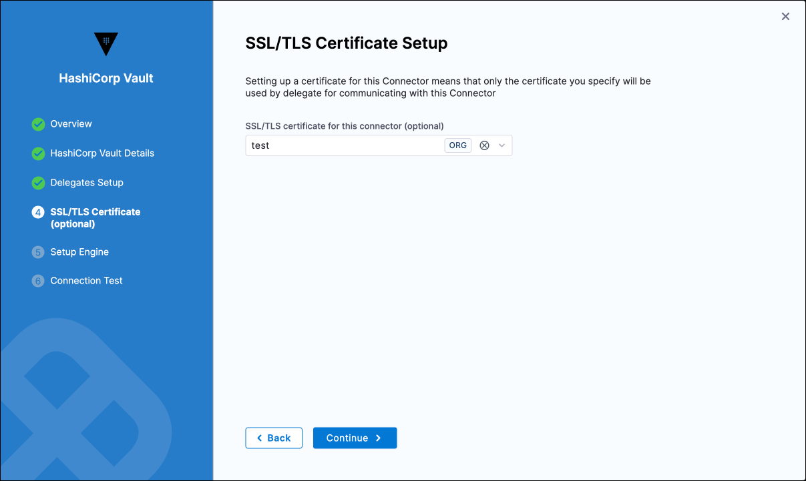

:::info note
Currently, this feature is behind the feature flag `PL_CENTRAL_CERTIFICATES_MANAGEMENT`. Contact [Harness Support](mailto:support@harness.io) to enable the feature.
:::

The Custom Certificate Feature offers a robust solution for managing the lifecycle of certificates at all hierarchical levels within Harness, including accounts, organizations, and projects. This feature is designed to bolster security measures and simplify the process of digital certificate management across the Harness platform.

## Key features

- **Scope Availability**: Enables the creation and management of certificates at all hierarchical levels within Harness, including account, organization, and project scopes.
- **Lifecycle Management**: Offers comprehensive management capabilities for certificates, encompassing creation, viewing, editing, and deletion.
- **Integration with Connectors**: Provides specialized support for integration with HashiCorp Vault connectors, ensuring secure connections and streamlined operations within external systems. This will be followed up with more connectors integration.

## Add a custom certificate

To integrate a custom certificate, navigate to the **Account Settings**, **Organization Settings**, or **Project Settings** based on the desired scope for the certificate addition.

## Create a certificate

To add a new certificate within Harness, follow these steps to navigate through the portal and input the necessary details:

1. Navigate to the preferred settings page (**Account Settings, Organization Settings,** or **Project Settings**) based on the scope where you want to add the certificate. Within this page, locate and click on the **Certificates** option. This action will take you to the certificate management page, where you can view all existing certificates under the selected scope.

2. On the certificate management page, click on **New Certificate**.

3. In the **Overview** Section, enter the certificate's Name, and optionally add **Tags** and a **Description**. Ensure all details are accurate and reflective of the certificate's purpose. Once completed, click on **Continue** to proceed.

4. Move to the **Details** Page, where you're required to input the **TLS Certificate** in the **X.509 Format**. This section also provides the option to chain multiple certificates, offering enhanced flexibility for certificate management. Ensure that the certificate details are correctly entered and conform to the **X.509** standard.

5. After entering all necessary details, click on Save to finalize the creation of the certificate. A confirmation notification will then appear, indicating **Certificate [certificateName] created successfully**, which signifies that the certificate has been successfully created and is now part of your Harness environment.

   

:::info note
If the certificate details fail validation, an error message will be displayed: `Invalid request: Certificate is not a valid X509 Certificate`.

:::

Editing and deletion options are available for each certificate. However, certificates currently in use by connectors cannot be directly deleted to avoid service disruptions. Future updates will introduce a forced deletion option for comprehensive management.

## Use certificates in connectors

Integrating certificates with connectors is essential for securing communications and operations. Currently, Harness supports certificate integration exclusively with the HashiCorp Vault connector.

## Add a certificate to a connector

1. Navigate to the Connectors page and select the desired connector for certificate integration. Enter the edit mode and proceed until reaching the **SSL/TLS Certificate** section.
2. In the **SSL/TLS certificate for this connector** dropdown, select the certificate you wish to associate. Apply the selection, continue through the setup, and perform a connection test to confirm the integration's success.

   

:::important note
For configurations using a root token, you must set the **Renewal Interval** to `0`.

:::
