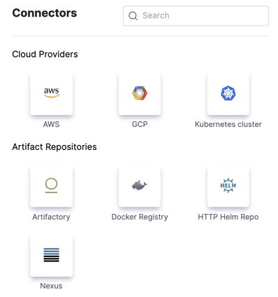
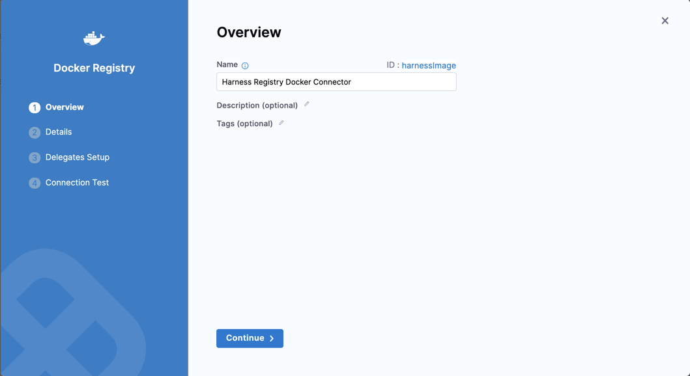

When you run a Harness pipeline, the Harness Delegate makes an anonymous outbound connection, through a [Docker connector](/docs/platform/connectors/cloud-providers/ref-cloud-providers/docker-registry-connector-settings-reference.md), to pull the required Harness images used for backend processes, such as [Harness CI images](/docs/continuous-integration/use-ci/set-up-build-infrastructure/harness-ci.md), from the public registry where they are stored.

By default, Harness uses the built-in Harness Image Docker connector with anonymous access to pull these images from a public Docker Hub container registry. There are four ways you can modify the default behavior for pulling Harness images:

<!-- no toc -->
* [Pull images anonymously from GCR or ECR.](#pull-images-anonymously-from-gcr-or-ecr)
* [Always use credentials instead of anonymous access.](#configure-harness-to-always-use-credentials-to-pull-harness-images)
* [Use credentials for specific stages.](#use-credentials-to-pull-harness-images-for-specific-stages)
* [Pull images from a private registry.](#pull-harness-images-from-a-private-registry)

To configure any of these options, you need [permissions](../../role-based-access-control/permissions-reference) to create, edit, and view connectors at the account [scope](/docs/platform/role-based-access-control/rbac-in-harness.md#permissions-hierarchy-scopes).

:::tip Rate Limiting

To prevent rate limiting or throttling issues when pulling images, configure the built-in Harness Image Docker connector to use credentials (instead of anonymous access) and pull images from GCR or ECR (instead of Docker Hub). For instructions, go to [Configure Harness to always use credentials to pull Harness images](#configure-harness-to-always-use-credentials-to-pull-harness-images).

:::

## Pull images anonymously from GCR or ECR

By default, Harness pulls Harness images from Docker Hub with anonymous access. You can also pull Harness images with anonymous access from GCR or ECR. This option changes the behavior for your entire account by editing the configuration of the built-in **Harness Docker Connector**. This is useful if you experience rate limiting issues when pulling from Docker Hub.

If you don't want to change the behavior for your entire account, follow the steps in [Use credentials to pull Harness images for specific stages](#use-credentials-to-pull-harness-images-for-specific-stages) to modify the behavior for specific stages only.

1. Go to **Account Settings**, select **Account Resources**, and then select **Connectors**.
2. Select the **Harness Docker Connector** (Id: `harnessImage`).

   If there is no connector with the `harnessImage` identifier in your Account, you need to [create a Docker connector](/docs/platform/connectors/cloud-providers/ref-cloud-providers/docker-registry-connector-settings-reference) with the exact **Id** of `harnessImage`. Harness gives precedence to the connector with the `harnessImage` identifier and uses it to pull the images.

3. Select **Edit Details**.
4. Select **Continue** to go to the **Details** settings.
5. For **Provider Type** and **URL**, do one of the following:

   * To pull [Harness images from GCR](https://console.cloud.google.com/gcr/images/gcr-prod/global/harness), select **Other (Docker V2 compliant)** for **Provider Type**, and then enter `https://gcr.io/gcr-prod` for **Docker Registry URL**.
   * To pull [Harness images from ECR](https://public.ecr.aws/harness), select **Other (Docker V2 compliant)** for **Provider Type**, and then enter `https://public.ecr.aws/harness` for **Docker Registry URL**.

   If you want to change the connector back to Docker Hub, select **Docker Hub** and enter `https://registry.hub.docker.com`.

6. For **Authentication**, select **Anonymous**. You can use anonymous access to pull Harness images from GCR, ECR, or Docker Hub.
7. Select **Continue** to go to **Select Connectivity Mode**, and then configure the connector to connect through a Harness Delegate or the Harness Platform.

   * If you plan to use this connector with [Harness Cloud build infrastructure](/docs/continuous-integration/use-ci/set-up-build-infrastructure/use-harness-cloud-build-infrastructure.md), you must select **Connect through Harness Platform**.
   * If you select **Connect through a Harness Delegate**, you can allow Harness to use any available delegate or specify delegates based on tags. For more information about how Harness selects delegates, go to [Delegate overview](/docs/platform/delegates/delegate-concepts/delegate-overview.md) and [Use delegates selectors](/docs/platform/delegates/manage-delegates/select-delegates-with-selectors.md).
   * For delegate installation instructions, go to [Delegate installation overview](../../delegates/install-delegates/overview).

8. Select **Save and Continue**, wait for the connectivity test to run, and then select **Finish**.

## Configure Harness to always use credentials to pull Harness images

If you don't want to connect anonymously, you can configure Harness to always use credentials, instead of anonymous access, to pull the Harness images. This option changes the behavior for your entire account by editing the credentials of the built-in **Harness Docker Connector**. This is useful if your organization's security policies don't allow anonymous connections to public image repos.

If you don't want to change the behavior for your entire account, you can [Use credentials to pull Harness images for specific stages](#use-credentials-to-pull-harness-images-for-specific-stages).

1. Go to **Account Settings**, select **Account Resources**, and then select **Connectors**.
2. Select the **Harness Docker Connector** (Id: `harnessImage`).

   If there is no connector with the `harnessImage` identifier in your Account, you need to [create a Docker connector](/docs/platform/connectors/cloud-providers/ref-cloud-providers/docker-registry-connector-settings-reference) with the exact **Id** of `harnessImage`. Harness gives precedence to the connector with the `harnessImage` identifier and uses it to pull the images.

3. Select **Edit Details**.
4. Select **Continue** to go to the **Details** settings.
5. For **Provider Type** and **URL**, do one of the following:

   * To pull [Harness images from GCR](https://console.cloud.google.com/gcr/images/gcr-prod/global/harness), select **Other (Docker V2 compliant)** for **Provider Type**, and then enter `https://gcr.io/gcr-prod` for **Docker Registry URL**.
   * To pull [Harness images from ECR](https://public.ecr.aws/harness), select **Other (Docker V2 compliant)** for **Provider Type**, and then enter `https://public.ecr.aws/harness` for **Docker Registry URL**.
   * To pull images from Docker Hub, select **Docker Hub** and entering `https://registry.hub.docker.com`.

6. For **Authentication**, select **Username and Password**, and provide a username and token to access Docker Hub or GCR,depending on the **Docker Registry URL**. The token needs read, write, and delete permissions.
7. Select **Continue** to go to **Select Connectivity Mode**, and then configure the connector to connect through a Harness Delegate or the Harness Platform.

   * If you plan to use this connector with [Harness Cloud build infrastructure](/docs/continuous-integration/use-ci/set-up-build-infrastructure/use-harness-cloud-build-infrastructure.md), you must select **Connect through Harness Platform**.
   * If you select **Connect through a Harness Delegate**, you can allow Harness to use any available delegate or specify delegates based on tags. For more information about how Harness selects delegates, go to [Delegate overview](/docs/platform/delegates/delegate-concepts/delegate-overview.md) and [Use delegates selectors](/docs/platform/delegates/manage-delegates/select-delegates-with-selectors.md).
   * For delegate installation instructions, go to [Delegate installation overview](../../delegates/install-delegates/overview).

8. Select **Save and Continue**, wait for the connectivity test to run, and then select **Finish**.

   If the connectivity test fails, make sure your connector's credentials are configured correctly and that the token has the necessary permissions.

## Use credentials to pull Harness images for specific stages

If you don't want to connect anonymously, you can configure Harness to use credentials, instead of anonymous access, to pull the Harness images for specific stages in your pipelines. This option lets you override the Harness image pull behavior in individual [Build stages](/docs/continuous-integration/use-ci/prep-ci-pipeline-components.md#stages) by creating a dedicated [Docker connector](/docs/platform/connectors/cloud-providers/ref-cloud-providers/docker-registry-connector-settings-reference) you can use for these specific use cases. This is useful when the delegate for that stage's build infrastructure can't anonymously access the public repo. For example, if the build infrastructure is running in a private cloud.

If you want to change the behavior for your entire account, you can [configure Harness to always use credentials to pull Harness images](#configure-harness-to-always-use-credentials-to-pull-harness-images).

1. Go to **Account Settings**, select **Account Resources**, and then select **Connectors**.

   Although you will select the connector at the stage scope, you must create the Docker connector at the account scope.

2. Select **New Connector**, and, under **Artifact Repositories**, select the **Docker Registry** connector.

   

3. Enter a **Name** for the connector. The **Description** and **Tags** are optional.

   Harness automatically creates an **Id** ([entity identifier](../../references/entity-identifier-reference.md)) based on the **Name**. You can edit the **Id** while creating the connector only. After saving the connector, the **Id** can't be changed.

   

4. Select **Continue** to go to the **Details** settings.
5. For **Provider Type** and **URL**, do one of the following:

   * To pull [Harness images from GCR](https://console.cloud.google.com/gcr/images/gcr-prod/global/harness), select **Other (Docker V2 compliant)** for **Provider Type**, and then enter `https://gcr.io/gcr-prod` for **Docker Registry URL**.
   * To pull [Harness images from ECR](https://public.ecr.aws/harness), select **Other (Docker V2 compliant)** for **Provider Type**, and then enter `https://public.ecr.aws/harness` for **Docker Registry URL**.
   * To pull images from Docker Hub, select **Docker Hub** and entering `https://registry.hub.docker.com`.

6. For **Authentication**, select **Username and Password**, and provide a username and token to access GCR, ECR, or Docker Hub. The token needs **Read, Write, Delete** permissions.
7. Select **Continue** to go to **Select Connectivity Mode**, and then configure the connector to connect through a Harness Delegate or the Harness Platform.

   * If you plan to use this connector with [Harness Cloud build infrastructure](/docs/continuous-integration/use-ci/set-up-build-infrastructure/use-harness-cloud-build-infrastructure.md), you must select **Connect through Harness Platform**.
   * If you select **Connect through a Harness Delegate**, you can allow Harness to use any available delegate or specify delegates based on tags. For more information about how Harness selects delegates, go to [Delegate overview](/docs/platform/delegates/delegate-concepts/delegate-overview.md) and [Use delegates selectors](/docs/platform/delegates/manage-delegates/select-delegates-with-selectors.md).
   * For delegate installation instructions, go to [Delegate installation overview](../../delegates/install-delegates/overview).

8. Select **Save and Continue**, wait for the connectivity test to run, and then select **Finish**.

   If the connectivity test fails, make sure your connector's credentials are configured correctly and that the token has the necessary permissions.

9. In the **Build** stage where you want to use your Docker connector, go to the [Infrastructure settings](/docs/continuous-integration/use-ci/set-up-build-infrastructure/ci-stage-settings.md#infrastructure), and select your Docker connector in the **Override Image Connector** field.

   When the pipeline runs, Harness will use the specified connector to download Harness images.

   

## Pull Harness images from a private registry

Harness CI images are stored in a public container registry. If you don't want to pull the images directly from the public registry, you can download the images you need, perform any necessary security checks, upload them to your private registry, and then configure your CI pipelines to pull the Harness CI images from your private registry.

You can also [use a private registry for STO scanner images](/docs/security-testing-orchestration/use-sto/set-up-sto-pipelines/download-images-from-private-registry).

### Download Harness images to your registry

1. Download the images you need from the [Harness project on GCR](https://console.cloud.google.com/gcr/images/gcr-prod/global/harness) or the [Harness ECR public gallery](https://public.ecr.aws/harness), perform any tests or validations necessary for your organization's security policies, and then store the images in your private registry.

   :::warning

   Do not change the image names in your private registry. The image names must match the names specified by Harness.

   :::

2. **Recommended:** [Specify the images to use in your pipelines](/docs/continuous-integration/use-ci/set-up-build-infrastructure/harness-ci.md#specify-the-harness-ci-images-used-in-your-pipelines). This is recommended especially if your registry automatically downloads the latest images from the public Harness registry. This ensures your pipelines use specific image versions that you have validated, rather than automatically using the latest version. You must update this specification when you want to adopt a new version of an image.

### Create a Docker connector for your registry

Create a [Docker connector](/docs/platform/connectors/cloud-providers/ref-cloud-providers/docker-registry-connector-settings-reference) that connects to your private registry.

1. Go to **Account Settings**, select **Account Resources**, and then select **Connectors**. You must create the Docker connector at the account scope.
2. Select **New Connector**, and, under **Artifact Repositories**, select the **Docker Registry** connector.
3. Enter a **Name** for the connector. The **Description** and **Tags** are optional.

   Harness automatically creates an **Id** ([entity identifier](../../references/entity-identifier-reference.md)) based on the **Name**. You can edit the **Id** while creating the connector only. After saving the connector, the **Id** can't be changed.

4. Select **Continue**.
5. For **Provider Type**, select **Other (Docker V2 compliant)**.
6. For **Docker Registry URL**, enter the path for your container registry.
7. For **Authentication**, select **Username and Password**, and provide a username and token to access your registry. The token needs **Read, Write, Delete** permissions.
8. Select **Continue** to go to **Select Connectivity Mode**, and then configure the connector to connect through a Harness Delegate or the Harness Platform.

   * If you plan to use this connector with [Harness Cloud build infrastructure](/docs/continuous-integration/use-ci/set-up-build-infrastructure/use-harness-cloud-build-infrastructure.md), you must select **Connect through Harness Platform**.
   * If you select **Connect through a Harness Delegate**, you can allow Harness to use any available delegate or specify delegates based on tags. For more information about how Harness selects delegates, go to [Delegate overview](/docs/platform/delegates/delegate-concepts/delegate-overview.md) and [Use delegates selectors](/docs/platform/delegates/manage-delegates/select-delegates-with-selectors.md).
   * For delegate installation instructions, go to [Delegate installation overview](/docs/platform/delegates/install-delegates/overview).

9. Select **Save and Continue**, wait for the connectivity test to run, and then select **Finish**.

   If the connectivity test fails, make sure your connector's credentials are configured correctly and that the token has the necessary permissions.

10. Configure your pipelines to download Harness images from your private registry. In each **Build** stage where you want to pull from your private registry, go to the [Infrastructure settings](/docs/continuous-integration/use-ci/set-up-build-infrastructure/ci-stage-settings.md#infrastructure), and select your Docker connector in the **Override Image Connector** field.

   When the pipeline runs, Harness will use the specified connector to download images from your private registry.

   

## Connector selection hierarchy

<!-- CDS-82080/CI-11611 -->

When selecting the connector to use to pull images, Harness follows this hierarchy:

1. Check for a connector specified at the stage level, such as when [pulling Harness images from a private registry](#pull-harness-images-from-a-private-registry) or [using credentials to pull Harness images for specific stages](#use-credentials-to-pull-harness-images-for-specific-stages).
2. If there is no stage-level connector, use the account-level Harness Image connector (ID: `account.harnessImage`), which can use the default anonymous access configuration or you can configure it to [always use credentials to pull Harness images](#configure-harness-to-always-use-credentials-to-pull-harness-images).

## End of life notice: app.harness Docker registry

[Harness images](/docs/continuous-integration/use-ci/set-up-build-infrastructure/harness-ci) are available on Docker Hub, the [Harness project on GCR](https://console.cloud.google.com/gcr/images/gcr-prod/global/harness), and the [Harness ECR public gallery](https://public.ecr.aws/harness). In a continuation of this effort, and to improve stability when pulling Harness-required images, Harness deprecated the Harness-hosted `app.harness` Docker registry effective 15 Feb 2024. The registry end point will be end of life on 15 May 2024.

The end of life could impact you if:

* Your built-in Harness Docker connector (`account.harnessImage`) is configured to use the `app.harness` Docker registry. To avoid errors when the deprecation takes place, modify the target image registry by following the steps in [Configure Harness to always use credentials to pull Harness images](#configure-harness-to-always-use-credentials-to-pull-harness-images).
* You [pull Harness images from a private registry](#pull-harness-images-from-a-private-registry), and you are currently pulling the latest images from the `app.harness` Docker registry. To avoid errors post end of life, make sure you are pulling images from the [Harness project on GCR](https://console.cloud.google.com/gcr/images/gcr-prod/global/harness) or the [Harness ECR public gallery](https://public.ecr.aws/harness).
* You have other Docker connectors configured to the `app.harness` Docker registry. Edit these connectors to use `https://registry.hub.docker.com` instead.

## Troubleshoot Harness images

Go to the [CI Knowledge Base](/kb/continuous-integration/continuous-integration-faqs) for questions and issues related to Harness-required images, connectors, and pipeline initialization, such as:

* [How do I get a list of tags available for an image in the Harness image registry?](/kb/continuous-integration/continuous-integration-faqs/#how-do-i-get-a-list-of-tags-available-for-an-image-in-the-harness-image-registry)
* [Build failed with "failed to pull image" or "ErrImagePull"](/kb/continuous-integration/continuous-integration-faqs/#build-failed-with-failed-to-pull-image-or-errimagepull)
* [What access does Harness use to pull the Harness internal images from the public image repo?](/kb/continuous-integration/continuous-integration-faqs/#what-access-does-harness-use-to-pull-the-harness-internal-images-from-the-public-image-repo)
* [Can I use my own private registry to store Harness CI images?](#pull-harness-images-from-a-private-registry)
* [Docker Hub rate limiting](/docs/continuous-integration/use-ci/set-up-build-infrastructure/harness-ci/#docker-hub-rate-limiting)
