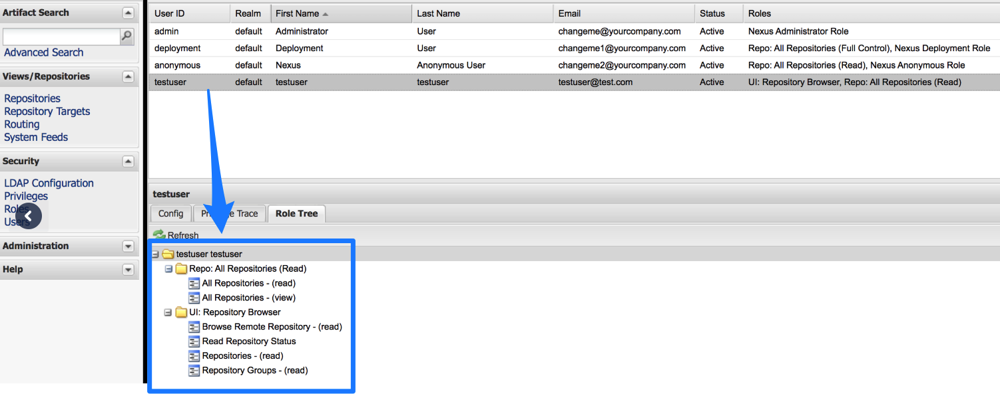

This topic provides settings and permissions for the Nexus connector.

## Nexus permissions required

The user account associated with the connector must have the following permissions in the Nexus Server:

* Repo: All repositories (Read)
* Nexus UI: Repository Browser
* If using Nexus 3 as a Docker repo, the account also needs a role with the `nx-repository-view-*_*_*` privilege.

For more information, go to the Sonatype documentation on [Managing Nexus security](https://help.sonatype.com/display/NXRM2/Managing+Security).

## Artifact type support

Legend:

* **M** - Metadata. This includes Docker image and registry information. For AMI, this means AMI ID-only.
* **Blank** - Not supported.

| **Docker Image**(Kubernetes/Helm) | **AWS AMI** | **AWS CodeDeploy** | **AWS Lambda** | **JAR** | **RPM** | **TAR** | **WAR** | **ZIP** | **PCF** | **IIS** |
| --- | --- | --- | --- | --- | --- | --- | --- | --- | --- | --- |
| M |  |  |  |  |  |  |  |  |  | M |

## Docker support

Nexus 3 Artifact Servers only.

## Nexus Artifact Server settings

The Harness Nexus Artifact server connects your Harness account to your Nexus artifact resources. It has the following settings.

### Name, Description, and Tags

The unique name for this connector.

Harness creates an [Id (Entity Identifier)](../../references/entity-identifier-reference.md) based on the name. You can change the **Id** while creating the connector. Once saved, the **Id** can't be changed, but you can change the **Name**.

**Description** and [**Tags**](../../references/tags-reference.md) are optional.

### Nexus Repository URL

The URL that you use to connect to your Nexus server. For example, `https://nexus3.dev.mycompany.io/repository/your-repo-name`.

### Version

The supported Nexus version, `3.x`.

For Nexus 3.x, Harness supports only the Docker repository format as the artifact source.

### Credentials

The username and password for the Nexus account to use for this connector.

For the password, select a [Harness text secret](/docs/platform/secrets/add-use-text-secrets).

## Nexus Artifact Details settings

### Repository URL

The URL you would use in the Docker login to fetch the artifact. This is the same as the domain name and port you use for `docker login hostname:port`.

### Repository Port

The port you use for `docker login hostname:port`.

As a best practice, include the scheme and port. For example, `https://your-repo:443`. If you cannot locate the scheme, you may omit it. For example, `your-repo:18080`.

For more information, go to the following Sonatype documentation:

* [Docker Repository Configuration and Client Connection](https://support.sonatype.com/hc/en-us/articles/115013153887-Docker-Repository-Configuration-and-Client-Connection)
* [Using Nexus 3 as Your Repository - Part 3: Docker Images](https://blog.sonatype.com/using-nexus-3-as-your-repository-part-3-docker-images)

### Repository

Name of the repository where the artifact is located.

### Artifact Path

The name of the artifact you want to deploy. For example, `nginx`, `private/nginx`, or `public/org/nginx`.

The repository and artifact path must not begin or end with `/`.

### Tag

Select a [tag](../../references/tags-reference.md) from the list.
