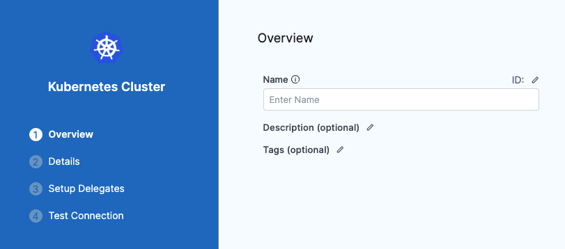

You can connect Harness with your Kubernetes clusters using the provider-agnostic Kubernetes cluster connector or a provider-specific connector, such as the [Google Cloud Platform (GCP) Connector](./connect-to-google-cloud-platform-gcp.md) or [AWS connector](./add-aws-connector.md). For a list of the platforms and technologies supported by Harness, go to [Supported Platforms and Technologies](../../../../docs/get-started/supported-platforms-and-technologies.md).

This page explains how to set up the provider-agnostic Kubernetes cluster connector. Once connected, you can use Kubernetes and Harness for provisioning infrastructure, running a CI build farm, and deploying microservices and other workloads to clusters. This page assumes you have some familiarity with [Harness' key concepts](../../../get-started/key-concepts.md).

This video shows how to add a Kubernetes cluster connector and install the Kubernetes Delegate in the target cluster at the same time:

<!-- Video:
https://www.youtube.com/embed/wUC23lmqfnY-->
<DocVideo src="https://www.youtube.com/embed/wUC23lmqfnY" />

## Roles and policies for the connector

**What roles should my Kubernetes account have?** The roles and policies needed by the account associated with your connector depend on how you'll use the connector in your Harness pipelines and what actions you need Harness to perform in the cluster.

You can use different methods for authenticating with the Kubernetes cluster, but all of them use a Kubernetes Role. The Role used must have either the `cluster-admin` permission in the target cluster or admin permissions in the target namespace. The Harness Delegate uses `cluster-admin` by default, because this ensures anything can be applied. Any restriction must take into account the actual usage of the connector, such as manifests to be deployed.

In general, the following permissions are required:

- **Deployments:** A Kubernetes service account with permission to create entities in the target namespace is required. The set of permissions should include `list`, `get`, `create`, `watch` (to fetch the pod events), and `delete` permissions for each of the entity types Harness uses. In general, cluster admin permission or namespace admin permission is sufficient.
- **Builds:** A Kubernetes service account with CRUD permissions on Secret, Service, Pod, and PersistentVolumeClaim (PVC).

For a detailed list of roles and policies, go to the [Kubernetes cluster connector settings reference](../../../platform/connectors/cloud-providers/ref-cloud-providers/kubernetes-cluster-connector-settings-reference.md).

:::tip

If you don't want to use `resources: ["*"]` for the Role, you can list out the resources you want to grant. Harness needs `configMap`, `secret`, `event`, `deployment`, and `pod` at a minimum for deployments, as stated above. Beyond that, it depends on the resources you are deploying via Harness.

If you don't want to use `verbs: ["*"]` for the Role, you can list out all of the verbs (`create`, `delete`, `get`, `list`, `patch`, `update`, `watch`).

:::

### Connect to Amazon EKS

To connect Harness to Amazon EKS, you can use the platform-agnostic Kubernetes cluster connector or an [AWS connector configured for EKS](/docs/platform/connectors/cloud-providers/ref-cloud-providers/aws-connector-settings-reference/##connect-to-elastic-kubernetes-service-eks).

To use an EKS cluster for Kubernetes cluster build infrastructure in Harness CI, you must create a platform-agnostic Kubernetes cluster connector for the stage's build infrastructure, and then you can use either type of connector in individual steps in the stage.

For individual steps in a build stage, if your EKS clusters use IRSA (IAM roles for the delegate's service account) or Fargate nodes in EKS clusters, use an [AWS connector configured for EKS](/docs/platform/connectors/cloud-providers/ref-cloud-providers/aws-connector-settings-reference/##connect-to-elastic-kubernetes-service-eks).

#### Switching IAM policies

If the IAM role used by your connector does not have the required policies, you can modify or switch the role assigned to the cluster or the Harness Delegate associated with your connector. It can take up to five minutes for IAM policy changes to take effect.

### AKS clusters must have local accounts enabled

To use an AKS cluster for deployments, the AKS cluster must have local accounts enabled (AKS property `disableLocalAccounts=false`).

## Add a Kubernetes cluster connector

1. In your Harness project, go to **Project Setup** and select **Connectors**.
2. Select **New Connector**, and then select the **Kubernetes Cluster** cloud provider connector.
3. Enter a **Name** for the connector. **Description** and **Tags** are optional.

   Harness automatically creates the corresponding **Id** ([entity identifier](../../../platform/references/entity-identifier-reference.md)) based on the name.

   

4. Select **Continue** to proceed to **Configure Credentials**.

### Enter credentials

1. Select how you want Harness to connect to the cluster. For details about these setting, go to the [Kubernetes cluster connector settings reference](../../../platform/connectors/cloud-providers/ref-cloud-providers/kubernetes-cluster-connector-settings-reference.md).

   - **Specify master URL and credentials:**
      - Provide the Kubernetes master node URL. To get the master URL, use `kubectl cluster-info`.
      - Enter the **Service Account Key** or other credentials. You can use any service account; the service account doesn't have to be attached to a Harness delegate.
   - **Use the credentials of a specific Harness Delegate:** Select this option to have the connector inherit the credentials used by the Harness Delegate running in the cluster. You can install a delegate while creating your connector, if you haven't installed the delegate already.

<details>
<summary>Obtain the Service Account token using kubectl</summary>

To use a Kubernetes Service Account (SA) and token, you need to use either an existing SA that has the `cluster-admin` permission (or namespace `admin`) or create a new SA and grant it the `cluster-admin` permission (or namespace `admin`).

For example:

1. Create a manifest. This manifest creates a new SA named `harness-service-account` in the `default` namespace:

   ```
   # harness-service-account.yml
   apiVersion: v1
   kind: ServiceAccount
   metadata:
     name: harness-service-account
     namespace: default
   ```

2. Apply the SA.

   ```
   kubectl apply -f harness-service-account.yml
   ```

3. Grant the SA the `cluster-admin` permission.

   ```
   # harness-clusterrolebinding.yml
   apiVersion: rbac.authorization.k8s.io/v1beta1
   kind: ClusterRoleBinding
   metadata:
     name: harness-admin
   roleRef:
     apiGroup: rbac.authorization.k8s.io
     kind: ClusterRole
     name: cluster-admin
   subjects:
   - kind: ServiceAccount
     name: harness-service-account
     namespace: default
   ```

4. Apply the `ClusterRoleBinding`.

   ```
   kubectl apply -f harness-clusterrolebinding.yml
   ```

5. After adding the SA, run the following commands to get the SA's token. The `| base64 -d` piping decodes the token so you can use it in the connector's credentials.

   ```
   SERVICE_ACCOUNT_NAME={SA name}

   NAMESPACE={target namespace}

   SECRET_NAME=$(kubectl get sa "${SERVICE_ACCOUNT_NAME}" --namespace "${NAMESPACE}" -o=jsonpath='{.secrets[].name}')

   TOKEN=$(kubectl get secret "${SECRET_NAME}" --namespace "${NAMESPACE}" -o=jsonpath='{.data.token}' | base64 -d)

   echo $TOKEN
   ```

:::note SA tokens for Kubernetes versions 1.24 and later

The Kubernetes SA token isn't automatically generated for SAs provisioned under Kubernetes versions 1.24 and later. Instead, you must create a new SA token and decode it to the `base64` format.

You can use the following kubectl command to create a SA bound token:

```
kubectl create token <service-account-name> --bound-object-kind Secret --bound-object-name <token-secret-name>
```

You can also create SAs using manifests, for example:

```
apiVersion: v1
kind: ServiceAccount
metadata:
  name: <service-account-name>
  namespace: default

---
apiVersion: v1
kind: Secret
type: kubernetes.io/service-account-token
metadata:
  name: <token-secret-name>
  annotations:
    kubernetes.io/service-account.name: "<service-account-name>"
```

For more details, go to [Managing Service Accounts](https://kubernetes.io/docs/reference/access-authn-authz/service-accounts-admin/).

:::

</details>

### Set up delegates

Harness uses Kubernetes cluster connectors at pipeline runtime to authenticate and perform operations with Kubernetes. Authentications and operations are performed by Harness Delegates. Regardless of the authentication method selected for a Kubernetes cluster connector, you must use Harness Delegates to perform authentication for the connector.

Select one of the following:
   * **Use any available Delegate**: Harness selects an available delegate at runtime. To learn how Harness selects delegates, go to [Delegate overview](/docs/platform/delegates/delegate-concepts/delegate-overview.md).
   * **Only use Delegates with all of the following tags**: Use **Tags** to match one or more suitable delegates. To learn more about delegate tags, go to [Use delegate selectors](/docs/platform/delegates/manage-delegates/select-delegates-with-selectors.md).

If there are no delegates available for your target cluster, you can select **Install new Delegate** if you need to [install a delegate](/docs/platform/delegates/delegate-concepts/delegate-overview.md) without exiting connector configuration. Delegates can be instaleld on your target cluster or any cluster in your environment that can connect to the cluster.

### Connection test

After selecting the delegate connectivity, **Save and Continue** to run the connection test. Harness tests the credentials you provided using the delegates you selected. If the test passes, select **Finish**.

During the connection test, Harness uses the provided credentials to list controllers in the **default** namespace in order to validate the credentials. If validation fails, Harness does not save the connector and the connection test fails.

If your cluster does not have a **default** namespace, or your credentials do not have permission in the **default** namespace, then you can check **Skip default namespace validation** to skip this check and save your connector's settings. You don't need to uncheck this setting later.

When you use this connector for a build or deployment, you'll specify a namespace. During a build or deployment, Harness uses this namespace rather than the **default** namespace. When you save a pipeline, Harness validates the namespace connection even if you selected **Skip default namespace validation** in the connector's settings.
