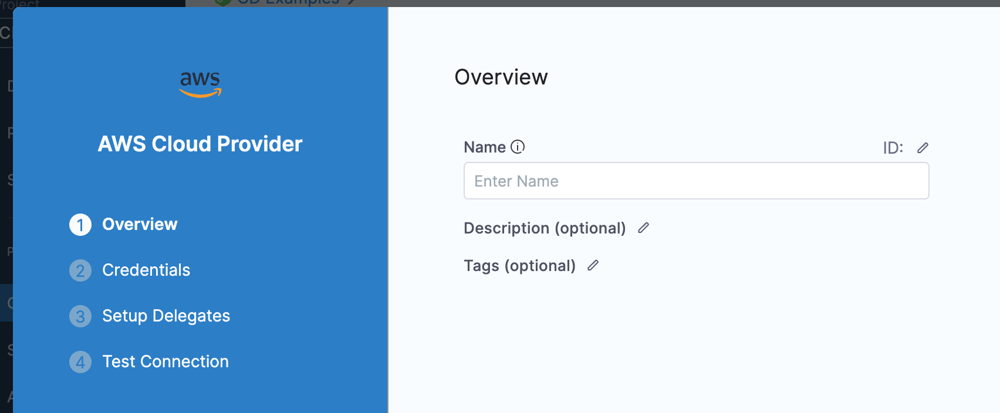

Use a Harness AWS connector to integrate AWS with Harness. Use AWS with Harness to obtain artifacts, communicate with AWS services, provision infrastructure, and deploy microservices and other workloads.

If you want to connect Harness to Elastic Kubernetes Service (Amazon EKS), you can use the platform-agnostic [Kubernetes cluster connector](../..connectors/../cloud-providers/connect-to-a-cloud-provider.md) or an [AWS connector configured for EKS](/docs/platform/connectors/cloud-providers/ref-cloud-providers/aws-connector-settings-reference/#connect-to-elastic-kubernetes-service-eks).

This topic explains how to set up an AWS connector.

## Configure roles and policies

The necessary IAM roles and policies needed by the AWS account used in the connector depend on which AWS service you are using with Harness and which operations you want Harness to perform in AWS. For an extensive description of roles and policies, go to the [AWS Connector Settings Reference](../../../platform/connectors/cloud-providers/ref-cloud-providers/aws-connector-settings-reference.md).

AWS connectors can also inherit IAM roles from Harness delegates running in AWS. If you want your connector to inherit from a delegate, make sure the delegate has the necessary roles.

:::warning

The [DescribeRegions](https://docs.aws.amazon.com/AWSEC2/latest/APIReference/API_DescribeRegions.html) action is required for all AWS connectors regardless of what AWS service you are using for your target infrastructure.

:::

If you find that the IAM role associated with your AWS connector doesn't have the policies required by the AWS service you want to access, you can modify or change the role assigned to the AWS account or the Harness delegate that your AWS connector is using. You may need to wait up to five minutes for the change to take effect.

:::tip

The AWS [IAM Policy Simulator](https://docs.aws.amazon.com/IAM/latest/UserGuide/access_policies_testing-policies.html) is a useful tool for evaluating policies and access.

:::

## Create the AWS connector

1. Open a Harness project, and select **Connectors** under **Project Setup**. You can also create connectors at the account or organization levels.
2. Select **New Connector**, and then select **AWS** under **Cloud Providers**.

   

3. Input a **Name** for the connector. **Description** and **Tags** are optional.
   Harness automatically creates an **Id** ([entity identifier](../../../platform/references/entity-identifier-reference.md)) for the connector based on the **Name**.
4. Select **Continue** to proceed to **Configure credentials**.

## Configure credentials

Review the following information carefully to ensure you select the correct credentials configuration for your AWS connector.

1. Select one of the following three primary options:
   * **Assume IAM Role on Delegate:** With this option, the connector inherits authentication credentials from the Harness delegate that is running in AWS. For example, you can select a Harness Delegate running in Amazon Elastic Kubernetes Service (EKS). However, this option is not valid for IAM roles for service accounts (IRSA).
      * If the Harness Delegate in your EKS cluster uses IAM roles for service accounts, you must select **Use IRSA**, not **Assume IAM Role on Delegate**.
      * If you deploy pods to Fargate nodes in an EKS cluster, and your nodes needs IAM credentials, you must configure IRSA in your AWS EKS configuration and select the **Use IRSA** option for your connector credentials. This is due to [Fargate limitations](https://docs.aws.amazon.com/eks/latest/userguide/fargate.html#:~:text=The%20Amazon%20EC2%20instance%20metadata%20service%20(IMDS)%20isn%27t%20available%20to%20Pods%20that%20are%20deployed%20to%20Fargate%20nodes.).
   * **AWS Access Key:** Provide an [Access Key and Secret Access Key](https://docs.aws.amazon.com/general/latest/gr/aws-sec-cred-types.html#access-keys-and-secret-access-keys) for the IAM role you want the connector to use.
   * **Use IRSA:** Required if you use IAM roles for service accounts, including IRSA in EKS clusters with OIDC Provider. Additional configuration is required, as explained in [Use IRSA](#use-irsa).
2. To use cross-account ARN, select **Enable cross-account access (STS Role)**. This option is available for all authentication methods, but it may not be supported by all pipeline steps. For more information about cross-account access in AWS connectors, go to the [AWS connector settings reference](../../../platform/connectors/cloud-providers/ref-cloud-providers/aws-connector-settings-reference.md).
3. By default, Harness uses the `us-east-1` region to test the credentials for AWS connectors. If you want to use a different region or an AWS GovCloud account, select it in the **Test Region** field. For more information about AWS GovCloud support, go to the [AWS connector settings reference](/docs/platform/connectors/cloud-providers/ref-cloud-providers/aws-connector-settings-reference/#test-region-and-aws-govcloud-support).
4. Select **Continue** to proceed to **Select Connectivity Mode**.

### Use IRSA

import IrsaPartial from '/docs/shared/aws-connector-auth-options.md';

<IrsaPartial name="aws-irsa" />

:::info

To use an AWS connector with IRSA in a CI stage, you must [configure your Kubernetes cluster build infrastructure to use the same service account name](/docs/continuous-integration/use-ci/set-up-build-infrastructure/ci-stage-settings/#service-account-name) specified in your delegate YAML.

:::

## Select connectivity mode

Harness uses AWS connectors during pipeline runs to authenticate and perform operations with AWS.

1. Select how you want Harness to connect to AWS:
   * **Connect through Harness Platform:** Use a direct, secure communication between Harness and AWS. This connectivity mode is required for [Harness Cloud build infrastructure](/docs/continuous-integration/use-ci/set-up-build-infrastructure/use-harness-cloud-build-infrastructure).
   * **Connect through a Harness Delegate:** Harness communicates with AWS through a Harness delegate in AWS. You must choose this option if you chose **Use IRSA** or **Assume IAM Role on Delegate** for the [connector credentials](#configure-credentials).
2. If connecting through a Harness delegate, select either:
   * **Use any available Delegate**: Harness selects an available delegate at runtime. To learn how Harness selects delegates, go to [Delegate overview](/docs/platform/delegates/delegate-concepts/delegate-overview.md).
   * **Only use Delegates with all of the following tags**: Use **Tags** to match one or more suitable delegates.
      * To learn more about delegate tags, go to [Use delegate selectors](/docs/platform/delegates/manage-delegates/select-delegates-with-selectors.md).
     * Select **Install new Delegate** if you need to [install a delegate](/docs/platform/delegates/delegate-concepts/delegate-overview.md) without exiting connector configuration.
3. Select **Save and Continue** to run the connection test. If the test succeeds, select **Finish**. The connection test confirms that your authentication and delegate selections are valid.

### Troubleshoot AWS connector errors

If the connection test fails due to a credentials issue, use the AWS CLI or console to check the credentials. The AWS [IAM Policy Simulator](https://docs.aws.amazon.com/IAM/latest/UserGuide/access_policies_testing-policies.html) is useful for evaluating policies and access.

Due to the limited scope of the initial connection test, credentials can pass the connection test and then fail when you use the connector in a pipeline. This can happen if the IAM role the connector uses doesn't have the roles and policies needed for the pipeline's operations. For example, if a pipeline has a Run step that uses an AWS connector, the connector might need specific roles or policies to be able to execute the operations required by the Run step.

If you experience any errors with AWS connectors, verify that the IAM roles and policies are correct, and that the connector credentials are correct. For example:

* The [DescribeRegions](https://docs.aws.amazon.com/AWSEC2/latest/APIReference/API_DescribeRegions.html) action is required for all AWS Cloud Providers regardless of what AWS service you are using for your target infrastructure.
* If the Harness Delegate in your EKS cluster uses IAM roles for service accounts, make sure the [connector credentials](#configure-credentials) are set to **Use IRSA**, not **Assume IAM Role on Delegate**.

For a list of roles and policies, go to the [AWS Connector Settings Reference](../../../platform/connectors/cloud-providers/ref-cloud-providers/aws-connector-settings-reference.md).
