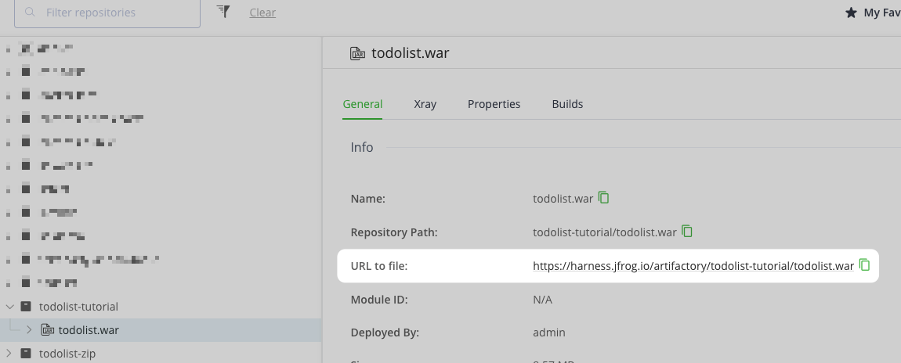
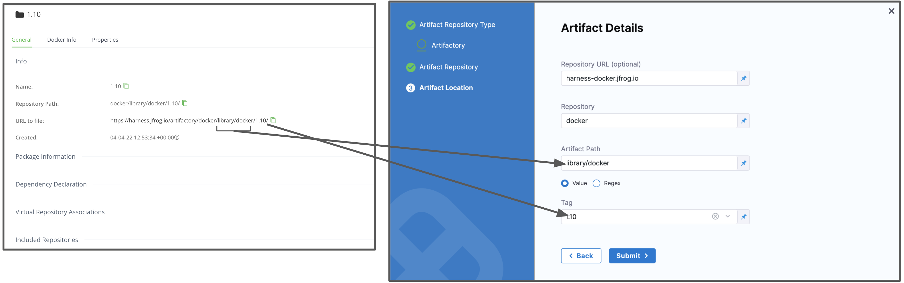

Harness supports both cloud and on-prem versions of Artifactory.

This topic provides settings and permissions for the Artifactory Connector.

## Artifactory Permissions

Make sure the following permissions are granted to the user:

* Privileged User is required to access API, whether Anonymous or a specific username (username and passwords are not mandatory).
* Read permission to all Repositories.

If used as a Docker Repo, user needs:

* List images and tags
* Pull images

See [Managing Permissions: JFrog Artifactory User Guide](https://www.jfrog.com/confluence/display/RTF/Managing+Permissions).

## Supported sources and registry types

The utility of the Artifactory connector depends on the module and file types you're using it with.

### Continuous Delivery

The following Artifactory sources are supported for Continuous Delivery:

* **Docker Image (Kubernetes):** Metadata
* **Helm Chart:** File
* **Zip:** File

Metadata/File sources include Docker image and registry information. For AMI, this means AMI ID-only.

Support for the following sources is in development:

* **Terraform**
* **AWS AMI**
* **AWS CodeDeploy**
* **AWS Lambda**
* **JAR**
* **RPM**
* **TAR**
* **WAR**
* **Tanzu (PCF)**
* **IIS**

If you are new to using Artifactory as a Docker repo, go to the JFrog documentation on [Getting Started with Artifactory as a Docker Registry](https://www.jfrog.com/confluence/display/RTF6X/Getting+Started+with+Artifactory+as+a+Docker+Registry).

### Continuous Integration

If you are pulling images or building/pushing images to JFrog Artifactory in Harness CI pipelines, **you can use the Artifactory connector for JFrog non-Docker registries only**.

For JFrog Docker registries, you must use the Docker connector. For more information, go to [Build and push to JFrog Docker registries](/docs/continuous-integration/use-ci/build-and-upload-artifacts/build-and-push/build-and-push-to-docker-jfrog.md) and [Upload Artifacts to JFrog](/docs/continuous-integration/use-ci/build-and-upload-artifacts/upload-artifacts/upload-artifacts-to-jfrog.md). This restriction also applies when pulling images from Artifactory for use in other steps, such as [CI Run steps](/docs/continuous-integration/use-ci/run-step-settings.md).

## Artifactory connector settings

The Artifactory connector has the following settings.

### Connector metadata

* **Name:** The unique name for this Connector.
* **ID:** Go to [Entity Identifier reference](../../../references/entity-identifier-reference.md).
* **Description:** Optional text string.
* **Tags:** Go to the [Tags reference](../../../references/tags-reference.md).

### Artifactory Repository URL

The Harness Artifactory Artifact server connects your Harness account to your Artifactory artifact resources.

For **Artifactory Repository URL**, enter your registry base URL followed by your module name, such as `https://mycompany.jfrog.io/artifactory` or `https://*****server_name*****/artifactory`.

The URL format depends on your Artifactory configuration, and whether your Artifactory instance is local, virtual, remote, or behind a proxy.

#### Get your JFrog URL

You can get the URL from your Artifactory settings.

When examining a file in your registry, check the **URL to file** setting.

You can also select your repo in your JFrog instance, select **Set Me Up**, and get the repository URL from the server name in the `docker-login` command.

For more information, go to the JFrog documentation on [Repository Management](https://www.jfrog.com/confluence/display/JFROG/Repository+Management) and [Configuring Docker Repositories](https://www.jfrog.com/confluence/display/RTF/Docker+Registry#DockerRegistry-ConfiguringDockerRepositories).

### Username and Password

Enter the **Username** for the Artifactory account user, and select or create a [Harness encrypted text secret](/docs/platform/secrets/add-use-text-secrets) containing the corresponding **Password**.

### Additional artifact details

These settings are for Artifactory deployments.

* **Repository URL:** Go to [Artifactory Repository URL](#artifactory-repository-url).
* **Repository:** Enter the name of the repository where the artifact source is located. Harness supports only the Docker repository format as the artifact source for deployments.
* **Artifact/Image Path:** Enter the name of the artifact you want to deploy. The repository and artifact path must not begin or end with `/`.
* **Tag:** Select a tag from the list.

:::info

The [Artifactory user account](#username-and-password) you use in the Harness Artifact connector requires [basic authentication](https://www.jfrog.com/confluence/display/JFROG/Access+Tokens#AccessTokens-BasicAuthentication) to fetch the **Artifact/Image Path** and **Tag**.

:::

:::info Limitation

The Artifactory connector currently does not support OpenID Connect (OIDC) for authentication, limiting integration with OIDC-compliant identity providers

:::