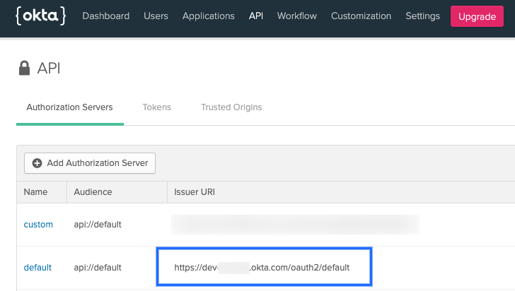
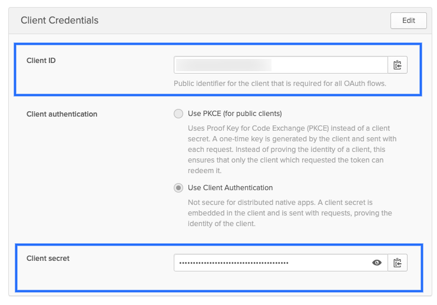
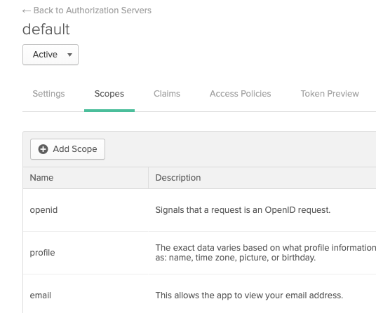

This topic provides settings and permissions for the [Harness Kubernetes cluster connector](/docs/platform/connectors/cloud-providers/add-a-kubernetes-cluster-connector). The Kubernetes cluster connector is a platform-agnostic connection to a Kubernetes cluster located anywhere. For cloud platform-specific connectors, go to [Cloud Connectors](/docs/category/cloud-providers/).

This video demonstrates how to add a Harness Kubernetes cluster connector and Harness Kubernetes delegate. The delegate is added to the target cluster, and then the Kubernetes cluster connector uses the delegate to connect to the cluster when a Harness pipeline runs.

<!-- Video:
https://www.youtube.com/watch?v=wUC23lmqfnY-->
<DocVideo src="https://www.youtube.com/watch?v=wUC23lmqfnY" />

You can create connectors in the Harness UI or in YAML. Here's an example of Kubernetes cluster connector YAML:

```yaml
connector:
  name: Doc Kubernetes Cluster
  identifier: Doc_Kubernetes_Cluster
  description: ""
  orgIdentifier: ""
  projectIdentifier: ""
  tags: {}
  type: K8sCluster
  spec:
    credential:
      type: ManualConfig
      spec:
        masterUrl: https://00.00.00.000
        auth:
          type: UsernamePassword
          spec:
            username: john.doe@example.io
            passwordRef: account.gcpexample
```

## Platform-agnostic Kubernetes cluster connector vs Platform-specific connectors

The Kubernetes cluster connector is platform-agnostic. You can use it to access a cluster on any platform. The Kubernetes cluster connector can't access platform-specific services and resources. For those, you need a platform-specific connector, like the [GCP connector](../../../connectors/cloud-providers/connect-to-google-cloud-platform-gcp.md) or the [AWS connector](../../../connectors/cloud-providers/add-aws-connector.md).

For example, if you have a GKE Kubernetes cluster hosted in GCP, you can use the Kubernetes cluster connector to connect Harness to the cluster in GCP (for example to run your Harness CI build infrastructure), but the Kubernetes cluster connector can't also access Google Container Registry (GCR). In this case, you have two options:

* Use a GCP connector to access the GKE cluster and all other GCP resources you need.
* Use a Kubernetes cluster connector for the GKE cluster and a GCP connector for all other GCP services and resources.

When you set up a Harness CD deployment, you specify the connector to use for the artifact and target cluster. If you create both a Kubernetes cluster connector and a GCP connector, you select the GCP connector for the GCR container and the Kubernetes cluster connector for the target cluster.

The option you use depends on how your clusters are configured, where they are located, and how your teams use Harness.

## Roles and policies for the connector

**What roles should my Kubernetes account have?** The roles and policies needed by the account associated with your connector depend on how you'll use the connector in your Harness pipelines and what actions you need Harness to perform in the cluster.

You can use different methods for authenticating with the Kubernetes cluster, but all of them use a Kubernetes Role. The Role used must have either the `cluster-admin` permission in the target cluster or admin permissions in the target namespace. For more information, go to [User-Facing Roles](https://kubernetes.io/docs/reference/access-authn-authz/rbac/#user-facing-roles) in the Kubernetes documentation.

### Deployments (CD)

A Kubernetes service account with permission to create entities in the target namespace is required. The set of permissions should include `list`, `get`, `create`, `watch` (to fetch the pod events), and `delete` permissions for each of the entity types Harness uses. In general, cluster admin permission or namespace admin permission is sufficient.

If you don't want to use `resources: ["*"]` for the Role, you can list out the resources you want to grant. Harness needs `configMap`, `secret`, `event`, `deployment`, and `pod` at a minimum for deployments, as stated above. Beyond that, it depends on the resources you are deploying via Harness.

If you don't want to use `verbs: ["*"]` for the Role, you can list out all of the verbs (`create`, `delete`, `get`, `list`, `patch`, `update`, `watch`).

The YAML provided for the Harness Delegate defaults to `cluster-admin` because that ensures anything could be applied. Any restriction must take into account the actual manifests to be deployed.

### Builds (CI)

Clusters used for Harness CI builds require a Kubernetes service account with CRUD permissions on Secret, Service, Pod, and PersistentVolumeClaim (PVC). You need the following permissions for a service account role for a Kubernetes cluster connector.

* Pods and secrets:
  * `create`
  * `get`
  * `list`
  * `watch`
  * `update`
  * `delete`
* Events:
  * `list`
  * `watch`

For Harness CI, the delegate requires CRUD permissions on Secret and Pod.

If your Kubernetes cluster connector is for both Harness CI and CD, make sure the cluster also meets the [Deployments (CD) permissions requirements](#deployments-cd).

For information about building on OpenShift clusters, go to [OpenShift support](#openshift-support)

<details>
<summary>Example Service Account and RoleBinding for CI</summary>

Here is a Service Account and RoleBinding that lists the minimum permissions:

```yaml
apiVersion: v1
kind: Namespace
metadata:
  name: cie-test
---
apiVersion: v1
kind: ServiceAccount
metadata:
  name: cie-test-sa
  namespace: cie-test
---
kind: Role
apiVersion: rbac.authorization.k8s.io/v1
metadata:
  name: sa-role
  namespace: cie-test
rules:
  - apiGroups: [""]
    resources: ["pods", "secrets"]
    verbs: ["get", "list", "watch", "create", "update", "delete"]
  - apiGroups: [""]
    resources: ["events"]
    verbs: ["list", "watch"]
---
kind: RoleBinding
apiVersion: rbac.authorization.k8s.io/v1
metadata:
  name: sa-role-binding
  namespace: cie-test
subjects:
  - kind: ServiceAccount
    name: cie-test-sa
    namespace: cie-test
roleRef:
  kind: Role
  name: sa-role
  apiGroup: rbac.authorization.k8s.io
```

</details>

### Harness CI cluster requirements

For Harness CI, the resources required for the Kubernetes cluster depends on the number of builds running in parallel, as well as the resources required for each build.

The following table provides rough estimates of potential resource requirements based on a number of daily builds. Your actual requirements can vary from these examples.

| **PRs/Day** | **Nodes with 4 CPU, 8GB RAM,100GB disk** | **Nodes with 8 CPU, 16GB RAM, 200GB disk** |
| ----------- | ---------------------------------------- | ------------------------------------------ |
| 100         | 19 - 26                                  | 11 - 15                                    |
| 500         | 87 - 121                                 | 45 - 62                                    |
| 1000        | 172 - 239                                | 89 - 123                                   |

## Kubernetes cluster connector settings

### Basic settings

* **Name:** The unique name for this connector.
* **ID:** [Entity Identifier.](../../../references/entity-identifier-reference.md)
* **Description:** Optional text string.
* **Tags:** Optional [tags](../../../references/tags-reference.md).

### Use the credentials of a specific Harness Delegate

Harness recommends using delegate credentials when possible. This is the simplest method to connect to a Kubernetes cluster, if it is appropriate for your configuration.

1. [Install and run the Harness Kubernetes delegate](/docs/platform/delegates/install-delegates/overview.md) in the target Kubernetes cluster.
2. Configure the Kubernetes cluster connector to connect to that cluster through that delegate. You can either provide the authentication details of the target cluster or use a role associated with the Harness Delegate in your cluster.

When you select a delegate in the connector, the Harness Delegate inherits the Kubernetes service account associated with the delegate pod. The service account associated with the delegate pod must have the Kubernetes `cluster-admin` role.

:::note

It is possible to create a connector with a non-existent delegate. This behavior is intended. This design allows customers to replace a delegate with a new one of the same name or tag.

:::

### Specify master URL and credentials

This is an alternative to using delegate credentials. It can be required for certain configurations that aren't compatible with inheriting delegate credentials.

1. For **Master URL**, provide the Kubernetes master node URL. To get the master URL, use `kubectl cluster-info`.
2. For **Authentication**, select and configure one of the authentication methods:

   * [Username and password](#username-and-password)
   * [Service Account](#service-account)
   * [OpenID Connect](#openid-connect)
   * [Client Key Certificate](#client-key-certificate)

:::info

In a [Build stage](/docs/continuous-integration/use-ci/set-up-build-infrastructure/ci-stage-settings), if you use a [delegate selector](/docs/platform/delegates/manage-delegates/select-delegates-with-selectors.md) with a Kubernetes cluster build infrastructure, and your delegate selector specifies a Docker delegate, then your Kubernetes cluster connector must be set to **Specify Master URL and Credentials**.

Kubernetes cluster connectors can't inherit delegate credentials (**Use the Credentials of a Specific Harness Delegate**) from Docker delegates because they are not in the same environment.

This is because, when the Kubernetes cluster connector is set to inherit delegate credentials, the delegate reaches the cluster at `localhost:8080`. With a Docker delegate, the cluster isn't at `localhost:8080` relative to the Docker delegate's environment. Therefore, you must use **Specify Master URL and Credentials** if you want to use a Docker delegate in your stage's delegate selector.

:::

#### Username and password

Harness doesn't recommend basic (username and password) authentication, and it is disabled for some connectors.

:::info Kubernetes Authentication Deprecation Notice

Basic authentication is not supported in Kubernetes client version 1.19 and later.

Basic authentication has been removed in GKE 1.19 and later.

:::

Provide the credentials for the *cluster*, not the *platform*.

* **Username:** Username for the Kubernetes cluster. For example, `admin` or `john@example.com`. You enter plaintext or use a Harness [Encrypted Text secret](../../../../first-gen/firstgen-platform/security/secrets-management/use-encrypted-text-secrets.md).
* **Password:** Password for the Kubernetes cluster, such as a basic authentication password. You must select or create a Harness [Encrypted Text secret](../../../../first-gen/firstgen-platform/security/secrets-management/use-encrypted-text-secrets.md).

#### Service account

Select or create a Harness encrypted text secret containing the decoded service account token for the service account. The secret must contain the decoded token for the connector to function correctly. The service account doesn't have to be associated with a delegate.

##### Generate the service account token

The Kubernetes SA token isn't automatically generated for SAs provisioned under Kubernetes versions 1.24 and later. Instead, you must create a new SA token and decode it to the `base64` format.

You can use the following kubectl command to create a SA bound token:

```
kubectl create token <service-account-name> --bound-object-kind Secret --bound-object-name <token-secret-name>
```

You can also create SAs using manifests, for example:

```yaml
apiVersion: v1
kind: ServiceAccount
metadata:
  name: <service-account-name>
  namespace: default

---
apiVersion: v1
kind: Secret
type: kubernetes.io/service-account-token
metadata:
  name: <token-secret-name>
  annotations:
    kubernetes.io/service-account.name: "<service-account-name>"
```

##### Obtain the service account token using kubectl

To use a Kubernetes Service Account (SA) and token, you need to use either an existing SA that has the `cluster-admin` permission (or namespace `admin`) or create a new SA and grant it the `cluster-admin` permission (or namespace `admin`).

To obtain the service account token using kubectl, do the following:

1. Create a SA in Kubernetes using the `kubectl create serviceaccount` command.

    ```bash
    kubectl create serviceaccount my-sa
    ```

2. Get the token associated with the SA. You can do this by describing the SA using `kubectl describe serviceaccount`.

    ```bash
    kubectl describe serviceaccount my-sa
    ```

    Look for the `Tokens` section in the output. There you will find the name of the token associated with the SA. For example:

    ```yaml
    Name:                my-sa
    Namespace:           default
    Labels:              <none>
    Annotations:         <none>
    Image pull secrets:  <none>
    Mountable secrets:   my-sa-token-harness
    Tokens:              my-sa-token-harness
    Events:              <none>
    ```

3. Get the secret associated with the token. You can do this by describing the token using `kubectl describe secret <YOUR_TOKEN_NAME>`. For example:

    ```bash
    kubectl describe secret my-sa-token-harness
    ```

    Replace `my-sa-token-harness` with the actual name of the token.

4. After you have the token secret, you can decode it to base64 format using `kubectl get secret <YOUR_TOKEN_SECRET_NAME> -o jsonpath='{.data.token}' | base64 --decode`. For example:

    ```bash
    kubectl get secret <YOUR_SA_TOKEN> -o jsonpath='{.data.token}' | base64 --decode
    ```

    Replace `<YOUR_SA_TOKEN>` with the actual name of the token secret.

This will output the token in plain text, decoded from base64 format.

For more information, go to [Managing Service Accounts](https://kubernetes.io/docs/reference/access-authn-authz/service-accounts-admin/) in the Kubernetes documentation.

#### OpenID Connect

These settings come from your OIDC provider authorization server or the provider app you use to log in. This option requires Harness Delegate version 24.03.82603 or later.

The following settings are from the authorization server settings:

* **Master URL:** The issuer URI for the provider authentication server.

   For example, in Okta, this is the Issuer URL for the [Authorization Server](https://developer.okta.com/docs/concepts/auth-servers/).

   

   Providers use different API versions. If you want to identify the version also, you can obtain it from the token endpoint.

   For example, in Okta, in the authentication server settings, select **Metadata URI**, locate the **token_endpoint**, and use the **token_endpoint URL** without the `/token` part. For example, you would use `https://dev-00000.okta.com/oauth2/default/v1` from `"token_endpoint":"https://dev-00000.okta.com/oauth2/default/v1/token"`

* **OIDC Username and Password:** Login credentials for a user assigned to the provider app.
* **OIDC Client ID:** Public identifier for the client that is required for all OAuth flows. For example, in Okta, this is located in the **Client Credentials** for the app.

   

* **OIDC Secret:** The client secret for the app. For Okta, this is located in the **Client Credentials** for the app.
* **OIDC Scopes:** OIDC scopes are used by an application during authentication to authorize access to a user's details, like name and picture. In Okta, you can find them in the Authorization Server **Scopes** tab.

   

   If you enter multiple scopes, use spaces to separate them.

### Client Key Certificate

The following settings are part of the provider app you use to log in:

* **Client Key Certificate:** All secrets must be Base64 encoded. Here is an example command to create Base64 values for a client key: `cat myuser.key | base64 | tr -d "\n"`.
* **Client Key:** Create or select a Harness secret containing the client key for the client certificate. The key must be pasted into the secret Base64 encoded.
* **Client Key passphrase:** Create or select a Harness secret containing the client key passphrase. The passphrase must be pasted in Base64 encoded.
* **Client Certificate:** Create or select a Harness secret containing the client certificate for the cluster. The public client certificate is generated along with the private client key used to authenticate. The certificate must be pasted in Base64 encoded.
* **Client Key Algorithm (optional):** Specify the encryption algorithm used when the certificate was created. Typically, RSA.
* **CA Certificate (optional):** Create or select a Harness secret to add the Certificate authority root certificate used to validate client certificates presented to the API server. The certificate must be pasted in Base64 encoded. For more information, go to the [Kubernetes authentication documentation](https://kubernetes.io/docs/reference/access-authn-authz/authentication/).

## Amazon AWS EKS support

You can use a Kubernetes cluster connector for AWS EKS by selecting the [Inherit Delegate Credentials option](#use-the-credentials-of-a-specific-harness-delegate). You can also use your [EKS service account](#service_account) token for authentication.

To use the platform-agnostic Kubernetes cluster connector with your AWS EKS infrastructure:

1. Install a Harness Kubernetes delegate in your EKS cluster. You must be logged in as an admin user when you run the `kubectl apply -f harness-delegate.yaml` command.
2. Give it a name that you can recognize as an EKS cluster delegate. For information on installing a Kubernetes delegate, go to [Install a Kubernetes delegate](../../../delegates/install-delegates/overview.md).
3. In the connector settings, select to connect through the delegate that you installed in your cluster.
4. When setting up the EKS cluster as build infrastructure or the target infrastructure for a deployment, select your Kubernetes cluster connector.

To use an EKS cluster for Kubernetes cluster build infrastructure in Harness CI, you must create a platform-agnostic Kubernetes cluster connector for the stage's build infrastructure, and then you can use either type of connector in individual steps in the stage. However, for individual steps in a build stage, if your EKS clusters use IRSA (for the delegate's service account or with OIDC Provider) or Fargate nodes in EKS clusters, use an [AWS connector configured for EKS](/docs/platform/connectors/cloud-providers/ref-cloud-providers/aws-connector-settings-reference/##connect-to-elastic-kubernetes-service-eks).

## OpenShift support

This section describes how to support OpenShift using a delegate running externally to the Kubernetes cluster. Harness supports running delegates internally for OpenShift 3.11 or later if the cluster is configured to allow images to run as root inside the container, which is required to write to the filesystem. Typically, OpenShift is supported through an external delegate installation (meaning a shell script installation of the delegate outside of the Kubernetes cluster) and a service account token (entered in the **Service Account** setting).

You need to use the **Master URL** and **Service Account Token** settings in the **Kubernetes Cluster Connector** settings.

You can use the following shell script to get the service account token. Run this script wherever you run kubectl to access the cluster, and set the `SERVICE_ACCOUNT_NAME` and `NAMESPACE` values to the values in your infrastructure.

```shell
SERVICE_ACCOUNT_NAME=default
NAMESPACE=mynamepace
SECRET_NAME=$(kubectl get sa "${SERVICE_ACCOUNT_NAME}" --namespace "${NAMESPACE}" -o json | jq -r '.secrets[].name')
TOKEN=$(kubectl get secret "${SECRET_NAME}" --namespace "${NAMESPACE}" -o json | jq -r '.data["token"]' | base64 -D)
echo $TOKEN
```

Once configured, OpenShift is used by Harness as a typical Kubernetes cluster.

### OpenShift notes

- If you decide to use username and password credentials in the Harness Kubernetes cluster connector, don't use the username and password for the OpenShift platform. Use the cluster's username and password.
- Harness supports [DeploymentConfig](https://docs.openshift.com/container-platform/4.1/applications/deployments/what-deployments-are.html), [Route](https://docs.openshift.com/enterprise/3.0/architecture/core_concepts/routes.html), and [ImageStream](https://docs.openshift.com/enterprise/3.2/architecture/core_concepts/builds_and_image_streams.html#image-streams) across Canary, Blue Green, and Rolling deployment strategies. Use `apiVersion: apps.openshift.io/v1` instead of `apiVersion: v1`.
- The SA token doesn't need global read permissions. The token can be scoped to the namespace.
- The Kubernetes containers must be OpenShift-compatible containers. If you're already using OpenShift, then this is already configured. Be aware that OpenShift can't deploy any Kubernetes container. You can get OpenShift images from the public repos at [https://hub.docker.com/u/openshift](https://hub.docker.com/u/openshift) and [https://access.redhat.com/containers](https://access.redhat.com/containers).
- Useful documentation for setting up a local OpenShift cluster for testing: [How To Setup Local OpenShift Origin (OKD) Cluster on CentOS 7](https://computingforgeeks.com/setup-openshift-origin-local-cluster-on-centos/) and [OpenShift Console redirects to 127.0.0.1](https://chrisphillips-cminion.github.io/kubernetes/2019/07/08/OpenShift-Redirect.html).
- You need the following permissions on Secret, Pod, and Event to run Harness CI builds in an OpenShift cluster: `create`, `get`, `list`, `watch`, `update`, `delete`

