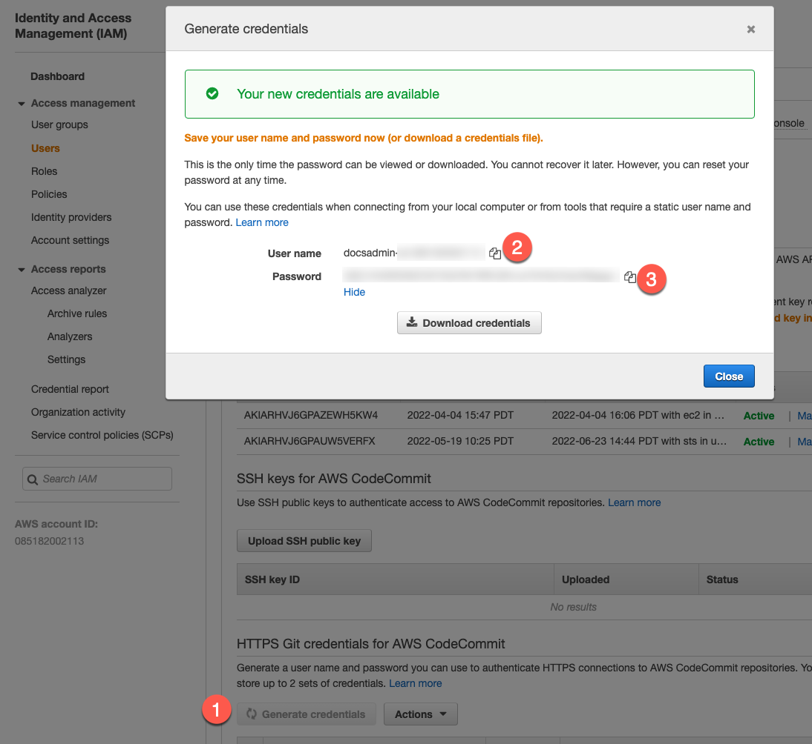

import Tabs from '@theme/Tabs';
import TabItem from '@theme/TabItem';

Harness code repository connectors connect your Harness account with your Git SCM provider. Connectors are used to pull code and other important files, such as Helm charts, Kubernetes manifests, and Terraform scripts, from your Git repos.

You can add code repo connectors at the account, organization, or project [scopes](../../role-based-access-control/rbac-in-harness/#permissions-hierarchy-scopes). This topic assumes you're adding connectors at the project scope, but the connector configuration is the same for any scope.

## Code repo connector permissions and access

Review the following important information about code repo connectors.

### Git provider account permissions

When you create a code repo connector, you provide credentials for authentication and authorization, such as a username and password, token, or another authentication method. The credentials allow the connector to take actions in your Git provider, such as cloning repositories or reading information in pull requests. Therefore, the credentials provided to the connector must have the necessary permissions to perform the actions required by the connector's functionality.

In general, the account/token specified in the connector configuration must have the same permissions that an equivalent user account would need to perform the same actions that the connector will take. **When creating a personal access token, the user account you use to create the token must have the required permissions or higher, such as a repo admin.**

For example, if the connector needs to clone repositories, the credentials provided in the connector must allow reading and cloning repositories. To create a token with sufficient permissions, you must use a user account that has sufficient (or higher) permissions. Similarly, if the connector needs to pull manifests from a repo, then the credentials provided in the connector must have `read repo` (or equivalent) permissions in your Git provider.

Some connectors require that you use an account with higher permissions, such as an admin account. For more details, refer to the configuration details for the specific connector that you're configuring. For permissions in the Harness Git Experience, go to [Source Code Manager Settings](./ref-source-repo-provider/source-code-manager-settings.md).

### Using SSH key authentication

If your code repo connector uses SSH Key authentication, the SSH Key is stored as a [Harness SSH credential secret](/docs/platform/secrets/add-use-ssh-secrets), and the SSH credential's **Username** must be `git`.

### Using connectors with Harness Cloud build infrastructure

If you plan to use a connector with [Harness Cloud build infrastructure](/docs/continuous-integration/use-ci/set-up-build-infrastructure/use-harness-cloud-build-infrastructure), the **Connectivity Mode** must be **Connect through Harness Platform**.

## Connect to AWS CodeCommit

You can use either an AWS CodeCommit connector or the platform-agnostic Git connector to connect to AWS CodeCommit repos.

Regardless of which connector you choose, the IAM account you use to connect to CodeCommit must have the following policies:

* **AWSCodeCommitPowerUser**
* **DescribeRegions**

The [DescribeRegions](https://docs.aws.amazon.com/AWSEC2/latest/APIReference/API_DescribeRegions.html) action is required for all AWS connections, regardless of what AWS resource you use with Harness.

For instructions on setting up the IAM user for CodeCommit connections, go to the following AWS documentation:

* [Setup for HTTPS users using Git credentials from AWS](https://docs.aws.amazon.com/codecommit/latest/userguide/setting-up-gc.html)
* [AWS managed policies for CodeCommit](https://docs.aws.amazon.com/codecommit/latest/userguide/security-iam-awsmanpol.html)

<Tabs>
  <TabItem value="codecommit" label="AWS CodeCommit connector" default>

<!-- I think this needs to be revised because the instructions here don't match the "Settings reference" topic, and I don't see an AWS CodeCommit option under Code Repos in the connector drawer -->

1. In your Harness project, select **Connectors** under **Project Setup**.
2. Select **New Connector** and select **AWS CodeCommit** under **Code Repositories**.
3. Configure the [AWS CodeCommit connector settings](../../connectors/cloud-providers/ref-cloud-providers/aws-connector-settings-reference.md):

   * Enter a **Name**.
   * Select **Repository** to connect to one repo or select **Region** to connect to an entire AWS region. Selecting **Region** lets you use one connector for all repos in that region.
   * If you selected **Repository**, enter the **AWS CodeCommit Repository URL**, such as `https://git-codecommit.us-west-2.amazonaws.com/v1/repos/doc-text`. You can get this URL from your CodeCommit repo by using its **Clone URL** menu and selecting **Clone HTTPS**.
   * If you selected **Region**, provide the name of a repo that Harness can use to test the connection.
   * In **Access Key** and **Secret Key**, enter the IAM user's access key and secret key, respectively. Use [Encrypted text secrets](/docs/platform/secrets/add-use-text-secrets) to store keys.

4. After the connection test runs, select **Finish** to save the connector.

</TabItem>
  <TabItem value="git" label="Platform-agnostic Git connector">

You can connect to CodeCommit [using the Harness platform-agnostic Git connector](#use-the-platform-agnostic-git-connector), instead of the AWS CodeCommit connector.

With the generic Git connector, you must use a username and password for the IAM user, instead of an access key and secret key.

<!-- original text: In the Harness CodeCommit Connector, in **Access Key**, enter the **User name** from the IAM user credentials you generated. In **Secret Key**, use a [Harness Encrypted Text secret](/docs/platform/secrets/add-use-text-secrets) for the **Password** of the IAM user account. -->

1. On the configuration page for the IAM User, select **Security credentials**, and then generate credentials in **HTTPS Git credentials for AWS CodeCommit**.

   

2. In your Harness project, select **Connectors** under **Project Setup**.
3. Select **New Connector** and select **Git** under **Code Repositories**.
4. Configure the [Git connector settings](./ref-source-repo-provider/git-connector-settings-reference.md):

   * Enter a **Name**.
   * Select **Repository** for the **URL Type**.
   * Select **HTTP** for the **Connection Type**.
   * In **Git Repository URL**, enter the AWS CodeCommit repository URL, such as `https://git-codecommit.us-west-2.amazonaws.com/v1/repos/doc-text`. You can get this URL from your CodeCommit repo by using its **Clone URL** menu and selecting **Clone HTTPS**.
   * In **Username** and **Password**, enter the username and password that you generated for the IAM user. Use an [Encrypted text secret](/docs/platform/secrets/add-use-text-secrets) to store the password.

5. After the connection test runs, select **Finish** to save the connector.

</TabItem>
</Tabs>

## Connect to Azure Repos

Azure Repos is a set of version control tools that you can use to manage your code. Azure Repos provide the following kinds of version control:

- Git: Distributed version control
- Team Foundation Version Control (TFVC): Centralized version control

For instructions, go to [Connect to Azure Repos](./connect-to-a-azure-repo.md).

## Connect to Bitbucket

Harness supports both Cloud and Data Center (On-Prem) versions of Bitbucket.

1. In your Harness project, select **Connectors** under **Project Setup**.
2. Select **New Connector**, and select **Bitbucket** under **Code Repositories**.
3. Configure the [Bitbucket connector settings](./ref-source-repo-provider/bitbucket-connector-settings-reference.md).
4. After the connection test runs, select **Finish** to save the connector.

## Connect to GitHub

1. In your Harness project, select **Connectors** under **Project Setup**.
2. Select **New Connector**, and select **GitHub** under **Code Repositories**.
3. Configure the [GitHub connector settings](./ref-source-repo-provider/git-hub-connector-settings-reference.md).
4. After the connection test runs, select **Finish** to save the connector.

## Connect to GitLab

1. In your Harness project, select **Connectors** under **Project Setup**.
2. Select **New Connector**, and select **GitLab** under **Code Repositories**.
3. Configure the [GitLab connector settings](./ref-source-repo-provider/git-lab-connector-settings-reference.md).
4. After the connection test runs, select **Finish** to save the connector.

## Use the platform-agnostic Git connector

If Harness doesn't have a dedicated code repo connector for your Git provider, or your configuration prevents you from using the platform-specific code repo connector, you can use the platform-agnostic Git connector.

1. In your Harness project, select **Connectors** under **Project Setup**.
2. Select **New Connector**, and select **Git** under **Code Repositories**.
3. Configure the [Git connector settings](./ref-source-repo-provider/git-connector-settings-reference.md).
4. After the connection test runs, select **Finish** to save the connector.

## Troubleshooting code repo connectors

You might encounter these issues with code repo connectors. Additional connector-specific issues are described on the dedicated pages for each connector.

### Network connection times out when fetching large repos

:::note

Currently, the fetch optimization feature is behind the feature flag `OPTIMIZED_GIT_FETCH_FILES`. Contact [Harness Support](mailto:support@harness.io) to enable the feature.

:::

Harness performs a `git clone` to fetch files. When fetching very large repositories, the network connection can time out. With fetch optimization enabled, Harness uses provider-specific APIs to improve performance when fetching very large repos.

:::info Optimized fetching for GitHub orgs with SAML

If the `OPTIMIZED_GIT_FETCH_FILES` feature flag is enabled, and your GitHub organization has SAML enabled, the token must be SAML-authorized to access the organization, even if the repository is public. For more information, go to the GitHub documentation on [GitHub authentication with SAML single sign-on](https://docs.github.com/en/enterprise-cloud@latest/authentication/authenticating-with-saml-single-sign-on/about-authentication-with-saml-single-sign-on).

:::

### Pipeline status updates aren't sent to PRs

Harness uses the pipeline's codebase connector to send status updates to PRs in your Git provider. Check the pipeline's [codebase configuration](/docs/continuous-integration/use-ci/codebase-configuration/create-and-configure-a-codebase.md) to confirm that it has a default codebase configuration and that it is using the correct code repo connector.
