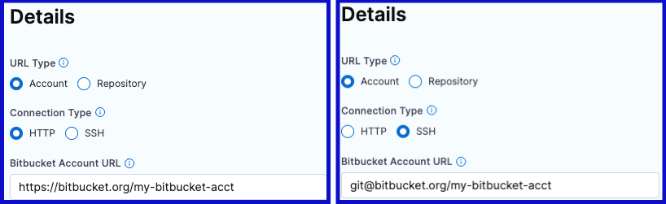
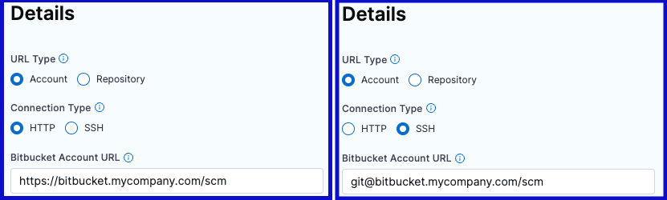
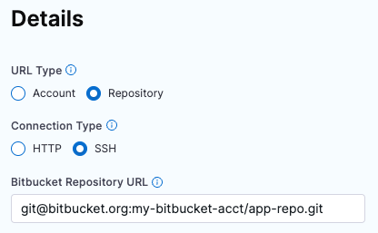
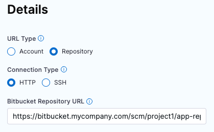
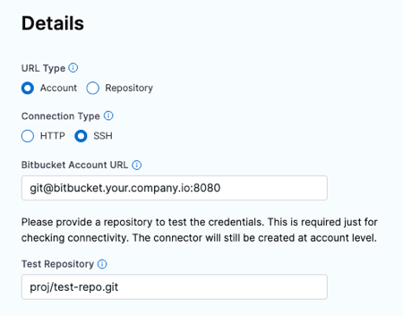
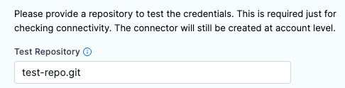
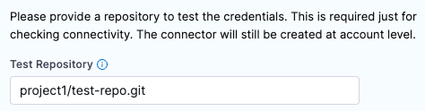

import Tabs from '@theme/Tabs';
import TabItem from '@theme/TabItem';


This topic describes the settings and permissions for the Bitbucket connector. Harness supports both Cloud and Data Center (On-Prem) versions of Bitbucket. The following settings are applicable to both versions.

:::warning Bitbucket Cloud: Workspace-level tokens recommended (Delegate v26.02.88600+)

Starting with **Delegate version 26.02.88600** and **SCM Service version 1.45.1**, Harness has migrated to the new Bitbucket Cloud APIs following Atlassian's [deprecation of cross-workspace APIs](https://community.atlassian.com/forums/Bitbucket-articles/Bitbucket-Cloud-Announcing-End-of-Life-for-Cross-Workspace-APIs/ba-p/3196105). With repository-level access tokens, **Test Connection** and **repository listing** (used during remote entity creation) will fail. Other Git Experience operations such as branch listing continue to work.

Harness recommends switching to **workspace-level access tokens** for full connector functionality. See [Troubleshooting](#troubleshooting) for details.

:::

:::warning App Passwords Deprecated

Bitbucket App Passwords are deprecated and will stop working after June 9, 2026. Migrate to API tokens or access tokens for authentication. For more information, see the [Bitbucket App Password deprecation announcement](https://www.atlassian.com/blog/bitbucket/bitbucket-cloud-enters-phase-2-of-app-password-deprecation).

If you're using App Passwords, see [Migrate from App Passwords to API tokens](#migrate-from-app-passwords-to-api-tokens) for migration instructions.

:::

## Overview settings

* **Name:** The unique name for this connector. Harness generates an **Id** ([Entity Identifier](../../../references/entity-identifier-reference.md)) based on the **Name**. You can edit the **Id** during initial connector creation. Once you save the connector, the **Id** is locked.
* **Description:** Optional text string.
* **Tags:** Optional labels you can use for filtering. For details, go to the [Tags reference](../../../references/tags-reference.md).

## Details settings

The **Details** settings specify which BitBucket account or repository you want this connector to connect to, whether to connect over HTTP or SSH, and the URL to use.

### URL Type

Select **Account** to connect an entire Bitbucket account. This option lets you use one connector to connect to all repositories in the specified Bitbucket account. Make sure you have at least one repo in the account; you need a repo to test the connection and save the connector.

Select **Repository** to connect to a single, specific repo in a Bitbucket account.

### Connection Type

Select the protocol, **HTTP** or **SSH**, to use for cloning and authentication. The **Connection Type** determines the URL format required for the **Bitbucket Account/Repository URL** field. It also determines the **Authentication** method you must use in the [Credentials settings](#credentials-settings).

### Bitbucket Account/Repository URL

Enter the URL for the Bitbucket account or repository that you want to connect to. The required value is determined by the **URL Type**, **Connection Type**, and your Bitbucket account type (Cloud or Data Center).


<Tabs>
  <TabItem value="account" label="URL Type: Account" default>


In the **Bitbucket Account URL** field, provide only the account-identifying portion of the Bitbucket URL, such as `https://bitbucket.org/my-bitbucket/`. Do not include any repo name or project name.

The URL format depends on the **Connection Type** and your Bitbucket account type (Cloud or Data Center). The following table provides format examples for each combination.

| Connection Type | Bitbucket Cloud | Bitbucket Data Center (On-Prem) |
| --------------- | --------------- | ------------------------------- |
| HTTP | `https://bitbucket.org/USERNAME/` or `https://bitbucket.org` | `https://bitbucket.YOUR-ORG-HOSTNAME/scm/` |
| SSH | `git@bitbucket.org:USERNAME/` | `git@bitbucket.YOUR-ORG-HOSTNAME/` |

<figure>



<figcaption>HTTP and SSH examples of Bitbucket Cloud account URLs.</figcaption>
</figure>

<figure>



<figcaption>HTTP and SSH examples of Bitbucket Data Center account URLs.</figcaption>
</figure>


</TabItem>
  <TabItem value="repo" label="URL Type: Repository">


In the **Bitbucket Repository URL** field, provide the complete URL to the Bitbucket repository that you want this connector to point to.

The URL format depends on the **Connection Type** and your Bitbucket account type (Cloud or Data Center). The following table provides format examples for each combination.

| Connection Type | Bitbucket Cloud | Bitbucket Data Center (On-Prem) |
| --------------- | --------------- | ------------------------------- |
| HTTP | `https://bitbucket.org/USERNAME/REPO-NAME.git` | `https://bitbucket.YOUR-ORG-HOSTNAME.com/scm/PROJECT-ID/REPO-NAME.git` |
| SSH | `git@bitbucket.org:USERNAME/REPO-NAME.git` | `git@bitbucket.YOUR-ORG-HOSTNAME/PROJECT-ID/REPO-NAME.git` |

<figure>



<figcaption>SSH example of a Bitbucket Cloud repository URL.</figcaption>
</figure>

<figure>



<figcaption>HTTP example of a Bitbucket Data Center repository URL.</figcaption>
</figure>


</TabItem>
</Tabs>

---

:::info On-Prem Accounts

There are several possible URL formats for Bitbucket Data Center (On-Prem) accounts, such as `bitbucket.myorg.com` or `bitbucket.my.org.com`, as well as variations of repo URLs. Your URL might not match the examples above, and you might need to modify the URL.

For SSH URLs, you may need to use a `DOMAIN-NAME:PORT` format for the authority portion, such as `bitbucket.myorg.com:8080`. This depends on your server and firewall configuration. If the connection test fails, make sure you've used the appropriate URL format.



If your On-Prem repo URL has an extra segment before the project ID or a multi-segment project ID, such as `bitbucket.myorg.com/scm/DESCRIPTOR/PROJECT-ID/REPO-NAME.git`, some API functionality can fail if you use the full URL. To fix this, exclude the extra segment when you enter the URL in the **Bitbucket Repository URL** field.

:::

### Test Repository

This field is only required if the **URL Type** is **Account**. Provide a path to a repo in your Bitbucket account that Harness can use to test the connector. Harness uses this repo path to validate the connection only. When you use this connector in a pipeline, you'll specify a true code repo in your pipeline configuration or at runtime.

For Bitbucket Cloud accounts, the **Test Repository** path format is: `REPO-NAME.git`.



For BitBucket Data Center (On-Prem) accounts, you must include the project ID, such as `PROJECT-ID/REPO-NAME.git`.



## Credentials settings

Provide authentication credentials for the connector.

### Authentication

The **Connection Type** you chose in the [Details settings](#details-settings) determines the **Authentication** method.

<Tabs>
  <TabItem value="http" label="HTTP: Username and Password" default>

The **HTTP** Connection Type requires **Username** and **Password** authentication for all accounts and repos, including read-only repos.

#### Username

In the **Username** field, enter your Bitbucket account username. You can find your username in your Bitbucket **Account settings**. You can use either plaintext or a [Harness encrypted text secret](/docs/platform/secrets/add-use-text-secrets).

:::tip Finding your username

If you're unsure of your Bitbucket username, go to [https://bitbucket.org/account/settings/](https://bitbucket.org/account/settings/) to view your account username. This is different from your email address.

:::

#### Password

In the **Password** field, provide one of the following authentication credentials. All passwords are stored as [Harness encrypted text secrets](/docs/platform/secrets/add-use-text-secrets).

**For Bitbucket Cloud:**

* **API Token** (recommended): Use an [API token](https://support.atlassian.com/bitbucket-cloud/docs/access-tokens/) with your username. API tokens are the recommended authentication method for Bitbucket Cloud. See [Create an API token](#create-an-api-token) for instructions.
* **Access Token**: Use an [access token](https://support.atlassian.com/bitbucket-cloud/docs/access-tokens/) with your username. If you use an access token, the **Username** must be `x-token-auth`.
* **App Password** (deprecated): App Passwords are deprecated and will stop working after June 9, 2026. Migrate to API tokens. See [Migrate from App Passwords to API tokens](#migrate-from-app-passwords-to-api-tokens).

**For Bitbucket Data Center (On-Prem):**

* **HTTP Access Token**: Use an [HTTP access token](https://confluence.atlassian.com/bitbucketserver/http-access-tokens-939515499.html) with your username.

:::warning Account type limitations

The authentication options available depend on your Bitbucket account type:

* **Bitbucket Cloud**: Use API tokens (recommended), access tokens, or App Passwords (deprecated).
* **Bitbucket Data Center (On-Prem)**: Use HTTP access tokens only. API tokens and App Passwords are not supported.

:::

You must provide an account-level or workspace-level token. Repo-level tokens are not supported.

</TabItem>
  <TabItem value="ssh" label="SSH: SSH Key">

The **SSH** Connection Type requires an **SSH Key** in PEM format. OpenSSH keys are not supported. In Harness, SSH Keys are stored as [Harness SSH credential secrets](/docs/platform/secrets/add-use-ssh-secrets). When creating an SSH credential secret for a code repo connector, the SSH credential's **Username** must be `git`. Always save the ssh key as a file secret.

For details on creating SSH keys and adding them to your Bitbucket account, go to the Bitbucket documentation about [Configuring SSH and two-step verification](https://support.atlassian.com/bitbucket-cloud/docs/configure-ssh-and-two-step-verification/).

:::tip

If you use the `keygen` command to generate an SSH key, include arguments such as `rsa` and `-m PEM` to ensure your key is properly formatted and uses the RSA algorithm. For example, this command creates an SSHv2 key:

```
ssh-keygen -t rsa -m PEM
```

Make sure to follow the prompts to finish creating the key. For more information, go to the Linux [ssh-keygen man page](https://linux.die.net/man/1/ssh-keygen).

:::

</TabItem>
</Tabs>


### Enable API access

You must enable API access to use Git-based triggers, manage webhooks, or update Git statuses with this connector. If you are using the Harness Git Experience, this setting is required. API access allows authentication via multiple methods.

<Tabs>
<TabItem value="email-api-token" label="Email and API Token (Bitbucket Cloud only)" default>

This authentication method is available only for Bitbucket Cloud. It requires Harness Delegate version 26.02.88600 or later.

In the **Email** field, enter the email address associated with your Bitbucket account.

In the **API Token** field, provide a Bitbucket account-level API token stored as a [Harness Encrypted Text secret](/docs/platform/secrets/add-use-text-secrets). See [Create an API token](#create-an-api-token) for instructions on creating an API token with the required scopes.


:::warning Delegate version requirement

The Email and API Token authentication method requires Harness Delegate version **26.02.88600** or later. If you're using an older delegate version, use one of the other authentication methods.

:::

:::info Bitbucket Cloud only

Email and API Token authentication is only available for Bitbucket Cloud. For Bitbucket Data Center (On-Prem), use the **Access Token** method.

:::

</TabItem>

<TabItem value="username-app-password" label="Username and App Password (Deprecated)">

:::warning Deprecated

App Passwords are deprecated and will stop working after June 9, 2026. Migrate to **Email and API Token** or **Access Token** authentication methods. [Learn More](https://www.atlassian.com/blog/bitbucket/bitbucket-cloud-enters-phase-2-of-app-password-deprecation)

:::

In the **Username** field, enter the Bitbucket account username as specified in your Bitbucket **Account settings**. Note that this might be different from what you entered in the first **Username** field. You can use either plaintext or a [Harness encrypted text secret](/docs/platform/secrets/add-use-text-secrets).

In the **Personal Access Token** field, provide a Bitbucket account-level [App password](https://support.atlassian.com/bitbucket-cloud/docs/create-an-app-password/). Passwords are stored as [Harness Encrypted Text secrets](/docs/platform/secrets/add-use-text-secrets).

You must provide an account-level app password or token. Repo-level tokens are not supported.


:::warning

For **HTTP** Connection Types, use the same password you used earlier, and make sure the **Username** fields are both plain-text or both encrypted. Don't use a plain-text username for one field and a secret for the other.

For On-Prem repos, if the repo URL has an extra segment before the project ID, such as `bitbucket.myorg.com/scm/DESCRIPTOR/PROJECT-ID/REPO-NAME.git`, some API functionality can fail if you use the full URL. To fix this, remove the extra segment from the [Bitbucket Repository URL](#bitbucket-accountrepository-url).

:::

</TabItem>

<TabItem value="access-token" label="Access Token">

Access tokens can be scoped to a Bitbucket repository, project, or workspace. For Bitbucket Cloud connectors, Harness recommends using a **workspace-level** access token. With Delegate version 26.02.88600 and later, repository-level tokens cannot list workspaces, which causes **Test Connection** and **repository listing** to fail.

When you select the access token method, provide the reference to a secret containing your Bitbucket access token (stored as a [Harness Encrypted Text secret](/docs/platform/secrets/add-use-text-secrets)) in the **Access Token** field.

For information about the features and limitations of Bitbucket access tokens, see the [Bitbucket documentation](https://support.atlassian.com/bitbucket-cloud/docs/access-tokens/).

:::warning

With **Delegate version 26.02.88600** and later, repository-level access tokens can no longer list workspaces due to Atlassian's [deprecation of cross-workspace APIs](https://community.atlassian.com/forums/Bitbucket-articles/Bitbucket-Cloud-Announcing-End-of-Life-for-Cross-Workspace-APIs/ba-p/3196105). If you are using a repository-level access token, Harness recommends switching to a workspace-level access token for full connector functionality.

:::

</TabItem>
</Tabs>
## Create an API token

To use API token authentication, you must create an API token in Bitbucket with the required scopes.

### Steps to create an API token

1. Go to Bitbucket [API Tokens Page](https://id.atlassian.com/manage-profile/security/api-tokens)
2. Click **Create API token with scopes**.
3. Enter a label for your token (for example, "Harness Connector").
4. Set an expiry date (maximum is one year).
5. Select **Bitbucket** as the workspace.
6. Select the following required scopes:
   * `read:issue:bitbucket`
   * `read:me`
   * `read:project:bitbucket`
   * `read:pullrequest:bitbucket`
   * `read:repository:bitbucket`
   * `read:user:bitbucket`
   * `read:webhook:bitbucket`
   * `read:workspace:bitbucket`
   * `write:webhook:bitbucket`
   * `write:issue:bitbucket`
   * `write:repository:bitbucket`
   * `write:pullrequest:bitbucket`
   * `delete:issue:bitbucket`
   * `delete:webhook:bitbucket`
7. Click **Create**.
8. Copy the API token immediately. You won't be able to view it again.


Store the API token as a [Harness Encrypted Text secret](/docs/platform/secrets/add-use-text-secrets) and reference it in your connector configuration.

:::info Two-factor authentication required

Bitbucket requires two-factor authentication (2FA) to be enabled on your account before you can create API tokens.

:::

## Migrate from App Passwords to API tokens

If you're currently using App Passwords, migrate to API tokens before June 9, 2026, when App Passwords will stop working.

### Migration steps

1. **Create an API token** in Bitbucket with the required scopes. See [Create an API token](#create-an-api-token) for instructions.

2. **Update your connector**:
   * Open your Bitbucket connector in Harness.
   * In the **Password** field (under Credentials settings), edit the secret.
   * Replace the App Password with your new API token.
   * Save the connector.

3. **If you enabled API access**:
   * If you're using **Username and App Password** for API access, switch to **Email and API Token** (Bitbucket Cloud only) or **Access Token**.
   * Update the credentials accordingly.

4. **Test the connection** to verify the migration was successful.

:::tip

You can use the same API token for both basic authentication (Username/Password) and API access (Email and API Token), but make sure the token has all the required scopes listed in [Create an API token](#create-an-api-token).

:::

## Connectivity Mode settings

Select whether you want Harness to connect directly to your Bitbucket account or repo, or if you want Harness to communicate with your Bitbucket account or repo through a delegate. If you plan to use this connector with [Harness Cloud build infrastructure](/docs/continuous-integration/use-ci/set-up-build-infrastructure/use-harness-cloud-build-infrastructure), you must select **Connect through Harness Platform**.

:::tip

For private network connectivity options with Harness Cloud, see [Private network connectivity options](/docs/platform/references/private-network-connectivity).

:::

### Delegates Setup

If you select **Connect through a Harness Delegate**, you can select **Use any available Delegate** or **Only use Delegates with all of the following tags**.

If you want to use specific delegates, you must identify those delegates. For more information, go to [Use delegate selectors](../../../delegates/manage-delegates/select-delegates-with-selectors.md).

### Kubernetes delegate with self-signed certificates

If your codebase connector allows API access and connects through a Harness Delegate that uses self-signed certificates, you must specify `ADDITIONAL_CERTS_PATH` in the delegate pod, as described in [Configure a Kubernetes build farm to use self-signed certificates](/docs/continuous-integration/use-ci/set-up-build-infrastructure/k8s-build-infrastructure/configure-a-kubernetes-build-farm-to-use-self-signed-certificates#enable-self-signed-certificates).

## Troubleshooting

Here are some troubleshooting suggestions for BitBucket Connectors.

### Connection test failing

If the connection test returns a `not authorized` error, check the following:

* **Username**: Make sure you used the **Username** specified in the Bitbucket **Account settings**, not your email address. You can find your username at [https://bitbucket.org/account/settings/](https://bitbucket.org/account/settings/).

* **Token permissions**: The connection test may fail if the token doesn't have sufficient privileges. Make sure your API token or access token has all the required scopes. See [Create an API token](#create-an-api-token) for the list of required scopes.

* **App Password deprecation**: If you're using an App Password and the connection test fails, the App Password may have expired or been revoked. Migrate to an API token. See [Migrate from App Passwords to API tokens](#migrate-from-app-passwords-to-api-tokens).

### Test Connection or repository listing fails after delegate upgrade to 26.02.88600

After upgrading to **Delegate version 26.02.88600** or later, the following operations may fail if you are using a repository-level access token for Bitbucket Cloud:

* **Test Connection** fails because the test attempts to fetch repositories across the workspace.
* **Repository listing** (for example, when creating remote entities in Git Experience) returns errors because workspace-level access is required to discover repositories.

Both failures share the same root cause: Atlassian has [deprecated cross-workspace APIs](https://community.atlassian.com/forums/Bitbucket-articles/Bitbucket-Cloud-Announcing-End-of-Life-for-Cross-Workspace-APIs/ba-p/3196105) in Bitbucket Cloud, and repository-level tokens no longer have permission to list workspaces or repositories across the workspace.

Other Git Experience operations — such as branch listing, file sync, and webhook operations — continue to work with repository-level tokens.

To resolve this:

* Switch to a **workspace-level access token**. See the [Bitbucket access tokens documentation](https://support.atlassian.com/bitbucket-cloud/docs/access-tokens/) for instructions on creating one, or switch to an [API token](#create-an-api-token) for workspace-level access.
* If you are already using an **API token** (under Email and API Token authentication), ensure the token has the `read:workspace:bitbucket` scope.
* Update the connector credentials in Harness and run **Test Connection** to verify.

### Status doesn't update in BitBucket Cloud PRs

There are two potential causes for this:

* Harness uses the pipeline's codebase connector to send status updates to BitBucket. Check the pipeline's [codebase configuration](/docs/continuous-integration/use-ci/codebase-configuration/create-and-configure-a-codebase.md) to confirm that it is using your BitBucket code repo connector.
* BitBucket Cloud limits the key size for sending status updates to PRs, and this can cause incorrect status updates in PRs due to some statuses failing to send. An enhancement was [released in April 2024](/release-notes/continuous-integration) for this behavior. However, if you modified your BitBucket Cloud settings based on the original handling, you might need to edit the settings again to account for the enhancement. <!-- Prior to GA you could enable a feature flag, `CI_BITBUCKET_STATUS_KEY_HASH`, for the handling. -->

### Some API functions fail for On-Prem repos

If your On-Prem repo URL has an extra segment before the project ID or a multi-segment project ID, such as `bitbucket.myorg.com/scm/DESCRIPTOR/PROJECT-ID/REPO-NAME.git`, some API functionality can fail if you use the full URL. To fix this, remove the extra segment from the [Bitbucket Repository URL](#bitbucket-accountrepository-url).
