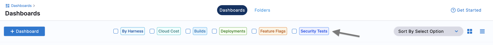
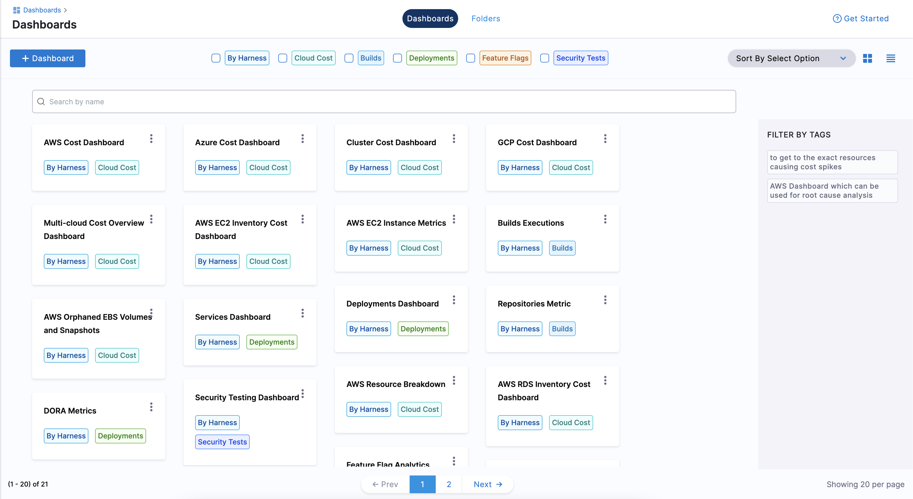
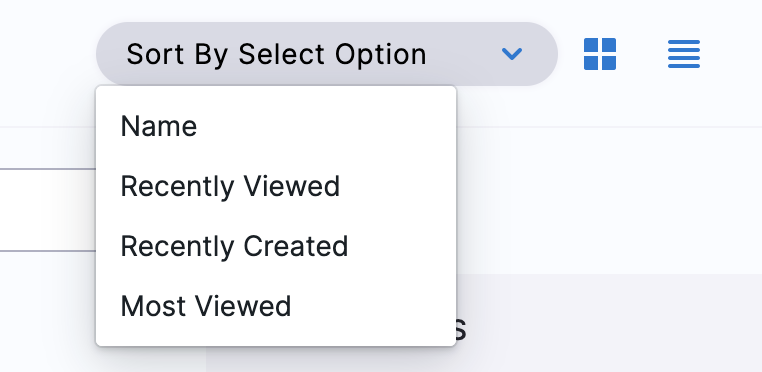

Harness Dashboards display key metrics and data related to your builds, deployments, security, and cloud costs. Dashboards let you track the health and performance of your deployments, monitor key metrics and KPIs, and quickly identify potential issues. You can customize the dashboards to show specific metrics and data relevant to your needs, and access them from a central location. The Harness Dashboards provide actionable insights into continuous delivery processes, so you can achieve faster and more efficient deployments.

Harness provides the following out-of-the-box dashboards across its products:

- Cloud Cost
- Builds 
- Deployments
- Feature Flags
- Security Tests

## Important

- You can create custom dashboards at the [account scope](/docs/platform/role-based-access-control/rbac-in-harness#permissions-hierarchy-scopes) only.
- Make sure you have the `Manage` permissions for **Dashboards** to create, edit, and delete custom dashboards.
- Make sure you have the `View` permissions for **Dashboards** to view the custom dashboards.

## Navigate to Dashboards

To view and access dashboards, select **DASHBOARDS** from the left navigation in your Harness account.
You can filter the data on the dashboards by selecting specific module(s).

After you have one or more custom dashboards available to you, the **Dashboards** page lists them.

To sort these dashboards select one of the following: 
 - Name
 - Recently Viewed
 - Recently Created
 - Most Viewed

You can either view the dashboards as a grid or a list.

## Clone dashboard

You can clone a dashboard by following these steps:

- Go to the dashboard you want to clone.
- Click on the three dots (...) in the top-right corner of the dashboard.
- Select "Clone Dashboard".
- Give the cloned dashboard a new name.
  Optionally, choose a different folder for the cloned dashboard.
- Click on "Clone" to create the cloned dashboard.
 
:::note
The cloned dashboard contains all the same widgets and configurations as the original dashboard.

:::

## Next steps
- [Create Dashboards](./create-dashboards.md)
- [Create Visualizations and Graphs](./create-visualizations-and-graphs.md)
- [Add Custom Fields to Custom Dashboards](./add-custom-fields.md)
