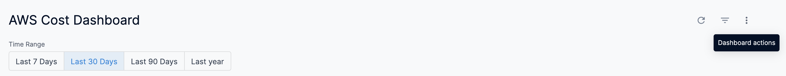

This topic describes how to use different dashboard actions. The document uses [AWS Cost Dashboard](../../cloud-cost-management/3-use-ccm-cost-reporting/6-use-ccm-dashboards/aws-dashboard.md) as an example. You can use **Dashboard actions** in the same way for other **By Harness Dashboards** too. For example, [GCP Cost Dashboard](../../cloud-cost-management/3-use-ccm-cost-reporting/6-use-ccm-dashboards/gcp-dashboard.md), [Azure Cost Dashboard](../../cloud-cost-management/3-use-ccm-cost-reporting/6-use-ccm-dashboards/azure-cost-dashboard.md), [Cluster Cost Dashboard](../../cloud-cost-management/3-use-ccm-cost-reporting/6-use-ccm-dashboards/cluster-cost-dashboard.md), and so on.

### Step: Use Dashboard Actions

Perform the following steps to use Dashboard actions:

1. In Harness, click **Dashboards**.
2. In **All Dashboards**, select **By Harness** and click **AWS Cost Dashboard**.
3. In AWS Cost Dashboard, click **Dashboard actions** (3-dot menu to the right of the filter button).

### Dashboard Action options

<table>
	<tr>
		<th>Option</th>
		<th>Description</th>
	</tr>
	<tr>
		<td valign="top">Download</td>
		<td>Downloads the dashboard in PDF or CSV format. See <a href="/docs/platform/Dashboards/download-dashboard-data">Download Dashboard Data</a>.</td>
	</tr>
	<tr>
		<td valign="top">Reset filters</td>
		<td>Resets the filter to its default value. By default, AWS Cost Dashboard displays the last 30 days' data.</td>
	</tr>
	<tr>
		<td valign="top">Each tile's time zone</td>
		<td>
		
Updates the time zone of the dashboard. The time zone applied to your dashboard can affect the results shown, because of slight differences in the exact hours used for time-based data. If you are interested in the data as it applies to a different region, change the time zone of your dashboard to reflect that region.

		
You can choose one of the following options:

		<ul>
			<li>Choose <b>Each tile’s time zone</b> to run all tiles in the time zone in which they were saved.</li>
			<li>Choose <b>Viewer time zone</b> to run all tiles in the time zone selected in your account settings.</li>
			<li>Choose any of the time zones listed in the drop-down to run all tiles in that time zone.</li>
		</ul>
		    After you select your time zone, click <b>Update</b> in the dashboard time zone window; the dashboard will update for the new time zone.Once you navigate away from the dashboard, the dashboard will return to its default time zone setting.
		</td>
	</tr>
</table>