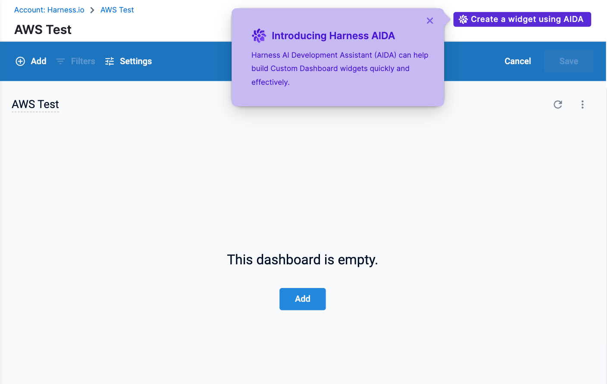

Dashboard Intelligence by Harness AI is your copilot for dashboard creation in Harness. This feature is available directly in the **Dashboard Editor** when you create or edit a dashboard. For more information on AI, go to [Overview of AI](/docs/platform/harness-aida/aida-overview).

:::important
   You must [enable module-specific AI features](/docs/platform/harness-aida/aida-overview/#enable-aida) in your Harness account to use this feature.
:::

This topic provides details on the current features, limitations, and best practices for dashboard engineering.

:::info note
Although the documentation is written in English and assumes an English-speaking user, Dashboard Intelligence by AI's natural language widget generation is not limited to English.

:::

### Before you begin

- [Dashboards overview](/docs/platform/dashboards/dashboards-overview)
- [Create Dashboards](/docs/platform/dashboards/create-dashboards)
- [Create visualizations and graphs](/docs/platform/dashboards/create-visualizations-and-graphs/)
- [Overview of Harness AI](/docs/platform/harness-aida/aida-overview)

### Supported query types

Dashboard Intelligence by AI currently supports three levels of Business Intelligence abstractions: quick queries, constrained queries, and custom queries.

#### Quick queries

Quick queries provide quick answers to high-level data questions. These queries include rollups and non-filtered interests, for example:
   - What are my total AWS costs?
   - What is my deployment failure rate?
   - What count of my feature flags are active?

#### Constrained queries

Constrained queries add filter constraints for deliberate answers. Constrained queries typically involve a time filter, for example:
   - What are my total AWS costs? Filter for the last 45 days.
   - What is my daily deployment success rate? Filter for the last 60 days.
   - What is my monthly build count? Filter for the last 90 days.

#### Custom queries

Custom queries involve custom fields. Currently, Dashboard Intelligence by AI only supports table calculations, for example: 
   - What are my AWS total costs? Pivot by region. Filter for the last 30 days. Include a table calculation returning yes if region is "us-west1", else no. Make this a table.

### Supported visualization types

Dashboard Intelligence by AI infers the most relevant data visualization for the natural language query by default. If you want to bypass the inference and enforce an explicit visualization type, explicitly state the desired visualization type in your query. For example, “What is my monthly deployment count? Filter for the past 12 months. Make this a line chart.”

Dashboard Intelligence by AI currently supports the following visualization types:

- Bar
- Column
- Line
- Pie
- Scatterplot
- Single Value
- Table

:::info note
Dashboard Intelligence by AI does not currently support customizing visualization optics within the natural language query itself. This constraint includes titles, color preferences, and so on.

:::

## Create a widget using AI

You first create your dashboard, and then you ask AIDA to set up your widget.

To create a widget using AIDA, do the following:

:::info note
Dashboards are created inside a folder. If you don't specify a folder, the dashboard saves in the Custom Dashboards root folder.

:::

1. In Harness, select **Dashboards**.
2. In **Dashboards**, select **+ Dashboard**.
3. In the **Create a Dashboard**, under Folder, select **Shared Folder**.
4. In the **Name** field, enter a name for your dashboard.
5. (Optional) In the **Tags** field, type a tag name, press Enter to create the tag, then click Continue.
6. Click **Edit Dashboard** to proceed.
   
   

7. Select **Create a widget using AI**. The Harness AIDA dialog opens.

   

8. Select the explore within the module for which you want to generate a visualization. In this example, under **Continuous Integration**, select **Builds and Repositories**.

9. Enter your query. For example, you could enter "Total builds over time for the last 30 days."

   

   Harness AI generates the tile.

   

10. To add additional tiles, select your module and enter another query. In this example, we've selected **AWS** and entered "Total cost by Region."

    

11. Continue selecting explores under modules and entering queries to add additional tiles.

## Best practices and guidelines for Dashboard Intelligence by AI

- When constructing a query, it's important to avoid unnecessary information. The more concise and direct the query is, the better it will be. Avoid using irrelevant details, and focus on the essential information that is required.

   **Recommended**

   "Project id, git repository, git event type, error message and failure rate. Filter for the last 72 days. Filter repository failure rate > 0. Make this a table."

   **Not recommended**

   "Construct a detailed table for me that presents project id, git repository, git event type, error message and failure rate. This should be filtered for the last 72 days, and I would like to have the failure rate greater than 0."

- Break your query into smaller, bite-sized sentences. Explicitly tell the agent your intentions (for example, filtering, pivots, table calculations, and so on) instead of chaining instructions into a single sentence.

   **Recommended**

   "Show me total costs. Pivot by region. Filter for the last 30 days. Include a table calculation returning yes if region is "us-west1" else no."

   **Not recommended**

   "Show me total costs by region within the last 30 days with a table calculation returning yes if region is "us-west1" else no."

- If you have trouble with a particular data point, pass both the table name and the field name in the prompt. For example, if you want to view your feature flags by segment environment, you could enter the following prompt: 
What are my total feature flags? Pivot by segments environment.

   

## Dashboard Intelligence by AI tips

- When you ask AI to plot something "by" another dimension, it enforces a pivot in the visualization. For example, you can say: "Show me total deployments by project."

- For table calculations or string filters, wrap the expression in double quotes, for example: Include a table calculation returning yes if region is "us-west1" else no.

- For number filters, use operators instead of words (for example, use ">" instead of "greater than").

- You can change the order of each statement. For example, switching the table calculation instruction with filter instruction helps with generation:

   - Example before: Show me total costs. Pivot by region. Include a table calculation returning yes if region is "us-west1" else no. Filter for the last 30 days.

   - Example after: Show me total costs. Pivot by region. Filter for the last 30 days. Include a table calculation returning yes if region is "us-west1" else no.
