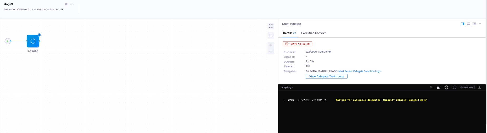

:::warning Closed Beta

The new Harness Delegate is currently in closed beta and available only to select customers. The product team determines access based on current [supported use cases and steps](/docs/platform/delegates-v2/install-delegate-2-0#whats-supported).

:::

Capacity-based stage queuing lets you limit the number of concurrent Local (Docker) Infra stages a new delegate instance can run at once. When every eligible delegate is at capacity, new stage requests are queued server-side and dispatched automatically as capacity frees up. This prevents resource exhaustion on the delegate host and ensures predictable pipeline performance.

:::info Scope

Capacity-based stage queuing applies only to **Local (Docker) Infra** stages running on the new Harness Delegate. Everything on this page assumes that context unless stated otherwise.

:::

## Configure MAX_STAGES

To limit concurrent stage executions, set the `MAX_STAGES` environment variable in your delegate's `config.env` file. The value must be a positive integer.

```
ACCOUNT_ID="<ACCOUNT_ID>"
TOKEN="<DELEGATE_TOKEN>"
TAGS="macos-arm64,local"
URL="https://app.harness.io"
NAME="DelegateTest"
MAX_STAGES=1
```

This configuration allows the delegate to execute only one Local (Docker) Infra stage at a time. Any additional stage requests are queued until the running stage completes.

If `MAX_STAGES` is not set, the number of concurrent stage executions is unbounded.

For full installation and configuration details, go to [Install Harness Delegate](/docs/platform/delegates-v2/install-delegate-2-0#set-max-stage-capacity).

### Queued stage visibility

When no eligible delegate has free capacity, the stage's **Initialize** step displays a log message indicating the stage is queued.



:::warning Known limitation

A queued stage currently appears as **Running** in the pipeline execution view even though it is waiting for delegate capacity at the Initialize task level. A distinct **Queued** status will be available in a future release.

:::

## Use cases

Local (Docker) Infra stages run directly on the delegate's host machine. Steps inside these stages can be container-based or containerless. Capacity limits are especially useful in two scenarios.

### Prevent resource exhaustion

Without capacity limits, a delegate accepts any number of concurrent stages. If many stages land on the same delegate simultaneously, the host machine can run out of CPU, memory, or disk I/O, causing slowness and instability across all running pipelines. Setting `MAX_STAGES` to an appropriate value keeps resource consumption predictable.

### Avoid tool concurrency conflicts

Some build tools rely on global system-level configurations or file locks that prevent parallel use. For example, Bazel supports only a single build per workspace by default. Running two stages that both invoke Bazel in the same workspace causes one of them to fail.

Setting `MAX_STAGES=1` serializes stage execution on that delegate, eliminating conflicts between concurrent stages.

:::info

All Harness-native steps run in isolated working directories and do not interfere with one another when executing concurrently. Concurrency conflicts arise only when custom or third-party tools used in a **Run** step share global state or workspace locks.

:::

## How stages are distributed

When a stage execution starts, Harness assigns it to an eligible delegate based on available capacity. All Initialize tasks are submitted with **NORMAL** priority by default.

### Free capacity calculation

Free capacity for a delegate is calculated as:

```
Free Capacity = MAX_STAGES − (number of stages currently executing)
```

### Assignment rules

- **Capacity available (Free Capacity > 0):** The stage is assigned to the eligible delegate with the highest free capacity. This distributes work evenly across delegates.
- **No capacity available (Free Capacity = 0):** The stage is queued and assigned to the first eligible delegate that finishes an in-progress stage.

### Queue ordering

When multiple stages are queued, they are assigned to delegates in the following order:

1. **Priority:** A task with **HIGH** priority is assigned before a task with **NORMAL** priority.
2. **Age:** Among tasks of equal priority, older tasks are assigned first (FIFO).

## Next steps

- **[Install Harness Delegate](/docs/platform/delegates-v2/install-delegate-2-0):** Set up the new Harness Delegate and configure `MAX_STAGES`.
- **[Delegate overview](/docs/platform/delegates-v2/delegate-overview):** Learn about the transactional execution model and architecture.
- **[Feature parity](/docs/platform/delegates-v2/feature-parity):** Compare supported features between the new and legacy delegates.
