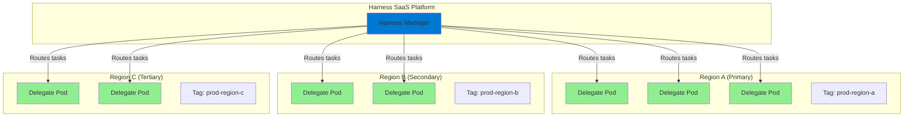
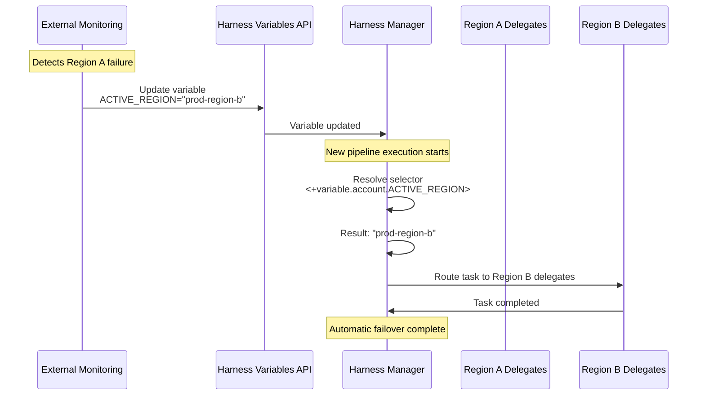
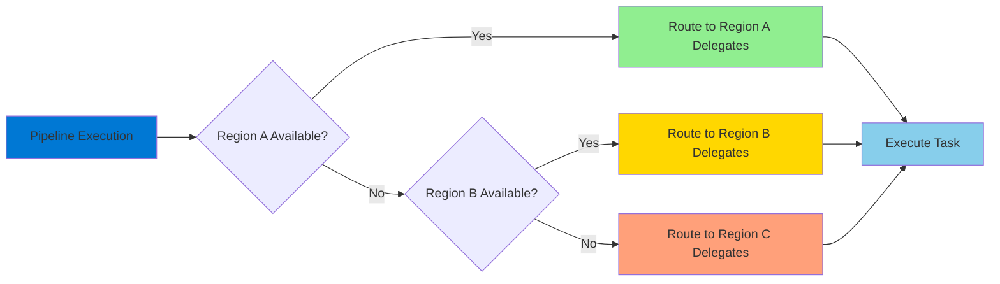
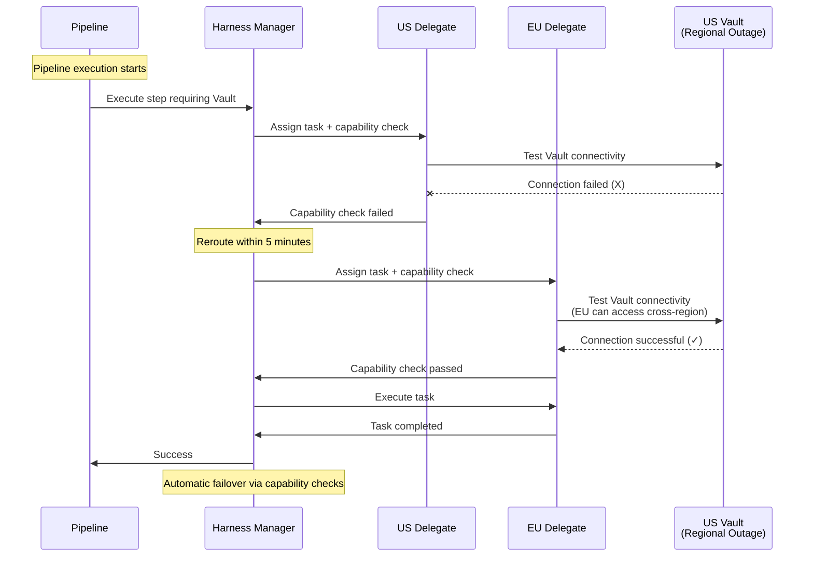

Harness Delegates can be deployed across multiple regions to ensure high availability and resilience during regional outages. This guide covers disaster recovery (DR) strategies for multi-region delegate deployments, including failover approaches, auto-scaling, and monitoring capabilities.

---

## Multi-region architecture overview

A typical multi-region delegate architecture involves deploying delegates across geographically distributed regions such as North America, EMEA, and Asia-Pacific. The primary goal is to ensure that pipeline execution continues even when one or more regions become unavailable.



Harness automatically handles delegate disconnections and routes tasks to available delegates based on their capabilities and selectors. When a delegate becomes unavailable, the platform marks it as disconnected within 5 minutes and stops routing tasks to it.

---

## Failover approaches

There are two primary approaches to implementing regional failover for Harness Delegates:

### Dynamic tag-based delegate provisioning

This approach uses infrastructure automation to provision delegates dynamically in secondary regions when the primary region fails. Delegates in the DR region are installed with the same tags as the primary region, allowing Harness to transparently route work to the new location.

**How it works:**

The primary region runs delegates under normal conditions. When a DR event is detected, automation scripts provision new delegate instances in the secondary region using Harness APIs or Kubernetes scaling mechanisms. The key principle is that new delegates in the DR location are tagged with the original tag of their main location (e.g., `prod-region-a`), ensuring pipelines continue to work without configuration changes.

As delegates are provisioned in the DR region, the Kubernetes cluster automatically scales to accommodate the increased load, and Harness diverts new pipeline runs to the delegates in the DR location.

**Implementation considerations:**

- Requires external monitoring to detect regional failures
- Automation can use Harness delegate installation APIs or Kubernetes operators
- Secondary region delegates must have access to the same internal resources (Vault, artifact registries, deployment targets) as the primary region
- DNS or load balancer configuration may need updates to route traffic appropriately
- Delegates must be tagged with the original primary region's tag to ensure transparent failover

**Failback process:**

When the main region comes back online, Harness automatically detects available delegates and distributes new pipeline runs across both the main and DR locations. To complete failback:

1. Uninstall all delegates from the DR location that have tags belonging to the main location
2. The Kubernetes cluster in the DR region automatically scales back to its original size
3. All new pipeline runs route to the restored main region

**Benefits:**

- Cost-efficient since secondary region resources are only provisioned during DR events
- No ongoing resource consumption in standby regions
- Clear separation between active and standby infrastructure

**Limitations:**

- Failover time includes the duration to provision and initialize new delegates
- Requires external automation and monitoring systems
- More complex to test and validate

### Variable-based configuration switching

This approach uses delegate selectors and dynamic expressions to control which regional delegates receive tasks. All delegates run continuously across all regions, and task routing is controlled through Harness variables.

**How it works:**

Delegates are deployed in all regions with region-specific selectors (e.g., `prod-region-a`, `prod-region-b`, `prod-region-c`). Pipeline configurations use dynamic selector expressions that reference Harness variables to determine the target region. When a DR event occurs, you update the variable value through the Harness API to switch task routing to a different region.

**Implementation considerations:**

- Use dynamic selectors in pipeline configurations: `<+variable.account.ACTIVE_REGION>`
- Create account-level or project-level variables that specify the active region's delegate selector
- Update variable values through the [Harness Variables API](https://apidocs.harness.io/tag/Variables) when failover is needed
- All regional delegates must have equivalent capabilities and access to required resources

**Example configuration:**

```yaml
# Delegate tags in each region
Region A (Primary):   prod-region-a
Region B (Secondary): prod-region-b
Region C (Tertiary):  prod-region-c

# Pipeline delegate selector (uses variable)
delegateSelectors:
  - <+variable.account.ACTIVE_REGION>

# Account-level variable values
ACTIVE_REGION: prod-region-a    # Normal operation
ACTIVE_REGION: prod-region-b    # During DR (failover to Region B)
```

**Variable-based failover flow:**



**Failover process:**

When a specific region fails, update the associated Harness account-level variable to point to the DR region's tag. For example, if Region A fails, update `ACTIVE_REGION` from `prod-region-a` to `prod-region-b`.

**Important**: For any failed pipelines, use the **Re-Run** action (not the **Retry** action) to ensure the updated variable value is used rather than the cached value from the failed execution.

**Failback process:**

When the main region comes back online, revert the account-level variable to its original value. New pipeline executions will automatically use the restored primary region.

**Benefits:**

- Fast failover by simply updating a variable value
- All delegates are always running and validated
- No provisioning delay during DR events
- Easier to test since infrastructure is always active

**Limitations:**

- Higher ongoing cost since all regional delegates run continuously
- May require capacity planning for all regions simultaneously
- Delegates in standby regions consume resources even when not actively processing tasks

**Cost optimization strategies:**

While the variable-based approach requires delegates running in all regions, you can optimize costs by:

- **Reduced capacity in standby regions**: Run secondary region delegates at minimal capacity (e.g., 2 replicas) and rely on Kubernetes HPA to scale up when they start receiving traffic during a failover event. This reduces idle resource consumption while maintaining the ability to scale quickly when needed.

- **Simplified topology in failover regions**: The delegate topology doesn't need to be identical across all regions. Consider deploying account-level delegates with a union of all tags in failover regions instead of replicating the exact organizational structure from the primary region. This reduces infrastructure complexity and ongoing maintenance overhead while still providing complete coverage during DR scenarios.

---

## Recommended approach

**For production environments with strict RTO requirements**: The variable-based configuration switching approach is recommended because it provides the fastest failover time and eliminates provisioning delays. The trade-off is higher infrastructure cost, but this is justified by the reliability and predictability of the DR process.

**For cost-sensitive environments with flexible RTO requirements**: The dynamic tag-based provisioning approach can be used if your organization can tolerate the additional time required to provision and initialize delegates during a DR event.

In both cases, ensure that:

- Regional delegates have network access to all required internal resources
- Capability checks are configured for steps that depend on region-specific resources
- Monitoring is in place to detect delegate availability issues
- DR procedures are documented and regularly tested

---

## Regional priority and cascading failover

For organizations with three or more regions, implement a priority-based failover strategy. For example:

1. **Primary region (Region A)**: All tasks route here under normal conditions
2. **Secondary region (Region B)**: Tasks route here if Region A is unavailable
3. **Tertiary region (Region C)**: Tasks route here if both Region A and B are unavailable



This can be implemented using conditional expressions in delegate selectors:

```yaml
delegateSelectors:
  - <+<+variable.region_a_available> == "true" ? "prod-region-a" : <+variable.region_b_available> == "true" ? "prod-region-b" : "prod-region-c">
```

Or by using automation scripts that update the active region variable based on availability checks.

---

## Capability checks and internal resource access

Harness automatically validates that delegates can access required resources through capability checks. When a step requires access to a specific connector (such as Vault, AWS, or Kubernetes), Harness validates that the delegate has network access and proper credentials.



Capability check results are cached for 5 minutes (capability whitelisting period). If a delegate loses access to a required resource, Harness will detect this within 5 minutes and stop routing tasks to that delegate.

For DR scenarios, this means:

- If a delegate can connect to Harness but cannot access internal resources due to a regional outage, capability checks will fail and tasks will route to delegates in other regions
- You don't need to implement separate health checks for internal resource access—Harness handles this automatically
- Ensure that delegates in all DR regions have equivalent access to required internal resources

---

## Monitoring and alerting

Implement monitoring to detect delegate availability issues and trigger DR procedures:

### Delegate health monitoring

- **Delegate connectivity**: Monitor whether delegates are connected to the Harness platform. Delegates that disconnect for more than 5 minutes trigger automatic task rerouting.
- **Capacity utilization**: Monitor delegate resource usage and task execution capacity to detect when delegates are under heavy load.
- **Task execution metrics**: Track task success rates, execution duration, and failure rates to identify regional performance issues.

Go to [Delegate metrics and monitoring](/docs/platform/delegates/manage-delegates/delegate-metrics/) to learn about available delegate metrics and monitoring capabilities.

### Platform-based monitoring

Harness provides built-in delegate metrics that can be used for monitoring:

- Delegate connection status
- Number of tasks executed per delegate
- Task failure rates
- Queue depth for pending stages

These metrics can be integrated with external monitoring systems like Datadog, Prometheus, or Grafana.

### Monitored Service for delegates

Consider setting up a Harness [Monitored Service](/docs/platform/monitored-service) for your delegate infrastructure. This provides:

- Health score calculation based on delegate metrics
- Anomaly detection for delegate behavior
- Integration with incident management workflows
- SLO tracking for delegate availability

---

## DR testing and validation

Regular testing of DR procedures is critical to ensure they work as expected during an actual outage:

- **Scheduled DR drills**: Periodically simulate regional failures by scaling down delegates or blocking network access
- **Variable-based failover testing**: Practice updating the active region variable and verify that tasks route to the correct region
- **Capability validation**: Ensure that delegates in all regions can access required internal resources
- **Documentation**: Maintain runbooks for DR procedures, including variable names, API endpoints, and escalation procedures
- **RTO/RPO measurement**: Track how long failover takes and whether it meets your recovery objectives

---

## Network and security considerations

When deploying delegates across multiple regions:

- **Network connectivity**: Ensure delegates in all regions have outbound connectivity to Harness Manager (`app.harness.io` or your dedicated cluster URL)
- **Secret manager access**: Verify that all regional delegates can access your secret manager (Vault, AWS Secrets Manager, etc.)
- **Connector validation**: Test that connectors work from all regional delegates, not just the primary region
- **Firewall rules**: Configure firewall rules to allow delegate traffic to Harness and to internal resources
- **Proxy configuration**: If using proxies, ensure they are configured consistently across all regions. Go to [Configure delegate proxy settings](/docs/platform/delegates/manage-delegates/configure-delegate-proxy-settings) to configure proxy settings for all regional delegates.

---

## Summary

A resilient multi-region delegate architecture requires careful planning of failover mechanisms, auto-scaling policies, and monitoring strategies. The recommended approach for most production environments is variable-based configuration switching combined with KEDA or HPA-based auto-scaling. This provides fast failover times, automated capacity management, and predictable behavior during DR events.

Key implementation steps:

1. Deploy delegates in multiple regions with region-specific selectors (e.g., `prod-region-a`, `prod-region-b`)
2. Configure dynamic selectors using Harness account-level variables (e.g., `<+variable.account.ACTIVE_REGION>`)
3. Set up monitoring and alerting for delegate health and capacity
4. Test DR procedures regularly, including variable updates and pipeline re-runs
5. Document failover procedures, variable mappings, and API endpoints for automation
6. Ensure all regional delegates have equivalent access to internal resources for capability checks

For cost optimization, consider running secondary regions at reduced capacity and using simplified delegate topologies with account-level delegates that combine multiple tags.
