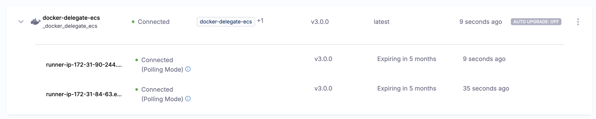

:::warning Closed Beta

Delegate 3.x is currently in closed beta and available only to select users. Access is determined by the product team. See [Feature Parity](/docs/platform/delegates-v2/feature-parity) for current supported use cases.

:::

This guide walks you through installing Delegate 3.x on Amazon Elastic Container Service (ECS) or AWS Fargate. The delegate runs as a container in your ECS cluster and connects to Harness to execute CI builds and other tasks. For supported connectors, CI steps, secret managers, and module support by deployment type, see the [Feature Parity](/docs/platform/delegates-v2/feature-parity) page.

:::info
To learn more about Delegate 3.x, including architecture and how it compares to the legacy delegate, see the [Delegate 3.x Overview](../delegate-overview).
:::

## Important considerations

Before deploying the delegate on ECS or Fargate, review the following information:

- **Manual updates required:** Delegates deployed on ECS do not auto-update. You must manually update the delegate by deploying a new task definition with the latest image. Harness recommends updating every 3 to 6 months to balance security and feature updates.
- **Infrastructure limits on Fargate:** When using AWS Fargate, tasks that exceed the specified CPU or memory limits will be terminated by AWS. This is a limitation of Fargate infrastructure. If you need more flexibility with resource limits, consider using ECS on EC2 instances or a Kubernetes-based deployment.
- **Docker image compatibility:** Delegate 3.x uses a different Docker image than legacy delegates. Ensure you use the correct image format for Delegate 3.x deployments.

## Get Harness credentials

Before installation, obtain your Account ID, Delegate Token, and Harness URL from the Harness platform.

import Tabs from '@theme/Tabs';
import TabItem from '@theme/TabItem';

<Tabs>
<TabItem value="Interactive Guide">

<DocVideo src="https://app.tango.us/app/embed/Get-Delegate-2-0-Credentials-41d069778e3e421d8791dd4dcc8ab793" title="Get credentials for Delegate 3.x" />

</TabItem>
<TabItem value="Step-by-Step" default>

1. **Open Delegate settings:** In the left nav, go to **Project Settings**, then under **Project-level Resources**, click **Delegates**.
2. **Create a new delegate:** Click **+ New Delegate** and choose **Docker** as your delegate type.
3. **Copy the credentials** from the `docker run` command:
   - `ACCOUNT_ID` → Your Account ID
   - `DELEGATE_TOKEN` → Your Delegate Token
   - `MANAGER_HOST_AND_PORT` → Your Harness URL (e.g., `https://app.harness.io`)

   

:::tip
Keep these values ready — you'll use them in the task definition.
:::

</TabItem>
</Tabs>

---

## Deploy a delegate to Amazon ECS

Use these steps to deploy a delegate to an ECS cluster running on EC2 instances. The delegate runs as an ECS service and connects to your AWS resources.

### Prerequisites

- An active AWS account with permissions to create ECS resources
- AWS CLI installed and configured
- An existing ECS cluster or permissions to create one

### Step 1: Create an ECS cluster

If you don't already have an ECS cluster, create one using the AWS Console or CLI.

**Using AWS Console:**

1. Go to the [Amazon ECS Console](https://console.aws.amazon.com/ecs/).
2. Click **Clusters** in the left navigation, then click **Create Cluster**.
3. Choose **EC2 Linux + Networking** as the cluster template.
4. Configure your cluster:
   - **Cluster name:** Enter a name (e.g., `harness-delegate-cluster`)
   - **EC2 instance type:** Select an instance type with at least 2 GB RAM (e.g., `t3.small` or larger)
   - **Number of instances:** Start with 1 instance
   - **Networking:** Use your default VPC and subnets, or create new ones
5. Click **Create** and wait for the cluster to be ready.

**Using AWS CLI:**

```bash
aws ecs create-cluster --cluster-name harness-delegate-cluster
```

### Step 2: Create the task definition

The task definition specifies how the delegate container should run, including environment variables, resource limits, and the Docker image.

1. Copy the following JSON into a file named `task-definition.json`:

   ```json
   {
     "family": "harness-delegate-task",
     "containerDefinitions": [
       {
         "name": "harness-delegate",
         "image": "us-docker.pkg.dev/gar-prod-setup/harness-public/harness/delegate:3.0.0",
         "cpu": 1024,
         "memory": 2048,
         "essential": true,
         "environment": [
           {
             "name": "HARNESS_ACCOUNT_ID",
             "value": "PUT_YOUR_ACCOUNT_ID"
           },
           {
             "name": "HARNESS_TOKEN",
             "value": "PUT_YOUR_DELEGATE_TOKEN"
           },
           {
             "name": "HARNESS_URL",
             "value": "PUT_YOUR_HARNESS_URL"
           },
           {
             "name": "HARNESS_NAME",
             "value": "ecs-delegate"
           }
         ],
         "logConfiguration": {
           "logDriver": "awslogs",
           "options": {
             "awslogs-group": "/ecs/harness-delegate",
             "awslogs-region": "us-east-1",
             "awslogs-stream-prefix": "delegate"
           }
         }
       }
     ],
     "requiresCompatibilities": ["EC2"],
     "networkMode": "bridge",
     "cpu": "1024",
     "memory": "2048"
   }
   ```

2. Replace the placeholder values:

   | **Field** | **Description** |
   |:----------|:----------------|
   | `PUT_YOUR_ACCOUNT_ID` | Your Harness account ID from the [Get Harness credentials](#get-harness-credentials) step |
   | `PUT_YOUR_DELEGATE_TOKEN` | Your delegate token from Harness |
   | `PUT_YOUR_HARNESS_URL` | Your Harness URL (e.g., `https://app.harness.io`) |
   | `awslogs-region` | The AWS region where your ECS cluster is located |

   :::warning Security Best Practice
   For production deployments, store the `HARNESS_TOKEN` in AWS Secrets Manager instead of plaintext in the task definition. Replace the environment variable with a `secrets` array:
   ```json
   "secrets": [
     {
       "name": "HARNESS_TOKEN",
       "valueFrom": "arn:aws:secretsmanager:REGION:ACCOUNT_ID:secret:harness/delegate-token"
     }
   ]
   ```
   For more information, go to [Specifying sensitive data](https://docs.aws.amazon.com/AmazonECS/latest/developerguide/specifying-sensitive-data.html) in the AWS documentation.
   :::

3. **Create CloudWatch Logs group** (required for logging):

   ```bash
   aws logs create-log-group --log-group-name /ecs/harness-delegate --region YOUR_AWS_REGION
   ```
   
   Replace `YOUR_AWS_REGION` with your AWS region (e.g., `us-east-1`, `us-west-2`).

4. **Register the task definition:**

   ```bash
   aws ecs register-task-definition --cli-input-json file://task-definition.json
   ```

### Step 3: Create the ECS service

Create a service to run and maintain the delegate task.

**Using AWS CLI:**

```bash
aws ecs create-service \
  --cluster harness-delegate-cluster \
  --service-name harness-delegate-service \
  --task-definition harness-delegate-task \
  --desired-count 1 \
  --launch-type EC2
```

**Using AWS Console:**

1. Go to your ECS cluster in the AWS Console.
2. Click **Create** under the **Services** tab.
3. Configure the service:
   - **Launch type:** EC2
   - **Task Definition:** Select `harness-delegate-task`
   - **Service name:** `harness-delegate-service`
   - **Number of tasks:** 1
4. Click **Create Service**.

### Step 4: Verify the delegate

1. Go to your Harness account.
2. Navigate to **Project Settings** > **Delegates**.
3. Verify that your delegate (named `ecs-delegate`) appears in the list with a **Connected** status.

   

---

## Deploy a delegate to AWS Fargate

Use these steps to deploy a delegate to AWS Fargate. Fargate is a serverless compute engine for containers that removes the need to manage EC2 instances.

### Prerequisites

- An active AWS account with permissions to create ECS and IAM resources
- AWS CLI installed and configured
- An existing VPC with subnets and security groups

### Step 1: Create an ECS cluster

If you don't have an ECS cluster, create one for Fargate.

**Using AWS Console:**

1. Go to the [Amazon ECS Console](https://console.aws.amazon.com/ecs/).
2. Click **Clusters** in the left navigation, then click **Create Cluster**.
3. Choose **Networking only** (Fargate) as the cluster template.
4. Configure your cluster:
   - **Cluster name:** `harness-delegate-fargate-cluster`
5. Click **Create**.

**Using AWS CLI:**

```bash
aws ecs create-cluster --cluster-name harness-delegate-fargate-cluster
```

### Step 2: Create an IAM execution role

Fargate requires an IAM execution role that grants ECS permission to pull container images and write logs.

1. Create a file named `trust-policy.json` with the following content:

   ```json
   {
     "Version": "2012-10-17",
     "Statement": [
       {
         "Effect": "Allow",
         "Principal": {
           "Service": "ecs-tasks.amazonaws.com"
         },
         "Action": "sts:AssumeRole"
       }
     ]
   }
   ```

2. Create the IAM role:

   ```bash
   aws iam create-role \
     --role-name ecsTaskExecutionRole \
     --assume-role-policy-document file://trust-policy.json
   ```

3. Attach the required policy:

   ```bash
   aws iam attach-role-policy \
     --role-name ecsTaskExecutionRole \
     --policy-arn arn:aws:iam::aws:policy/service-role/AmazonECSTaskExecutionRolePolicy
   ```

### Step 3: Create the task definition

1. Copy the following JSON into a file named `fargate-task-definition.json`:

   ```json
   {
     "family": "harness-delegate-fargate-task",
     "networkMode": "awsvpc",
     "requiresCompatibilities": ["FARGATE"],
     "cpu": "1024",
     "memory": "2048",
     "executionRoleArn": "arn:aws:iam::PUT_YOUR_AWS_ACCOUNT_ID:role/ecsTaskExecutionRole",
     "containerDefinitions": [
       {
         "name": "harness-delegate",
         "image": "us-docker.pkg.dev/gar-prod-setup/harness-public/harness/delegate:3.0.0",
         "essential": true,
         "environment": [
           {
             "name": "HARNESS_ACCOUNT_ID",
             "value": "PUT_YOUR_ACCOUNT_ID"
           },
           {
             "name": "HARNESS_TOKEN",
             "value": "PUT_YOUR_DELEGATE_TOKEN"
           },
           {
             "name": "HARNESS_URL",
             "value": "PUT_YOUR_HARNESS_URL"
           },
           {
             "name": "HARNESS_NAME",
             "value": "fargate-delegate"
           }
         ],
         "logConfiguration": {
           "logDriver": "awslogs",
           "options": {
             "awslogs-group": "/ecs/harness-delegate-fargate",
             "awslogs-region": "us-east-1",
             "awslogs-stream-prefix": "delegate"
           }
         }
       }
     ]
   }
   ```

2. Replace the placeholder values:

   | **Field** | **Description** |
   |:----------|:----------------|
   | `PUT_YOUR_AWS_ACCOUNT_ID` | Your 12-digit AWS account ID |
   | `PUT_YOUR_ACCOUNT_ID` | Your Harness account ID |
   | `PUT_YOUR_DELEGATE_TOKEN` | Your delegate token from Harness |
   | `PUT_YOUR_HARNESS_URL` | Your Harness URL (e.g., `https://app.harness.io`) |
   | `awslogs-region` | The AWS region where your cluster is located |

   :::warning Security Best Practice
   For production deployments, store the `HARNESS_TOKEN` in AWS Secrets Manager instead of plaintext. Replace the environment variable with a `secrets` array as shown in the ECS section above.
   :::

3. **Create CloudWatch Logs group** (required for logging):

   ```bash
   aws logs create-log-group --log-group-name /ecs/harness-delegate-fargate --region YOUR_AWS_REGION
   ```
   
   Replace `YOUR_AWS_REGION` with your AWS region (e.g., `us-east-1`, `us-west-2`).

   :::info
   The `ecsTaskExecutionRole` must have permissions to write logs to CloudWatch. If you encounter a `ResourceInitializationError` related to log creation, ensure the log group is created manually as shown above.
   :::

4. **Register the task definition:**

   ```bash
   aws ecs register-task-definition --cli-input-json file://fargate-task-definition.json
   ```

### Step 4: Create the service

Create a service configuration file to define networking and launch settings for Fargate.

1. Copy the following JSON into a file named `fargate-service.json`:

   ```json
   {
     "cluster": "harness-delegate-fargate-cluster",
     "serviceName": "harness-delegate-fargate-service",
     "taskDefinition": "harness-delegate-fargate-task",
     "launchType": "FARGATE",
     "desiredCount": 1,
     "networkConfiguration": {
       "awsvpcConfiguration": {
         "subnets": [
           "PUT_YOUR_SUBNET_ID"
         ],
         "securityGroups": [
           "PUT_YOUR_SECURITY_GROUP_ID"
         ],
         "assignPublicIp": "ENABLED"
       }
     },
     "platformVersion": "LATEST",
     "schedulingStrategy": "REPLICA"
   }
   ```

2. Replace the placeholder values:

   | **Field** | **Description** |
   |:----------|:----------------|
   | `PUT_YOUR_SUBNET_ID` | The subnet ID where the task should run. Use a public subnet if `assignPublicIp` is `ENABLED`, or a private subnet with NAT Gateway if `DISABLED` |
   | `PUT_YOUR_SECURITY_GROUP_ID` | A security group ID that allows outbound traffic to the internet (required for the delegate to communicate with Harness) |

   :::warning Security Best Practice
   For production deployments, use `"assignPublicIp": "DISABLED"` and place the task in a private subnet with a NAT Gateway. This ensures the delegate only has outbound connectivity to Harness and is not exposed to the public internet. The example above uses `ENABLED` for simplicity in getting started.
   :::

3. **Find your subnet and security group IDs:**

   List available subnets:
   ```bash
   aws ec2 describe-subnets --query "Subnets[*].[SubnetId,VpcId,AvailabilityZone,CidrBlock]" --output table
   ```

   List security groups:
   ```bash
   aws ec2 describe-security-groups --query "SecurityGroups[*].[GroupId,GroupName,VpcId]" --output table
   ```

4. **Create the service:**

   ```bash
   aws ecs create-service --cli-input-json file://fargate-service.json
   ```

### Step 5: Verify the delegate

1. Check the service status:

   ```bash
   aws ecs describe-services \
     --cluster harness-delegate-fargate-cluster \
     --services harness-delegate-fargate-service
   ```

2. Go to your Harness account.
3. Navigate to **Project Settings** > **Delegates**.
4. Verify that your delegate (named `fargate-delegate`) appears in the list with a **Connected** status.

   

---

## Configure the delegate

After the delegate is installed, you can configure additional settings using environment variables in the task definition.

### Common environment variables

| **Variable** | **Description** | **Required** |
|:-------------|:----------------|:-------------|
| `HARNESS_ACCOUNT_ID` | Your Harness account ID | Yes |
| `HARNESS_TOKEN` | Delegate token for authentication | Yes |
| `HARNESS_URL` | Harness platform URL | Yes |
| `HARNESS_NAME` | Name for the delegate | No (defaults to `harness-delegate`) |
| `HARNESS_TAGS` | Comma-separated list of tags for the delegate (e.g., `aws,ecs,production`) | No |

For more configuration options, go to [Configure a Delegate](./configure-delegate.md).

---

## Update the delegate

To update the delegate to a new version:

1. Update the `image` field in your task definition JSON file to the latest delegate version:
   ```json
   "image": "us-docker.pkg.dev/gar-prod-setup/harness-public/harness/delegate:3.0.0"
   ```
   
   Check the [Harness release notes](/release-notes/delegate) for the latest version number.

2. Register the new task definition:
   
   **For ECS (EC2):**
   ```bash
   aws ecs register-task-definition --cli-input-json file://task-definition.json
   ```
   
   **For Fargate:**
   ```bash
   aws ecs register-task-definition --cli-input-json file://fargate-task-definition.json
   ```

3. Update the service to use the new task definition:
   
   **For ECS (EC2):**
   ```bash
   aws ecs update-service \
     --cluster harness-delegate-cluster \
     --service harness-delegate-service \
     --task-definition harness-delegate-task \
     --force-new-deployment
   ```
   
   **For Fargate:**
   ```bash
   aws ecs update-service \
     --cluster harness-delegate-fargate-cluster \
     --service harness-delegate-fargate-service \
     --task-definition harness-delegate-fargate-task \
     --force-new-deployment
   ```

---

## Troubleshooting

### Delegate does not appear in Harness

- Verify that the `HARNESS_ACCOUNT_ID`, `HARNESS_TOKEN`, and `HARNESS_URL` values are correct.
- Check CloudWatch Logs for error messages:
  ```bash
  aws logs tail /ecs/harness-delegate --follow
  ```
- Ensure the security group allows outbound HTTPS traffic (port 443).

### Task fails to start on Fargate

**Common causes:**

- **Execution role ARN is incorrect:** Verify that the execution role ARN in your task definition matches the actual role in your AWS account.
- **Subnets lack internet access:** Check that your subnets have a route to the internet (either via an Internet Gateway for public subnets or NAT Gateway for private subnets).
- **CloudWatch Logs permissions error:** If you see `ResourceInitializationError: failed to validate logger args` or `AccessDeniedException: User is not authorized to perform: logs:CreateLogGroup`, the execution role lacks permissions to create log groups.

**Solution for CloudWatch Logs error:**

Create the log group manually before starting the service:

```bash
aws logs create-log-group --log-group-name /ecs/harness-delegate-fargate --region us-east-1
```

Then force a new deployment:

```bash
aws ecs update-service \
  --cluster YOUR_CLUSTER_NAME \
  --service YOUR_SERVICE_NAME \
  --force-new-deployment \
  --region us-east-1
```

**To diagnose task failures:**

View stopped task details to see the exact error:

```bash
aws ecs describe-tasks \
  --cluster YOUR_CLUSTER_NAME \
  --tasks $(aws ecs list-tasks --cluster YOUR_CLUSTER_NAME --service-name YOUR_SERVICE_NAME --desired-status STOPPED --region us-east-1 --query 'taskArns[0]' --output text) \
  --region us-east-1 \
  --query 'tasks[0].stoppedReason'
```

### Delegate disconnects frequently

- Ensure the task has sufficient CPU and memory resources.
- Check for network connectivity issues between the ECS task and Harness.

For additional help, contact [Harness Support](https://support.harness.io).
