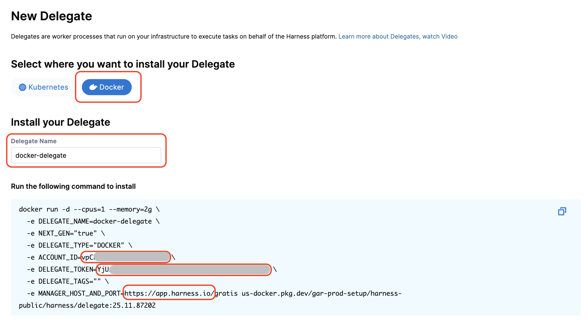

:::warning Closed Beta

The new Harness Delegate is currently in closed beta and available only to select customers. Access is determined by the product team and is based on current [supported use cases and steps](#connectors-and-steps-support).

:::

This guide describes how to install the new Harness Delegate in a Kubernetes cluster. The Kubernetes delegate runs as a deployment in your cluster and can execute CI builds and other Harness tasks.

:::info
To learn more about the new delegate, including architecture, capabilities, and how it compares to the legacy delegate, go to:
- [New Delegate Overview](../delegate-overview) - Complete guide to the new delegate
- [Feature Parity](../feature-parity) - Detailed feature comparison
:::

:::info Important

The new Harness Delegate is in **Beta** and can only be used for CI Stage Pipelines with limited step and connector support. The latest delegate does not yet support running builds in a remote cluster—your delegate must be installed in the same Kubernetes cluster where it will run CI builds.

:::

## Feature Flags

To use the new delegate for different operations, you need to enable the appropriate feature flags in your Harness account:

| Feature Flag | Purpose | When to Enable |
|--------------|---------|----------------|
| `CI_V0_K8S_BUILDS_USE_RUNNER` | Routes CI stages with Kubernetes infrastructure to the new delegate | Enable this if you want all CI stages with Kubernetes infrastructure to use the new delegate account-wide. Alternatively, you can use a stage variable `HARNESS_CI_INTERNAL_ROUTE_TO_RUNNER` set to `true` for individual stages. |
| `PL_USE_RUNNER` | Enables the new delegate for connector tests and secret manager operations | Enable this to use the new delegate for connector connectivity tests and secret manager operations (create, update, rename, delete secrets). |

**Note:** Feature flags are account-level settings. Contact your Harness administrator to enable these flags if you don't have the necessary permissions.

## Get Account ID, Token, and Harness URL

Before installing the delegate, you need to obtain your Harness account credentials. These values are required for the delegate to authenticate and connect to the Harness platform.

1. Navigate to the delegate listing page in your Harness account. The URL format is:
   ```
   https://<your-harness-url>/ng/account/<account-id>/module/ci/settings/delegates/list
   ```

2. Click **+ New Delegate**.

3. Select **Docker** as the installation type. Even though you're installing in Kubernetes, selecting Docker will prompt you to enter the required credentials.

4. Copy the values from the installation command:
   - **ACCOUNT_ID** - Your Harness account identifier
   - **DELEGATE_TOKEN** - Authentication token for the delegate
   - **MANAGER_HOST_AND_PORT** - Your Harness platform URL

   Save these values for the next step. In the following sections, these will be referred to as your **Account ID**, **Delegate Token**, and **Harness URL**, respectively.

   

## Install the Delegate in Kubernetes

The Kubernetes delegate is deployed using a manifest that includes a namespace, a service account, RBAC permissions, secrets, a deployment, and a horizontal pod autoscaler.

### Download the Kubernetes Manifest

Copy the Kubernetes manifest YAML below and save it to a file named `delegate_deployment.yaml` (or any name you prefer) on your local machine.

<details>
<summary>Click to view the complete Kubernetes manifest</summary>

```yaml
apiVersion: v1
kind: Namespace
metadata:
  name: "PUT_YOUR_DELEGATE_NAMESPACE"

---

apiVersion: v1
kind: ServiceAccount
metadata:
  name: "PUT_YOUR_DELEGATE_NAME"
  namespace: "PUT_YOUR_DELEGATE_NAMESPACE"

---

apiVersion: rbac.authorization.k8s.io/v1
kind: ClusterRoleBinding
metadata:
  name: "PUT_YOUR_DELEGATE_NAME"
subjects:
  - kind: ServiceAccount
    name: "PUT_YOUR_DELEGATE_NAME"
    namespace: "PUT_YOUR_DELEGATE_NAMESPACE"
roleRef:
  kind: ClusterRole
  name: cluster-admin
  apiGroup: rbac.authorization.k8s.io

---

apiVersion: v1
kind: Secret
metadata:
  name: "PUT_YOUR_DELEGATE_NAME"
  namespace: "PUT_YOUR_DELEGATE_NAMESPACE"
type: Opaque
data:
  HARNESS_DELEGATE_TOKEN: "PUT_YOUR_DELEGATE_TOKEN"

---

apiVersion: apps/v1
kind: Deployment
metadata:
  labels:
    harness.io/name: "PUT_YOUR_DELEGATE_NAME"
  name: "PUT_YOUR_DELEGATE_NAME"
  namespace: "PUT_YOUR_DELEGATE_NAMESPACE"
spec:
  replicas: 1
  minReadySeconds: 10
  selector:
    matchLabels:
      harness.io/name: "PUT_YOUR_DELEGATE_NAME"
  template:
    metadata:
      labels:
        harness.io/name: "PUT_YOUR_DELEGATE_NAME"
      annotations:
        prometheus.io/scrape: "true"
        prometheus.io/port: "3000"
        prometheus.io/path: "/metrics"
    spec:
      serviceAccountName: "PUT_YOUR_DELEGATE_NAME"
      terminationGracePeriodSeconds: 600
      restartPolicy: Always
      containers:
      - image: "PUT_YOUR_DELEGATE_IMAGE"
        imagePullPolicy: Always
        name: delegate
        securityContext:
          allowPrivilegeEscalation: false
          runAsUser: 0
        resources:
          limits:
            memory: "256Mi"
          requests:
            cpu: "0.5"
            memory: "256Mi"
        livenessProbe:
          httpGet:
            path: /health
            port: 3000
          initialDelaySeconds: 10
          periodSeconds: 10
          failureThreshold: 5
        readinessProbe:
          httpGet:
            path: /health
            port: 3000
          initialDelaySeconds: 5
          periodSeconds: 10
          failureThreshold: 5
        envFrom:
        - secretRef:
            name: "PUT_YOUR_DELEGATE_NAME"
        env:
        - name: HARNESS_ACCOUNT_ID
          value: "PUT_YOUR_ACCOUNT_ID"
        - name: HARNESS_MANAGER_HOST_AND_PORT
          value: "PUT_YOUR_MANAGER_ENDPOINT"
        - name: HARNESS_DELEGATE_NAME
          value: "PUT_YOUR_DELEGATE_NAME"
        - name: HARNESS_DELEGATE_TAGS
          value: "PUT_YOUR_DELEGATE_TAGS"
        - name: POD_NAMESPACE
          valueFrom:
            fieldRef:
              fieldPath: metadata.namespace
        - name: POD_SERVICE_ACCOUNT_NAME
          valueFrom:
            fieldRef:
              fieldPath: spec.serviceAccountName

---

apiVersion: autoscaling/v1
kind: HorizontalPodAutoscaler
metadata:
   name: "PUT_YOUR_DELEGATE_NAME"
   namespace: "PUT_YOUR_DELEGATE_NAMESPACE"
   labels:
       harness.io/name: "PUT_YOUR_DELEGATE_NAME"
spec:
  scaleTargetRef:
    apiVersion: apps/v1
    kind: Deployment
    name: "PUT_YOUR_DELEGATE_NAME"
  minReplicas: 1
  maxReplicas: 1
  targetCPUUtilizationPercentage: 99
```

</details>

### Configure the Manifest

Open the downloaded YAML file and replace the following placeholders with your actual values:

| Placeholder | Description | Example |
|-------------|-------------|---------|
| `PUT_YOUR_DELEGATE_NAMESPACE` | Kubernetes namespace for the delegate | `harness-delegate` |
| `PUT_YOUR_DELEGATE_NAME` | Name for your delegate | `k8s-delegate` |
| `PUT_YOUR_DELEGATE_TOKEN` | Delegate token (obtained in previous step) | Base64 encoded token |
| `PUT_YOUR_DELEGATE_IMAGE` | Delegate container image | `us-docker.pkg.dev/gar-prod-setup/harness-public/harness/delegate:1.30.1` |
| `PUT_YOUR_ACCOUNT_ID` | Account ID (obtained in previous step) | Your Harness account ID |
| `PUT_YOUR_MANAGER_ENDPOINT` | Harness URL (obtained in previous step) | `https://app.harness.io` |
| `PUT_YOUR_DELEGATE_TAGS` | Comma-separated delegate tags | `k8s,runner,production` |

**Delegate Tags:** The `HARNESS_DELEGATE_TAGS` environment variable accepts a comma-separated string of tags. You can specify multiple tags to organize and filter delegates. For example: `k8s,runner,production,qa-signoff-k8s`. These tags are used when selecting delegates for connectors and pipeline stages.

### Deploy the Delegate

Once you've configured all the placeholders in the manifest, apply it to your Kubernetes cluster:

```bash
kubectl apply -f delegate_deployment.yaml
```

The manifest creates the following Kubernetes resources:
- **Namespace** - Isolated environment for the delegate
- **ServiceAccount** - Kubernetes service account for the delegate pod
- **ClusterRoleBinding** - Grants cluster-admin permissions to the service account
- **Secret** - Stores the delegate token securely
- **Deployment** - Manages the delegate pod lifecycle
- **HorizontalPodAutoscaler** - Automatically scales the delegate based on CPU usage

### Verify Installation

After applying the manifest, verify that the delegate is running:

```bash
kubectl get pods -n <your-delegate-namespace>
```

You should see a pod with your delegate name in a `Running` state. Check the pod logs to ensure it's connecting to Harness:

```bash
kubectl logs -n <your-delegate-namespace> <delegate-pod-name> -f
```

Once the pod is running, navigate to **Project Settings** > **Delegates** in the Harness UI. Your new delegate should appear in the list with a **Connected** status, indicating it's successfully communicating with the Harness platform.

## Using the Kubernetes Delegate

Once your delegate is installed and connected, you can use it for CI stages with Kubernetes infrastructure, connector tests, and secret manager operations.

### CI Stage with Kubernetes Infrastructure

To use the new delegate for CI builds, configure your pipeline stage to use Kubernetes infrastructure and route tasks to it.

#### Create a Kubernetes Cluster Connector

1. In your Harness project, go to **Connectors** and create a new **Kubernetes Cluster** connector.

<div style={{textAlign: 'center'}}>
  <DocImage path={require('../static/k8s-1.png')} width="30%" height="30%" title="Click to view full size image" />
</div>

2. In the **Overview** step, enter a name for your connector and click **Continue**.

<div style={{textAlign: 'center'}}>
  <DocImage path={require('../static/k8s-2.png')} width="60%" height="60%" title="Click to view full size image" />
</div>

3. In the **Details** step, select **Use the credentials of a specific Harness Delegate (IAM role, service account, etc)**.

<div style={{textAlign: 'center'}}>
  <DocImage path={require('../static/k8s-3.png')} width="60%" height="60%" title="Click to view full size image" />
</div>

4. In the **Delegates Setup** step, configure delegate selection:
   - Choose **Only use Delegates with all of the following tags**
   - Add tags that match your delegate tags (the tags you specified in `HARNESS_DELEGATE_TAGS` during installation)
   - Verify that your delegate appears in the matching delegates list with a green checkmark

<div style={{textAlign: 'center'}}>
  <DocImage path={require('../static/k8s-4.png')} width="60%" height="60%" title="Click to view full size image" />
</div>

5. Save the connector. You may see a connector test error—this is expected, as connector tests are not yet fully supported for the new delegate. The connector will work correctly even if the test connection is not successful.

#### Configure CI Stage Infrastructure

1. In your CI pipeline stage, go to the **Infrastructure** tab.

2. Select **Kubernetes** as your infrastructure type.

3. Select the Kubernetes cluster connector you created.

4. Specify a namespace where the builds will run. This should be a pre-existing namespace in your cluster.

<div style={{textAlign: 'center'}}>
  <DocImage path={require('../static/k8s-5.png')} width="60%" height="60%" title="Click to view full size image" />
</div>

#### Enable New Delegate Routing

To route CI tasks to the new delegate, you can either:

- **Use a stage variable** (recommended for testing): Go to your pipeline stage's **Advanced** tab, add a variable named `HARNESS_CI_INTERNAL_ROUTE_TO_RUNNER`, and set its value to `true`. This enables new delegate routing for that specific stage only.
- **Enable the feature flag** (account-wide): Enable `CI_V0_K8S_BUILDS_USE_RUNNER` in your Harness account (see [Feature Flags](#feature-flags) for details). This routes all CI stages with Kubernetes infrastructure to the new delegate, while still respecting the delegate selectors configured in your Kubernetes connectors.

### Connector Tests and Secret Manager Operations

To use the new delegate for connector connectivity tests and secret manager operations (create, update, rename, and delete secrets):

1. Enable the feature flag `PL_USE_RUNNER` in your Harness account (see [Feature Flags](#feature-flags) for details).

2. In your connector's **Delegates Setup** section, select delegate tags that match your delegate installation.

3. The delegate will automatically be used for connector tests and secret manager operations when the tags match.

:::info
Not all connectors are supported by the new delegate. Check the [supported connectors list](#supported-connectors) before configuring your connectors.
:::

## Connectors and Steps Support

The new delegate currently supports a limited set of connectors and CI steps. The following sections detail what's currently supported and any known limitations.

### Supported Connectors

| Connector Type | Caveats |
|----------------|---------|
| **Docker Registry** | Only the DockerHub provider type is supported |
| **GitHub** | Full support for GitHub connectors |
| **HashiCorp Vault** | AppRole and Token Auth are supported; set Renewal Interval to 0 (zero) |
| **AWS Secrets Manager** | Access Key and IAM Role Credential Type authentications are supported |

### Supported CI Steps

| Step Type | Caveats |
|-----------|---------|
| **Initialize** | Fully supported |
| **Git Clone** | Supports only GitHub connectors |
| **Run** | Fully supported |
| **Background** | Fully supported |
| **Plugin** | Fully supported |
| **Upload to Artifactory, S3, and GCS** | Fully supported for artifact uploads |
| **Cache Intelligence** | Fully supported for cache operations |


