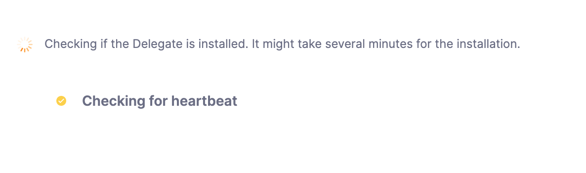

To set up a Harness Delegate, you install the delegate in your environment and the delegate automatically registers with your Harness account.

The delegate config file (for example, Kubernetes delegate YAML file) contains your Harness account Id. That's how the delegate knows where to register.

### Installing and registering delegates

To install a delegate, follow the steps in the relevant delegate installation topic, such as [Install a Kubernetes delegate](/docs/platform/2_Delegates/install-delegates/install-a-kubernetes-delegate.md) or [Install a Docker delegate](/docs/platform/2_Delegates/install-delegates/overview.md).

Once you have installed the delegate in your environment, select **Verify** in the delegate wizard, and Harness will verify that it is receiving heartbeats from the delegate.


This means Harness is waiting for the delegate you installed to register.

Registration can take a few minutes.

Once the delegate registers, the **Verify** screen will indicate that the delegate is running.

### Verifying delegate registration manually

The Verify screen also includes troubleshooting steps.

Here are a few of the steps for the Kubernetes delegate.

Check the status of the delegate on your cluster:

```
kubectl describe pod <your-delegate-pod> -n harness-delegate-ng
```
Check the delegate logs:

```
kubectl logs -f <harness-delegate> -n harness-delegate-ng
```
If the pod isn't up, you might see the following error in your cluster:

```
CrashLoopBackOff: Kubernetes Cluster Resources are not available.
```
Make sure the Kubernetes Cluster Resources (CPU, Memory) are enough.

If the delegate didn’t reach a healthy state, try this:

```
kubectl describe pod <your-delegate-pod> -n harness-delegate-ng
```
