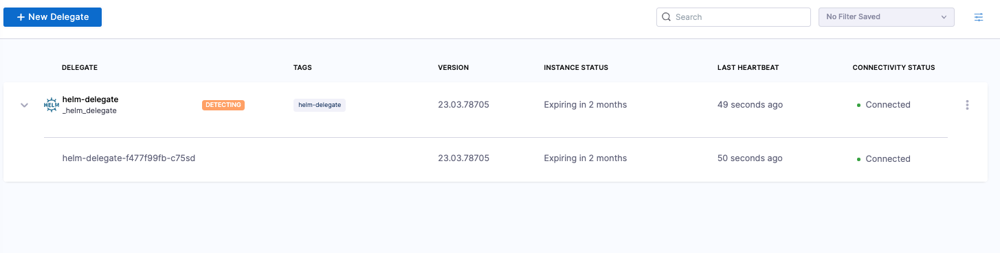
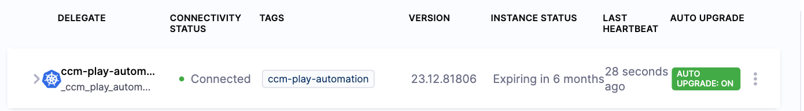

The Harness Delegate for Kubernetes and Helm supports automatic upgrades. Harness recommends that you enable automatic upgrades for your Kubernetes delegates. With automatic upgrades, you always have the most recent version of the delegate.

Delegate upgrades do not affect pipelines unless the shutdown timeout is reached. Before an upgrade is performed, the delegate finishes the tasks that are underway. The delegate then shuts down. As part of the shutdown process, there is a 10 minute timeout by default. You can configure this setting. For more information, go to [Graceful delegate shutdown](/docs/platform/delegates/delegate-concepts/graceful-delegate-shutdown-process/).

:::info
The automatic upgrade feature is enabled by default for the Kubernetes manifest, Terraform, and Helm installation options. However, the automatic upgrade feature is not supported for the Docker installation option.
:::

## How automatic upgrade works in the Kubernetes manifest

The Kubernetes manifest has a component called `upgrader`. The `upgrader` is a cron job that runs every hour by default. Every time it runs, it sends a request to Harness Manager to determine which delegate version is published for the account. The API returns a payload, such as `harness/delegate:yy.mm.verno`. If the delegate that was involved in this upgrade cron job does not have the same image as what the API returns, the `kubectl set image` command runs to perform a default rolling deployment of the delegate replicas with the newer image.

To prevent the installation of the automatic upgrade feature, remove the `CronJob` section before you apply the manifest.

You can also change the time when the upgrade cron job runs by updating the `schedule`. For configuration details, go to [Configure the delegate upgrade schedule](#configure-the-delegate-upgrade-schedule).

:::info
User information is not propagated when a delegate is started from external sources. All delegate operations are recorded under the SYSTEM user in the audit trail, especially during the scale-up and scale-down processes. The **Action** column displays actions when a delegate is created, updated, or upserted. For more information about the audit trail, go to [View audit trail](/docs/platform/governance/audit-trail/).
:::

<details>
<summary>Example Kubernetes manifest</summary>

```yaml
kind: Role
apiVersion: rbac.authorization.k8s.io/v1
metadata:
  name: upgrader-cronjob
  namespace: harness-delegate-ng
rules:
  - apiGroups: ["batch", "apps", "extensions"]
    resources: ["cronjobs"]
    verbs: ["get", "list", "watch", "update", "patch"]
  - apiGroups: ["extensions", "apps"]
    resources: ["deployments"]
    verbs: ["get", "list", "watch", "create", "update", "patch"]

---

kind: RoleBinding
apiVersion: rbac.authorization.k8s.io/v1
metadata:
  name: kubernetes-delegate-upgrader-cronjob
  namespace: harness-delegate-ng
subjects:
  - kind: ServiceAccount
    name: upgrader-cronjob-sa
    namespace: harness-delegate-ng
roleRef:
  kind: Role
  name: upgrader-cronjob
  apiGroup: ""

---

apiVersion: v1
kind: ServiceAccount
metadata:
  name: upgrader-cronjob-sa
  namespace: harness-delegate-ng

---

apiVersion: v1
kind: Secret
metadata:
  name: test-upgrader-token
  namespace: harness-delegate-ng
type: Opaque
data:
  UPGRADER_TOKEN: "DELEGATE_TOKEN"

---

apiVersion: v1
kind: ConfigMap
metadata:
  name: test-upgrader-config
  namespace: harness-delegate-ng
data:
  config.yaml: |
    mode: Delegate
    dryRun: false
    workloadName: DELEGATE_TO_AUTO_UPGRADE
    namespace: harness-delegate-ng
    containerName: delegate
    delegateConfig:
      accountId: ACCOUNT_ID
      managerHost: HARNESS_MANAGE_ENDPOINT_URL

---

apiVersion: batch/v1
kind: CronJob
metadata:
    labels:
        harness.io/name: test-upgrader-job
    name: test-upgrader-job
    namespace: harness-delegate-ng
spec:
    schedule: "0 */1 * * *"
    concurrencyPolicy: Forbid
    startingDeadlineSeconds: 20
    jobTemplate:
        spec:
        template:
            spec:
                serviceAccountName: upgrader-cronjob-sa
                restartPolicy: Never
                containers:
                - image: harness/upgrader:latest
                name: upgrader
                imagePullPolicy: Always
                envFrom:
                - secretRef:
                    name: test-upgrader-token
                volumeMounts:
                    - name: config-volume
                    - mountPath: /etc/config
                volumes:
                    - name: config-volume
                    - configMap:
                        name: test-upgrader-config

```

</details>

### Determine if automatic upgrade is enabled

When a delegate is installed, it may take up to an hour by default to determine if the `upgrader` was removed during installation. During that time, the delegate shows a status of **DETECTING**.

Harness updates the status when `upgrader` makes its first API call to the Harness platform. The default schedule is one hour, but the schedule is configurable. If Harness doesn't detect the upgrader API call within 90 minutes, the upgrade status is updated from **DETECTING** to **AUTO UPGRADE: OFF**.

Let's say the `upgrader` schedule is configured to two hours. The upgrade status would change from **AUTO UPGRADE: OFF** to **AUTO UPGRADE: ON** and back to **AUTO UPGRADE: OFF**. Every 90 minutes that Harness doesn't detect the API call, the status is set to **AUTO UPGRADE: OFF**. As soon as Harness detects it again, the status is set to **AUTO UPGRADE: ON**. Harness recommends a default schedule of 60 minutes. For more information, go to [Configure the delegate upgrade schedule](#configure-the-delegate-upgrade-schedule).

To find the delegate status, select an account, a project, or an organization, then select **Settings**. Under resources, select **Delegates**. For more information, go to [Delegates list page](/docs/platform/delegates/delegate-concepts/delegate-overview#delegates-list-page).



When the delegate is first installed, the Delegates list page displays an **Auto Upgrade** status of **DETECTING** and then **SYNCHRONIZING**. After the first hour (for the default `upgrader` configuration) or your custom configured time, the delegate shows a status of **AUTO UPGRADE: ON** or **AUTO UPGRADE: OFF**.



### Disable automatic upgrade on an installed delegate image

If you disable automatic upgrades, then you have to manually upgrade the delegate regularly to prevent a loss of backward compatibility.

To disable auto-upgrade on an installed delegate image, do the following:

1. Run the following command to suspend auto-upgrade on the installed image.

   ```
   kubectl patch cronjobs <job-name> -p '{"spec" : {"suspend" : true }}' -n <namespace>
   ```

2. In the delegate manifest, locate the **CronJob** resource. In the resource `spec`, set the `suspend` field to `true`.

   ```yaml
   spec:
      - suspend: true
   ```

### Configure the delegate upgrade schedule

Harness recommends a default schedule of 60 minutes, but suggests a range between one and 90 minutes for optimal performance.

:::info important
If you set the value outside of this range, upgrades will still work as expected. However, if the frequency exceeds 90 minutes, Harness will not be able to detect any auto-upgrades, and the UI will display that auto-upgrades are turned `OFF`.
:::

To configure the delegate upgrade schedule, do the following:

1. In the `delegate.yaml` manifest file, locate the `upgrader-cronjob` resource.
2. Configure the **CronJob** resource to your specific settings.

   The `CronJob` YAML configuration should look something like the example below that runs the job every 15 minutes. The `spec.schedule` field defines when and how often the job should run.

   ```yaml
   ---

   apiVersion: batch/v1
   kind: CronJob
   metadata:
     labels:
       harness.io/name: kubernetes-delegate-upgrader-job
     name: kubernetes-delegate-upgrader-job
     namespace: harness-delegate-ng
   spec:
     schedule: "0,15,30,45 * * * *"
     concurrencyPolicy: Forbid
     startingDeadlineSeconds: 20
     jobTemplate:
       spec:
         template:
           spec:
             serviceAccountName: upgrader-cronjob-sa
             restartPolicy: Never
             containers:
             - image: harness/upgrader:latest
               name: upgrader
               imagePullPolicy: Always
               envFrom:
                - secretRef:
                   name: kubernetes-delegate-upgrader-token
               volumeMounts:
                 - name: config-volume
                   mountPath: /etc/config
             volumes:
               - name: config-volume
                 configMap:
                   name: kubernetes-delegate-upgrader-config
   ```

   For more information on the schedule syntax, go to [Writing a CronJob spec](https://kubernetes.io/docs/concepts/workloads/controllers/cron-jobs/#writing-a-cronjob-spec) in the Kubernetes documentation.

3. Save the file.
4. Run the following.

   ```
   kubectl apply -f harness-delegate.yaml
   ```

   The schedule change for the cron job will take effect immediately, and the next upgrade run will follow the new schedule. If you have made any other changes to the YAML file, such as updating the image, configuration, environment variables, and so on, those changes will take effect during the next run.

### Configure an optional registry mirror for delegate images

If you use Docker pull through registry cache (`https://docs.docker.com/docker-hub/mirror/`), you can configure `upgrader` to use an optional registry mirror for your delegate images.

When this feature is configured, Harness Delegate images are fetched from the designated mirror, instead of public Docker Hub.

```yaml
mode: Delegate
dryRun: false
workloadName: delegate-name
namespace: harness-delegate-ng
containerName: delegate
registryMirror: us.gsr.io/gcr-mirror
delegateConfig:
  accountId: <YOUR_ACCOUNT_ID>
  managerHost: <MANAGER_HOST>
```

During an upgrade, when `upgrader` seeks to update the delegate to `harness/delegate:verno`, it will utilize the image from `us.gsr.io/gcr-mirror/harness/delegate:verno`.

This option can be enabled by setting `upgrader.registryMirror` Helm value for Delegate Helm chart or by modifying Upgrader Kubernetes manifest.

## Use automatic upgrade with custom delegate images

You may choose to use a custom delegate image for the following reasons:

- You don't have access to Docker Hub, so you pull the Harness images and put them in your own container registry.
- You use the Harness Delegate as a base image and install tools, certificates, etc.

If automatic upgrade is enabled and you have a custom image, the following may occur:

- If the Kubernetes cluster does not have access to Docker Hub, then the upgrade fails.
- If the Kubernetes cluster has access to Docker Hub, then the new published image is deployed. This action causes the custom tooling to be lost.

To avoid these issues, you can set up the `upgrader` to use your custom delegate tag.

1. Use the [latest-supported-version](https://apidocs.harness.io/tag/Delegate-Setup-Resource/#operation/publishedDelegateVersion) API to determine the delegate number for your account:

   ```
   curl --location 'https://app.harness.io/ng/api/delegate-setup/latest-supported-version?accountIdentifier=\<YOUR_ACCOUNT_IDENTIFIER>' \
    --header 'x-api-key: \<YOUR_API_KEY>'
   ```

    The following example result is returned. It returns the tag of the delegate that is released to your account.

    ```json
    {
    "metaData": {},
    "resource": {
        "latestSupportedVersion": "24.04.82804",
        "latestSupportedMinimalVersion": "24.04.82804.minimal"
    },
    "responseMessages": []
    }
    ```

    When the `upgrader` makes a request, it tries to change the image to `harness/delegate:24.04.82804`. You can take either the `harness/delegate:24.04.82804` image or the `harness/delegate:24.04.82804.minimal` image and build your own image by adding more tools and binaries, and then push it to your own container repository. For example, you might publish the image to a private repository, such as `artifactory-abc/harness/delegate:24.04.82804`.

2. Once the image is pushed, you can call the [override-delegate-tag](https://apidocs.harness.io/tag/Delegate-Setup-Resource/#operation/overrideDelegateImageTag) API to enable the Harness back-end to supply the upgrader with the custom delegate tag:

    ```
   curl --location --request PUT 'https://app.harness.io/ng/api/delegate-setup/override-delegate-tag?accountIdentifier=<account_identifier>&delegateTag=artifactory-abc%2Fharness%2Fdelegate%3A23.04.78910' \
    --header 'x-api-key: <your_api_key>'
    ```

    It returns the following results:

    ```json
    {
    "metaData": {},
    "resource": "Updated Delegate image tag to artifactory-abc/harness/delegate:24.04.82804",
    "responseMessages": []
    }
    ```

    The next time the `upgrader` runs, it will receive the `artifactory-abc/harness/delegate:24.04.82804` image.


## Delegate expiration support policy

Six months after a delegate image is released, the delegate reaches End of Support (EOS). Eight months after a delegate image is released, the delegate is End of Life (EOL). 

When a delegate has been tagged as "expired", this does not stop a Delegate from continuing operations.  It is a cosmetic flag to inform a customer that the delegate should be considered for an upgrade. Because delegates are only backward-compatible, they might have issues if the backend has moved too far ahead. Harness recommends that you upgrade your delegates before they expire.

| Release | EOS | EOL |
| --- | --- | --- |
| 24.04.verno | 23.10.verno and below | 23.08.verno and below |
| 24.05.verno | 23.11.verno and below | 23.09.verno and below |

EOS means the following:

- Harness Support will provide best-attempt support requests for the delegate, and would recommend a change to a newer version.  This applies to both Harness FirstGen and Harness NextGen. 
- Security fixes will still be addressed, but may be already addressed with a newer update.
- Product defects will not be addressed.  Code Changes also will not be
- If delegates are past their EOS date, Harness does not support them. Expired delegates might continue to work, but it is recommended to upgrade to a newer delegate if the delegate does not work as intended.

EOL means the following:

- In addition to the EOS clauses, security fixes will not be addressed.

For a list of delegate images and their support status, go to [Delegate image version support status](/docs/platform/delegates/delegate-reference/delegate-image-version-status).

#### Example delegate expiration

 For delegates with an immutable image type, the image tag is `yy.mm.verno`. A delegate version `24.05.84200` would reach EOS in November 2024 and EOL in January 2025.

:::note
This policy applies to delegates with the `yy.mm.verno` image tag. It does not apply to legacy delegates. For information on delegate types, go to [Delegate image types](/docs/platform/delegates/delegate-concepts/delegate-image-types).

:::

:::info
Harness Self-Managed Enterprise Edition support is limited to the delegate version released with the most recent version. When you upgrade Harness Self-Managed Enterprise Edition, the supported delegate version is included.

:::

### Determine when your delegate expires

To determine when your delegate expires, do the following:

1. Select an account, a project, or an organization, and then select **Delegates**.

2. Locate your delegate in the list, and then check the **INSTANCE STATUS** column.

### Update the delegate YAML

Harness does not recommend the use of delegate images that are not current. However, if you require an earlier image version, check the repository on [Docker Hub](https://hub.docker.com/r/harness/delegate/tags).

To update the delegate YAML, do the following:

- Select **New Delegate** > **Kubernetes** > **Kubernetes Manifest** > **Custom**, and then follow the instructions on the screen.

For an example of a complete Delegate YAML file, go to [Example Kubernetes manifest for Harness Delegate](/docs/platform/delegates/delegate-reference/YAML/example-kubernetes-manifest-harness-delegate.md).

