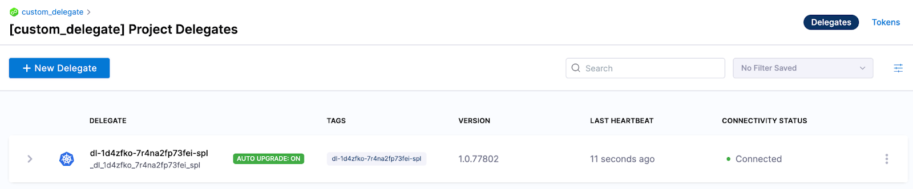
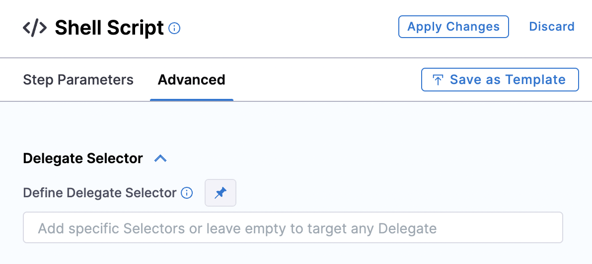

import Tabs from '@theme/Tabs';
import TabItem from '@theme/TabItem';

The [Harness Delegate](/docs/platform/delegates/delegate-concepts/delegate-overview) is a lightweight worker process that is installed on your infrastructure and communicates only via outbound HTTP/HTTPS to the Harness Platform. This enables the Harness Platform to leverage the delegate for executing the CI/CD and other tasks on your behalf, without any of your secrets leaving your network.

The default delegates are packaged with third-party SDKs that support Kubernetes, Helm, and other Harness-integrated tools. The SDKs are included on the delegate image as binary files; depending on the tool, multiple versions are included. Harness also provides a "minimal" delegate image that doesn't include third-party SDKs.

You can modify the default and minimal Harness Delegate images. You might customize the delegate image if:

* You want to use binaries that reduce your attack surface. Vulnerability scans detect unresolved vulnerabilities in older binary versions.
* You want to use tools or versions of tools that Harness doesn't include on the default delegate image. You can install all kinds of tools, such as Git client, Helm, Terraform, PowerShell, Docker, AWS CLI, and so on.
* You need to modify where certain tools run. For example, connecting to external systems usually requires a third-party client tool or library to be present locally, and some of the Harness CD and Platform tasks require these client tools to be present in the same container instance where the delegate runs.

There are two primary ways to modify the Harness Delegate image:

* Install additional client tools along with the delegate by modifying the delegate YAML to install the tools and versions that you specify in the `INIT_SCRIPT` environment variable. This approach works best when you are still building your CI/CD pipelines and you don't yet have the final list of required client tools. This approach is explained in this topic.
* Create a custom delegate image (using the Harness-provided delegate image as a base image). This approach works best when you know all the client tools ahead of time. For instructions on building custom delegate images, go to [Build custom delegate images with third-party tools](./build-custom-delegate-images-with-third-party-tools.md).

import Addperm from '/docs/platform/shared/delegate-additional-permissions.md'

<Addperm />

## Edit the delegate YAML

To install a delegate, you download its YAML file and run it in your target environment, such as a Kubernetes cluster. For example purposes, this topic uses a delegate installed on a Kubernetes cluster created on Google Cloud.

To modify the delegate image, you need to edit the delegate YAML file to specify delegate environment variables, the delegate base image, [Harness-required SDKs](#add-harness-required-sdks) (depending on the selected base image), and [third-party tools to install](#add-your-custom-tools).

You can modify the delegate YAML before or after you install the delegate. To get the delegate YAML, follow the steps to [Install a delegate](/docs/platform/get-started/tutorials/install-delegate). To follow along with the examples in this topic, use the **Kubernetes Manifest** option for delegate installation.

Since the delegate is declaratively defined in YAML, it is easy to add custom scripts and customize the delegate in other ways too. SDKs and additional tools are specified in the `INIT_SCRIPT`, with the exception of [delegate Helm chart deployments](#delegate-helm-chart-deployments). For more examples, go to [Common delegate initialization scripts](/docs/platform/delegates/delegate-reference/common-delegate-profile-scripts.md).

### Delegate Helm chart deployments

For delegate Helm chart deployments, add your third-party tool custom binaries to `initScript` in your `values.yaml` file to run them before delegate installation. You can find the [default values.yaml in the delegate-helm-chart GitHub repo](https://github.com/harness/delegate-helm-chart/blob/main/harness-delegate-ng/values.yaml).

For example, the following `values.yaml` entry installs Kubectl on amd64 architecture. The exact install URL depends on your architecture. For additional architecture installation commands, go to the Kubernetes documentation on [Installing kubectl]( https://kubernetes.io/docs/tasks/tools/#kubectl).

```yaml
# Script to run before delegate installation
initScript: "
            curl -L0 https://dl.k8s.io/release/v1.24.3/bin/linux/amd64/kubectl -o kubectl
            chmod +x ./kubectl
            mv kubectl /usr/local/bin/"
```

## Add Harness-required SDKs

The toolset you install on the delegate minimal image must include the SDKs that Harness requires to perform tasks.

In the delegate container `spec`, use the `INIT_SCRIPT` environment variable to download the certified SDK versions that Harness requires.

The SDKs you need to add depend on the type of deployment. For a list of SDK versions certified for different deployment types, go to [Delegate-required SDKs](/docs/platform/delegates/delegate-reference/delegate-required-sdks.md).

<details>
<summary>Example Kubernetes manifest delegate YAML with required SDK downloads</summary>

The following delegate YAML contains examples of downloads for all Harness-required SDKs. You can edit the YAML to include only the SDKs and versions Harness requires for your deployment type. To modify the export `PATH`, run `export PATH=/opt/harness-delegate/custom-client-tools/:<path>`.

```yaml
...
        - name: DELEGATE_TYPE
          value: "KUBERNETES"
        - name: DELEGATE_NAMESPACE
          valueFrom:
            fieldRef:
              fieldPath: metadata.namespace
        - name: INIT_SCRIPT
          value: |

            ## Kubectl
            curl -L0 https://dl.k8s.io/release/v1.24.3/bin/linux/amd64/kubectl -o kubectl
            chmod +x ./kubectl
            mv kubectl /usr/local/bin/

            ## Helm V3
            curl -L0 https://get.helm.sh/helm-v3.9.2-linux-amd64.tar.gz -o helm-v3.9.2.tar.gz
            tar -xvzf helm-v3.9.2.tar.gz
            chmod +x ./linux-amd64/helm
            mv ./linux-amd64/helm /usr/local/bin/

            ## Kustomize
            curl -L0 https://github.com/kubernetes-sigs/kustomize/releases/download/kustomize%2Fv4.5.4/kustomize_v4.5.4_linux_amd64.tar.gz -o kustomize_v4.5.4.tar.gz
            tar -xvzf kustomize_v4.5.4.tar.gz
            chmod +x ./kustomize
            mv kustomize /usr/local/bin/

            ## OpenShift OC
            curl -L0 https://mirror.openshift.com/pub/openshift-v4/clients/oc/latest/linux/oc.tar.gz -o oc.tar.gz
            tar -xvzf oc.tar.gz
            chmod +x ./oc
            mv oc /usr/local/bin/

            ## go-template
            mkdir -p /opt/harness-delegate/client-tools/go-template/v0.4.1/
            curl -L0 https://app.harness.io/public/shared/tools/go-template/release/v0.4.1/bin/linux/amd64/go-template -o go-template
            chmod +x ./go-template
            mv go-template /usr/local/bin/

            curl -L https://get.helm.sh/chartmuseum-v0.14.0-linux-amd64.tar.gz -o chartmuseum-v0.14.tar.gz
            tar xzvf chartmuseum-v0.14.tar.gz
            chmod +x ./linux-amd64/chartmuseum
            mv ./linux-amd64/chartmuseum /usr/local/bin/

            cd /opt/harness-delegate
...
```

</details>

### Private Cloud Foundry (PCF) deployments

PCF deployments require CLI 7. For installation instructions, go to [Install Cloud Foundry CLI versions on the Harness Delegate](/docs/platform/delegates/delegate-reference/common-delegate-profile-scripts/#cloud-foundry-cli/).

## Add your custom tools

Open the delegate YAML file and locate the `INIT_SCRIPT` in the delegate container `spec`. To install additional tools on the delegate, add your custom scripts to the `INIT_SCRIPT`.

These examples show how to install some common tools.

<Tabs>
<TabItem value="aws" label="Install AWS CLI">

The following `INIT_SCRIPT` installs the AWS CLI:

```yaml
  - name: INIT_SCRIPT
    value: |
        curl "https://awscli.amazonaws.com/awscli-exe-linux-x86_64.zip" -o "awscliv2.zip"
        unzip awscliv2.zip
        ./aws/install
```

</TabItem>
<TabItem value="kubectl" label="Install kubectl">

The following `INIT_SCRIPT` installs kubectl:

```yaml
  - name: INIT_SCRIPT
    value: |
        curl -L0 https://dl.k8s.io/release/v1.24.3/bin/linux/amd64/kubectl -o kubectl
        chmod +x ./kubectl
        mv kubectl /opt/harness-delegate/custom-client-tools/kubectl
```

</TabItem>
<TabItem value="terraform" label="Install Terraform">

The following `INIT_SCRIPT` installs Terraform:

```yaml
  - name: INIT_SCRIPT
    value: |
        curl -O -L  https://releases.hashicorp.com/terraform/0.12.25/terraform_0.12.25_linux_amd64.zip
        unzip terraform_0.12.25_linux_amd64.zip
        mv ./terraform /usr/bin/
```

</TabItem>
<TabItem value="helm" label="Install Helm">

The following `INIT_SCRIPT` installs Helm 3:

```yaml
  - name: INIT_SCRIPT
    value: |
        curl -fsSL -o get_helm.sh https://raw.githubusercontent.com/helm/helm/main/scripts/get-helm-3
        chmod 700 get_helm.sh
        ./get_helm.sh
```

</TabItem>
</Tabs>

### Install multiple tools at once

To install multiple tools, you can add all the install scripts to the `INIT_SCRIPT`, for example:

```yaml
  - name: INIT_SCRIPT
    value: |

        ## Install AWS CLI
        curl "https://awscli.amazonaws.com/awscli-exe-linux-x86_64.zip" -o "awscliv2.zip"
        unzip awscliv2.zip
        ./aws/install

        ## Install kubectl
        curl -L0 https://dl.k8s.io/release/v1.24.3/bin/linux/amd64/kubectl -o kubectl
        chmod +x ./kubectl
        mv kubectl /opt/harness-delegate/custom-client-tools/kubectl

        ## Install Terraform
        curl -O -L  https://releases.hashicorp.com/terraform/0.12.25/terraform_0.12.25_linux_amd64.zip
        unzip terraform_0.12.25_linux_amd64.zip
        mv ./terraform /usr/bin/

        ## Install Helm3
        curl -fsSL -o get_helm.sh https://raw.githubusercontent.com/helm/helm/main/scripts/get-helm-3
        chmod 700 get_helm.sh
        ./get_helm.sh
```

## Apply the changes

You can modify the delegate YAML before or after you install the delegate.

If you haven't yet installed the delegate, finish [Installing the delegate](/docs/platform/get-started/tutorials/install-delegate) in your target environment.

If you already installed the delegate, you need to apply the updated delegate YAML and restart the delegate. For example, if your delegate is in a Kubernetes cluster, run the kubectl command to apply it:

```
kubectl apply -f harness-delegate.yml
```

Wait a few minutes for the delegate to start up. You can check the delegate status in the Harness Platform.



## Test your tools

You can either run an existing pipeline that requires one of the tools you installed, or create a test pipeline with a simple script to confirm that a tool was installed.

1. Create a pipeline and add a **Custom** stage.
2. Add a **Shell Script** step.
3. Enter a simple script, such as a version check, for the tool that you installed.

   For example, if you installed the Git client, you could run `git --version`, or if you installed the AWS CLI, you could run `aws --version`.

   

   You can modify this step to test any command for the tool. For example, if you installed Helm, you could run a test to deploy a Helm chart:

   ```
   helm create my-new-chart
   helm install my-new-chart ./my-new-chart
   helm ls
   ```

4. Set the **Execution Target** to **On Delegate**.
5. On the **Advanced** tab, select the delegate you just modified.

   

6. Save and run the pipeline. If the tool was installed on the delegate successfully, you should see the output of your script in the execution logs.

   
