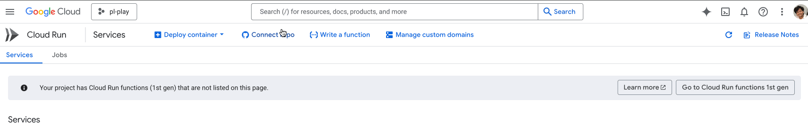

import DeployContainer from './static/container-image-url.png';
import ConfigureService from './static/cloud-run-configure.png';
import ContainerConfig from './static/configure-container-vol-security.png';
import HealthCheck from './static/health-check.png';
import DelegateStatus from './static/delegate-status.png';
import EnVariable from './static/environment-variables.gif';
import ServiceUrl from  './static/service-url.gif';

Harness Delegate is essential for connecting your infrastructure with the Harness platform, enabling seamless deployments. Harness Delegates typically run on VMs, Kubernetes clusters, or ECS Fargate, but Google Cloud Run presents a lightweight, cost-efficient, and scalable alternative.

This guide provides step-by-step instructions to configure a Harness Delegate on Google Cloud Run.

### Prerequisites

1. Ensure you have an active [Harness account](https://app.harness.io) with the necessary permissions. 

2. A Google Cloud service account with appropriate IAM roles:
    
    ```bash
    roles/run.admin # - Cloud Run Admin
    roles/iam.serviceAccountUser # - Service Account User
    roles/artifactregistry.reader # - For pulling images from GAR
    ```

### Harness Delegate on Google Cloud Run

To configure a delegate on Google Cloud Run:  

    1. Login to [Google Cloud Run](https://console.cloud.google.com/run), Select an existing project or create a new one as needed.
 
        - Check for Deploy container → Service as shown below:

           
        
    2. To create a service, follow these steps:

        2.1. Add Container Image URL. You can select it from [Artifact Registry](https://console.cloud.google.com/artifacts/docker/gar-prod-setup/us/harness-public/harness%2Fdelegate) or provide a [Docker Hub Image URL](https://hub.docker.com/r/harness/delegate/tags).
        
            

        2.2. To configure a service, enter a name, select a region, choose a billing method (request-based or instance-based), and set up scaling. You can configure Auto Scaling by setting the minimum number of instances based on your requirements or switch to Manual Scaling. 
        
            For now, we will opt for Manual Scaling and set the number of instances to 1.
                
                
                                
        2.3.  Configure Ingress to control access to Cloud Run services. For now, select "All" to allow direct access from the internet.

    3. To edit container configuration, click **Container(s), Volumes, Networking, Security** section to expand the options and set the following details accordingly.
        
        - Container Port: 3460  
        - Settings → Container Name: Set an appropriate name (this will be used as the container image name).  
        - Resources → Memory: At least 2Gi, CPU: 1 

            

    4. Click Add Health Checks, then configure the Startup Probe and Liveness Probe as follows:  

        - Select Protocol: HTTP  
        - Set Path: `/api/health`  
        - Startup Probe: Set an initial delay of 120s  
        - Liveness Probe: Set an initial delay of 0s (all other settings remain the same as Startup probe) as shown in image below.

              

        - Click Add to proceed.

    5. To configure Environment Variables, scroll up and select Variables & Secrets next to Settings.  

            
        These environment variables are the same as those in the delegate installation step available in the Harness UI, as shown below.

        - Log in to your [Harness account](https://app.harness.io/). Navigate to Account Settings → Account-level Resources → Delegate.  

        - Click New Delegate to access the installation steps as show below:

            ```bash
                docker run --cpus=1 --memory=2g \
                -e DELEGATE_NAME=docker-delegate-demo \
                -e NEXT_GEN="true" \
                -e DELEGATE_TYPE="DOCKER" \
                -e ACCOUNT_ID=gVcEXXXXXXXXA3JqA \
                -e DELEGATE_TOKEN=ZmY5MXXXXBlMTIwOXXXXXXXQ2Zjc1NjI4MDQ= \
                -e DELEGATE_TAGS="" \
                -e MANAGER_HOST_AND_PORT=https://app.harness.io/gratis 24.10.84107
            ```

        - Set the variables in Variables & Secrets by adding the following key-value pairs:

            :::info Keeping Your Delegate Always Running on Google Cloud Run 

                Google Cloud Run automatically scales your service based on real-time traffic, which helps optimize resources but can affect services like delegates that need to stay up.
                
                - You can set min and max replicas, but Google still manages the actual scaling based on demand.
                - Each new revision gets 100% of the traffic by default, causing older ones to scale down.
                - If there's no traffic, Cloud Run may stop the container.

                To ensure your delegate remains active and is always available, add the following environment variables:
                    
                    - `INIT_SCRIPT`: `nohup bash -c "while true; do curl -s https://<your-service-url>/api/health; sleep 30; done" &`
                        
                        - The INIT_SCRIPT ensures the container continuously runs the required startup logic. You can find the service URL, as shown in the GIF below.
                            
                            

                    - `HOST_NAME_COMMAND`: echo uniqdelegate-$(openssl rand -hex 3)
            :::

            ```bash
                DELEGATE_NAME="<your_delegate_name>"
                NEXT_GEN="true"
                DELEGATE_TYPE="DOCKER"
                ACCOUNT_ID="<your_account_id>"
                DELEGATE_TOKEN="<delegate_token_from_step1>"
                MANAGER_HOST_AND_PORT="<manager_host_and_port_from_step1>"
                HOST_NAME_COMMAND=`echo uniqdelegate-$(openssl rand -hex 3)`
                INIT_SCRIPT=`nohup bash -c "while true; do curl -s https://<your-service-url>/api/health; sleep 30; done" &`

                # (Optional) Add delegate tags if needed
                DELEGATE_TAGS="tag1"
            ``` 
            
    6. Click Create to complete the setup.

    7. To confirm the delegate is created and running, check its status in the Harness UI on Delegate page as shown in image below.

        


             


