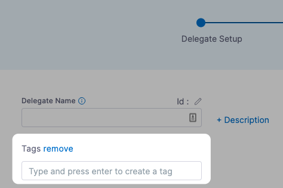
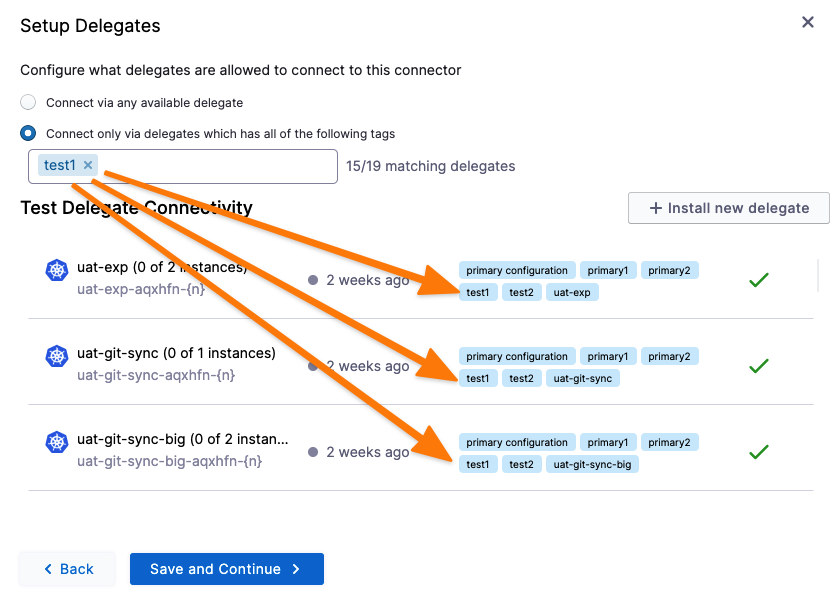

Harness runs tasks by using Harness Delegate to connect your environment to resources. Harness selects the best delegate based on previous use or round-robin selection. For more information, go to [How Harness Manager picks delegates](/docs/platform/delegates/delegate-concepts/delegate-overview.md#how-harness-manager-picks-delegates).

In some cases, you might want Harness to select specific delegates. In these cases, you can use the **Delegate Selector** settings in pipelines, connectors, and so on, with corresponding delegate tags.

:::info note
If no delegate is selected for a CD step's **Delegate Selector** setting, Harness prioritizes the delegate that was successfully used for the infrastructure definition connector.

For more information, go to [Which delegate is used during pipeline execution?](/docs/platform/delegates/delegate-concepts/delegate-overview/#which-delegate-is-used-during-pipeline-execution).
:::

### Delegate tags

A delegate tag with the same name as your delegate is automatically added to your delegate during the configuration process. You can add one or more comma-separated tags on the `helm` command line or in the Kubernetes YAML file, as shown in the following example.

```yaml
...
    env:
    ....
    - name: DELEGATE_TAGS
      value: "tag1,tag2"
...
```

For Docker delegates, you can add tags using the following flag for your `docker run` command.

```
-e DELEGATE_TAGS="tag1, tag2, tag3"
```

You can also add tags to the **Tags** field during the setup process:



For detailed information on how delegates are selected during execution, go to [Delegate overview](/docs/platform/delegates/delegate-concepts/delegate-overview.md).

You can select a delegate based on its tags in the **Delegate Selector** settings of Harness entities like pipelines and connectors.

#### How does Harness handle multiple tags?

When you use multiple delegate tags in the **Delegate Selector** settings of a step, Harness selects only the delegate(s) that have all the selectors.

This means that if there are multiple tags, the delegate must match all of them to be selected. For instance, if you have a delegate with three tags and you only provide two of them in the **Delegate Selector** settings, the delegate is still eligible for selection as long as the two tags are present for that delegate.

### Delegate selector priority

You can use delegate selectors at multiple places, such as the pipeline, stage, and step levels.

It's important to know which delegate selectors are given priority so that you ensure the correct delegate is used when you want it used.

The delegate selector priority is:

1. Step
2. Step Group
3. Stage
4. Pipeline
5. Connector


The step level has the highest priority. Any delegate selected in a step's **Delegate Selector** setting overrides any delegates selected in 2-5 above.

A connector can be used in multiple places in a pipeline, such as a stage infrastructure's **Cloud Provider** setting or even in certain step settings.

### Step and step group delegate selector

Delegates can be selected for steps and [step groups](/docs/continuous-delivery/x-platform-cd-features/cd-steps/step-groups) in their **Advanced** settings.

Here is a step example:


Here is a step group example:


:::info

Step and step group delegator selectors are not available for [Harness CI](/docs/continuous-integration) because CI stages run in self-contained build pods.

:::

### Select a delegate for a connector using tags

When you add a connector, you are given the option of connecting to your third-party account using any available delegate or specific delegates.


You select specific delegates using their tags.

You only need to select one of a delegate's tags to select it. All delegates with the tag are selected.

Here, the tag is **test1**, and you can see multiple delegates match it:



### Pipeline delegate selector

Delegates can be selected for an entire pipeline in the pipeline **Advanced Options** settings.


### Stage delegate selector

Delegates can be selected for an entire stage in the stage **Advanced** settings.


### Infrastructure connector

Delegates can be selected for the connector used in a stage's **Infrastructure** settings, such as a CD stage's **Cluster Details** > **Connector** setting.


### Select a delegate for a step using tags

You can select one or more delegates for each pipeline step.

In each step, in **Advanced**, in the **Delegate Selector** option:


You only need to select one of a delegate's tags to select it. All delegates with the tag are selected.

### Delegate selectors usage in deployments

For deployments, a delegate can help determine the deployment target when it's connector configuration is marked as **Inherit from Delegate**. This configuration means the delegate is in the target cluster for the deployment. This delegate is typically defined in the deployment stage's [environment](/docs/continuous-delivery/x-platform-cd-features/environments/environment-overview) or [infrastructure definition](/docs/continuous-delivery/deploy-srv-diff-platforms/kubernetes/define-your-kubernetes-target-infrastructure). Specifically, it's defined in the connector that is configured within the infrastructure definition.   

However, it is also possible to set a delegate at the step level using the **Delegate Selectors** advanced option. Choosing a selector in this method described above will *override* any previously selected delegate selector, including selections from the pipeline, stage, step group or infrastructure definition (via connector). This can lead to unexpected behavior. 

For example, if a delegate for a non-prod environment was selected at the stage level, but a delegate for a prod environment was chosen at the step level, then you face a scenario where a non prod artifact is deployed directly to prod. 

#### Delegate selector best practices

- Do not use delegate selectors in deployment steps because the security boundary for deployments should be at the infrastructure definition and environment level.

- Do not expose delegate selectors as inputs for steps unless the intent of exposing the delegate selector to the pipeline executor is clear. 

- Do not hard code delegate selector selections into templates.

- Make sure to review connector configurations in the infrastructure definition.

#### When should I use a delegate selector?

Delegate selectors are a powerful tool, but should be used carefully and only when necessary. A good use case for using this advanced setting is to target delegates that have access to a third party systems that you may not want your deployment specific delegates to use.

Examples include:
- Shell Script Step: Use a delegate selector to choose a delegate that has permissions to perform the job.
- CV Step Execution: Use a delegate selector to choose a delegate that has access to your CV health provider.
- Terraform Steps
- Tanzu Steps

Delegate selectors can also be used with a [custom artifact source](/docs/continuous-delivery/x-platform-cd-features/services/add-a-custom-artifact-source-for-cd). A custom artifact source allows a delegate that has access to an artifact repo to fetch metadata about it. Using a delegate selector allows you to choose the delegate that has access to the artifact repo and then pass the information to the delegate that has the ability to deploy.

### Modify tags using Harness API

Go to [Delegate Group Tags Resource](https://harness.io/docs/api/tag/Delegate-Group-Tags-Resource/).

### Define delegate selectors as a fixed value, runtime input, or expression

Delegate selectors in pipeline, stage, step, and step group can be defined as a fixed value, runtime input, or expression.

If you're using expressions, there are two options, either the entire list of delegate selectors can be an expression or elements of delegate selectors can be expressions.

In this example, we'll define a delegate selector in a step as an expression.

To define a delegate selector in a step as an expression:

1. Open your pipeline and select your step.
2. Select **Advanced**.
3. Expand the **Delegate Selector** option.
4. Select the **Define Delegate Selector** pencil icon. Harness displays the **Fixed value**, **Runtime input**, or **Expression** options. In this example, we'll define an expression.
5. Select **Expression**.

   :::info note
   Under **Define Delegate Selector**, the **Delegate Selector** option is selected by default. You can also use **Delegate Selection Expression List** to use the entire list of delegate selectors as an expression. In this example, we'll use the default **Define Delegate Selector** option.
   :::

6. Enter your expression, for example `<+org.description>`.

   :::info note
   You can also select a built-in expression from the list Harness generates as you type.
   :::

7. (Optional) Select **Add** to enter additional expressions.
8. (Optional) Select ***YAML** to view your updated pipeline YAML.
9.  Select **Save**.

### See also

- [Delegate overview](/docs/platform/delegates/delegate-concepts/delegate-overview.md)
