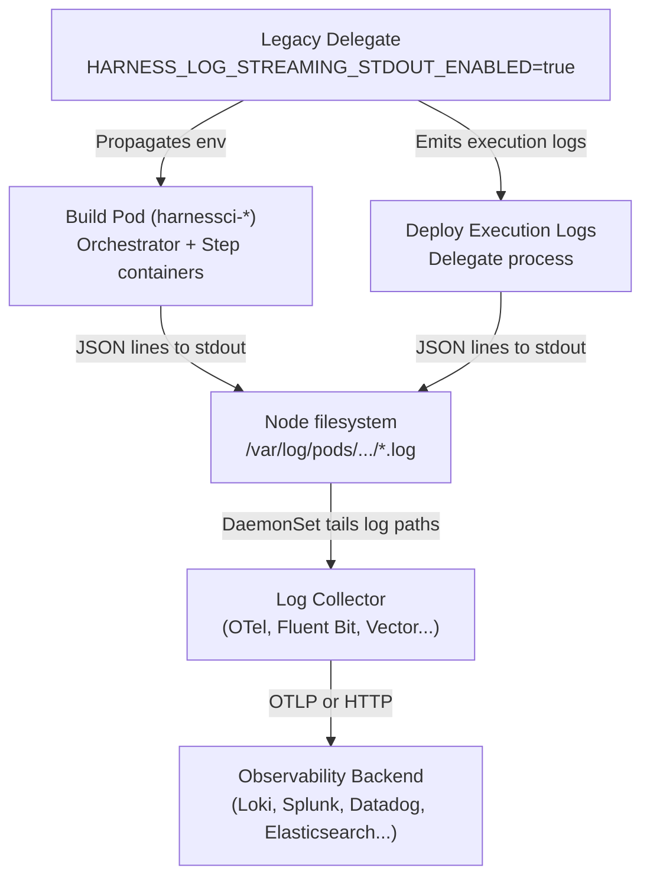

When enabled, Harness streams build and deploy pipeline stage execution logs to stdout as structured JSON, in parallel with the standard Harness Log Service. A log collector such as OpenTelemetry Collector, Fluent Bit, or Vector then captures these logs and forwards them to your observability backend.

This functionality offers the following benefits:

- Consolidate build and deploy logs with existing observability data.
- Enable sophisticated search and analytics.
- Configure alerts and custom dashboards.
- Manage log retention and meet compliance requirements.

---

## What will you learn in this topic?

- How [log streaming architecture](#log-streaming-architecture) works.
- Which [delegate and infrastructure combinations](#supported-infrastructure) are supported.
- How to [enable log streaming](#step-1-enable-log-streaming) on your delegate.
- How to [configure log collection](#step-2-configure-log-collection) with OpenTelemetry or other collectors.
- How to [verify log streaming](#step-3-verify-log-streaming) in your observability backend.
- The [log format and schema](#log-format-reference) Harness emits.
- [Example queries](#query-examples) for Loki, Splunk, and Elasticsearch

---

## Before you begin

Before you configure log streaming, ensure that you have:

- A Harness account with access to the **Deploy** stage, **Build** stage, or both.
- A **supported self-managed Delegate** with access to the infrastructure where your build and deploy pipeline stages execute.
- Permission to update the Delegate configuration and set the `HARNESS_LOG_STREAMING_STDOUT_ENABLED` environment variable.
- For Kubernetes deployments, access to the cluster where the Delegate and build stage workloads run.
- A log collector, such as OpenTelemetry Collector, Fluent Bit, Vector, or Promtail, configured to collect logs from the appropriate build and/or deploy stage log paths.
- An observability backend capable of receiving the collected logs, such as Grafana Loki, Splunk, Datadog, or Elasticsearch.

---

## Supported infrastructure

Support for log streaming depends on your delegate type and execution infrastructure:

| Delegate | Execution infrastructure | Status | How logs are collected |
| :-- | :-- | :-- | :-- |
| Self-managed Legacy Delegate | Kubernetes cluster | Supported | A node-level log collector DaemonSet tails build stage pod logs and delegate execution logs, including deploy execution logs. |
| Self-managed Kubernetes Delegate | Kubernetes cluster | Not supported | Kubernetes-based builds on Delegate 3.x do not currently support log streaming. |
| Harness Cloud (hosted build infrastructure) | N/A | Not applicable | Logs are managed by Harness and are not exposed for external collection. |


:::info Kubernetes build support on new delegates

For Kubernetes build infrastructures, log streaming currently supports the **self-managed Legacy Delegate**.

:::

---

## Log streaming architecture

When log streaming is enabled, Harness writes execution logs as structured JSON to stdout.

The log source differs slightly between build and deploy stage:

- **Build stage**: The delegate propagates the log-streaming flag to the containers in build stage pods. The orchestrator container writes stage-level lines, such as setup, step dispatch, and teardown, while each step container writes its execution output as JSON to stdout.
- **Deploy stage**: Deploy execution logs are emitted by the delegate process as structured JSON execution logs.

Because build and deploy stages logs originate from different workloads, the OTel Collector must include the appropriate paths for both log sources.

For Kubernetes:

- Build stage pod logs: `/var/log/pods/<namespace>_harnessci-*/**/*.log`

- Delegate execution logs, including deploy stage task execution: `/var/log/pods/<namespace>_<delegate-name>-*/**/*.log`

The log-streaming enablement is the same for build and deploy stages, but logs are collected from different Kubernetes pod paths.

The example OTel configuration in this topic includes both the build stage pod path and the delegate path required for deploy execution logs.



:::info Harness emits JSON, not OTLP

The Harness execution engine only writes structured JSON to container stdout. It does not speak OTLP natively. The choice of log collector (such as OpenTelemetry Collector, Fluent Bit, Vector, or Promtail) and downstream protocol is entirely yours.

:::

---

## Step 1: Enable log streaming

Enable log streaming by setting `HARNESS_LOG_STREAMING_STDOUT_ENABLED=true`. The same delegate configuration is used for build and deploy stages.

### For Kubernetes environments (Legacy Delegate)

Edit your delegate Deployment manifest and add the environment variable `HARNESS_LOG_STREAMING_STDOUT_ENABLED=true` to the delegate container: 

```yaml
apiVersion: apps/v1
kind: Deployment
metadata:
  name: harness-delegate
  namespace: harness-delegate-ng
spec:
  template:
    spec:
      containers:
        - name: harness-delegate-instance
          env:
            - name: HARNESS_LOG_STREAMING_STDOUT_ENABLED
              value: "true"
```

Apply the manifest and wait for the rollout to complete:

```bash
kubectl apply -f delegate.yaml
kubectl rollout status deploy/harness-delegate -n harness-delegate-ng
```

### For Docker-based delegates

Add the environment variable to your `docker run` command:

```bash
# Replace the placeholders below with your actual delegate environment variables.
docker run -d \
  -e HARNESS_LOG_STREAMING_STDOUT_ENABLED=true \
  -e ACCOUNT_ID=<your-account-id> \
  harness/delegate:<version>
```

After the delegate restarts with log streaming enabled, the setting applies to supported build and deploy pipeline stage executions handled by that delegate. No changes to individual pipeline YAML definitions are required.

---

## Step 2: Configure log collection

Once log streaming is enabled, you can configure your log collector of choice to tail and forward the log records.

For Kubernetes environments, deploy an OpenTelemetry (OTel) Collector DaemonSet in your cluster to tail the node container logs. The `filelog` receiver tails container logs under `/var/log/pods`, and a parser extracts the JSON envelope emitted by Harness.

For deploy and build environments, configure the collector to include:

- Build stage pod logs under `harnessci-*`.
- Delegate pod logs for deploy stage and other delegate-level execution logs.

Below is an example snippet for the OTel Collector configuration. Replace `<your-namespace>` and `<your-delegate-name>` with your actual values:

```yaml
receivers:
  filelog:
    # Tail build stage pods (prefixed with harnessci-) and delegate execution logs
    include:
      - /var/log/pods/<your-namespace>_harnessci-*/**/*.log # For build stage
      - /var/log/pods/<your-namespace>_<your-delegate-name>-*/**/*.log # For deploy stage
    start_at: end
    include_file_path: true
    operators:
      # Parse CRI log format: <time> <stream> <flags> <log>
      - type: regex_parser
        regex: '^(?P<time>[^ ]+) (?P<stream>stdout|stderr) (?P<flags>[^ ]+) (?P<log>.*)$'
        on_error: send
        timestamp:
          parse_from: attributes.time
          layout: '%Y-%m-%dT%H:%M:%S.%LZ'
      # Parse the nested JSON envelope written by the containers
      - type: json_parser
        parse_from: attributes.log
        if: 'attributes["log"] matches "^\\{.*"'
        on_error: send

processors:
  batch:
    timeout: 2s
    send_batch_size: 500
  resource:
    attributes:
      - key: service.name
        value: harness
        action: insert

exporters:
  otlphttp:
    endpoint: http://<your-backend-endpoint>:3100/otlp

service:
  pipelines:
    logs:
      receivers: [filelog]
      processors: [batch, resource]
      exporters: [otlphttp]
```
The two `include` entries serve different purposes. If you use both build and deploy stages, keep both paths in the collector configuration.

:::tip Other collectors work similarly

You can configure other collectors, such as **Fluent Bit**, **Vector**, or **Promtail**, to tail the same pod directories (`/var/log/pods/`) and parse the container logs as JSON before forwarding them to your backend.

:::

---

## Step 3: Verify log streaming

Perform the following steps to verify the log streaming:

1. Run a build stage or deploy pipeline handled by the configured delegate.
2. Check your collector DaemonSet logs:

   ```bash
   kubectl logs -l app=otel-collector -n <your-namespace> --tail=20
   ```

3. Query your observability backend for logs with `service.name = "harness"`.
4. Verify that the expected pipeline execution logs are present.
   - For build stage, verify logs generated by the build stage pod.
   - For deploy stage, verify execution logs collected from the delegate pod.

---

## Log format reference

Build and deploy execution logs are written as structured JSON objects. The schema is identical for both build stage and deployment stage steps.

<details>
<summary>Example: Build stage log</summary>

This example shows a log line from a build stage executing a container step:

```json
{
  "timestamp": "2026-08-11T10:15:30.123456789Z",
  "level": "INFO",
  "message": "Successfully built image docker.io/myorg/myapp:v1.2.3",
  "logType": "EXECUTION_LOGS",
  "logAbstractions": {
    "accountId": "abc123xyz",
    "orgId": "default",
    "projectId": "ecommerce",
    "pipelineId": "build_and_push",
    "runSequence": "42",
    "planExecutionId": "exec_abc123def456",
    "stageIdentifier": "build_stage",
    "stepIdentifier": "build_and_push_image"
  },
  "logContext": {
    "taskId": "task_ci_build_001"
  }
}
```

This log record captures the output from a container image build step. The `stepIdentifier` shows which step generated the log, and `runSequence` indicates this is the 42nd execution of the pipeline.

</details>

<details>
<summary>Example: Deploy stage log</summary>

This example shows a log line from a deploy stage executing a Kubernetes Apply step:

```json
{
  "timestamp": "2026-08-11T14:32:15.789012345Z",
  "level": "INFO",
  "message": "kubectl apply -f deployment.yaml --namespace production",
  "logType": "EXECUTION_LOGS",
  "logAbstractions": {
    "accountId": "abc123xyz",
    "orgId": "default",
    "projectId": "ecommerce",
    "pipelineId": "deploy_prod",
    "runSequence": "156",
    "planExecutionId": "exec_8f3a9b2c",
    "stageIdentifier": "deploy_stage",
    "stepIdentifier": "apply_manifests"
  },
  "logContext": {
    "taskId": "task_k8s_apply_001"
  },
  "logKey": "accountId:abc123xyz/orgId:default/projectId:ecommerce/pipelineId:deploy_prod/runSequence:156",
  "commandUnit": "Execute"
}
```

This log record shows the exact kubectl command executed during deployment. Deploy stage execution logs may include additional fields like `logKey` and `commandUnit` that are not present in build stage logs.

</details>

### Field reference

| Field | Description |
| :-- | :-- |
| `timestamp` | UTC timestamp in RFC 3339 nanosecond format. |
| `level` | Log level: `INFO`, `WARN`, `ERROR`. Note that for Kubernetes build pod stdout, this is currently hardcoded to `INFO` on the stdout stream. Severity-based filtering can be done on the message content downstream or by relying on the original Harness Log Service. |
| `message` | The actual log line content. |
| `logType` | Always `EXECUTION_LOGS` for the pipeline execution output. |
| `logAbstractions.accountId` | Your Harness account identifier. |
| `logAbstractions.orgId` | The organization identifier. |
| `logAbstractions.projectId` | The project identifier. |
| `logAbstractions.pipelineId` | The pipeline identifier. |
| `logAbstractions.runSequence` | The run number (or run sequence). |
| `logAbstractions.planExecutionId` | The unique execution ID for this pipeline run. |
| `logAbstractions.stageIdentifier` | The stage that produced the log. |
| `logAbstractions.stepIdentifier` | The identifier of the step that produced this line, or `engine` for stage-level orchestration lines. |
| `logContext.taskId` | The delegate task ID (present when available). |

:::info Delegate and deploy execution logs

Delegate-level execution logs, including deploy stage task execution logs, use the same general structured JSON format.

These records can also include the following fields when available:
- `logKey`: Harness internal log key associated with the execution log.
- `commandUnit`: Command unit name, such as `Execute`.

These two fields are not present in standard build stage step log records.

:::

---

## Query examples

The following query examples assume the default `service.name` (`harness`) tags configured in the steps above.

### Grafana Loki (LogQL)

```logql
# Query all Kubernetes build logs
{service_name="harness"}

# Filter by a specific pipeline
{service_name="harness"} | json | logAbstractions_pipelineId="build_and_push"

# Filter for errors by inspecting message content
{service_name="harness"} |~ "(?i)(error|failed|exception|panic)"
```

### Splunk (SPL)

```spl
index=harness sourcetype="_json"
| spath "logAbstractions.pipelineId"
| search "logAbstractions.pipelineId"="build_and_push"
```

### Elasticsearch (KQL)

```kql
logAbstractions.pipelineId: "build_and_push" AND level: "ERROR"
```

---

## Resiliency and data safety

Because log streaming writes logs in parallel to the standard flow, **Harness UI logs are unaffected by outages in your external log collector or observability backend**. The collector handles buffering and retries asynchronously.

| Outage Scenario | Collector Behavior | Data Impact |
| :--- | :--- | :--- |
| Log collector restarts | The collector tracks its read position (offset) in each log file. Upon restart, it resumes reading from that offset. | No data lost (as long as files have not been rotated or pruned on disk). |
| Backend is temporarily down | The collector buffers logs in a sending queue and retries with exponential backoff. | No data lost (within the buffer and retry window). |
| Backend is down for an extended period | The sending queue becomes full. Once the queue is full, the oldest buffered log entries are dropped. | Logs may be lost on the collector side (only the external copy; Harness UI logs remain fully intact). |
| Collector crashes | In-memory buffers and queue states are lost. | Minimal data lost (limited to in-flight batches that were not yet flushed to the backend). |

---

## FAQs

<details>
<summary>Is the log-streaming setup different for build and deploy stages?</summary>

No. Both build and deploy stages use the same delegate-level enablement: `HARNESS_LOG_STREAMING_STDOUT_ENABLED=true`. However, the log collection paths are different:

- Build stage execution logs are collected from build stage pods: `/var/log/pods/<namespace>_harnessci-*/**/*.log`
- Deploy stage execution logs are collected from the delegate pod: `/var/log/pods/<namespace>_<delegate-name>-*/**/*.log`

The example OTel configuration in this topic includes both paths.

</details>

<details>
<summary>Do I have to use the OpenTelemetry Collector?</summary>

No. The Harness execution engine writes logs as structured JSON to container stdout. You can use any container log collector (such as OpenTelemetry Collector, Fluent Bit, Vector, Promtail, or Datadog Agent) that can tail those targets.

</details>

<details>
<summary>Does enabling this feature affect the logs I see in the Harness UI?</summary>

No. Logs continue to flow to the Harness Log Service unchanged. The external stream is a separate copy emitted for your log collector.

</details>

<details>
<summary>Do I need to change my pipeline YAML to enable log streaming?</summary>

No. The feature is controlled by the `HARNESS_LOG_STREAMING_STDOUT_ENABLED` environment variable on the delegate. All pipelines running on that delegate automatically stream logs.

</details>

<details>
<summary>Does this feature work with Harness Cloud build infrastructure?</summary>

No. The feature requires a supported self-managed Delegate deployment. Harness Cloud build infrastructure is fully hosted and managed by Harness.

</details>

<details>
<summary>Will log streaming work with Delegate 3.x on Kubernetes?</summary>

No. Kubernetes-based builds on Delegate 3.x do not currently support log streaming. Only self-managed Legacy Delegate supports this feature for Kubernetes build infrastructure.

</details>

<details>
<summary>What is the performance impact of enabling log streaming?</summary>

Minimal on the Harness execution side. The dual write uses a non-blocking JSON marshalling and stdout/file write per log line. The bulk of the overhead is handled asynchronously by your log collector.

</details>

<details>
<summary>How do I disable log streaming?</summary>

Set `HARNESS_LOG_STREAMING_STDOUT_ENABLED=false` on the delegate and restart. Existing pipeline executions continue using their current configuration. New pipeline executions use the updated delegate configuration after the delegate restarts.

</details>

---

## Related concepts

Now that you understand log streaming for build and deploy pipelines, explore related infrastructure and logging topics:

- [Kubernetes deployments](/docs/continuous-delivery/deploy-srv-diff-platforms/kubernetes/kubernetes-deployments-overview): Deploy applications to Kubernetes clusters. Log streaming captures all Kubernetes deployment step logs (such as Apply, Rolling, Blue Green) as structured JSON.
- [Set up a Kubernetes cluster build infrastructure](/docs/continuous-integration/use-ci/set-up-build-infrastructure/k8s-build-infrastructure/set-up-a-kubernetes-cluster-build-infrastructure): Learn how to configure a self-managed Kubernetes build farm for build stages.
- [Customize delegate logging](/docs/platform/delegates/manage-delegates/customize-delegate-logging): Configure log patterns and levels for the delegate process itself.
- [Continuous Integration](/docs/continuous-integration): Learn how to build, test, and verify code using Harness build stage.
- [Continuous Delivery](/docs/continuous-delivery): Learn how to deploy and manage application delivery using Harness deploy stage.
