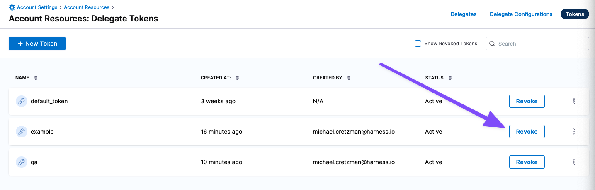

import Tabs from '@theme/Tabs';
import TabItem from '@theme/TabItem';

:::info Important note
You need to have **Create/Edit Delegate** permission to create and manage delegate tokens. For more information, go to [Permissions reference](/docs/platform/role-based-access-control/permissions-reference).
:::

Harness uses delegate tokens to encrypt communication between Harness Delegates and the Harness Manager. By default, when a new Harness account is created, all Harness Delegates in that account share the same token.

Delegate tokens act as secret keys to encrypt and decrypt JWT tokens, ensuring sensitive data remains protected during transmission. These tokens are never transmitted directly.

You can enhance security by replacing the default delegate token with new tokens. This allows you to add and revoke tokens according to your governance policies, rotate tokens as needed, and store them in a secret manager.

### Generate a new delegate token

<Tabs>
<TabItem value="Manual">
To generate a new delegate token:

1. Navigate to **Settings** of your scope (Account, organizations, or Project). We will use Account scope for this example.

2. In **Account-level resources**, navigate to **Delegates**, then select **Tokens**.

3. Select **New Token**.

4. Enter a name for the new token and select **Apply**. The new token is created and appears in the list using the name you provided.

5. Copy and save the token value. You can now update your delegates with the new token.

6. To view more about a token, select the **More Options** (&vellip;) menu. Here you can view more information about the token or copy the token value.
</TabItem>
<TabItem value="Interactive">
  <iframe
    src="https://app.tango.us/app/embed/c30db2fd-2e31-4d21-bd59-a3cf50f86b70"
    style={{ minHeight: '640px', width: '80%', border: 'none' }}
    sandbox="allow-scripts allow-top-navigation-by-user-activation allow-popups allow-same-origin"
    security="restricted"
    title="Create Delegate Token in Harness"
    referrerPolicy="strict-origin-when-cross-origin"
    frameBorder="0"
    allowFullScreen
  />
</TabItem>
</Tabs>

## Update existing delegates with new tokens

You can update an existing delegate with a new token value and then restart the delegate.

### Kubernetes delegate

To update a Kubernetes delegate with a new token:

1. Open your `harness-delegate.yaml` file.

2. Update the `DELEGATE_TOKEN` and `UPGRADER_TOKEN` values with your new token.

3. Apply the changes:
   ```bash
   kubectl apply -f harness-delegate.yaml
   ```
   The delegate pods will restart automatically with the new token.

### Docker delegate

To update a Docker delegate with a new token:

1. Stop the existing delegate containers:
   ```bash
   docker stop <delegate_container_id>
   docker stop <upgrader_container_id>
   ```

2. Restart the delegate with the new token in the environment variable: `DELEGATE_TOKEN=<new_token>`

3. Restart the upgrader with the new token in the environment variable: `UPGRADER_TOKEN=<new_token>`

You can verify the token update using `docker exec <container_id> env`.

## Revoke Delegate tokens

Harness loads tokens during the delegate startup process as part of the connection heartbeat. When you change the delegate token, you must restart the delegate cycle process.

When you revoke a token, all delegates using that token are immediately disconnected and stopped.

To revoke tokens, do the following:

1. On the **Tokens** page, select **Revoke** next to the token you want to remove.

   

2. Confirm by selecting **Revoke**. The token is immediately revoked and will no longer appear in the list.

## Delete Delegate tokens

:::info Note
You can only delete tokens that have been revoked. 
:::
<Tabs>
<TabItem value="Manual">
To delete a token, do the following:

1. On the **Tokens** page, select **Revoked Tokens** next to the +New Token button. It will list all the revoked tokens.

2. Select the token you want to delete and select **Delete**.

3. Confirm by selecting **Delete**. The token is immediately deleted and will no longer appear in the list.

</TabItem>
<TabItem value="Interactive">
    <iframe 
    src="https://app.tango.us/app/embed/8ee400d8-d23c-419e-9029-a6e0f4a05683" 
    style={{ minHeight: '640px', width: '80%', border: 'none' }}
    sandbox="allow-scripts allow-top-navigation-by-user-activation allow-popups allow-same-origin" 
    security="restricted" 
    title="Revoke Tokens in Harness" 
    referrerpolicy="strict-origin-when-cross-origin" 
    frameborder="0" 
    allowfullscreen
    />
</TabItem>
</Tabs>

## Rotate Delegate tokens

You can rotate and store your delegate tokens in a third-party secret manager and reference them as needed.

:::info note
If you rotate your delegate tokens, you must redeploy the delegate.
:::

To rotate your tokens, do the following:

1. Create your delegate token through the [API](https://apidocs.harness.io/tag/Delegate-Token-Resource#operation/createDelegateToken). The delegate token API returns the token value.
2. Add the delegate token to a secret manager, such as HashiCorp Vault.
3. When you deploy the delegate pod, reference the delegate token from the secret manager.

   For example, to reference the delegate token stored in the HashiCorp Vault, do the following:

   * Add the below annotations in the [delegate Helm chart](https://github.com/harness/delegate-helm-chart):

      ```yaml
      vault.hashicorp.com/agent-inject: true
                    vault.hashicorp.com/agent-inject-secret-secret1: <delegate_token> //delegate token referenced in hashicorp vault
                    vault.hashicorp.com/agent-inject-status: injected
                    vault.hashicorp.com/agent-inject-template-secret1:
                      {{ with secret "<delegate_token>" }}                           //delegate token referenced in hashicorp vault
                      export DELEGATE_TOKEN="{{ .Data.data.DELEGATE_TOKEN }}"
                      {{ end }}
                    vault.hashicorp.com/auth-config-type: iam
                    vault.hashicorp.com/role: qa-cloudtrust-infrastructure
      ```

   :::info note
   This example shows how to use HashiCorp Vault. Other secret managers require different setup steps and Helm chart annotations.
   :::
