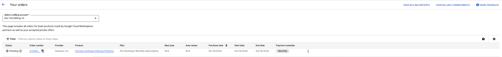

### What is Google Cloud Marketplace?
[Google Cloud Marketplace](https://cloud.google.com/marketplace?hl=en) enables software vendors to offer their products and services to customers directly through Google Cloud Platform (GCP). It provides a convenient platform for users to discover, purchase, and deploy software solutions directly from Google Cloud Console or through APIs.

### Which Harness products are currently available on Google Cloud Marketplace?
     | **Product** | **Private Offer Flow** | **Public Offer Flow** |
     | --- | --- | --- |
     | [Harness Software Delivery Platform](https://console.cloud.google.com/marketplace/product/harness-public/harness-software-delivery-platform)| Yes | No |
     | [Harness Continuous Delivery](https://console.cloud.google.com/marketplace/product/harness-public/harness-continuous-delivery) | Yes | Yes |

### How can customers purchase Harness products via the Google Cloud Marketplace Private Offer Flow? 
    There are two ways to initiate the private offer flow with Harness:
        1. If you have an existing relationship with Harness, then Harness can collect the required customer details, create an offer, and send you a private offer so that you pay a custom price for the software.
        2. If you're interested in a Harness product and want to request a custom quote for it, you can contact Harness' sales team by selecting **Contact Sales**.

            

    #### Step 1: Details required from the customer by Harness to create a private offer:
        - The Harness product(s) the customer is interested in procuring.
        - Customer Organization
        - Customer Contact Name
        - Customer Email
        - Customer's Google cloud billing account ID
        - Contract start date

    #### Step 2: Steps to accept the Harness private offer:
        1. Once the private offer has been created and published, the customer can be informed via the email and/or by sending across the offer URL.
        2. The customer will receive the email that looks like: 
        3. Upon clicking the review offer link received via the email, the customer will be able to view the offer details and also accept the offer. 
        
        4. As soon as the offer is accepted customer can view the status of the order on the product page as well as the manage orders link.
        
        5. When you navigate to the Marketplace > Orders section you should see an order in pending state. Harness system is currently approving and activating your account. The activation may take 1-5 minutes.
        
        
        6. Once the account has been activated, customer will be able to see the status updated on the orders.
        
        7. At this point the account has been activated. 
        8. As the last step customer will have to reach out to Harness sales rep that assisted with the private offer, in order to provision the product licensing.

    ### How can customers purchase the Harness products via Google Cloud Marketplace Public Offer Flow? 
        A Google Cloud Marketplace public listing refers to a software or service offering that is publicly available and accessible to all users of the Google Cloud Platform (GCP). When a product or service is listed as "public" on the Google Cloud Marketplace, it means that any GCP customer can discover, evaluate, and potentially deploy that offering within their own cloud environment. 
        
        This is the self serve model where the user can discover the product, view the pricing of the product, make the purchase and start using the product as soon as the order/account is approved.
        Harness currently offers following  products as public listings:
        *   [Harness Continuous Delivery](https://console.cloud.google.com/marketplace/product/harness-public/harness-continuous-delivery) 

        #### Please follow the steps below in order to subscribe to the publicly listed Harness product:
            1. Customers can find the Harness listings by simply searching for 'Harness' on the Google Cloud Marketplace products. 
            2. Navigate to the Harness product you want to subscribe to.
            3. If the product is listed publicly, as a customer you should be able to view the pricing and see a subscribe button:
            
            4. Please click on the subscribe to view the terms and offered plans. 
            5. As a customer once you select the plan and finalize the subscription you will be provided with two options:
                1. Sign up with the provider
                2. Manage orders
            6. As a customer you will view the Harness signup page upon clicking 'Signup with the provider' option. This option will take the customer signup information and create the account for the respective email id provided during the sign up process.
            7. At this point the customer will be able to login and start using the product. Please reach out to the Harness support for any issues encountered. 

