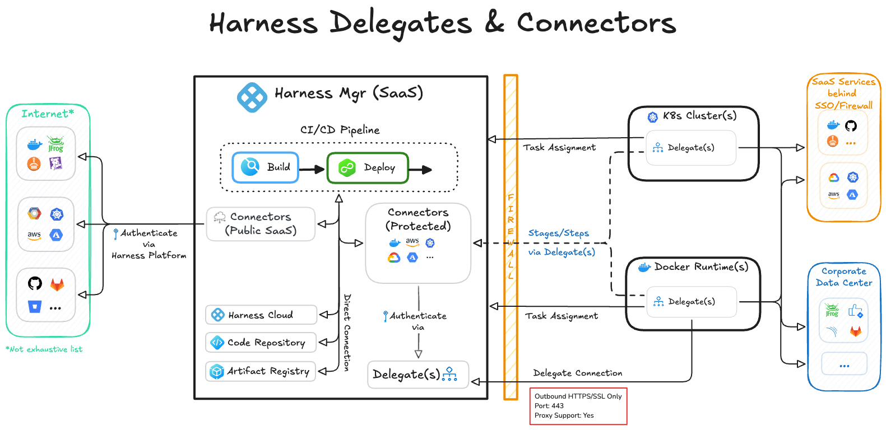

The Harness Platform provides a common framework underlying the Harness modules to help you onboard and enable diverse teams leveraging different modules for different use cases.

This page describes key concepts related to Harness Platform features and functionality, such as your Harness account, organizations, projects, delegates, RBAC, global settings, and more.

Harness modules include Harness Continuous Integration (CI), Harness Continuous Delivery (CD), Harness Security Testing Orchestration (STO), and so on. In addition to each module's unique features, some modules share common or similar features, such as pipelines. To learn more about module features, functionality, and key concepts, go to the [documentation](https://developer.harness.io/) for the module you're interested in. For example, for information about deploying services, go to [Continuous Delivery key concepts](/docs/continuous-delivery/get-started/key-concepts.md).

## Account

Your Harness account is the entity at the highest [scope](/docs/platform/role-based-access-control/rbac-in-harness.md#permissions-hierarchy-scopes). It contains [organizations and projects](#role-based-access-control-rbac) as well as global settings and resources.

Resources, such as [connectors](#connectors), can be added at all scopes (account, organization, or project), and they are available to all lower scopes.

Creating a thoughtful hierarchy of organizations and projects in your account allows teams to  manage their organization-level and project-level resources without relying on account admins.

### Account information

For instructions on accessing your account, go to the [Platform onboarding guide](./onboarding-guide.md).

You can find information about your account on the [Account Overview page](/docs/platform/get-started/subscriptions-licenses/view-account-info-and-subscribe-to-alerts), such as your Harness Account Name, Account ID, the Harness SaaS cluster that hosts your account, as well as the [module subscription and license information](/docs/platform/get-started/subscriptions-licenses/subscriptions). You'll need this information to configure your delegates, Terraform provider, CLI, and other automation tools that help in administering your account.

Note that this information is different for the [Self-Managed Enterprise Edition](/docs/self-managed-enterprise-edition.md), which is not a SaaS offering.

## Organizations and projects

Within your Harness account, you'll likely have multiple Harness [organizations and projects](/docs/platform/organizations-and-projects/projects-and-organizations).

Harness organizations (or orgs) allow you to group projects that share the same goal. Each org can have many Harness projects containing Harness pipelines, users, and resources that share the same goal.

For example, organizations can represent a business unit within your company, while projects represent application development teams within that business unit.

Using [Harness RBAC](#role-based-access-control-rbac), you can disperse administration of organizations and projects to their respective owners. For example, you can use the **Project Admin** role to designate an administrator for a specific project.

Once control is delegated to administrators at the organization or project level, those administrators can invite their team members and independently create/manage their own module and platform components without any possibility of accidental misconfiguration from another team.

Projects are a shared space where teams can work independently on similar technologies without relying on account or org admins for new entities.

## Role-based access control (RBAC)

[Harness RBAC](/docs/platform/role-based-access-control/rbac-in-harness) empowers you to control access at all [scopes](https://developer.harness.io/docs/platform/role-based-access-control/rbac-in-harness#permissions-hierarchy-scopes), from the global account scope down to granular entity-specific access to individual pipelines.

Harness RBAC is comprised of [principles, resource groups, and roles](https://developer.harness.io/docs/platform/role-based-access-control/rbac-in-harness#rbac-components). Principals include users, user groups, and service accounts. Roles and resource groups define permissions sets, including what actions a principal can take and what entities they can take those actions on. You assign roles and resource groups to principals.

### User and group management

Harness provides a comprehensive feature set for user and user group management.

A Harness user is any individual registered with Harness with a unique email address. You can [add/remove users](/docs/platform/role-based-access-control/add-users) manually or via automated user provisioning integrations using Okta SCIM, Microsoft Entra ID SCIM, OneLogin SCIM and just-in-time SAML.

Harness offers several options for users to [authenticate](https://developer.harness.io/docs/platform/authentication/authentication-overview) into their Harness account. You can choose which option to configure according to your needs:

- Username and password
- Public OAuth Providers like Google, GitHub, GitLab, LinkedIn, Azure & BitBucket
- SAML Providers like Azure, Okta & OneLogin
- LDAP

You can also [organize users into user group](https://developer.harness.io/docs/platform/role-based-access-control/add-user-groups). You can assign roles and resource groups to user groups to quickly configure permissions for a set of users at once, rather that managing each user individually.

User groups are also useful for configuring notification settings. Notifications can be configured with email/alias, Slack Webhook, Microsoft Teams Webhook and PagerDuty as channels.

### Service accounts and API keys

[Service accounts](/docs/platform/role-based-access-control/add-and-manage-service-account) are similar to users but without any human user association, since they are meant for external systems to integrate with the Harness Platform.

You assign roles and resource groups to service accounts, just as you would a user. Then you create API keys for the service account to authenticate and authorize remote services attempting to perform operations in Harness through Harness APIs. API keys inherit the role bindings assigned to the service account.

Similarly, when you create an API key for a personal user account, the API key inherits the user's permissions.

## Governance using Policy as Code

Add governance guardrails with policies based on Open Policy Agent (OPA).

[Use built-in sample policies or write your own.](/docs/platform/governance/policy-as-code/harness-governance-overview)

## Secrets management

Harness includes built-in secrets management to store your encrypted secrets, such as access keys, and use them in your Harness account. Harness also integrates with all popular secrets managers.

For more information, go to [Harness secrets management overview](/docs/platform/secrets/secrets-management/harness-secret-manager-overview).

## Delegates

[Harness Delegates](/docs/platform/delegates/delegate-concepts/delegate-overview) are lightweight worker processes that you install on your infrastructure (such as a Kubernetes cluster). Delegates connect to the Harness Platform (also referred to as the Harness Manager) to perform tasks using your container orchestration platforms, artifact repositories, monitoring systems, and so on. Delegates communicate only via outbound HTTP/HTTPS to the Harness Platform.

This enables the Harness Platform to leverage the delegate to execute Harness tasks on your behalf, without any of your secrets leaving your network.

The delegate is key to enabling Harness to perform tasks on your behalf, but you don't need to install it right away. You can install the delegate while setting up your pipelines or connectors. The Harness Platform guides you through the process.

<figure>

<figcaption>Diagram of Harness Delegate architecture</figcaption>
</figure>

Harness GitOps Agent

The Harness GitOps Agent is similar to the Harness Delegate, but it handles GitOps based workflows and management. 

GitOps is part of Harness CD. For more information, go to [Install a Harness GitOps Agent](/docs/continuous-delivery/gitops/connect-and-manage/install-a-harness-git-ops-agent) and [Delegate and GitOps Agent strategy](https://www.harness.io/blog/delegates-and-agents-onramp-to-scale-with-harness).

This video describes the Harness Delegate and GitOps Agent Strategy.

<DocVideo src="https://www.youtube.com/watch?v=_4k4I8g-Fo0" />

## Connectors

[Harness connectors](/docs/category/connectors) contain the information necessary to integrate and work with 3rd party tools. For example, a GitHub connector authenticates with a GitHub account and repo and fetches files as part of a build or deploy stage in a pipeline.

Harness offers many types of connectors, including:

- [Code repo connectors](/docs/category/code-repositories)
- [Artifact repo connectors](/docs/category/artifact-repositories)
- [Cloud provider connectors](/docs/category/cloud-providers)
- [Monitoring and logging system connectors](/docs/platform/connectors/monitoring-and-logging-systems/connect-to-monitoring-and-logging-systems)
- [Ticketing system connectors](/docs/category/ticketing-systems-1)

## Pipelines

Pipelines are a feature of several Harness modules. Pipelines represent a workflow, and, in Harness, they are comprised of pipeline-level settings, [stages](#stages), and [steps](#steps-and-step-groups). Pipelines can be a cyclical process that include integration, delivery, operations, testing, deployment, real-time changes, and monitoring.

For example, a pipeline can use the CI module to build, test, and push code, and then a CD module to deploy the artifact to your production infrastructure.

Pipelines are triggered manually in the Harness Platform or automatically in response to Git events, schedules, new artifacts, and so on.

### Pipeline Studio

In Harness, you can write pipelines in YAML or build pipelines visually in the Pipeline Studio.

* The **Visual editor** provides a GUI experience where you can easily configure settings, add and remove steps and stages, and drag-and-drop steps and stages to rearrange them, organize them in parallel, or add or remove them from step groups.
* The **YAML editor** provides a [text editor experience for creating pipelines](/docs/platform/pipelines/harness-yaml-quickstart.md). You can also user the [Harness Git Experience](#git-experience) to manage your Harness YAML entities from your Git repos.

You can freely switch between the two editors. When editing a pipeline in Harness, use the selector at the top of the Pipeline Studio to switch between the Visual and YAML editors.

### Stages

A [stage](/docs/platform/pipelines/add-a-stage.md) is a subset of a pipeline that contains the logic to perform one major segment of the pipeline process. Stages are based on the different milestones of your pipeline, such as building, approving, and delivering.

Some stages, like a deploy stage, use strategies that automatically add the necessary steps.

### Steps and step groups

A step is an individual operation in a stage. Harness offers many steps, from specialized steps to generic scripting steps.

Steps can run sequentially or in parallel. You can also organized related steps into step groups.

Usually, a step group is a collection of steps that share the same logic, such as the same rollback strategy.

For more information, go to [Run Steps in a Step Group](/docs/continuous-delivery/x-platform-cd-features/cd-steps/step-groups/) and [Organize steps in step groups](/docs/platform/pipelines/use-step-groups.md).

### Templates

[Templates](/docs/platform/templates/template) enhance developer productivity, reduce onboarding time, and enforce standardization across the teams that use Harness. You can create templates for steps, step groups, stages, and pipelines.

## Automation

Harness offers several approaches for automating management of Harness entities in your account:

- [Terraform Provider](/docs/category/terraform-provider)
- [Harness CLI](/docs/category/cli)
- [Harness API](/docs/category/api)

## Harness Manager

The *Harness Manager* can be a synonym for the Harness Platform and it can refer to "inline" (within the platform) storage and management of configurations and pipelines. It can also refer to the orchestration and handling of internal Harness functions, for example, when you run a pipeline.

## Git Experience

With the [Harness Git Experience](/docs/platform/git-experience/git-experience-overview), you can sync your Harness account, orgs, and projects with your Git repo to manage Harness entirely from Git.

Components that you can write in YAML can also be managed purely through Git with the Git Experience.

## FirstGen vs NextGen

:::warning

Eventually all FirstGen accounts will be migrated to NextGen.

FirstGen Harness CD reached EOL on December 30, 2023, and EOS on March 30, 2024.

:::

Harness FirstGen and Harness NextGen are two versions of the Harness product suite.

* Harness FirstGen is the legacy or earlier version of Harness. It covers common platforms but didn't include all Harness modules.
* Harness NextGen is Harness' new version with a redesigned experience and new Continuous Integration, Feature Flags, Security Testing Orchestration, Service Reliability Management, Cloud Cost Management, and Chaos Engineering modules.

The majority of the documentation on the Harness Developer Hub (HDH) applies to Harness NextGen. Until all FirstGen accounts are migrated, you can find the [FirstGen documentation on HDH](/docs/first-gen). The documentation in all other sections applies only to NextGen features.

For more information, go to the [Upgrade guide](/docs/continuous-delivery/get-started/upgrading/upgrade-nextgen-cd.md).
