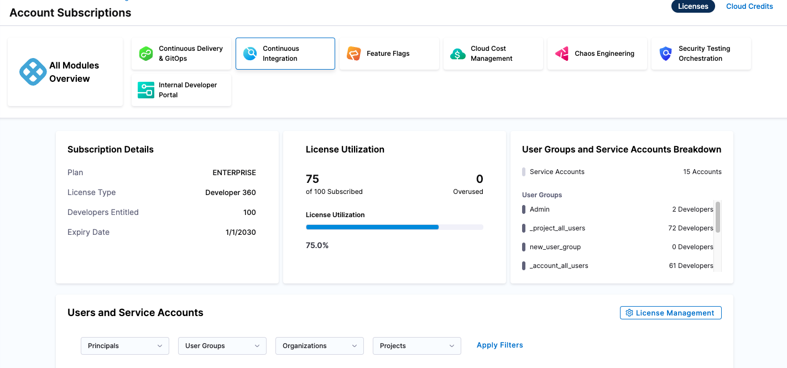
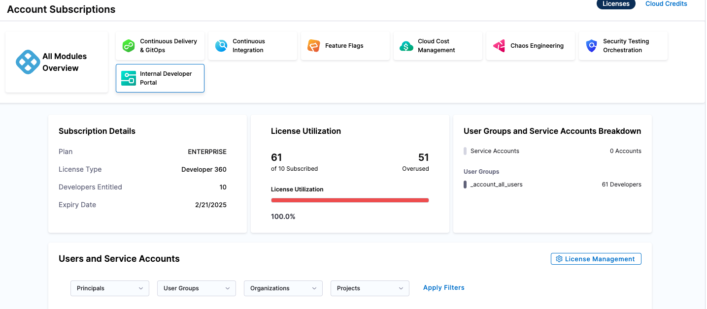
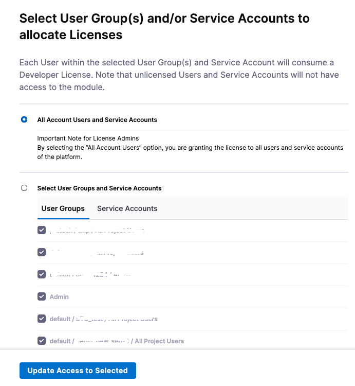

import Manage from '/docs/platform/shared/subscription-manage.md';
import View from '/docs/platform/shared/subscription-view-subscriptions.md';
import Cloud from '/docs/platform/shared/subscription-cloud-credits.md';

You can view and manage module subscription details as well as license information directly within your Harness account. This includes monitoring current subscriptions, reviewing license allocations, and adjusting as necessary to meet your organizational needs.

## Developer 360 subscriptions

You can subscribe to Harness modules using the [Developer 360](https://www.harness.io/pricing) subscription model. The Developer 360 subscription offers two plans: **Free** and **Enterprise**. All plans include [Harness AI](/docs/category/harness-ai), our AI Development Assistant.

:::info
This model spans all modules except Cloud Cost Management, which is on a *Cloud Spend* model.
:::

The following sections explain how this subscription model works across the various modules on the platform.

### Who is a developer?

A **Developer**  contributes to code development, deployment, security, maintenance, optimization, or all other technical activities related to software code that is managed with Harness.

These users leverage Harness to create code repositories, build, test, secure, and deploy software, conduct chaos experiments, manage SLOs, handle feature flags, and more.

The definition of a **Developer** (and any associated consumption entitlements) remains consistent for **Free** and **Enterprise** plans.

### Modules with direct developer tracking

The following Harness modules are integral to a **Developer's** daily workflow. Each module requires a separate developer license for every user involved.

- **Code Repository (CODE):** All users on the Harness Platform who have permission to access Harness CODE module are considered as **CODE Developers** and consume a license.
- **Continuous Integration (CI):** All users on the Harness Platform who have permission to access Harness CI module are considered as **CI Developers** and consume a license.
- **Internal Developer Portal (IDP):** All users on the Harness Platform who have permission to access Harness IDP module are considered as **IDP Developers** and consume a license.
- **Feature Management & Experimentation (FME)**: All users on the Harness Platform who have permission to access the Harness FME module consume a user seat. Seats represent named users who manage flags, experiments, environments, or integrations within FME.
- **Software Engineering Insights (SEI):** SEI allows admins to explicitly define (import) the list of Developers for whom Insights must be generated. All Developers in this list, explicitly consume a Developer license. These Developers may never login to the Harness Platform, but consume a license by virtue of having Insights generated for their engineering-related work. Insights may often be accessed by management or engineering leadership.

### Modules with no direct developer tracking (consumption entitlements)

All other Harness modules (except CCM) are indirectly involved in a **Developer's** day-to-day workflow, and they track an indirect unit instead of a **Developer** license. Harness refers to these indirect units as **Consumption Entitlements**.

In these cases, the **Developer** license acts as a proxy for granting a predetermined set of consumption entitlements, as explained below.

You have the option to subscribe to additional **Consumption Entitlements** as needed, with an associated additional cost.

Continuous Delivery and GitOps (CD) Services

CD deploys software services onto infrastructure platforms spanning traditional VMs, Kubernetes, public cloud platforms, serverless functions, and other custom deployment targets. A **Service** is an independent unit of software you track and manage through Harness CD and GitOps. This typically maps to:

- A service in Kubernetes.
- A containerized service on a cloud (such as AWS ECS, Azure ACS, or Google Container Engine).
- A VM in the traditional VM-based apps.
- Five serverless functions in serverless environments.

CD tracks **Service** license consumption instead of **Developers**. All **Service** licenses are tracked over a *last 30 days* active window. For more information about CD services and how they are tracked, go to [Service licensing for CD](https://developer.harness.io/docs/continuous-delivery/get-started/service-licensing-for-cd/).

Feature Management & Experimentation (FME) Services

Feature Management & Experimentation (FME) tracks license consumption using **Monthly Tracked Keys (MTKs)** and **User Seats**.

- Monthly Tracked Keys (MTKs) represent the number of unique traffic type identifiers (e.g. `anonymous`) evaluated by FME SDKs in a given month. This measures feature flag and experiment usage at scale. For example, if your app evaluates flags for 500,000 unique end users in September, that counts as 500,000 MTKs toward your subscription.
- User Seats represent the named users (team members) who log into Harness FME to manage flags, experiments, environments, or integrations. Each active user account with access to FME consumes one seat.

FME also enforces service limits for projects, environments, flags, segments, and more to ensure reliability. These limits are not billed, but can be raised by contacting [Harness Support](/docs/feature-management-experimentation/fme-support/).

Service Reliability Management (SRM) Services

SRM helps manage SLOs/SLIs for various services in an R&D organization. A **Service** is an independent unit of software you track & manage through Harness SRM. This typically maps to:

- A service in Kubernetes.
- A containerized service on a cloud (such as AWS ECS or Azure ACS or Google Container Engine).
- A VM in the traditional VM-based apps.
- Five serverless functions in serverless environments.

SRM tracks **Service** license consumption, instead of **Developers**. All Service licenses are tracked over a *last 30 days* active window.

Chaos Engineering (CE) Services

Chaos Engineering (CE) makes it easy to run chaos experiments across diverse services within an R&D organization, aimed at enhancing their resilience. A **Service** represents an autonomous software unit managed and tracked through Harness CE. This typically maps to:

- A service in Kubernetes.
- A containerized service on a cloud (such as AWS ECS, Azure ACS, or Google Container Engine).
- A VM in the traditional VM-based apps.
- Five serverless functions in serverless environments.

CE tracks **Service** license consumption, instead of **Developers**. All Service licenses are tracked over a *last 30 days* active window.

For more information about CE services and how they are tracked, go to [Service licensing for CE](https://developer.harness.io/docs/chaos-engineering/use-harness-ce/license-consumption/).

Harness Database DevOps (DB DevOps) Instances

Harness Database DevOps is a database lifecycle and deployment management module that licenses consumption on a **per Database Instance** basis under the dev360 model.  

Each provisioned DB Instance is considered a licensed unit and consumes one DB Instance entitlement; pricing scales with the number of deployed instances. Subscription details (plan type, subscribed instance limits, start & expiry dates, and live usage metrics) are available in **Account Settings → Subscriptions**. 

For purchases, add-ons, or assistance with renewal or sizing, contact the [Harness Sales Team](https://www.harness.io/company/contact-sales) or open a ticket via the [Harness Support Portal](https://support.harness.io).  

Infrastructure as Code Management (IACM) Executions

An IACM **Execution** is counted as every successful IACM stage execution that uses an Infrastructure Provider's `apply` command (such as `terraform apply`) and results in resource changes.

IACM tracks **Executions** license consumption, instead of **Developers**.

Security Testing Orchestration (STO) Security Scans

A **Security Scan** is defined as the execution of the Security Testing Orchestration (STO) step within a pipeline. This involves scanning a **Target** for security vulnerabilities. A target can be a repository, container image, configuration, or live application.

STO tracks **Security Scans** license consumption, instead of **Developers**. **Security Scans** are tracked over a *last 30 days* active window.

Supply Chain Security (SCS) Supply Chain Executions

A **Supply Chain Execution** is defined as the execution of the Supply Chain Security (SCS) step in a pipeline. Generating SBOMs, enforcing SBOM policies, generating SLSA provenance, or verifying SLSA provenance are all counted as unique SCS steps.

SCS tracks **Supply Chain Executions** license consumption, instead of **Developers**. **Supply Chain Executions** are tracked over a *last 30 days* active window.

### Included and add-on consumption entitlements

The Developer 360 subscription model includes module-specific consumption entitlements by default.

This means every developer license for a module includes a corresponding consumption entitlement, where applicable.

You can always acquire additional consumption entitlements as needed through add-on purchases.

#### Included consumption entitlements

| Harness Module | Included Consumption Entitlement |
|----------------|----------------------------------|
| **Code Repository** | Not applicable since **Developers** are tracked directly|
| **Continuous Integration** | Not applicable since **Developers** are tracked directly|
| **Continuous Delivery & GitOps** | 1 Service for every 3 **Developers** |
| **Service Reliability Management** | 1 Service for every 3 **Developers** |
| **Chaos Engineering** | 1 Service for every 3 **Developers** |
| **Infrastructure as Code Management** | 120 Executions per **Developer** per year|
| **Software Engineering Insights** | Not applicable since **Developers** are tracked directly |
| **Internal Developer Portal** | Not applicable since **Developers** are tracked directly|
| **Security Testing Orchestration** | 100 Security Scans per **Developers** per month |
| **Supply Chain Security** | 100 Supply Chain Executions per **Developers** per month|

#### Add-on consumption entitlements

For every module where a consumption entitlement applies, you can purchase any number of add-on entitlements.

This means you can purchase more:

- Services for CD, SRM, and CE
- Executions for IACM
- Security Scans for STO
- Supply Chain Executions for SCS

### Cloud Cost Management (CCM) Cloud Spend

CCM does not follow the Developer 360 subscription model.

**Cloud Spend** for CCM is licensed as a Monthly/Annual Cloud Spend that is managed and optimized via Harness. This cloud spend is actively tracked in the CCM module experience and tracked against the licensed cloud spend.

## View subscriptions

You can view and manage your Harness module subscriptions in your Harness **Account Settings**.

<View />

## Cloud credits

<Cloud />

## Developer 360 modules subscriptions

For Developer 360 module subscriptions, you can view your subscription details on the Subscriptions page. In your Harness account, go to Account Settings, then select Subscriptions.

On the Subscriptions page, select the Developer 360 modules.

Licenses are now based on developers. License Utilization shows the number of users over the number of licenses subscribed.

With the License Management, customers can directly assign user groups or service accounts to the respective module through this new subscription page. Customers can either assign All Account Users and Service Accounts or Select User Groups and Service Accounts to a specific module.

This is an honor system, where customers report licensed user groups and service accounts. There is no enforcement mechanism even if no users are assigned, modules will remain accessible to all users in the system.

## Manage subscriptions

<Manage />

## Module subscriptions and licenses

For more information about specific module subscriptions and licenses, go to:

- [CI Subscriptions and licenses](/docs/continuous-integration/get-started/ci-subscription-mgmt/)
- [CD Service-based licensing and usage](/docs/continuous-delivery/get-started/service-licensing-for-cd)
- [FME usage and billing](/docs/feature-management-experimentation/management-and-administration/account-usage)
- [SRM subscriptions and licenses](/docs/service-reliability-management/get-started/srm-subscription-licensing)
- [CE license consumption](/docs/chaos-engineering/guides/license-consumption)
- [SEI subscriptions and licenses](/docs/software-engineering-insights/harness-sei/get-started/sei-subscription-and-licensing)
- [CODE subscriptions and licenses](/docs/code-repository/get-started/cr-subscription-mgmt)

## Cloud Marketplace offerings

For information about Cloud Marketplace subscriptions, go to [Cloud marketplace offerings](/docs/category/cloud-marketplace-offerings).
