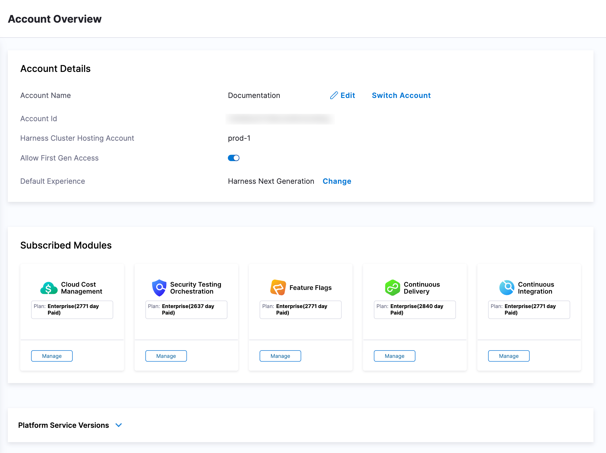
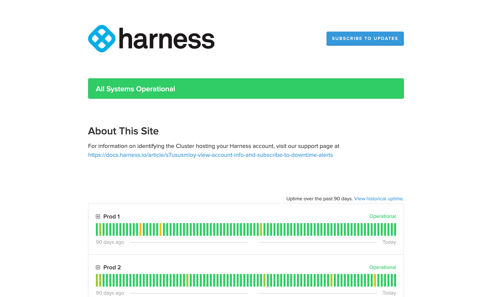

Harness provides a summary of your account information and enables you to subscribe to downtime alerts for the SaaS cluster hosting your Harness account.

## Account overview

To get an overview of your Harness account, go to **Account Settings**. Under **General**, select **Account Details** to open the Account Overview page.

This page shows your **Account Details** and **Subscribed Modules**.

### Account details

The **Account Details** section enables you to view your account information, allow FirstGen access, and set your default experience.

- **Account Name:** Your account name.
- **Account Id:** Your account ID.
- **Harness Cluster:** The Harness cluster assigned to your account.
- **Allow First Gen Access:** This setting allows you to enable and disable FirstGen access for your account.
- **Default Experience:** This setting allows environment administrators to set the default generation landing page for users to ensure the correct Harness experience, Harness First Generation or Harness Next Generation, is provided.

### Subscribed modules

For more information about the **Subscribed Modules** content of this page, go to [Subscriptions and licenses](./subscriptions.md).

## View site status and set downtime alerts

To view site status and subscribe to alerts:

1. In Harness, select **Help**, and then select **Site Status**.

   The status page shows the operational status of the SaaS cluster hosting your account.

   

2. Select **Subscribe to Updates** to get updated if the cluster's status changes.
