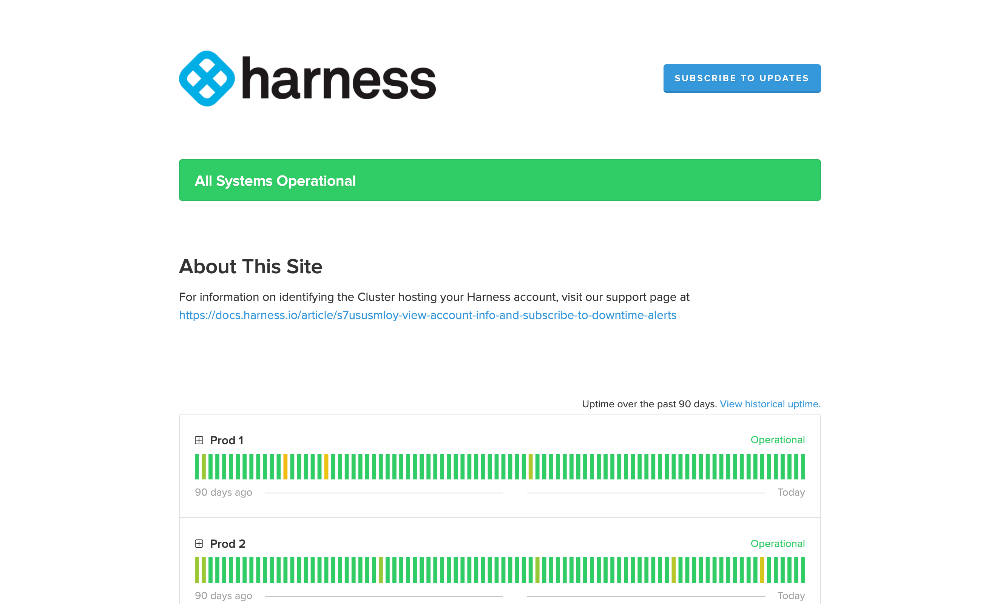

Harness provides a summary of your account information and enables you to subscribe to downtime alerts for the SaaS cluster hosting your Harness account.

## Account overview

To get an overview of your Harness account, go to **Account Settings** and select **Overview**.

Here you can find your account details, check hosting status, and inspect your module [subscriptions and licenses](./subscriptions.md).

## Site status and downtime alerts

To view site status and subscribe to alerts:

1. In Harness, select **Help**, and then select **Site Status**.

   The status page shows the operational status of the SaaS cluster hosting your account.

   

2. Select **Subscribe to Updates** to get updated if the cluster's status changes.
