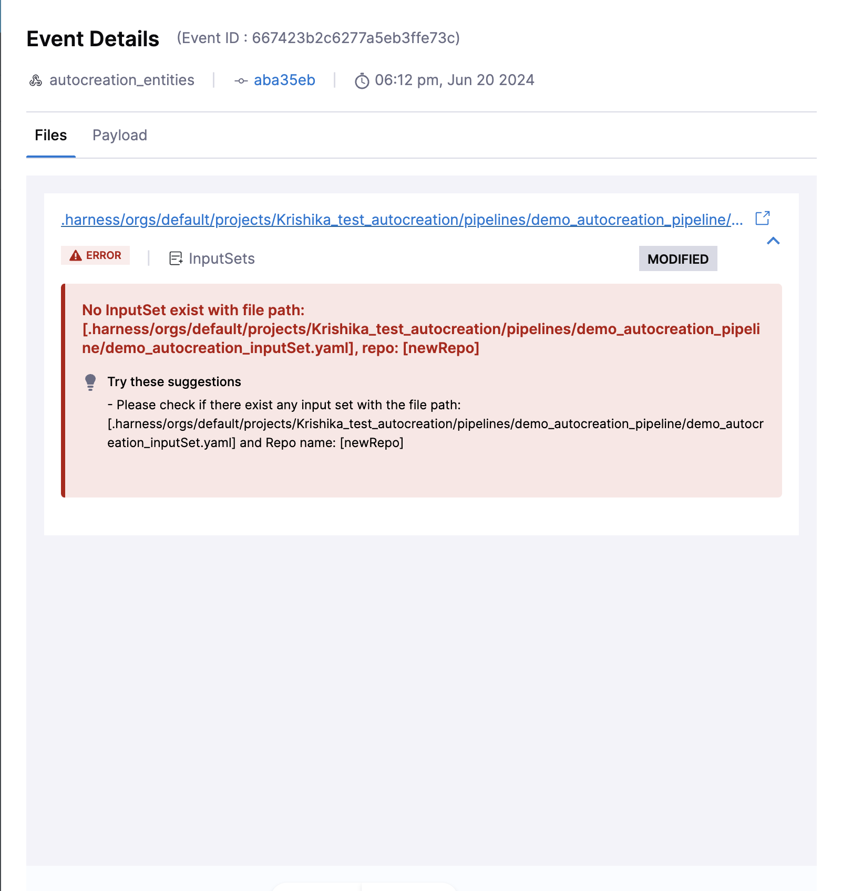

Autocreation is a feature that allows you to automatically create entities in Harness when files are added remotely.

:::info note
Currently this feature is behind the feature flag `PIE_GITX_AUTOCREATION`. Please contact[Harness Support](mailto:support@harness.io) to enable this feature.
:::

## Pre-requisite of autocreation

- Register the webhook for your repository where you are adding your files remotely.
- Files that are added in the default branch(main, master etc).
- Added files should follow naming convention based on the entity type. 

## File Path Convention

There is a file convention specific to each entity. File path will have a key indentifying information. 

:::info note
File path has to start with **.harness**.
:::

We will discuss the file path convention for each entity with an example:-

### Pipelines

File path for storing your pipelines should follow the following naming convention:

`.harness/orgs/<org_identifier>/projects/<project_identifier>/pipelines/<pipeline_identifier>.yaml`

- Folder name should be `pipelines`.

For example :- `.harness/orgs/default/projects/Krishika_test_autocreation/pipelines/demo_autocreation_pipeline.yaml`

- **Organizations directory**: `orgs`
- **Organization identifier**: `default`
- **Projects directory**: `projects`
- **Project identifier**: `Krishika_test_autocreation`
- **Pipelines directory**: `pipelines`
- **Pipeline identifier**: `demo_autocreation_pipeline`


### Input Sets

File path for storing your input set should follow the following naming convention:

 `.harness/orgs/<org_identifier>/projects/<project_identifier>/pipelines/<pipeline_identifier>/input_sets/<input_set_identifier>.yaml`

 - Folder name should be `input_sets`.

Input sets belonging to a pipeline will reside in the directory of pipeline identifier.

For example :- `.harness/orgs/default/projects/Krishika_test_autocreation/pipelines/demo_autocreation_pipeline/demo_autocreation_inputSet.yaml`

- **Organizations directory**: `orgs`
- **Organization identifier**: `default`
- **Projects directory**: `projects`
- **Project identifier**: `Krishika_test_autocreation`
- **Pipelines directory**: `pipelines`
- **Pipeline identifier**: `demo_autocreation_pipeline`
- **Input sets directory**: `input_sets`
- **Input set identifier**: `demo_autocreation_inputSet`

### Templates

1. Account Level

File path for storing template at Account level should follow the following naming convention: 

`.harness/templates/<template_identifier>/<version_label>.yaml`

- Folder name should be `templates`.
- All version labels belonging to a template will reside in the directory of template identifier (deploy is the template identifier in above case with v1 and v2 versions labels.)

For example:- `.harness/templates/template_autocreation/v1.yaml`

- **Templates directory**: `templates`
- **Template identifier**: `template_autocreation`
- **Version label**: `v1`

2. Project Level

File path for storing template at Project level should follow the following naming convention: 

`.harness/orgs/<org_identifier>/projects/<project_identifier>/templates/<template_identifier>/<version_label>.yaml`


For example:- `.harness/orgs/default/projects/Krishika_test_autocreation/templates/template_autocreation_project_level/v1.yaml`

- **Organizations directory**: `orgs`
- **Organization identifier**: `default`
- **Projects directory**: `projects`
- **Project identifier**: `Krishika_test_autocreation`
- **Templates directory**: `templates`
- **Template identifier**: `template_autocreation_project_level`
- **Version label**: `v1`

### Services

1. Account Level

File path for storing Services at Account level should follow the following naming convention: 

`.harness/services/<service_identifier>.yaml`.

- Folder name should be `services`.

For example:- `.harness/services/service_deploy_nginx_account.yaml`

- **Services directory**: `services`
- **Service identifier**: `service_deploy_nginx_account`

2. Project Level

File path for storing template at Project level should follow the following naming convention: 

`.harness/orgs/<org_identifier>/projects/<project_identifier>/services/<service_identifier>.yaml`

- folder name should be `services`.

For example:- `.harness/orgs/default/projects/Krishika_test_autocreation/services/service_deploy_nginx_project.yaml`

- **Organizations directory**: `orgs`
- **Organization identifier**: `default`
- **Projects directory**: `projects`
- **Project identifier**: `Krishika_test_autocreation`
- **Services directory**: `services`
- **Service identifier**: `service_deploy_nginx_project`

### Environment

1. Account Level

File path for storing Environment at Account level should follow the following naming convention:

 `.harness/envs/<environment_identifier>.yaml`

- Folder name should be `envs`.

For example:- `.harness/envs/Pre_Prod_qa.yaml`

- **Environments directory**: `envs`
- **Environment identifier**: `Pre_Prod_qa`

2. Project Level

File path for storing Environment at Project level should follow the following naming convention:

 `.harness/orgs/<org_identifier>/projects/<project_identifier>/envs/<environment_identifier>.yaml`

For example:- `.harness/orgs/default/projects/Krishika_test_autocreation/envs/Pre_Prod_qa_project_level.yaml`

- **Organizations directory**: `.harness/orgs`
- **Organization identifier**: `default`
- **Projects directory**: `projects`
- **Project identifier**: `Krishika_test_autocreation`
- **Environments directory**: `envs`
- **Environment identifier**: `Pre_Prod_qa_project_level`

### Infrastructure 

1. Account Level

File path for storing Infrastructure at Account level should follow the following naming convention:

 `.harness/envs/<environment_identifier>/infras/<infrastructure_identifier>.yaml`

- All infrastructures belonging to an environment will reside in the directory of environment identifier.
- Folder name should be `infras`

For example:- `.harness/envs/Pre_Prod_qa/infras/infra_account_level.yaml`

- **Environments directory**: `envs`
- **Environment identifier**: `Pre_Prod_qa`
- **Infrastructure directory**: `infras`
- **Infrastructure identifier**: `infra_account_level`


2. Project Level

File path for storing Infrastructure at Project level should follow the following naming convention: 

`.harness/orgs/<org_identifier>/projects/<project_identifier>/envs/<environment_identifier>/infras/<infrastructure_identifier>.yaml`

For example:- `.harness/orgs/default/projects/Krishika_test_autocreation/envs/Pre_Prod_qa_project_level/infras/infra_project_level.yaml`

- **Organization directory**: `orgs`
- **Organization identifier**: `default`
- **Projects directory**: `projects`
- **Project identifier**: `Krishika_test_autocreation`
- **Environments directory**: `envs`
- **Environment identifier**: `Pre_Prod_qa_project_level`
- **Infrastructure directory**: `infras`
- **Infrastructure identifier**: `infra_project_level`

## Creation of Entities

Since we have discussed the file path conventions for each entities let's see how to create entities with help of autocreation. We are going to discuss creation of Pipeline and Input set in these examples, similar approach can be followed for creating other entities like Services, Environments, Templates and Infrastructure.

You can refer to [YAML schema](/docs/platform/pipelines/harness-yaml-quickstart/#yaml-schema) for creating Harness entities via YAML.


#### Pipelines

In this example, we are going to follow the same names that we have discussed while discussing file path examples of different entities.

Let's create a pipeline under organization `default` and project `Krishika_test_autocreation`.

We have our pipeline yaml stored under `pipeline` directory :-

`.harness/orgs/default/projects/Krishika_test_autocreation/pipelines/demo_autocreation_pipeline.yaml`

Let's consider this example yaml that we are going to put under **demo_autocreation_pipeline.yaml**:

```yaml
pipeline:
  name: demo_autocreation_pipeline
  identifier: demo_autocreation_pipeline
  projectIdentifier: Krishika_test_autocreation
  orgIdentifier: default
  tags: {}
  stages:
    - stage:
        name: custom
        identifier: custom
        description: ""
        type: Custom
        spec:
          execution:
            steps:
              - step:
                  type: ShellScript
                  name: ShellScript_1
                  identifier: ShellScript_1
                  spec:
                    shell: Bash
                    executionTarget: {}
                    source:
                      type: Inline
                      spec:
                        script: |
                          input_variable=<+pipeline.variables.input_variable>
                          echo "the value is:$input_variable"
                    environmentVariables: []
                    outputVariables: []
                  timeout: 10m
        tags: {}
  variables:
    - name: input_variable
      type: String
      description: ""
      required: false
      value: <+input>
```
Now after saving this yaml, we are going to push this to our Git Repository

```
git add .harness/orgs/default/projects/Krishika_test_autocreation/pipelines/demo_autocreation_pipeline.yaml
git commit -m "Add pipeline yaml"
git push
```

After pushing the changes, pipeline named as **demo_autocreation_pipeline** is created in Organization **default** under the Project **Krishika_test_autocreation** .


#### Input Sets

Let's create an Input set that we are going to use inside our Pipeline `demo_autocreation_pipeline`.

We have our input set YAML stored under the directory of the pipeline identifier 
**demo_autocreation_pipeline**, specifically under the **input_sets** directory  :

`.harness/orgs/default/projects/Krishika_test_autocreation/pipelines/demo_autocreation_pipeline/input_sets/demo_autocreation_inputSet.yaml`

Let's consider this example yaml that we are going to put under **demo_autocreation_inputSet.yaml**:

```yaml
inputSet:
  name: input_set
  tags: {}
  identifier: input_set
  orgIdentifier: default
  projectIdentifier: Krishika_test_autocreation
  pipeline:
    identifier: demo_autocreation_pipeline
    variables:
      - name: input_variable
        type: String
        value: hello
```

Now after saving this yaml, we are going to push this to our Git Repository

```
git add .harness/orgs/default/projects/Krishika_test_autocreation/pipelines/demo_autocreation_pipeline/demo_autocreation_inputSet.yaml
git commit -m "Add input set yaml"
git push
```

After pushing the changes, we will see in that Input set named as **input_set** is created for the pipeline **demo_autocreation_pipeline**. 


:::info note
1. Entity specific RBAC is not applicable.
2. There is no specific order in which entities are created.
3. You can have different repository for storing Pipelines and Input Set.
:::

## Common Errors

### After pushing changes to your repository, you don't see the entity created in your UI?

Make sure that your entity is placed under correct directory with correct file path convention.

To check what the issue might be, you can always go **Webhook** under Project or Account Setting depending on where you have registered your repository's webhook. 

Under **Events** you can see the Error that might have caused the issue.

Let's take a look at this error message:-



This error states **No InputSet exist with file path:- [.harness/orgs/default/projects/Krishika_test_autocreation/pipelines/demo_autocreation_pipeline/demo_autocreation_inputSet.yaml], repo: [newRepo]**. This was caused because file **demo_autocreation_inputSet.yaml** was not placed under the directory **inputSets** and therefore it failed in creating Input Set.


