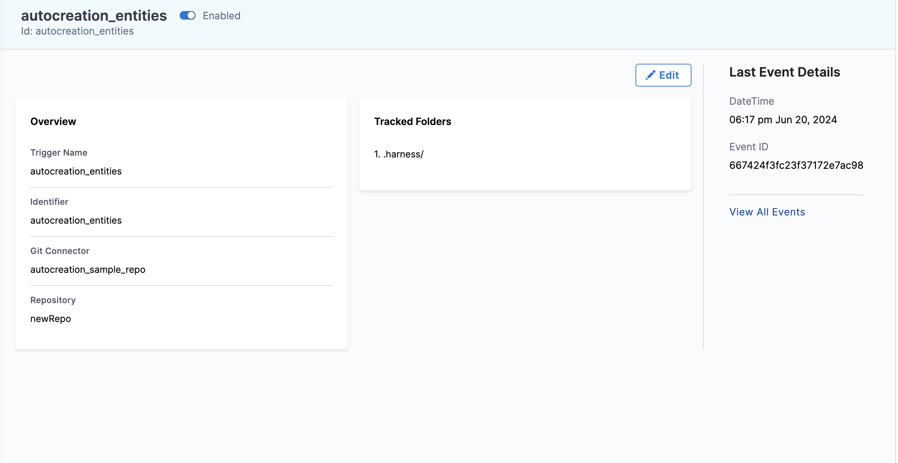

Autocreation is a feature that allows you to automatically create entities in Harness when files are added remotely within your Git Repository.  The files, in this case, are created within Git, so the object is initiated and created within your repository in the [correct directory](#file-path-convention).  

This differs from [moving inline entities to Git](https://developer.harness.io/docs/platform/git-experience/move-inline-entities-to-git/) and [enabling bidirectional sync](https://developer.harness.io/docs/platform/git-experience/gitexp-bidir-sync-setup/) as for this case, customers would be initially creating objects from the Harness UI rather than initiating from Git, and do not have to follow a directory structure for the objects being saved in the Git Repo.

:::info note
Currently this feature is behind the feature flag `PIE_GITX_AUTOCREATION`. Please contact [Harness Support](mailto:support@harness.io) to enable this feature.
:::

## Pre-requisites of Autocreation

- Register the webhook for your repository where you are adding your files remotely. The scope of the webhook should match the entity it's trying to create. For example, a project-level webhook can only create entities within the same project, whereas an account-level webhook can create entities across multiple projects and the organizations.
- Added files should follow a [specific file path convention based on the entity type](#file-path-convention). The file paths would be created manually and can be created on an as-needed-basis.

:::info note
Files that are added only in the default branch(main, master etc) of the Git Repo are autocreated.
:::


## File Path Convention

We need to follow a specific file convention for each entity for auto-creation. This is required to infer the scope of the entity as well as type of entity from the filepath.

:::info note
Files under `.harness` folder are only used for auto-creation as of now. Therefore, to create files automatically via remote, all file paths must begin with `.harness`. Webhooks will, by default, track the `.harness` folder.
:::



We will discuss the file path convention for each entity with an example:-


:::info note
The file path name of the entity YAML can be anything, as the name and identifier of the entity are picked up from the YAML itself that you are pushing to your Git repository. If the name and identifier are not provided in the YAML, then the file name will be used as the name and identifier.
:::

### Pipelines

File path for storing your pipelines should follow the following naming convention:

`.harness/orgs/<org_identifier>/projects/<project_identifier>/pipelines/<file_path_name>.yaml`

- Folder name should be `pipelines`.

For example :- `.harness/orgs/test_org/projects/test_project/pipelines/demo_autocreation_pipeline.yaml`

- **Organization directory**: `orgs`
- **Organization identifier**: `test_org`
- **Projects directory**: `projects`
- **Project identifier**: `test_project`
- **Pipelines directory**: `pipelines`
- **Pipeline File Path name**: `demo_autocreation_pipeline`


### Input Sets

File path for storing your input set should follow the following naming convention:

 `.harness/orgs/<org_identifier>/projects/<project_identifier>/pipelines/<pipeline_identifier>/input_sets/<file_path_name>.yaml`

 - Folder name should be `input_sets`.

Input sets belonging to a pipeline will reside in the directory of pipeline identifier.

For example :- `.harness/orgs/test_org/projects/test_project/pipelines/demo_autocreation_pipeline/input_sets/demo_autocreation_inputSet.yaml`

- **Organizations directory**: `orgs`
- **Organization identifier**: `test_org`
- **Projects directory**: `projects`
- **Project identifier**: `test_project`
- **Pipelines directory**: `pipelines`
- **Pipeline identifier**: `demo_autocreation_pipeline`
- **Input sets directory**: `input_sets`
- **Input Set File Path name**: `demo_autocreation_inputSet`

### Templates


1. **Account Level**

File path for storing template at Account level should follow the following naming convention: 

`.harness/templates/<template_identifier>/<file_path_name>.yaml`

- Folder name should be `templates`.
- All version labels belonging to a template will reside in the directory of template identifier.

For example:- `.harness/templates/test_template/v1.yaml`

- **Templates directory**: `templates`
- **Template identifier**: `test_template`
- **Version label/Version File Path name**: `v1`

2. **Organization Level**

File path for storing template at Organization level should follow the following naming convention: 

`.harness/orgs/<org_identifier>/templates/<template_identifier>/<file_path_name>.yaml`

For example:- `.harness/orgs/test_org/templates/test_template/v1.yaml`

- **Organizations directory**: `orgs`
- **Organization identifier**: `test_org`
- **Templates directory**: `templates`
- **Template identifier**: `test_org`
- **Version label/Version File Path name**: `v1`


3. **Project Level**

File path for storing template at Project level should follow the following naming convention: 

`.harness/orgs/<org_identifier>/projects/<project_identifier>/templates/<template_identifier>/<file_path_name>.yaml`


For example:- `.harness/orgs/test_org/projects/test_project/templates/template_autocreation_project_level/v1.yaml`

- **Organizations directory**: `orgs`
- **Organization identifier**: `test_org`
- **Projects directory**: `projects`
- **Project identifier**: `test_project`
- **Templates directory**: `templates`
- **Template identifier**: `template_autocreation_project_level`
- **Version label**: `v1`

### Services

1. **Account Level**

File path for storing Services at Account level should follow the following naming convention: 

`.harness/services/<file_path_name>.yaml`.

- Folder name should be `services`.

For example:- `.harness/services/service_deploy_nginx_account.yaml`

- **Services directory**: `services`
- **Service File Path Name**: `service_deploy_nginx_account`

2. **Organization Level**

File path for storing services at Organization level should follow the following naming convention: 

`.harness/orgs/<org_identifier>/services/<file_path_name>.yaml`

For example:- `.harness/orgs/test_org/services/service_deploy_nginx_org.yaml`

- **Organizations directory**: `orgs`
- **Organization identifier**: `test_org`
- **Services directory**: `services`
- **Service File Path Name**: `service_deploy_nginx_org`


3. **Project Level**

File path for storing services at Project level should follow the following naming convention:

`.harness/orgs/<org_identifier>/projects/<project_identifier>/services/<file_path_name>.yaml`

- folder name should be `services`.

For example:- `.harness/orgs/test_org/projects/test_project/services/service_deploy_nginx_project.yaml`

- **Organizations directory**: `orgs`
- **Organization identifier**: `test_org`
- **Projects directory**: `projects`
- **Project identifier**: `test_project`
- **Services directory**: `services`
- **Service File Path Name**: `service_deploy_nginx_project`

### Environments

1. **Account Level**

File path for storing Environment at Account level should follow the following naming convention:

 `.harness/envs/<environment_type>/<file_path_name>.yaml`

- Folder name should be `envs` followed by the type of environment `production` or `pre_production`.

For example:- `.harness/envs/pre_production/qa.yaml`

- **Environment directory**: `envs`
- **Environment type**: `pre_production`
- **Environment File Path name**: `qa`

2. **Organization Level**

File path for storing Environment at Organization level should follow the following naming convention:

`.harness/orgs/<org_identifier>/envs/<environment_type>/<file_path_name>.yaml`

For example:- `.harness/orgs/test_org/envs/pre_production/qa_org.yaml`


- **Organization directory**: `orgs`
- **Organization identifier**: `test_org`
- **Environment directory**: `envs`
- **Environment type**: `pre_production`
- **Environment File Path name**: `qa_org`


3. **Project Level**

File path for storing Environment at Project level should follow the following naming convention:

 `.harness/orgs/<org_identifier>/projects/<project_identifier>/envs/<environment_type>/<file_path_name>.yaml`

For example:- `.harness/orgs/test_org/projects/test_project/envs/pre_production/Pre_Prod_qa_project_level.yaml`

- **Organizations directory**: `orgs`
- **Organization identifier**: `test_org`
- **Projects directory**: `projects`
- **Project identifier**: `test_project`
- **Environment directory**: `envs`
- **Environment type**: `pre_production`
- **Environment File Path name**: `qa_project_level`

### Infrastructures

1. **Account Level**

File path for storing Infrastructure at Account level should follow the following naming convention:

 `.harness/envs/<environment_type>/<environment_identifier>/infras/<file_path_name>.yaml`

- All infrastructures belonging to an environment will reside in the directory of type of environment followed by environment identifier.
- Folder name should be `infras`

For example:- `.harness/envs/pre_production/qa/infras/infra_account_level.yaml`

- **Environments directory**: `envs`
- **Environment type**: `pre_production`
- **Environment identifier**: `qa`
- **Infrastructure directory**: `infras`
- **Infrastructure File Path name**: `infra_account_level`


2. **Project Level**

File path for storing Infrastructure at Project level should follow the following naming convention: 

`.harness/orgs/<org_identifier>/projects/<project_identifier>/envs/<environment_type>/<environment_identifier>/infras/<file_path_name>.yaml`

For example:- `.harness/orgs/test_org/projects/test_project/envs/pre_production/qa_project_level/infras/infra_project_level.yaml`

- **Organization directory**: `orgs`
- **Organization identifier**: `test_org`
- **Projects directory**: `projects`
- **Project identifier**: `test_project`
- **Environment directory**: `envs`
- **Environment type**: `pre_production`
- **Environment identifier**: `qa_project_level`
- **Infrastructure directory**: `infras`
- **Infrastructure File Path name**: `infra_project_level`

### Overrides
Overrides allow for specific configurations at different scope levels, such as Account, Organization, and Project, for various Harness entities like Environment, Service, and Infrastructure. The file path conventions for these overrides vary depending on the scope level.

#### Global Environment Overrides

1. **Account Level**

To create a global environment override at the account level, use the following file path convention:

`.harness/overrides/[ENV_REF]/<file_path_name>.yaml`

For example:- `.harness/overrides/account.pre_production/overrides.yaml`


- **Overrides directory**: `overrides`
- **ENV_REF**: `account.pre_production`
- **Overrides File Path name**: `overrides`

2. **Organization Level**

To create a global environment override at the organization level, use the following file path convention:

`.harness/orgs/<org_identifier>/overrides/[ENV_REF]/<file_path_name>.yaml`

For example:- `.harness/orgs/test_org/overrides/org.pre_prod/overrides.yaml`

- **Organization directory**: `orgs`
- **Organization identifier**: `test_org`
- **Overrides directory**: `overrides`
- **ENV_REF**: `org.pre_prod`
- **Overrides File Path name**: `overrides`

3.  **Project Level**

To create a global environment override at the project level, use the following file path convention:

`.harness/orgs/<org_identifier>/projects/<project_identifier>/overrides/[ENV_REF]/<file_path_name>.yaml`

For example:- `.harness/orgs/test_org/projects/test_project/overrides/test_environment/overrides.yaml`

- **Organization directory**: `orgs`
- **Organization identifier**: `test_org`
- **Projects directory**: `projects`
- **Project identifier**: `test_project`
- **Overrides directory**: `overrides`
- **ENV_REF**: `test_environment`
- **Overrides File Path name**: `overrides`


#### Services and Environment Overrides

1. **Account Level**

To create a Services and Environment Overrides at the Account level, use the following file path convention:

`.harness/overrides/[ENV_REF]/services/[SERVICE_REF]/<file_path_name>.yaml `

For example:- `.harness/overrides/account.pre_production/services/account.test_demo/overrides.yaml`

- **Overrides directory**: `overrides`
- **ENV_REF**: `account.pre_production`
- **Service directory**: `service`
- **SERVICE_REF**: `account.test_demo`
- **Overrides File Path name**: `overrides`

2. **Organization Level**

To create a Services and Environment Overrides override at the organization level, use the following file path convention:

`.harness/orgs/<org_identifier>/overrides/[ENV_REF]/services/[SERVICE_REF]/<file_path_name>.yaml`

For example:- `.harness/orgs/test_org/overrides/org.pre_prod/services/org.test_demo/overrides.yaml`

- **Organization directory**: `orgs`
- **Organization identifier**: `test_org`
- **Overrides directory**: `overrides`
- **ENV_REF**: `org.pre_prod`
- **Service directory**: `service`
- **SERVICE_REF**: `org.test_demo`
- **Overrides File Path name**: `overrides`

:::important note
In this example, both the service `(org.test_demo)` and environment `(org.pre_prod)` are from the organization level. However, the path can represent different combinations, such as an organization-level service with an account-level environment or vice versa
:::

3. **Project level**

To create a Services and Environment Overrides override at the project level, use the following file path convention:

`.harness/orgs/<org_identifier>/projects/test_project/overrides/test_environment/services/[SERVICE_REF]/<file_path_name>.yaml`

For example:- `.harness/orgs/test_org/projects/<project_identifier>/overrides/[ENV_REF]/services/test_demo/overrides.yaml`

- **Organization directory**: `orgs`
- **Organization identifier**: `test_org`
- **Projects directory**: `projects`
- **Project identifier**: `test_project`
- **Overrides directory**: `overrides`
- **Service directory**: `service`
- **SERVICE_REF**: `test_demo`
- **ENV_REF**: `test_environment`
- **Overrides File Path name**: `overrides`


#### Environment and Infrastructure Overrides

1. Account Level

To create an Environment and Infrastructure Overrides at the Account Level, use the following file path convention:

`.harness/overrides/[ENV_REF]/infras/[INFRA_ID]/<file_path_name>.yaml`

For example:-`.harness/overrides/account.pre_production/infras/infra_test/overrides.yaml`

- **Overrides directory**: `overrides`
- **ENV_REF**: `account.pre_production`
- **Infrastructure directory**: `infras`
- **INFRA_ID**: `infra_test`
- **Overrides File Path name**: `overrides`

2. Organization Level

To create an Environment and Infrastructure Overrides at the Organization level, use the following file path convention:

`.harness/orgs/<org_identifier>/overrides/[ENV_REF]/infras/[INFRA_ID]/<file_path_name>.yaml`

For example:-`.harness/orgs/test_org/overrides/org.pre_production/infras/infra_test/overrides.yaml`

- **Organization directory**: `orgs`
- **Organization identifier**: `test_org`
- **Overrides directory**: `overrides`
- **ENV_REF**: `org.pre_production`
- **Infrastructure directory**: `infras`
- **INFRA_ID**: `infra_test`
- **Overrides File Path name**: `overrides`

3. Project Level

To create an Environment and Infrastructure Overrides at the Project level, use the following file path convention:

`.harness/orgs/<org_identifier>/projects/<project_identifier>/overrides/[ENV_REF]/infras/[INFRA_ID]/<file_path_name>.yaml`

For example:- `.harness/orgs/test_org/projects/test_project/overrides/pre_production/infras/infra_test/overrides.yaml`

- **Organization directory**: `orgs`
- **Organization identifier**: `test_org`
- **Project directory**: `projects`
- **Project identifier**: `test_project`
- **Overrides directory**: `overrides`
- **ENV_REF**: `pre_production`
- **Infrastructure directory**: `infras`
- **INFRA_ID**: `infra_test`
- **Overrides File Path name**: `overrides`


#### Service and Infrastructure Overrides

1. Account Level

To create a Service and Infrastructure Overrides at the Account Level, use the following file path convention:

`.harness/overrides/[ENV_REF]/services/[SERVICE_REF]/infras/[INFRA_ID]/<file_path_name>.yaml`

For example:- `.harness/overrides/account.pre_production/services/account.test_demo/infras/infra_test/overrides.yaml`

- **Overrides directory**: `overrides`
- **ENV_REF**: `account.pre_production`
- **Service directory**: `service`
- **SERVICE_REF**: `account.test_demo`
- **Infrastructure directory**: `infras`
- **INFRA_ID**: `infra_test`
- **Overrides File Path name**: `overrides`

2. Organization Level

To create a Service and Infrastructure Overrides at the Organization Level, use the following file path convention:

`.harness/orgs/<org_identifier>/overrides/[ENV_REF]/services/[SERVICE_REF]/infras/[INFRA_ID]/<file_path_name>.yaml`

For example:- `.harness/orgs/test_org/overrides/org.pre_production/services/org.test_demo/infras/infra_test/overrides.yaml`

- **Organization directory**: `orgs`
- **Organization identifier**: `test_org`
- **Overrides directory**: `overrides`
- **ENV_REF**: `org.pre_production`
- **Service directory**: `service`
- **SERVICE_REF**: `org.test_demo`
- **Infrastructure directory**: `infras`
- **INFRA_ID**: `infra_test`
- **Overrides File Path name**: `overrides`


3. Project Level

To create a Service and Infrastructure Overrides at the Project Level, use the following file path convention:

`.harness/orgs/<org_identifier>/projects/<project_identifier>/overrides/[ENV_REF]/infras/[INFRA_ID]/<file_path_name>.yaml`

For example:- `.harness/orgs/test_org/projects/test_project/overrides/pre_production/infras/infra_test/overrides.yaml`

- **Organization directory**: `orgs`
- **Organization identifier**: `test_org`
- **Project directory**: `projects`
- **Project identifier**: `test_project`
- **Overrides directory**: `overrides`
- **ENV_REF**: `pre_production`
- **Service directory**: `service`
- **SERVICE_REF**: `org.test_demo`
- **Infrastructure directory**: `infras`
- **INFRA_ID**: `infra_test`
- **Overrides File Path name**: `overrides`

## Creation of Entities

:::info note
During the autocreation of entities, if a user commits more than 300 files in a single commit, the autocreation of entities for those files will fail. Files received as a response from GitHub (fewer than 300) will be processed correctly. However, commits with more than 300 files will not be handled, potentially leading to discrepancies where users may not see the expected results.
:::

Since we have discussed the file path conventions for each entities let's see how to create entities with help of autocreation. We are going to discuss creation of Pipeline and Input set in these examples, similar approach can be followed for creating other entities like Services, Environments, Templates and Infrastructure.

You can refer to [YAML schema](/docs/platform/pipelines/harness-yaml-quickstart/#yaml-schema) for creating Harness entities via YAML.


#### Pipelines

In this example, we are going to follow the same names that we have discussed while discussing file path examples of different entities.

Let's create a pipeline under organization `default` and project `Krishika_test_autocreation`.

We have our pipeline yaml stored under `pipeline` directory :-

`.harness/orgs/default/projects/Krishika_test_autocreation/pipelines/demo_autocreation_pipeline.yaml`

Let's consider this example yaml that we are going to put under **demo_autocreation_pipeline.yaml**:

```yaml
pipeline:
  name: demo_autocreation_pipeline
  identifier: demo_autocreation_pipeline
  projectIdentifier: Krishika_test_autocreation
  orgIdentifier: default
  tags: {}
  stages:
    - stage:
        name: custom
        identifier: custom
        description: ""
        type: Custom
        spec:
          execution:
            steps:
              - step:
                  type: ShellScript
                  name: ShellScript_1
                  identifier: ShellScript_1
                  spec:
                    shell: Bash
                    executionTarget: {}
                    source:
                      type: Inline
                      spec:
                        script: |
                          input_variable=<+pipeline.variables.input_variable>
                          echo "the value is:$input_variable"
                    environmentVariables: []
                    outputVariables: []
                  timeout: 10m
        tags: {}
  variables:
    - name: input_variable
      type: String
      description: ""
      required: false
      value: <+input>
```
After saving this YAML file, we will push it to our Git repository, for which we have registered the webhook in Harness. We can then view this event on our Webhook Events page.


```
git add .harness/orgs/default/projects/Krishika_test_autocreation/pipelines/demo_autocreation_pipeline.yaml
git commit -m "Add pipeline yaml"
git push
```

After pushing the changes, pipeline named as **demo_autocreation_pipeline** is created in Organization **default** under the Project **Krishika_test_autocreation** .


#### Input Sets

Let's create an Input set that we are going to use inside our Pipeline `demo_autocreation_pipeline`.

We have our input set YAML stored under the directory of the pipeline identifier 
**demo_autocreation_pipeline**, specifically under the **input_sets** directory  :

`.harness/orgs/default/projects/Krishika_test_autocreation/pipelines/demo_autocreation_pipeline/input_sets/demo_autocreation_inputSet.yaml`

Let's consider this example yaml that we are going to put under **demo_autocreation_inputSet.yaml**:

```yaml
inputSet:
  name: input_set
  tags: {}
  identifier: input_set
  orgIdentifier: default
  projectIdentifier: Krishika_test_autocreation
  pipeline:
    identifier: demo_autocreation_pipeline
    variables:
      - name: input_variable
        type: String
        value: hello
```

After saving this YAML file, we will push it to our Git repository, for which we have registered the webhook in Harness. We can then view this event on our Webhook Events page.

```
git add .harness/orgs/default/projects/Krishika_test_autocreation/pipelines/demo_autocreation_pipeline/demo_autocreation_inputSet.yaml
git commit -m "Add input set yaml"
git push
```

After pushing the changes, we will see that Input set named as **input_set** is created for the pipeline **demo_autocreation_pipeline**. 


:::info note
Harness RBAC is not applicable in Autocreation. The scope of the webhook should match the entity it's trying to create. For example, a project-level webhook can only create entities within the same project, whereas an account-level webhook can create entities across multiple projects and the organizations. If you are able to push to the default branch, you will be able to create the entity in Harness.
:::
