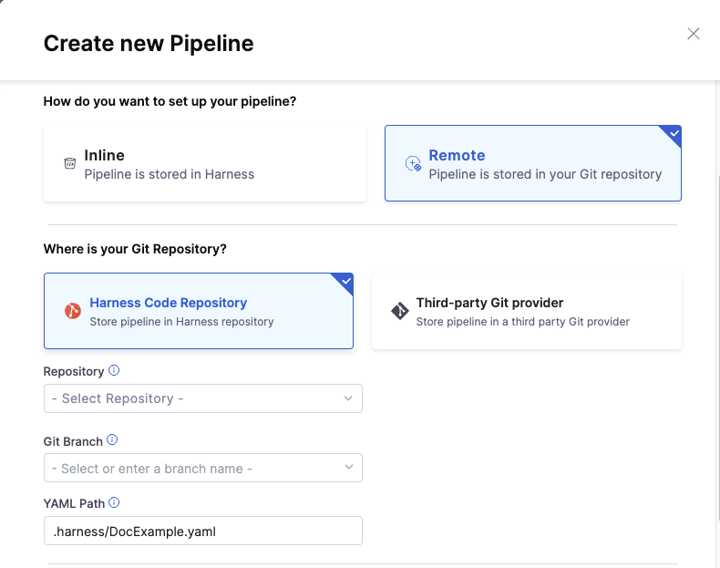
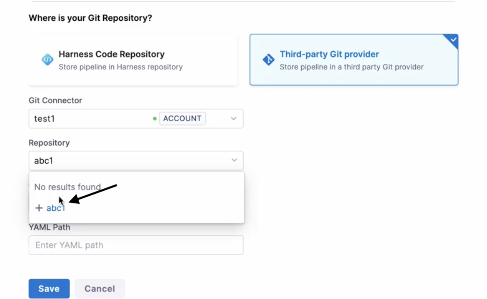
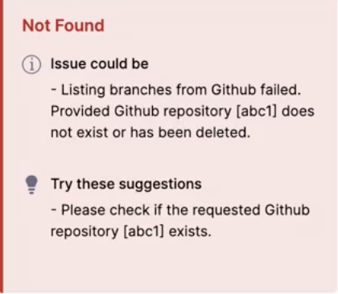

import create_pipeline from './static/git-experience-overview-02.png'
import branch_selection from './static/git-experience-overview-03.png'

Harness Git Experience allows you to store your resource configurations, such as pipelines and input sets, in Git. You can use Git as the single source of truth and modify your configurations using your Git credentials.

With Harness Git Experience, you can easily select the repository and branch from which to execute your pipelines. This provides seamless access to your Harness resources and their configurations stored in Git, simplifying your pipeline execution.

## Before you begin

* Make sure you have a Git repo with at least one branch.​
* Make sure you have a [Harness Git connector](/docs/platform/connectors/code-repositories/connect-to-code-repo) with a Personal Access Token (PAT) for your Git account.​

## Supported Git providers

The following Git providers are supported for Harness Git Sync:​

* [Harness Code Repository](/docs/code-repository/)
* GitHub
* Bitbucket Cloud
* Bitbucket Server
* Azure Repos
* GitLab

Make sure `feature.file.editor` is not set to `false` in the `bitbucket.properties` file if you are using Bitbucket on-prem.

:::info note

Git Sync may be noticeably delayed if your delegate is in a cloud provider (GCP, AWS, Azure, Physical Data Center) rather than Harness Cloud because of encryption and decryption across two connections.

:::

## Supported Harness entities

You can save the following Harness resources in Git using Harness Git Experience:

* Pipelines
* Input sets
* Templates
* Services
* Environment 
* Infrastructure Definitions
* Policies

:::info note

Artifact Source templates are not supported with Git Experience.

:::

## What is Harness Git Experience?

Harness Git Experience lets you choose a Git-First approach for managing Harness configurations as code, using Git as the source of truth.

You can do this by creating a resource with the **Remote** option and specifying the Git repo and branch where you want to save your configurations.

For example, you can create a pipeline by choosing the **Remote** option and save it in Git by providing the repo name and branch name along with the file path.

  

Harness Git Experience lets you modify the configurations stored in Git through the Harness UI and save it back to Git.

You can save the modifications in the existing branch or a new branch through a PR.

## Harness Git Experience workflow

* When you create a Remote resource in Harness, the configurations are stored in Git.
* You can select the branch from which you want to run the pipeline.

  
  
  

  You can also select the branch in the **Run Pipeline** settings.

  <DocImage path={require('./static/86a197e9afb88cb6816cea527bd7b8cee41d7d3d39f7c5104ebeedc00d6f050f.png')} width="60%" height="60%" title="Click to view full size image" />    

* During pipeline execution, the configurations of the required resources and any referenced entities like input sets, are fetched from Git.
  * If the referenced entities exist in the same repo, they are fetched from the same branch that you have selected for pipeline execution.
  * If the referenced entities exist in a different repo, they are fetched from the default branch of the repo where the entities are stored.
* Harness resolves all the dependencies and then proceeds with the pipeline execution.

## Key features

Here are the key features of Harness Git Experience:

### Multiple repo support

Your Harness resources and their configurations can exist in multiple repos. You can choose the repository where you wish to make the modifications before pushing each configuration. At pipeline execution, Harness pulls them all together to execute your pipeline as you designed it. This gives you the flexibility to manage your Git repositories in the way you want.

You can store your configurations in the following ways:

* Store configuration files along with the code repository.
* Store configuration files in a repository separate from the code.
* Store the prod configurations in one repo, and the non-prod ones in another repo, so that only the selected developers can access prod configs.
* Store the configuration files of different environments in different branches.
* Store the pipelines in one repository, and other configuration files in another. 

:::important

To link input sets and pipelines from different repositories, enable `Allow different repo for Pipeline and InputSets` in the default settings.
For more information, go to [Default settings](/docs/platform/settings/default-settings).

:::

### Repo Listing

:::info note
Currently this feature is behind feature flag `CDS_LIST_REPO_V2 `. Contact [Harness Support](mailto:support@harness.io) to enable the feature.
:::

For a certain connector, you can now search for repositories with support for infinite scroll. Simply enter any keyword to see related repositories listed. If you can't find the repository you're looking for, you can also add it manually.

If the repository actually exists it will fetch the branch name, if not it will throw an error.

:::important
1. Search in repo listing is not supported for Azure Repos.
2. GitHub connectors should be created at the "organization" level, linking each connector to a specific GitHub organization to access all repositories within that organization. Using a global GitHub connector with the URL “github.com” to access multiple organizations and their repositories is not supported and may cause issues. The V2 repo listing APIs do not support global GitHub connectors, and if such a connector is used, the API will automatically switch to the V1 flow to ensure repositories can still be listed, albeit without the enhancements of the V2 APIs.
:::

### Branch Listing

:::info note
Currently this feature is behind feature flag `CDS_LIST_BRANCH_V2 `. Contact [Harness Support](mailto:support@harness.io) to enable the feature.
:::

You can now search for branches in a given repository with support for infinite scroll while creating remote entities. Simply enter any keyword to see related branches listed. If you can't find the branch you're looking for, you can also add it manually.

:::important
1. Search in branch listing is not supported for Github and Github Apps.
2. Please note that search in branch listing is only available while creating remote entities.
:::

### Supported Git Providers for Repo and Branch Listing

| Git Provider | Repo Listing | Branch Listing
| --- | --- | --- |
| Github | Yes | No  |
| Bitbucket SAAS | Yes | Yes |
| Bitbucket Server | Yes  | Yes |
| Azure | No | Yes |
| Gitlab | Yes | Yes |
| Github App | No | No |
| Harness Code | Yes | Yes |

1. [Repo Listing](#repo-listing) is not supported in Azure and Github Apps, but users can manually type in the desired repository name and add it.
2. [Branch Listing](#branch-listing) is not supported in Github and Github Apps, but users can manually type in the desired branch name and add it.

### Multiple branch support

Multiple users can make commits to multiple branches for the resources that are synced with the Git Provider. This provides the flexibility for various branching workflows.

### Bi-Directional sync

:::note

Currently, Bi-Directional sync is behind the feature flag `PIE_GIT_BI_DIRECTIONAL_SYNC`. Contact [Harness Support](mailto:support@harness.io) to enable the feature.

:::

By default, Harness Git Experience syncs unidirectionally, from Harness to your Git repos. Enable this setting to have Git Experience sync two-way (bidirectionally) between Harness and your Git repo.

Changes made on either the Git repo or Harness are synched automatically.

For more information, go to [Set up bidirectional sync for Git Experience](/docs/platform/git-experience/gitexp-bidir-sync-setup).

### What can I do with Harness Git Experience?

Harness Git Experience helps you do the following:

* Store and retrieve your Harness configurations to/from Git.
* Change the Harness configuration just by changing the YAML files in Git.
* Add a remote pipeline in Harness, and it gets added to your specified Git repo and branch.
* Maintain your key Harness resources like pipelines, Input sets like you maintain code.
* Submit config changes using the Harness pipeline Studio (GUI and/or YAML) or entirely in Git.
* Make Harness pipeline or resource config changes in a branch, test it in isolation (sandbox), and submit changes to master using Harness Manager or your Git platform.

### What do I need to enable Harness Git Experience?

#### Git connector

:::note

If you are using [Harness Code Repository](/docs/code-repository/) as your Git Repo, you won't need a Git Connector and can skip this step.

:::

A Harness Git Connector is used to sync your Harness Project with your Git repo. You can set up a [Git Connector](/docs/category/code-repo-connectors) first and simply select it when setting up Git Experience, or you can create a Git Connector as part of the Git Experience setup.

You will need a Harness Git Connector to connect with the Git provider and perform operations like generating a webhook. Your Git Connector credentials are used to commit to Git when operations are performed using API.

:::info note
**Important:** The Connector must use the **Enable API access** option and **Username and Token** authentication. Harness requires the token to access the Git API. Generate the token in your account on the Git provider and add it to Harness as a Secret. Next, use the token in the credentials for the Git Connector. For detailed steps to add a Git Connector, see [Code Repo Connectors](../connectors/code-repositories/connect-to-code-repo.md).

:::

:::tip
When using **GitHub Enterprise Cloud** as your Git provider, we recommend utilizing a GitHub App to avoid rate limit issues.

You have multiple options for making API requests:

- **Personal Access Token**: You can use a personal access token to make API requests. These requests count towards your personal rate limit of 5,000 requests per hour.

- **GitHub App**: Authorizing a GitHub App to make API requests on your behalf increases your rate limit. If the GitHub App is owned by a GitHub Enterprise Cloud organization, the rate limit is increased to 15,000 requests per hour.

- **OAuth App**: Similarly, authorizing an OAuth app to make API requests on your behalf also increases your rate limit. If the OAuth app is owned or approved by a GitHub Enterprise Cloud organization, the rate limit is increased to 15,000 requests per hour for members of the organization.

By using a GitHub App or an OAuth app associated with a GitHub Enterprise Cloud organization, you can benefit from a higher rate limit, thus preventing interruptions due to rate limiting.
:::

#### Repository

Harness configurations are stored in repositories. These configuration files can be kept in the same repository as the code, or they can be kept separate. You can map your resources and configurations to multiple repositories.

:::info note
You must have valid Git credentials and a repo within this Git account before you enable Harness Git Experience.
:::

:::note
If changes are made in Git, metadata such as id and scope parameters are not validated, but the spec is. If errors occur, you will be presented with an invalid YAML view.
:::

### Next steps

* [Harness Git Experience Quickstart](configure-git-experience-for-harness-entities.md)
* [Manage input sets and Triggers in Git Experience](manage-input-sets-in-simplified-git-experience.md)
* [Manage a Harness pipeline Repo using Git Experience](manage-a-harness-pipeline-repo-using-git-experience.md)
* [Manage Services using Git Experience](manage-services-using-git-experience.md)
* [Manage Environment and Infrastructure Definition using Git Experience](manage-environments-infra-definitions.md)
