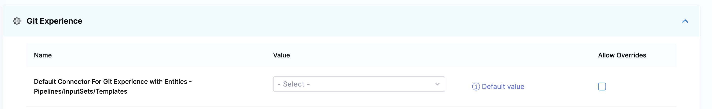
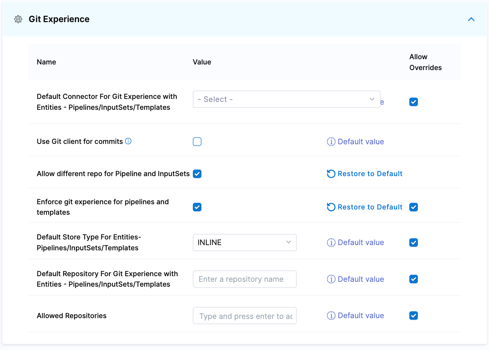

Harness Default Settings lets you configure parameters in your account, organization, or project scope for specific Harness modules and features.

This topic explains how to view and edit the default settings for Git Experience.

## Use default connector for Git Experience

In order to avoid selecting the same connector repeatedly, you can enable the default connector settings **Default Connector For Git Experience with Entities - Pipelines/InputSets/Templates**. When this setting is enabled, the default connector is preselected during pipeline or template creation. You can, however, use any other connector if necessary.

To enable this setting in Harness: 

1. Go to **ACCOUNT SETTINGS**, and then select **Account Resources**.
2. Select **Default Settings**, and then select **Git Experience**.
3. In **Default Connector For Git Experience with Entities - Pipelines/InputSets/Templates**, select a connector to set it as a default connector.
   
   

4. Enable this setting.
   After you enable this setting, it applies to all the scopes (account, organization, and project) in Harness.
5. To override this setting in the child scopes, select **Allow Overrides** beside the settings.

## Use Git client for commits

If you are using Bitbucket on-prem and `feature.file.editor` is set to false in the `bitbucket.properties`, make sure you enable **Use Git client for commits** in the default settings at the account scope. Harness will check out the code on the delegate and use the Git client to make the commits to your Git repository.

To enable this setting in Harness: 

1. Go to **ACCOUNT SETTINGS**, and then select **Account Resources**.
2. Select **Default Settings**, and then select **Git Experience**.
3. Enable **Use Git client for commits**.

## Use different repos for entities

To link input sets and pipelines from different repositories, enable **Allow different repo for Pipeline and InputSets** in the default settings. For more information, go to Default settings.

To enable this setting in Harness: 

1. Go to **ACCOUNT SETTINGS**, and then select **Account Resources**.
2. Select **Default Settings**, and then select **Git Experience**.
3. Enable **Allow different repo for Pipeline and InputSets**.

## Enforce Git Experience

To ensure that your resource configurations are saved only in Git repositories, you can enforce Git experience in your Harness account.
You can do this by enabling `Enforce git experience for pipelines and templates`. 

This setting applies to the following resources:

* Pipelines
* Templates

Harness disables inline pipelines and templates, and users can only create remote pipelines and templates after enabling this setting. You can still create inline input sets corresponding to existing inline pipelines.

To enforce Git experience in Harness: 

1. Go to **ACCOUNT SETTINGS**, and then select **Account Resources**.
2. Select **Default Settings**, and then select **Git Experience**.
3. Enable **Enforce git experience for pipelines and templates**.
   After you enable this setting, it applies to all the scopes (account, organization, and project) in Harness.
4. To override this setting in the child scopes, select **Allow Overrides** beside the settings.
   This forces configurations at the account scope to be saved in Git repositories only. Users can, however, still create inline pipelines and templates at the organizational and project levels.

   
