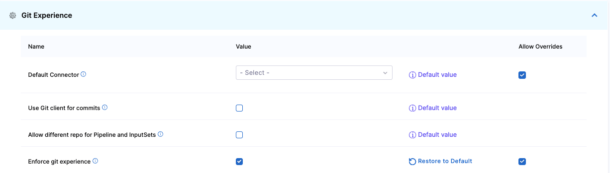

Harness Default Settings lets you configure parameters in your account, organization, or project scope for specific Harness modules and features.

This topic explains how to view and edit the default settings for Git Experience.

## Use default connector for Git Experience

To avoid selecting the same connector repeatedly, you can enable the default connector settings **Default Connector For Git Experience with Entities - Pipelines/InputSets/Templates**. When this setting is enabled, the default connector is preselected during pipeline or template creation. You can, however, use any other connector if necessary.

To enable this setting in Harness, do the following:

1. In Harness, go to the [scope](#scopes-and-refinement) where you want to enable the default connector settings. This setting is available at the account, organization, and project scope.

   * To enable the default connector settings at the account scope, select **Account Settings**, select **Account Resources**, and then select **Default Settings**.
   * To enable the default connector settings at the organization scope, go to **Account Settings**, select **Organizations**, select the relevant organization, and then select **Default Settings**.
   * To enable the default connector settings at the project scope, go to **Projects**, select the relevant project, and then select **Default Settings**.
2. Select **Git Experience**.
3. In **Default Connector For Git Experience with Entities - Pipelines/InputSets/Templates**, select a connector to set it as a default connector.

   

4. Enable this setting.
   After you enable this setting, it applies to all the scopes (account, organization, and project) in Harness.
5. (Optional) For the account and project scopes, you can allow overrides. To override this setting in other scopes, select **Allow Overrides** beside the setting.

## Use Git client for commits

If you are using Bitbucket on-prem and `feature.file.editor` is set to false in the `bitbucket.properties`, make sure you enable **Use Git client for commits** in the default settings at the account scope. Harness will check out the code on the delegate and use the Git client to make the commits to your Git repository.

To enable this setting in Harness, do the following:

1. Go to **Account Settings**, select **Account Resources**.
2. Select **Default Settings**, and then select **Git Experience**.
3. Enable **Use Git client for commits**.

## Use different repos for Git Experience pipelines and input sets

To link input sets and pipelines from different repositories, enable **Allow different repo for Pipeline and InputSets** in the default settings at the account scope.

To enable this setting in Harness, do the following:

1. Go to **Account Settings**, select **Account Resources**.
2. Select **Default Settings**, and then select **Git Experience**.
3. Enable **Allow different repo for Pipeline and InputSets**.

## Enforce Git Experience

To ensure that your resource configurations are saved only in Git repositories, you can enforce Git experience in your Harness account.
You can do this by enabling `Enforce git experience for pipelines and templates`.

This setting applies to the following resources:

* Pipelines
* Templates

Harness disables inline pipelines and templates, and users can only create remote pipelines and templates after enabling this setting. You can still create inline input sets corresponding to existing inline pipelines.

To enable this setting in Harness, do the following:

1. In Harness, go to the [scope](#scopes-and-refinement) where you want to enable the default connector settings. This setting is available at the account, organization, and project scope.

   * To enable the **Enforce git experience for pipelines and templates** setting at the account scope, select **Account Settings**, select **Account Resources**, and then select **Default Settings**.
   * To enable the **Enforce git experience for pipelines and templates** setting at the organization scope, go to **Account Settings**, select **Organizations**, select the relevant organization, and then select **Default Settings**.
   * To enable the **Enforce git experience for pipelines and templates** setting at the project scope, go to **Projects**, select the relevant project, and then select **Default Settings**.
2. Select **Git Experience**.
3. Enable **Enforce git experience for pipelines and templates**.
   After you enable this setting, it applies to all the scopes (account, organization, and project) in Harness.
4. (Optional) For the account and project scopes, you can allow overrides. To override this setting in other scopes, select **Allow Overrides** beside the setting.
   This forces configurations at the applicable scope to be saved in Git repositories only. Users can, however, still create inline pipelines and templates at other levels.

   

## Set the default storage type for entities

This setting applies to the following resources:

* Pipelines
* Input sets
* Templates

To set the default storage type for entities in Harness, do the following:

1. In Harness, go to the [scope](#scopes-and-refinement) where you want to enable the default connector settings. This setting is available at the account, organization, and project scope.

   * To set the **Default Store Type For Entities- Pipelines/InputSets/Templates** at the account scope, select **Account Settings**, select **Account Resources**, and then select **Default Settings**.
   * To set the **Default Store Type For Entities- Pipelines/InputSets/Templates** at the organization scope, go to **Account Settings**, select **Organizations**, select the relevant organization, and then select **Default Settings**.
   * To enable set the **Default Store Type For Entities- Pipelines/InputSets/Templates** at the project scope, go to **Projects**, select the relevant project, and then select **Default Settings**.
2. Select **Git Experience**.
3. In the **Default Store Type For Entities- Pipelines/InputSets/Templates** list, select **Inline** or **Remote**.
4. (Optional) For the account and organization scopes, you can allow overrides. To override this setting in other scopes, select **Allow Overrides** beside the setting.

## Set the default repository for Git Experience entities

This setting applies to the following resources:

* Pipelines
* Input sets
* Templates

To set the default repository for Git Experience entities, do the following:

1. In Harness, go to the [scope](#scopes-and-refinement) where you want to enable the default connector settings. This setting is available at the account, organization, and project scope.

   * To set the default repository for Git Experience entities at the account scope, select **Account Settings**, select **Account Resources**, and then select **Default Settings**.
   * To set the default repository for Git Experience entities at the organization scope, go to **Account Settings**, select **Organizations**, select the relevant organization, and then select **Default Settings**.
   * To enable set the default repository for Git Experience entities at the project scope, go to **Projects**, select the relevant project, and then select **Default Settings**.
2. Select **Git Experience**.
3. Enter your repository name.
4. (Optional) For the account and organization scopes, you can allow overrides. To override this setting in other scopes, select **Allow Overrides** beside the setting.

## Set allowed repositories for Git Experience

To set the allowed repositories for Git Experience entities, do the following:

1. In Harness, go to the [scope](#scopes-and-refinement) where you want to enable the default connector settings. This setting is available at the account, organization, and project scope.

   * To set the default repository for Git Experience entities at the account scope, select **Account Settings**, select **Account Resources**, and then select **Default Settings**.
   * To set the default repository for Git Experience entities at the organization scope, go to **Account Settings**, select **Organizations**, select the relevant organization, and then select **Default Settings**.
   * To enable set the default repository for Git Experience entities at the project scope, go to **Projects**, select the relevant project, and then select **Default Settings**.
2. Select **Git Experience**.
3. Enter the name(s) of you allowed repositories.
4. (Optional) For the account and organization scopes, you can allow overrides. To override this setting in other scopes, select **Allow Overrides** beside the setting.

## Enable Bi-Directional Sync

By default, Harness Git Experience syncs unidirectionally, from Harness to your Git repos. Enable this setting to have Git Experience sync two-way (bidirectionally) between Harness and your Git repo.

Changes made on either the Git repo or Harness are synched automatically.

For more information, go to [Set up bidirectional sync for Git Experience](/docs/platform/git-experience/gitexp-bidir-sync-setup).