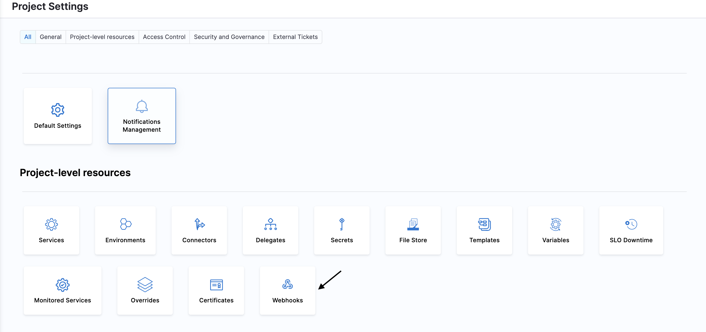

Once you have synced your Harness entities with your Git Repository, you can view bi-directional activity between Harness and your repository with the help of **Bi-Directional Sync Health Status**.
For each entitiy, you can see file path, commit message, status of the last sync as well as the payload.

## Where you can link your Webhook and view bi-didrectional sync events?

You can register your webhook on Organization, Project and Account Level. 

- Go to  **Project Settings**.
- Go to **Project level Resources**.
- Click on **Webhook**.

The same steps can be followed to register webhook at at **Organization** and **Account** level Settings.

## How to register a webhook?

:::info note
Please make sure Bidirectional sync is enabled 
:::

